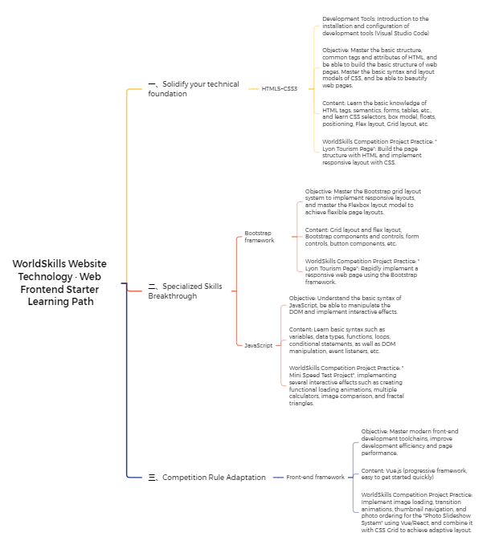
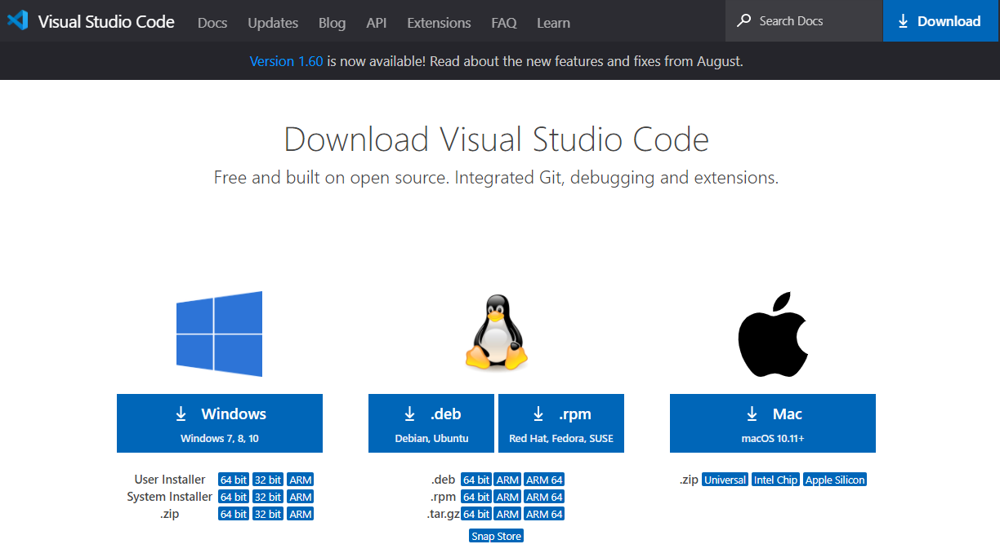
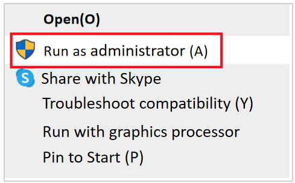
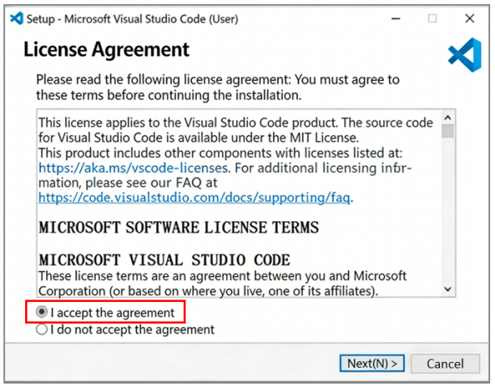
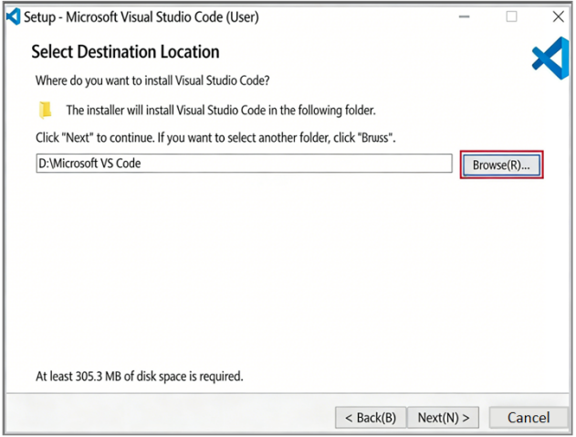
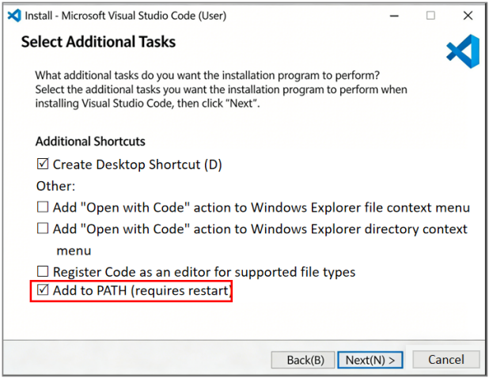
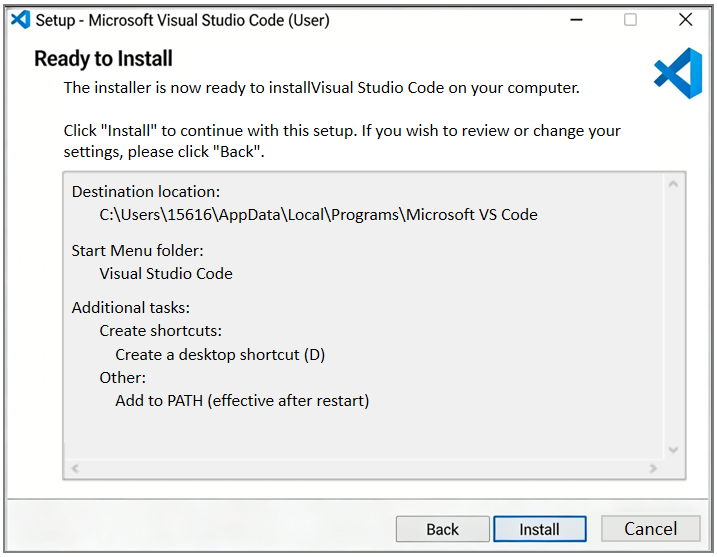
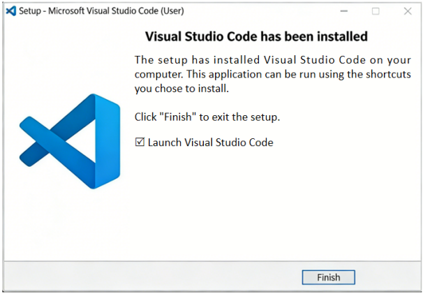
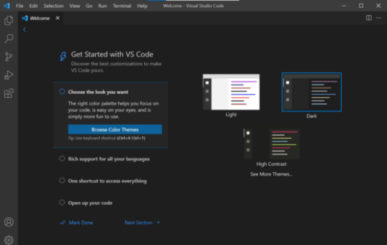

# Project 1 Web Frontend Basics --- Start of Frontend Exploration

## Content Guidance
This project mainly introduces two parts: understanding Web Frontend and development preparation. In the section of understanding Web Frontend, you will establish a basic understanding of Web Frontend development through the development history of Web Frontend, a brief introduction to the main technologies of Web Frontend, and the learning path of Web Frontend. Through development preparation, you will learn about the tools for Web Frontend development, choose appropriate development tools, and get ready for further study.

## Learning Objectives
- Understand the development history of Web Frontend.
- Understand the main technologies of Web Frontend.
- Learn about the learning path of Web Frontend.
- Recognize and use the tools for Web Frontend development.

## Task 1.1 Understanding Web Frontend

### 1.1.1 A Brief Introduction to the Development History and Main Technologies of Web Frontend

#### 1.History of Web Frontend
The Web emerged in March 1989, originating from a project proposal titled Information Management: A Proposal written by scientist Tim Berners-Lee at the European Organization for Nuclear Research (CERN). The first Web server went live in November 1990. The famous Netscape Navigator browser was released in 1995, followed by Microsoft’s Internet Explorer (IE) browser.
At present, various technical standards related to the Web are managed and maintained by the World Wide Web Consortium (W3C). From a technical perspective, Web technologies mainly include three core components: the HyperText Transfer Protocol (HTTP), Uniform Resource Locator (URL), and HyperText Markup Language (HTML). The Web also has five key characteristics: graphical interface, platform independence, distributed architecture, dynamism, and interactivity.

#### 2. Introduction to HTML
HyperText Markup Language (HTML) is a simple and general-purpose markup language. It is the most widely used language on the Internet and the primary language for constructing web documents.By combining it with other Web technologies (such as scripting languages, Common Gateway Interface, components, etc.), powerful web pages can be created. Therefore, HTML is the foundation of World Wide Web programming, which means that the World Wide Web is built on hypertext.

#### 3. Introduction to CSS
CSS stands for Cascading Style Sheets. These styles define how HTML elements are displayed.For a large website, if all the code is written in a single HTML file, it will be difficult to manage and the code will not be concise enough. Therefore, the same styles in the HTML file can be extracted and written into a dedicated CSS file, then applied by reference. This greatly improves code reusability and overall development efficiency.

#### 4. Introduction to JavaScript
JavaScript, commonly referred to as JS, is a scripting language embedded into HTML pages, which is interpreted and executed line by line by the browser. As an object-based and event-driven scripting language, JavaScript is mainly used to enhance the dynamic interactivity of HTML pages.

### 1.1.2  WorldSkills Web Technologies·Web Frontend Learning Path
Web frontend developers need to master a variety of Web frontend development technologies, including HTML5, CSS3, JavaScript, jQuery, Ajax, Vue.js, React.js, Angular.js, WeChat Mini Programs, Node.js, and so on.
According to the technical requirements of WorldSkills Web Technologies · Web Frontend Development, the WorldSkills Web Technologies · Web Frontend learning path shown in Figure 1-1 is specially formulated.

_Figure 1-1 WorldSkills Web Technologies · Web Frontend Learning Path Map_

## Task 1.2 Development Preparation

### 1.2.1 Mainstream Browsers
A browser is a piece of software that can display the content of HTML files (an application of Standard Generalized Markup Language) from web servers or file systems, and enables users to interact with these files. Browsers are responsible for translating the code written by developers into rich and colorful web pages according to encoding rules.
Currently, the mainstream browsers on the market include Chrome, Firefox, and IE (Internet Explorer).

#### 1.Chrome Browser
Chrome Browser is developed by Google. It is a free, open-source web browser with a clean and simple interface, and it has the largest user share among browsers.
Advantages: stable and less likely to crash, fast performance, near-incognito mode, simple search, flexible tabs, and enhanced security.
The Google Chrome icon is shown in Figure 1-2.

#### 2.Firefox Browser
Firefox Browser, also known as Mozilla Firefox, is an open-source browser developed by the Mozilla Foundation and open-source developers. It provides most commonly used plug-ins for regular usage and is one of the most popular browsers today. Firefox runs on Windows, Mac OS X, Linux, and Android.
The Firefox icon is shown in Figure 1-2.

#### 3.Edge Browser
Microsoft Edge is a new-generation free cross-platform web browser released by Microsoft. Built on the open-source Chromium project, it was first launched in 2015. With faster page loading, optimized resource usage, and deep integration with the Windows system, it has quickly become one of the mainstream browsers. The latest version supports innovative features including multi-device synchronization, intelligent privacy and security protection, and immersive reading.

#### 4.Safari Browser
Safari is a fast, secure, and highly privacy-focused web browser developed by Apple. With deep integration into the Apple ecosystem, it provides users with a smooth cross-device browsing experience. It also offers efficient and user-friendly features such as a clean and intuitive interface, reading mode, and tab groups. As a result, it has become the preferred browser for Apple device users who value privacy, security, and seamless ecosystem collaboration.
The Safari icon is shown in Figure 1-2.

_Figure 1-2 Icons of Google Chrome, Firefox, Edge and Safari browsers_

### 1.2.2 Development Tools
There are various development tools available for Web front-end development. Different developers can select appropriate tools according to their characteristics and personal habits. The mainly used development tools include Visual Studio Code, HBuilder X, WebStorm, Sublime Text, etc. This book mainly introduces the installation and usage of two development tools: Visual Studio Code and HBuilder X.

#### 1.Visual Studio Code
Visual Studio Code is a cross-platform source code editor provided by Microsoft for developers, which can run on Windows, Mac OS X and Linux systems. This editor is characterized by being free, open-source, with a huge number of extensions, lightweight (without consuming too much memory and CPU), and powerful. The installation process of Visual Studio Code is described in detail below.
(1) Open the official VS Code website, go to the download page, and download the corresponding version according to your computer system, as shown in Figure 1-3.

_Figure 1-3 Download_
After the installer is downloaded, right-click to run it, as shown in Figure 1-4.

_Figure 1-4 Run_

##### (3) Check "I accept the agreement" and click "Next", as shown in Figure 1-5.
(4) Select "Browse" to change the installation directory. It is recommended to install it on a drive other than the C drive. Then click "Next", as shown in Figure 1-6.

_Figure 1-5 Check "I accept the agreement"  Figure 1-6 Change the software installation directory_
(5) Users can select additional tasks according to their personal development environment needs and check the corresponding options. It is recommended to check "Create Desktop Icon (D)" and "Add to PATH (requires restart)", then click "Next", as shown in Figure 1-7.
(6) Confirm the installation location and additional tasks. If you need to correct the path or change the selected options, click "Back" to return to the previous steps. If everything is correct, click "Install" directly, as shown in Figure 1-8.

_Figure 1-7 Select Additional Tasks                 Figure 1-8 Install_

##### (7) Click "Finish" to complete the installation, as shown in Figure 1-9.

##### (8) The software running interface is shown in Figure 1-10.

