# Project 2 Quick Start to HTML ----- Simplicity is the beauty of code, making content more understandable

## Content Guide
In this project, you will master relevant knowledge through five tasks. By creating your first page, you will learn the basic structure and syntax of HTML, as well as common HTML tags such as heading tags, paragraph tags, text formatting tags, empty tags and block tags. By building a daily news list, you will understand list tags, hyperlinks and image tags. By designing a course information table, you will learn to use table tags and their common attributes. By completing a campus survey form, you will learn form tags and related controls. Finally, by finishing a website login page, you will comprehensively use the knowledge learned in this project to improve practical skills.

## Learning Objectives
- Understand the basic structure and syntax of HTML.
- Master the usage of common HTML tags.
- Master the usage of lists, hyperlinks and image tags.
- Master the usage of table and form tags and their attributes.

## Task 2.1 My First Page

### 2.1.1 Task Description
Take Li Bai's poem Quiet Night Thought as the case for my first page. The displayed content mainly consists of a title on the first line, the ancient poem, its modern translation, and the creation background in the middle, as well as a signature part in the bottom right corner. The effect of the case is shown in Figure 2-1.
<p align="center">
  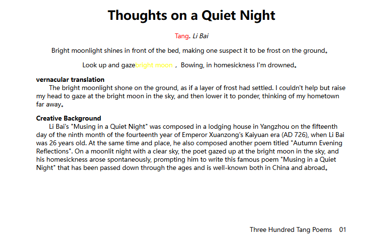
</p>

<p align="center"><em>Figure 2-1 My First Page</em></p>

### 2.1.2 Knowledge Preparation
HTML documents are simple to create and powerful in function, supporting the embedding of files in different data formats—this is one of the reasons for HTML’s popularity. Its main features are summarized as follows:
Simplicity: HTML is a text file containing tags, which can be edited with any text editing tool. Language version upgrades adopt a superset approach, making it more flexible and convenient.
Extensibility: The wide application of HTML has brought requirements such as enhanced functions and added identifiers. HTML uses extended subclass elements to ensure system expansion.
Platform Independence: HTML runs based on browser interpretation. Currently, almost all web browsers support HTML, regardless of the operating system.
Universality: HTML is the universal language of the Web, a simple and general markup language. It allows web developers to create complex pages combining text and images, which can be viewed by anyone online, no matter what type of computer or browser they use.

#### 1.Basic Format of HTML
The basic format of an HTML document mainly includes the &lt;!DOCTYPE&gt; document type declaration, the &lt;html&gt; root tag, the &lt;head&gt; head tag, and the &lt;body&gt; body tag. The details are as follows:

##### (1) &lt;!DOCTYPE&gt; Declaration
The &lt;!DOCTYPE&gt; tag is located on the first line of an HTML document and is not an HTML tag. It is used to specify which HTML or XHTML standard the document follows. The DOCTYPE declaration code in an HTML5 document is as follows.

```html
<!DOCTYPE html>
```

Always add the &lt;!DOCTYPE&gt; declaration to HTML documents so that browsers can recognize the document type and parse it accordingly. Using the HTML5 DOCTYPE declaration triggers browsers to render pages in standards-compliant mode.

##### (2) &lt;html&gt;&lt;/html&gt; Tags
The &lt;html&gt; tag, also known as the root tag, is the most basic element in HTML. It starts with &lt;html&gt; and ends with &lt;/html&gt;, with all other tags nested between them. The HTML tag informs the browser that the content between these two tags is an HTML document and should be interpreted as such.

##### (3) &lt;head&gt;&lt;/head&gt; Tags
The &lt;head&gt; tag is used to define the header information of a page and acts as a container for all header elements. It is the introductory part of a document, mainly used to describe basic properties of the document through embedded tags, and is generally not displayed as the main content in the browser.
The most commonly used tags inside &lt;head&gt; are the &lt;title&gt; tag and the &lt;meta&gt; tag. The &lt;title&gt; tag defines the webpage title, which appears in the top-left corner of the browser window. The &lt;meta&gt; tag describes information such as the title, author, keywords, page refresh settings, and relationships with other documents.

##### (4) &lt;body&gt;&lt;/body&gt; Tags
The &lt;body&gt; tag, also known as the body tag, is located inside the &lt;html&gt;&lt;/html&gt; tags and after the &lt;head&gt; tag, in a parallel relationship with &lt;head&gt;. An HTML document may contain only one pair of &lt;body&gt; tags.
All content displayed on the webpage — including text, images, audio, video, and other media — must be placed inside the &lt;body&gt; tags. Only the content within &lt;body&gt; is ultimately shown to users.

##### (5) Basic HTML Structure

```html
<!DOCTYPE html>
<html lang="en">
  <head>
    <meta charset="utf-8">
    <title></title>
  </head>
  <body>
  </body>
</html>
```

After learning the basic format of HTML, let's do a simple case practice to experience making a most basic web page. The sample code is as follows.

```html
<!DOCTYPE html>
<html lang="en">
  <head>
    <meta charset="utf-8">
    <title>The first exercise</title>
  </head>
  <body>
    Hello!
  </body>
</html>
```

The effect of the case is shown in Figure 2-2.
<p align="center">
  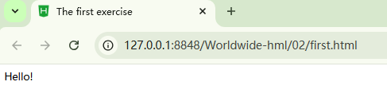
</p>

<p align="center"><em>Figure 2-2 Case Result Display</em></p>

#### 2. Introduction to HTML Technical Terms and Grammar

##### (1) Web Page
Web page: All content displayed in a browser window forms a complete web page. These web pages are actually individual files stored on a computer somewhere on the Internet.

##### (2) Tag
In an HTML page, elements enclosed in angle brackets &lt; &gt; are called HTML tags, such as &lt;html&gt;, &lt;head&gt;, &lt;body&gt;, etc. A tag is a coding command placed within &lt; &gt; markers that represents a specific function.
For easier learning and understanding, HTML tags are generally divided into two categories: paired tags and self-closing tags.
Paired tag: A tag composed of a start tag and an end tag. The basic syntax format is as follows.

```html
<label name>Content</label name>
```

Self-closing tag: a tag that can fully describe a function with only one marker, also known as an empty tag. The basic syntax format is as follows:

```html
<label name/>
```

HTML comment: There is a special type of tag in HTML — the comment tag. Comment tags are used when you need to add explanatory text in an HTML document that is easy to read and understand but should not be displayed on the page. The basic syntax format is as follows:

```html
<!-- Comment statement -->
For example, adding a comment to a <p> tag, the sample code is as follows:
  <p>This is a normal paragraph.</p> <!--This is a comment and will not be displayed in the browser.-->
```

HTML5 uses a loose syntax format, and tags are not case‑sensitive.

##### (3) Attributes and Attribute Values
HTML tags can have attributes. Attributes provide additional information about HTML elements. An element’s attributes are usually placed in the start tag after the tag name. Attributes consist of key-value pairs; attributes are separated by spaces, and an attribute and its value are connected by an equal sign. For example: name="value". The basic format is as follows.
&lt;tag_name attribute1="attribute_value1" attribute2="attribute_value2"&gt;Content&lt;/tag_name&gt;

#### 3.The head Tag
Common tags in the &lt;head&gt; section include &lt;link&gt;, &lt;meta&gt;, &lt;script&gt;, &lt;style&gt;, and &lt;title&gt;.
The &lt;title&gt; tag is used to define the title of an HTML page and must be placed inside the &lt;head&gt; tag. An HTML document can contain only one pair of &lt;title&gt; tags. The content between the &lt;title&gt; tags is displayed in the title bar of the browser window. The basic format is as follows.

```html
<title>Page Title</title>
```

The &lt;meta&gt; tag is used to define the metadata of a page. It can appear repeatedly within the &lt;head&gt; tag and is a self-closing tag in HTML.
The &lt;meta/&gt; tag itself contains no content and is used in name/value pairs. Its attributes can define relevant page parameters, such as providing keywords for search engines, the author’s name, page description, and setting the webpage refresh time.
The basic format is as follows.

```html
<meta name="name" content="value"/>
Example: Setting webpage keywords.
<meta name="keywords" content="Web Design and Production"/>
Example: Setting webpage description.
<meta name="description" content="The best study book for web design and production"/>
Example: Setting character encoding.
<meta http-equiv="Content-Type" content="text/html; charset=utf-8"/>
Example: Setting automatic page refresh and redirection.
<meta http-equiv="refresh" content="10;url=URL"/>
```

The &lt;link&gt; tag: A web page often requires the cooperation of multiple external files. The &lt;link&gt; tag can be used in the &lt;head&gt; section to reference external files, and a page allows multiple &lt;link&gt; tags to reference multiple external files. The basic format is as follows:

```html
<link rel="stylesheet" type="text/css" href="style.css"/>
```

Common attributes of the &lt;link&gt; tag are shown in Table 2-1.

**Table 2-1 Common Attributes of the link Tag**

| Attribute Name | Common Values | Description |
| --- | --- | --- |
| href | URL | Specifies the address of the referenced external document. |
| rel | stylesheet | Specifies the relationship between the current document and the referenced external document; the value of this attribute is usually stylesheet (style sheet). |
| type | text/css | Indicates that the type of the referenced external document is a CSS style sheet. |
|  | image/x-icon | References an external icon file. |

The &lt;style&gt; tag is used to define style information for an HTML document and is placed inside the &lt;head&gt; tag. The basic format is as follows:

```html
<style attribute="attribute_value">Style content</style>
```

When using the &lt;style&gt; tag in HTML, the attribute type is often defined with the corresponding value text/css, indicating the use of inline CSS styles.

#### 4.Heading Tags
Headings are used to make web pages more semantic. Heading tags are frequently used in pages. HTML provides six levels of headings: &lt;h1&gt;, &lt;h2&gt;, &lt;h3&gt;, &lt;h4&gt;, &lt;h5&gt;, and &lt;h6&gt;. The importance and font size decrease gradually from &lt;h1&gt; to &lt;h6&gt;. The basic format is as follows:

```html
<hn >Heading Text</hn>  <!--n ranges from 1 to 6-->
```

#### 5.Paragraph Tags
Paragraphs are defined by the &lt;p&gt; tag. To display text in an organized way on a web page, paragraph tags are essential. Just like in ordinary writing, an entire web page can be divided into several paragraphs, and the tag used for paragraphs is &lt;p&gt;. The basic format is as follows:

```html
<p>Paragraph text</p>
```

#### 6.Text Formatting Tags
In text content, it is often necessary to design text effects, which requires the use of text formatting tags. Commonly used text formatting tags in HTML5 are shown in Table 2-3.

**Table 2-3 Text Formatting Tags**

| Tag | Description of Display Effect |
| --- | --- |
| &lt;b&gt;&lt;/b&gt; and &lt;strong&gt;&lt;/strong&gt; | Displays text in bold. |
| &lt;i&gt;&lt;/i&gt; and &lt;em&gt;&lt;/em&gt; | Displays text in italic. |
| &lt;s&gt;&lt;/s&gt; and &lt;del&gt;&lt;/del&gt; | Displays text with a strikethrough. |
| &lt;u&gt;&lt;/u&gt; and &lt;ins&gt;&lt;/ins&gt; | Displays text with an underline. |
| &lt;big&gt;&lt;/big&gt; and &lt;small&gt;&lt;/small&gt; | Defines text as larger or smaller. |
| &lt;sup&gt;&lt;/sup&gt; and &lt;sub&gt;&lt;/sub&gt; | Defines text as superscript and subscript. |

#### 7.Empty Tags
The self-closing tags we commonly use are all empty tags, such as the &lt;meta/&gt; and &lt;link/&gt; tags we have already learned. In addition, other commonly used empty tags include &lt;hr&gt;, &lt;br&gt;, &lt;img&gt;, &lt;input&gt;, etc.

```html
<hr> tag: horizontal rule tag, displayed as a horizontal line.
<br> tag: line break tag, forces text to start on a new line.
 tag: image tag.
<input> tag: form control tag.
```

#### 8.Introduction to Inline Tags and Block-Level Tags
HTML provides a wide range of tags for organizing page structure. To make page structure organization more reasonable, HTML tags are classified into different types, generally divided into block-level tags and inline tags, also known as block-level elements and inline elements.

##### (1) Block-Level Tags
Block-level elements generally start on a new line. They typically occupy an entire line or multiple lines by themselves. Width, height, alignment, and other properties can be set for them. They are often used for webpage layout and structural construction, and can contain inline elements as well as other block-level elements.
Common block-level elements include &lt;h1&gt; to &lt;h6&gt;, &lt;p&gt;, &lt;div&gt;, &lt;ul&gt;, &lt;ol&gt;, &lt;li&gt;, etc. Among them, the &lt;div&gt; tag is the most typical block-level element.

```html
<div> tag: "div" is short for "division", meaning "section or area". The content between <div> and </div> acts as a container, which can divide a webpage into independent, distinct sections and hold various webpage elements such as paragraphs, headings, and images.
  The <div> tag is very powerful. When used with attributes such as id and class, along with CSS styling, it can replace most text formatting tags.
```

##### (2) Inline Tags
Inline elements, also known as inline-level elements, are generally basic semantic elements. They do not occupy independent space and only support the structure by their own font size and image dimensions. Normally, properties such as width, height, and alignment cannot be set for them. They are often used to control the style of text on a page.
Common inline elements include &lt;strong&gt;, &lt;b&gt;, &lt;em&gt;, &lt;i&gt;, &lt;del&gt;, &lt;s&gt;, &lt;ins&gt;, &lt;u&gt;, &lt;a&gt;, &lt;span&gt;, etc. Among them, the &lt;span&gt; tag is the most typical inline element.

```html
<span> is an inline element. Only text and various inline tags such as <strong>, <em>, etc. can be contained between <span> and </span>. Multiple levels of <span> can also be nested within a <span> tag.
          The <span> tag is often used to define some specially displayed text on a webpage. It has no fixed presentation format by itself and will only produce visual changes when styles are applied.
```

##### (3) Element Conversion
If you want an inline element to have some characteristics of a block-level element, or a block-level element to have some characteristics of an inline element, you can use the display property to convert the element type. The common values and functions of the display property are shown in Table 2-4.

**Table 2-4 Common Values and Functions of the display Property**

| Property Value | Display Effect Description |
| --- | --- |
| inline | The element will be displayed as an inline element (the default display value for inline elements). |
| block | The element will be displayed as a block-level element (the default display value for block-level elements). |
| inline-block | The element will be displayed as an inline-block element. Its width, height, alignment and other properties can be set, but the element will not occupy an entire line. |
| none | The element will be hidden, not displayed, and take up no page space, as if the element does not exist. |

### 2.1.3 Task Implementation
My first page is divided into the following five steps, as detailed below.

#### Step 1: Create an HTML page.

```html
<!DOCTYPE html>
<html lang="en">
  <head>
    <meta charset="utf-8">
    <title>My first page</title>
  </head>
  <body>
  </body>
</html>
```

#### Step 2: Add the ancient poem Quiet Night Thought.
The title Quiet Night Thought shall be implemented using heading tags, while the poem content shall be implemented using paragraph tags.Color and italic effects can be achieved using the color attributes of empty tags and text formatting tags.

```html
<h1>Thoughts on a Quiet Night</h1>
<p><span style="color: red;">Tang</span>. <i>Li Bai</i></p>
<p>Bright moonlight shines in front of the bed, making one suspect it to be frost on the ground。</p>
<p>Look up and gaze<font color="yellow">bright moon</font> ，Bowing, in homesickness I'm drowned。</p>
```

#### Step 3: Implement the vernacular translation and creative background sections.
Please pay attention to the use of block-level tags, paragraph tags, text formatting tags, and empty tags.

```html
<div  style="text-align: left;">
  <p>
    <b>vernacular translation</b>
    <br>
    &nbsp;&nbsp;&nbsp;&nbsp;&nbsp;&nbsp;&nbsp;The bright moonlight shone on the ground, as if a layer of frost had settled. I couldn't help but raise my head to gaze at the bright moon in the sky, and then lower it to ponder, thinking of my hometown far away。
  </p>
  <p>
    <b>Creative Background</b>
    <br>
    &nbsp;&nbsp;&nbsp;&nbsp;&nbsp;&nbsp;&nbsp;Li Bai's "Musing in a Quiet Night" was composed in a lodging house in Yangzhou on the fifteenth day of the ninth month of the fourteenth year of Emperor Xuanzong's Kaiyuan era (AD 726), when Li Bai was 26 years old. At the same time and place, he also composed another poem titled "Autumn Evening Reflections". On a moonlit night with a clear sky, the poet gazed up at the bright moon in the sky, and his homesickness arose spontaneously, prompting him to write this famous poem "Musing in a Quiet Night" that has been passed down through the ages and is well-known both in China and abroad。
  </p>
</div>
```

#### Step 4: Implement the signature part using paragraph tags with right alignment.
Use line break tags to separate the signature from the main content.

```html
<br /><br /><br /><br /><br />
<p style="text-align: right;">Three Hundred Tang Poems&nbsp;&nbsp;&nbsp;&nbsp;01</p>
```

#### Step 5: Take all page content as a whole, and set the center alignment, width and margins through styles.

```html
<div style="width: 800px;margin: 0 auto;text-align: center;" ></div>
```

## Task 2.2 Daily News List

### 2.2.1 Task Description
A news web page contains a lot of content we want to know. It presents news to users through text, images, lists and other elements, and can link multiple independently displayed web pages together.
This case mainly includes a news list page and a news detail page. Clicking a hyperlink on the news list page jumps to the news detail page, which displays the news image and description content. The page effects are shown in Figure 2-3 and Figure 2-4.
<p align="center">
  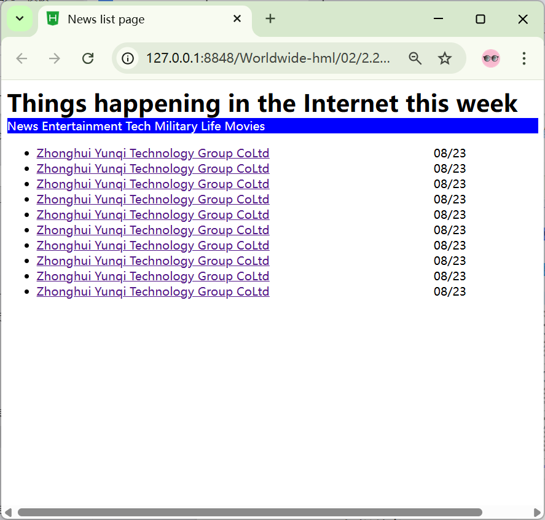
</p>

<p align="center">
  
</p>

<p align="center"><em>Figure 2-3 News List Page            Figure 2-4 News Detail Page</em></p>

### 2.2.2 Knowledge Reserve

#### 1. Introduction to Lists
A list is one of the most commonly used data arrangement methods on web pages. Common lists include ordered lists, unordered lists, and definition lists.

##### (1) Ordered List
An ordered list is a list with a sequential arrangement. Each list item is arranged in a specific order. For example, common rankings on web pages such as music charts and game leaderboards can be defined using ordered lists.The basic format is as follows, and the effect is shown in Figure 2-5.

```html
<!DOCTYPE html>
<html lang="en">
  <body>
    <ol>
      <li>Ordered list item 1</li>
      <li>Ordered list item 2</li>
      <li>Ordered list item 3</li>
    </ol>
  </body>
</html>
```

<p align="center">
  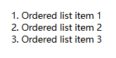
</p>

2-5 Ordered List

##### (2) Unordered List
The unordered list is the most commonly used list on web pages. It is called an "unordered list" because there is no order or hierarchy among its list items; they are usually presented side by side.
The basic format is as follows, and the effect is shown in Figure 2-6.

```html
<!DOCTYPE html>
<html lang="en">
  <body>
    <ul>
      <li>Unordered list item 1</li>
      <li>Unordered list item 2</li>
      <li>Unordered list item 3</li>
    </ul>
  </body>
</html>
```

<p align="center">
  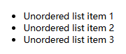
</p>

<p align="center"><em>Figure 2-6 Unordered List</em></p>

##### (3) Definition List
A definition list is often used to explain and describe terms or nouns. Unlike ordered and unordered lists, there are no bullets before the list items of a definition list.
The &lt;dl&gt; tag represents a definition list.
The &lt;dl&gt; tag is used together with &lt;dt&gt; (a term in the definition list) and &lt;dd&gt; (a description of the term in the list).
The basic format is as follows, and the effect is shown in Figure 2-7.

```html
<dl>
  <dt>Noun 1</dt>
  <dd>Explanation 1 of noun 1</dd>
  <dd>Explanation 2 of noun 1</dd>
  ...
  <dt>Noun 2</dt>
  <dd>Explanation 1 of noun 2</dd>
  <dd>Explanation 2 of noun 2</dd>
  ...
</dl>
```

<p align="center">
  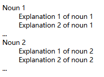
</p>

<p align="center"><em>Figure 2-7 Definition List</em></p>
Note: Paragraphs, line breaks, images, links, other lists, etc. can be used inside list items.

##### (4) Nested Application of Lists
When browsing products in online shopping malls, we often see that a certain category of products is divided into several subcategories, which usually contain further subcategories.
Similarly, when using lists, a list item may also contain several sub-list items. To define sub-list items within a list item, lists need to be nested.
Use the nesting of unordered lists to achieve the effect shown in Figure 2-8.
<p align="center">
  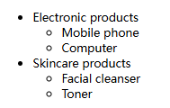
</p>

<p align="center"><em>Figure 2-8 Nested Application of Lists</em></p>
The code to implement Figure 2-8 is as follows.

```html
<ul>
  <li>Electronic products
    <ul>
      <li>Mobile phone</li>
    </ul>
    <ul>
      <li>Computer</li>
    </ul>
  </li>
  <li>Skincare products
    <ul>
      <li>Facial cleanser</li>
    </ul>
    <ul>
      <li>Toner</li>
    </ul>
  </li>
</ul>
```

#### 2.Introduction to URL Resource Paths
In HTML, the concepts of absolute paths and relative paths are involved wherever files are referenced, such as hyperlinks, images, and so on.

##### (1) Absolute Path
An absolute path refers to the actual path where a file exists on a hard disk. For example, if the image 1.jpg is stored in the directory C:\book\Web Layout\Code on a hard disk, the absolute path of the image 1.jpg is C:\book\Web Layout\Code\1.jpg.To specify a webpage background image using an absolute path, the following statement should be used:

```html
<body background="C:\book\Web Layout\Code\1.jpg">
  In practice, absolute paths are rarely used in web programming. When a webpage using absolute paths is uploaded to a web server for viewing, the images are very likely to fail to display.
  This is because when the project is uploaded to a web server, the entire website may not be placed on the server's C drive, but on the D drive or E drive instead. Even if it is placed on the server's C drive, the directory C:\book\Web Layout\Code may not exist on the web server, so the images will not be displayed when browsing the webpage.
```

##### (2) Relative Path
A relative path refers to the location of a target file relative to the current file. For example, in the case mentioned above, the file ZhangSan.html references the image bg.jpg. Since bg.jpg is in the same directory as ZhangSan.html, the following code can be used in ZhangSan.html.
As long as they remain in the same directory, the image will display correctly in the browser no matter where the files are uploaded on the web server.

```html
<body background="bg.jpg">
  Note:Relative paths use the / character as the directory separator, while absolute paths can use either \ or /.
  In relative paths, ../ represents the parent directory. Multiple levels of parent directories can be expressed by using multiple ../ sequences.
```

#### 3.Hyperlinks
When we browse web pages on the Internet, hyperlinks can be seen everywhere. Most of these hyperlinks are created using the &lt;a&gt;&lt;/a&gt; tag.
Hyperlinks are part of the &lt;body&gt; content in an HTML document. Using hyperlinks can connect the internal parts of a web page, as well as link the web page to external websites or external links, forming an interconnected content display interface. The relevant attributes of the &lt;a&gt; tag will be explained below.
In addition to the two commonly used attributes href and target, the &lt;a&gt; tag has many other attributes, as shown in Table 2-7.

**Table 2-7 Attributes of the &lt;a&gt; Tag**

| Attribute Name | Attribute Description |
| --- | --- |
| href attribute | The URL, the destination to which the hyperlink navigates. |
| Target attribute | The method of opening the hyperlink, with four optional values:; _blank: Opens the hyperlink in a new browser tab or window.; _self: Opens the hyperlink in the current browser tab or window.; _parent: Used within an iframe frame; normally equivalent to _self.; _top: Equivalent to _self. |
| title attribute | Displays text information when the mouse hovers over the hyperlink. |

##### (1) Internal Links (Anchor Links)
If a web page is very long, users need to constantly drag the scrollbar to view the desired content when browsing. To improve the speed of information retrieval, HTML provides a special type of link — an anchor link. By creating an anchor link, users can quickly jump to the target content.
An anchor uses the href attribute of the &lt;a&gt; tag to point to the id of a specific element on the page, allowing users to jump to the corresponding position when clicked.

```html
<!-- Anchor link -->
<a href="#section1">Jump to Section 1</a>
<!-- Anchor target -->
<div id="section1">This is the content of Section 1</div>
```

When a visitor clicks the hyperlink, the page will scroll to the position of the corresponding element with the specified id. Anchor jumping does not trigger a page refresh; it only changes the viewport position.
（2）External Links (href)
①Adding links to text
Text with hyperlinks has a special style. By default, linked text is blue and underlined. The &lt;a&gt;&lt;/a&gt; tag has an href attribute that specifies the address of the new page. The address specified by href generally uses a relative path.
An exercise for setting hyperlinks on text is as follows:

```html
<html>
  <head>
    <title>Hyperlink Settings</title>
  </head>
  <body>
    <a href="ul_ol.htm">Go to the List Settings Page</a>
  </body>
</html>
```

The browsing effect is shown in Figure 2-10.
<p align="center">
  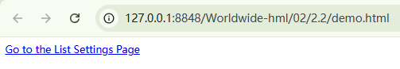
</p>

<p align="center"><em>Figure 2-10 Hyperlink Settings</em></p>
As can be seen from Figure 2-10, this is the default style of a hyperlink. When the link on the page is clicked, the page will jump to the page in the same directory, namely the ul_ol.html page. When clicking the browser's "Back" button to return to the original page, the color of the text link changes to purple, indicating that the link has been visited by the user.
② Modify the window opening method of the link
By default, a hyperlink opens a new page by replacing the current page. According to different user needs, you can specify other ways for the hyperlink to open a new window.
③ Add tooltip text to the link
The hyperlink tag provides the title attribute, which can easily give visitors prompts. The value of the title attribute is the prompt content, which appears only when the visitor’s cursor hovers over the hyperlink, so it does not affect the neatness of the page layout. The code is shown below.

```html
<html>
  <head>
    <title>Hyperlink Settings</title>
  </head>
  <body>
    <a href="ul_ol.htm" target="_blank" title="Hello reader, the text you are seeing now is a prompt. Clicking this link will open a new window and redirect you to the ul_ol.htm page.">Go to the List Settings Page</a>
  </body>
</html>
```

The browsing effect is shown in Figure 2-11.
<p align="center">
  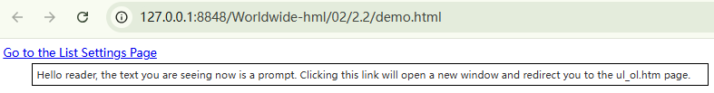
</p>

2-11 Tooltip Text for Hyperlinks

#### 4.Image Tags
（1）Definition and Usage of the &lt;img&gt; Tag
In HTML, the &lt;img&gt; tag is used to embed an image in a web page, and its function is to create a placeholder for the referenced image.
The &lt;img&gt; tag is very commonly used in web pages, for example, to import a logo image, button background image, tool icon, etc. Wherever there is an image, the &lt;img&gt; tag will basically appear in the source code (except for some background images).
The basic format of the &lt;img&gt; tag is as follows.

```html

```

Note: The src attribute is used to specify the address of the image to be embedded in the web page. The alt attribute is used to define alternative text for the image. Both the src attribute and the alt attribute are required attributes of the &lt;img&gt; tag.
Commonly used attribute settings for the &lt;img&gt; tag are shown in Table 2-8.

**Table 2-8 Attributes of the &lt;img&gt; Tag**

| Attribute | Description |
| --- | --- |
| alt | Defines a short description of the image (alternative text), no more than 1024 characters. |
| src | The URL of the image to be displayed. |
| title | Displays when the user hovers the mouse over the image. |
| srcset/sizes | efine responsive image design.; srcset: Allows providing images of multiple resolutions; the browser automatically selects based on device pixels.; sizes: Used together with srcset to define the image size that should be used at different screen widths.; Define the height of the image.; Set the width of the image. |
| height | Defines the height of the image. |
| width | Sets the width of the image. |

### 2.2.3 Task Implementation

#### Step 1: Edit the index.html file and add the news title content.
html

```html
<h1 style="width: 800px;margin: 0 auto;">Things That Happened on the Internet This Week</h1>
```

#### Step 2: For the news category navigation, use block-level tags to set the background color, width and margins. Use inline-block tags to set the font color to white.

```html
<div style="background-color: blue;">
  <div style="width: 800px;margin: 0 auto;">
    <span style="color: #fff">News</span>
    <span style="color: #fff">Entertainment</span>
    <span style="color: #fff">Tech</span>
    <span style="color: #fff">Military</span>
    <span style="color: #fff">Life</span>
    <span style="color: #fff">Movies</span>
  </div>
</div>
```

#### Step 3: For the news list, design the structure using block-level elements. The list arranges multiple news headlines. Hyperlinks are used to connect the specific news pages with the news headlines. Complete this by combining knowledge of styling, text formatting, and inline tags.

```html
<div style="width: 800px;margin: 0 auto;">
  <ul>
    <li>
      <a href="pages/detail.html">Zhonghui Yunqi Technology Group CoLtd</a>
      &nbsp;&nbsp;&nbsp;&nbsp;&nbsp;&nbsp;&nbsp;&nbsp;&nbsp;
      <span>08/23</span>
    </li>
    <li>
      <a href="pages/detail.html">Zhonghui Yunqi Technology Group CoLtd</a>
      &nbsp;&nbsp;&nbsp;&nbsp;&nbsp;&nbsp;&nbsp;&nbsp;&nbsp;
      <span>08/23</span>
    </li>
    <li>
      <a href="pages/detail.html">Zhonghui Yunqi Technology Group CoLtd</a>
      &nbsp;&nbsp;&nbsp;&nbsp;&nbsp;&nbsp;&nbsp;&nbsp;&nbsp;
      <span>08/23</span>
    </li>
    <li>
      <a href="pages/detail.html">Zhonghui Yunqi Technology Group CoLtd</a>
      &nbsp;&nbsp;&nbsp;&nbsp;&nbsp;&nbsp;&nbsp;&nbsp;&nbsp;
      <span>08/23</span>
    </li>
    <li>
      <a href="pages/detail.html">Zhonghui Yunqi Technology Group CoLtd</a>
      &nbsp;&nbsp;&        <li>
        <a href="pages/detail.html">Zhonghui Yunqi Technology Group CoLtd</a>
        &nbsp;&nbsp;&nbsp;&nbsp;&nbsp;&nbsp;&nbsp;&nbsp;&nbsp;
        <span>08/23</span>
      </li>
      bsp;&nbsp;&nbsp;&nbsp;&nbsp;&nbsp;&nbsp;
      <span>08/23</span>
    </li>
    <li>
      <a href="pages/detail.html">Zhonghui Yunqi Technology Group CoLtd</a>
      &nbsp;&nbsp;&nbsp;&nbsp;&nbsp;&nbsp;&nbsp;&nbsp;&nbsp;
      <span>08/23</span>
    </li>
  </ul>
</div>
```

Edit the news details file detail.html.

#### Step 1: Add the image content for the news details page.

```html

```

#### Step 2: Add the news description and news details content.

```html
<p>Aligning with the talent training program for WeChat Mini Program development, we carry out the construction of teaching and practical training from the bottom up around the target positions.....</p>
<ol>
  <li>
    <h4>Software Testing Practical Training Solution</h4>
    <p>Dual standards of vocational skill level certificates and teaching syllabuses.</p>
    <p>Based on the dual standards of Software Testing and Development Vocational Skill Level Certificate and teaching syllabus, we adopt the "integration of training and teaching" mode to build a talent training program that integrates courses with certificates. Through curriculum and practical training, we improve students' professional skills to match their employment positions.</p>
    <p>......</p>
  </li>
  <li>
    <h4>Frontend Development Practical Training Solution</h4>
    <p>Dual standards of development orientation and enterprise talent demands.</p>
    <p>Based on the dual standards of development-oriented teaching and enterprise talent needs, we integrate industry skills from competitions and certificate assessment skills into curriculum standards, reflecting new technologies, new requirements and new norms. This achieves the integration of courses with certificates and competitions, guides the teaching direction and promotes teaching reform.</p>
    <p>.....</p>
  </li>
  <li>
    <h4>Blockchain Practical Training Solution</h4>
    <p>With blockchain being included in the "New Infrastructure" and the successive introduction of relevant policies, the blockchain industry has ushered in an upsurge of practical applications, leading to an increasing demand for professional talents. As an interdisciplinary and cross-field technological application, it covers knowledge from multiple disciplines such as computer science, cryptography, mathematics, finance and economics. To cultivate blockchain talents and meet social needs, many universities have launched blockchain-related courses, and blockchain has gradually become a relatively independent academic discipline.</p>
    <p>......</p>
  </li>
</ol>
```

#### Step 3: Implement "Back to Top" using an anchor hyperlink; implement the "Plain Text Version of Current News" using a hyperlink.

```html
<p>
  <a href="#">Back to Top</a> <a href="../date/news.txt" target="_blank">Plain Text Version of Current News</a>
</p>
```

#### Step 4: Implement "View Original Text" using a hyperlink and block-level element, aligned to the right.

```html
<p style="text-align:right">
  <a href="../index.html">View Original Text</a>
</p>
```

## Task 2.3 Campus Survey Report

### 2.3.1 Task Description
Living in the era of big data, students must have filled out various questionnaires and logged into various software and websites with account passwords. The campus survey form includes records such as age group, hobbies, messages to the school, basic information and other contents. The details are shown in Figure 2-14.
<p align="center">
  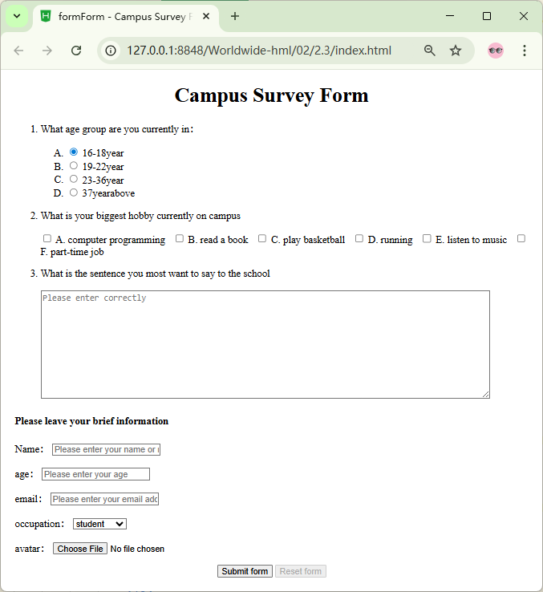
</p>

<p align="center"><em>Figure 2-14 Campus Survey Report</em></p>

### 2.3.2 Knowledge Reserve

#### 1.Introduction to Forms
Forms are mainly responsible for the function of data collection in web pages. A form consists of three basic parts:
Form Tag: It contains the URL of the CGI program used to process form data, as well as the method of submitting data to the server.
Form Fields: They include text boxes, password boxes, hidden fields, multi-line text boxes, check boxes, radio buttons, drop-down selection boxes, file upload boxes, etc.
Form Buttons: Including submit buttons, reset buttons and general buttons. They are used to send data to the server or cancel input, and can also be used to control the processing of other scripts.

#### 2.The &lt;form&gt; Tag
The &lt;form&gt; tag is used to create an HTML form for user input. A form contains input elements such as text fields, checkboxes, radio buttons, submit buttons, and so on. A form can also include menus, textarea, fieldset, legend, and label elements.
From our understanding of forms, we know that to send data in a form to a backend server, a form area must be defined. In HTML, the &lt;form&gt; tag is used to define the form area — that is, to create a form for collecting and transmitting user information. All content inside the &lt;form&gt; tag will be submitted to the server.
The basic format for creating a form is as follows:

```html
<form action="URL" method="submission method" name="form name">
  Various form controls
</form>
```

The demo code for form controls is shown in Figure 2-15.
<p align="center">
  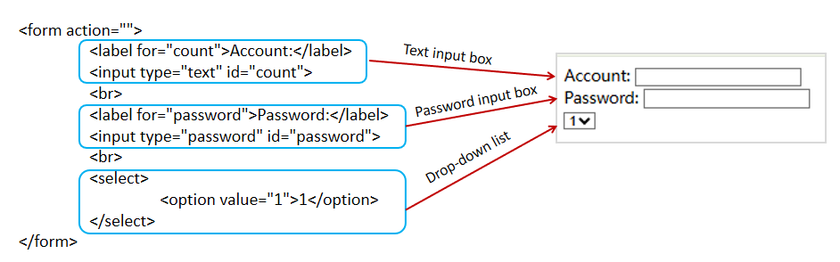
</p>

<p align="center"><em>Figure 2-15 Demo Code for Form Controls</em></p>
The attributes of the &lt;form&gt; tag are described below.

##### (1) The action attribute
After a form collects information, it needs to send the information to a server for processing. The action attribute is used to specify the URL address of the server program that receives and processes the form data.

```html
<form action="form_action.php">
  When the form is submitted, the form data will be sent to the page named "form_action.php" for processing. The value of the action attribute can be a relative path, an absolute path, or an email address for receiving data.
  <form action="email address">
    When the form is submitted, the form data will be sent in the form of an email.
```

##### (2) The method attribute
The method attribute is used to set the submission method of form data. Common request methods are get or post. In HTML5, the method attribute of the &lt;form&gt; tag can be used to set the way form data is sent to the server for processing. Sample code is as follows:

```html
<form action="form_action.asp" method="get">
  In the code above, get is the default value of the method attribute. Data submitted this way will be displayed in the browser’s address bar, which has poor security and limits the amount of data that can be sent. The post method, however, provides better security and no data size restrictions, so using method="post" allows large amounts of data to be submitted.
```

##### (3) The name attribute
The name attribute is used to specify the name of a form to distinguish multiple forms on the same page.

##### (4) autocomplete attribute
The autocomplete attribute specifies whether the form has an autocomplete function. The autocomplete attribute has two values, explained as follows:
on: the form has autocomplete enabled
off: the form has autocomplete disabled

##### (5) novalidate attribute
The novalidate attribute specifies that automatic validation of the form is disabled when the form is submitted. Setting this attribute on a form turns off validation for the entire form.

#### 3.The Input Tag
The &lt;input&gt; tag is used to collect user information.

```html
<input type="text box type" id="text box id" name="text box name">
```

Depending on the different values of the type attribute, input fields come in many forms, mainly three types: input type, selection type, and event type (button type).
（1）Input Types
① Single-line Text Input Box

```html
<input type="text">
```

A single-line text input box is often used to enter short information such as username, account number, ID number, etc. Common attributes include name, value, maxlength, etc.
② Password Input Box

```html
<input type="password">
```

A password input box provides a secure way for users to enter passwords. The text is masked so that it cannot be read, and characters in the input box are replaced with symbols such as "•".
③ email Type

```html
<input type="email">
```

The email type is a text input box used for entering E-mail addresses. It verifies whether the content in the email input box conforms to the Email address format; if not, a corresponding error message will be prompted.
④ number Type

```html
<input type="number">
```

The number-type input element provides a text box for entering numerical values. When the form is submitted, it automatically checks whether the content in the input box is a number. An error prompt will appear if the entered content is not a number or is out of the specified range.
The number-type input box can restrict the entered numbers by setting allowed maximum and minimum values, valid number intervals, default values, etc. The specific attributes are described below.
value: specifies the default value of the input box.
max: specifies the maximum input value acceptable to the input box.
min: specifies the minimum input value acceptable to the input box.
step: the valid interval of the input field; the default value is 1 if not set.
⑤ tel Type

```html
<input type="tel">
```

The tel type provides a text box for entering phone numbers. Since phone number formats vary widely, it is difficult to implement a universal format. Therefore, the tel type is usually used together with the pattern attribute.
⑥ url Type

```html
<input type="url">
```

The URL-type input element is a text box used for entering URL addresses. Data will be submitted to the server if the entered content conforms to the URL address format; otherwise, submission will be blocked and a prompt message will appear.
⑦ search Type

```html
<input type="search">
```

The search type is a text box dedicated to entering search keywords. It can automatically record certain characters, such as in site search or Google search. After the user enters content, a delete icon appears on its right side; clicking this icon button can quickly clear the content.
⑧ Range Type

```html
<input type="range">
```

The range-type input element provides a numerical input within a certain range, displayed as a slider on the web page. Its common attributes are the same as those of the number type. The minimum and maximum values can be set via the min and max attributes, and the sliding step size can be specified via the step attribute.
（2）Selection Types
① Radio Button

```html
<input type="radio">
```

Radio buttons are used for single selection. When defining radio buttons, you must assign the same name value to options in the same group for the "single selection" function to work.
② Checkbox

```html
<input type="checkbox">
```

Checkboxes are often used for multiple selections, such as choosing interests and hobbies. The checked attribute can be used to set a default selected item.
③ File Field

```html
<input type="file">
```

When a file field is defined, users can submit a file to the backend server either by entering the file path or by selecting the file directly.
④ date pickers Type

```html
<input type="date/ month/ week…">
Date pickers refer to date and time input types. HTML5 provides multiple input types for selecting dates and times and validating the entered values, as shown in Table 2-12 below.
```

**Table 2-12 Date Pickers Types**

| Date & Time Type | Description |
| --- | --- |
| date | Selects day, month, and year. |
| month | Selects month and year. |
| week | Selects week and year. |
| time | Selects time (hours and minutes). |
| datetime | Selects time, day, month, and year (UTC time). |
| datetime-local | Selects time, day, month, and year (local time). |

⑤  color Type

```html
<input type="color">
```

The color type provides a color input box for RGB color selection. Its basic format is #RRGGBB, with a default value of #000000. The default color can be changed using the value attribute. Clicking the color input box opens a color picker panel, allowing users to visually select a color conveniently.
（3）Button Types
① Ordinary Button

```html
<input type="button"/>
```

An ordinary button is often used with JavaScript. Beginners only need to understand it briefly.
② Submit Button

```html
<input type="submit">
```

The submit button is a core control in a form. After users finish entering information, they usually need to click the submit button to complete the submission of form data. The value attribute can be used to change the default text on the submit button.
③ Reset Button

```html
<input type="reset">
```

When the information entered by the user is incorrect, they can click the reset button to clear all form information that has been entered. The value attribute can be used to change the default text on the reset button.
To better understand and apply these attributes, a case is used next to demonstrate their usage, as shown in Example 1.
Example 1: Application of attributes of the input tag.
The effect is shown in Figure 2-16.

```html
<!DOCTYPE html>
<html lang="en">
  <head>
    <meta charset="utf-8">
    <title>Input Controls</title>
  </head>
  <body>
    <form action="#" method="post">
      Username:    <!-- text Single-line text input box -->
      <input type="text" name="" id="" value="Zhang San" maxlength="6" ><br>
      Password:    <!-- password Password input box -->
      <input type="password" name="" id="" value="" size="40" ><br><br>
      Gender:    <!-- radio Single selection input box -->
      <input type="radio" name="sex" checked="checked" id="" value="" >Male
      <input type="radio" name="sex" id="" value="" >Female<br><br>
      Interests:    <!-- checkbox Checkbox -->
      <input type="checkbox" >Singing
      <input type="checkbox" >Dancing
      <input type="checkbox" >Swimming<br><br>
      Upload Avatar:
      <input type="file"><br><br>        <!-- file File field -->
      <input type="submit">                <!-- submit Submit button -->
      <input type="reset">                <!-- reset Reset button -->
      <input type="button" value="Normal Button"><!-- button Normal button -->
      <input type="hidden">                    <!-- hidden Hidden field -->
    </form>
  </body>
</html>
```

<p align="center">
  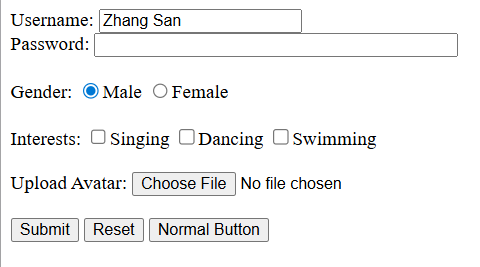
</p>

<p align="center"><em>Figure 2-16 Demonstration Example of Input Controls</em></p>
In this example, different types of input controls are defined by applying various type attribute values to the &lt;input&gt; element, and other optional attributes of the &lt;input&gt; tag are used for some of these controls.
The maxlength and value attributes are used to set the maximum allowed characters and the default displayed text in a single-line text input box; the size attribute is used to define the width of the password input box; and the name and checked attributes are used to set the name and default selected item of radio buttons.
In the preview, different types of input controls have different appearances. When specific operations are performed, such as entering a username and password, selecting gender and hobbies, etc., the displayed effects also differ.
For example, when content is entered into the password input box, it is displayed as dots instead of plain text like the username, as shown in Figure 2-17 below.
<p align="center">
  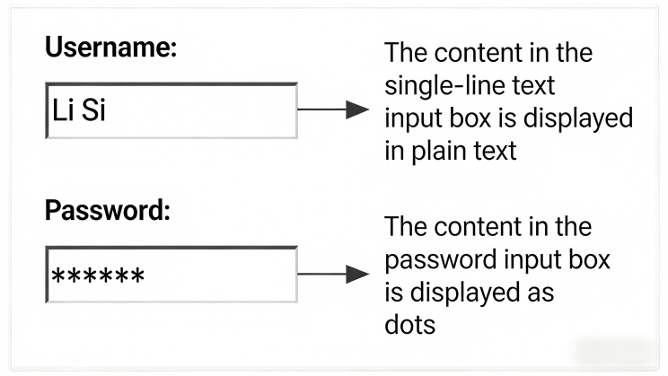
</p>

<p align="center"><em>Figure 2-17 Display Difference Between Single-line Text Box and Password Box</em></p>
Note: For input types that are not supported by the browser, they will be displayed as a normal input box on the web page.

#### 4. The &lt;textarea&gt; Tag
A multi-line text input field that can hold an unlimited amount of text. The size of the textarea can be specified using the cols and rows attributes.

```html
<textarea cols="30" rows="5">
  Text content
</textarea>
```

The &lt;select&gt; Tag
The select control is used to define a drop-down menu with multiple options, as shown in Figure 2-18.
<p align="center">
  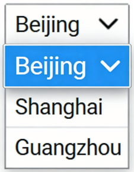
</p>

<p align="center"><em>Figure 2-18 Drop-down Menu</em></p>
The basic syntax format for defining a drop-down menu using the select control is as follows:

```html
<select>
  <option>Option 1</option>
  <option>Option 2</option>
  <option>Option 3</option>
  ...
</select>
```

The &lt;select&gt;&lt;/select&gt; tag is used to add a drop-down menu in a form. The &lt;option&gt;&lt;/option&gt; tag is nested inside the &lt;select&gt;&lt;/select&gt; tag to define specific options in the drop-down menu.

**Table 2-13 Attributes of the select control**

| Tag Name | Attribute | Description |
| --- | --- | --- |
| &lt;select&gt; | size | Specifies the number of visible options in the drop-down menu (the value is a positive integer). |
|  | multiple | When multiple="multiple" is defined, the drop-down menu supports multiple selections by holding down the Ctrl key while selecting multiple items. |
| &lt;option&gt; | selected | When selected="selected" is defined, the current item becomes the default selected item. |

### 2.3.3 Task Implementation

#### Step 1: Edit the index.html file and add the page title.

```html
<h1>Campus Survey Form</h1>
```

#### Step 2: Center the entire content page. First, use block-level elements for layout and create the form.

```html
<div style="width: 800px;margin: 0 auto;" >
  <form action="">
    …
  </form>
</div>
```

#### Step 3: Implement the layout of the page content and information.

```html
<ol>
  <li>
    <p>What age group are you currently in：</p>
    <ol type="A">
      <li>
        <input type="radio" id="age1" name="age" checked>
        <label for="age1">16-18year</label>
      </li>
      <li>
        <input type="radio" id="age2" name="age">
        <label for="age2">19-22year</label>
      </li>
      <li>
        <input type="radio" id="age3" name="age">
        <label for="age3">23-36year</label>
      </li>
      <li>
        <input type="radio" id="age4" name="age">
        <label for="age4">37yearabove</label>
      </li>
    </ol>
  </li>
  <li>
    <p>What is your biggest hobby currently on campus</p>
    <p>
      <input type="checkbox" name="bobby" id="hbA">
      <label for="hbA">A. computer programming</label>&nbsp;&nbsp;
      <input type="checkbox" name="bobby" id="hbB">
      <label for="hbB">B. read a book</label>&nbsp;&nbsp;
      <input type="checkbox" name="bobby" id="hbC">
      <label for="hbC">C. play basketball</label>&nbsp;&nbsp;
      <input type="checkbox" name="bobby" id="hbD">
      <label for="hbD">D. running</label>&nbsp;&nbsp;
      <input type="checkbox" name="bobby" id="hbE">
      <label for="hbE">E. listen to music</label>&nbsp;&nbsp;
      <input type="checkbox" name="bobby" id="hbF">
      <label for="hbF">F. part-time job</label>
    </p>
  </li>
  <li>
    <p>What is the sentence you most want to say to the school</p>
    <textarea rows="10" cols="90" name="" placeholder="Please enter correctly"></textarea>
  </li>
</ol>
```

#### Step 4: For the personal basic information section, block-level elements can be used to implement the layout. The name is text and uses a text box; age is a number and uses the number input type; the email uses the email type input box; the occupation is implemented using the select drop-down menu control; the avatar uses the file upload function with the file input type; form events are implemented using a submit button and a reset button.

```html
<h4>Please leave your brief information</h4>
<p>
  <label for="userName">Name：</label>
  <input type="text" name="userName" maxlength="8" id="userName" placeholder="Please enter your name or nickname correctly">
</p>
<p>
  <label>age：</label>
  <input type="number" name="" placeholder="Please enter your age" min="15" />
</p>
<p>
  <label>email：</label>
  <input type="email" name="" placeholder="Please enter your email address" min="15" />
</p>
<p>
  <label for="userName">occupation：</label>
  <select name="occupation">
    <option value="teacher" >teacher</option>
    <option value="stydent" selected>student</option>
    <option value="worker">employee</option>
    <option value="tourist">tourist</option>
  </select>
</p>
<p>
  <label>avatar：</label>
  <input type="file" name="avatar" placeholder="Please enter your profile picture" id="avatar" accept="image/jpeg"/>
</p>
<p align="center">
  <button type="submit">Submit form</button>
  <button type="reset" disabled>Reset form</button>
</p>
```

## Task 2.4 Practical Project – Call-to-Action Section (Section F)

### 2.4.1 Task Description
This practical project implements the production of the call-to-action section in a tour guide website. The header navigation will be fixed at the top when scrolling, and it also features a frosted glass effect.
The next part is the call-to-action section, which has a large cover image as the background. A call-to-action button is placed in the center of this section. The CTA button includes a hover effect that follows the mouse cursor, presenting a shining effect with a border.

### 2.4.2 Effect Display
The effect display of the call-to-action section is shown in Figure 2-19.
<p align="center">
  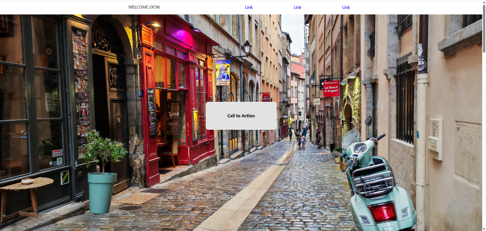
</p>

<p align="center"><em>Figure 2-19 Call to Action</em></p>

### 2.4.3 Task Implementation

#### Step 1: Create the tour guide homepage.
Create a new HTML page named index.html. After creation, set the page title to “Welcome Lyon”.
The code is as follows:

```html
<!DOCTYPE html>
<html lang="en">
  <head>
    <!-- Meta Tags -->
    <meta charset="UTF-8" />
    <meta name="viewport" content="width=device-width, initial-scale=1.0" />
    <title>WELCOME LYON</title>
    <!-- Links -->
  </head>
  <body>
  </body>
</html>
```

Create a style file with the structure styles/index.css, and import the _base.css file in the index.css file as follows:

```css
@import url("./_base.css");
```

Create a style file with the structure _base.css and set the common styles as follows:

```css
*,
*::before,
*::after {
  box-sizing: border-box;
  padding: 0;
  margin: 0;
  font-family: Arial, Helvetica, sans-serif;
  font-weight: 400;
  font-size: 1rem;
  text-decoration: none;
  border: 0;
}
body {
  display: flex;
  flex-direction: column;
  min-height: 100vh;
  overflow-x: hidden;
}
img {
  max-width: 100%;
  object-fit: cover;
  object-position: center;
}
```

#### Step 2: Edit the index.html file to create the webpage logo and navigation section.
The code is as follows:

```html
<!DOCTYPE html>
<html lang="en">
  <head>
    <!-- Meta Tags -->
    <meta charset="UTF-8" />
    <meta name="viewport" content="width=device-width, initial-scale=1.0" />
    <title>Welcome Lyon</title>
    <!-- Links -->
    <link rel="stylesheet" href="styles/index.css" />
    <!-- <script src="scripts/Tab.js"></script> -->
  </head>
  <body>
    <!-- Header -->
    <header>
      <div class="header-container">
        <h1 class="logo">WELCOME LYON</h1>
        <!-- Navigation -->
        <nav>
          <a href="#">Link</a>
          <a href="#">Link</a>
          <a href="#">Link</a>
        </nav>
      </div>
    </header>
  </body>
</html>
Create the _header.css file with the following styles:
/* Styles for the header */
header {
background-color: rgba(255, 255, 255, 0.85);
position: fixed;
top: 0;
width: 100%;
backdrop-filter: blur(2rem);
box-shadow: 0 2px 4px rgba(0, 0, 0, 0.25);
z-index: 1000;
}
.header-container {
margin: 0 auto;
padding: 1rem;
width: min(100%, 860px);
display: flex;
align-items: center;
justify-content: space-between;
}
.header-content .logo {
color: black;
text-transform: uppercase;
}
/* Navigation */
header nav {
display: flex;
align-items: center;
gap: 150px;
}
header nav a {
color: #0504c8;
}
Import the _header.css file in the index.css file as follows:
@import url("./_base.css");
@import url("./_header.css");
```

#### Step 3: Edit the index.html file and add the call-to-action section.
The code is as follows:

```html
<!DOCTYPE html>
<html lang="en">
  <head>
    <!-- Meta Tags -->
    <meta charset="UTF-8" />
    <meta name="viewport" content="width=device-width, initial-scale=1.0" />
    <title>Welcome Lyon</title>
    <!-- Links -->
    <link rel="stylesheet" href="./styles/index.css" />
    <!-- <script src="scripts/Tab.js"></script> -->
  </head>
  <body>
    <!-- Header -->
    <header>
      <div class="header-container">
        <h1 class="logo">WELCOME LYON</h1>
        <!-- Navigation -->
        <nav>
          <a href="#">Link</a>
          <a href="#">Link</a>
          <a href="#">Link</a>
        </nav>
      </div>
    </header>
    <main>
      <!-- Hero Section -->
      <div class="hero">
        
        <div class="cta-container" id="cta-container">
          <button class="cta">Call to Action</button>
        </div>
      </div>
    </main>
  </body>
</html>
Create _hero.css with the following styles:
.hero {
height: 1023px;
padding: 1rem;
position: relative;
}
.hero img {
width: 100%;
position: absolute;
inset: 0;
height: 100%;
}
/* Hero Button */
.cta-container {
height: 112px;
width: 278px;
background: transparent;
border-radius: 0.5rem;
position: absolute;
left: 50%;
top: 50%;
transform: translate(-50%, -50%);
z-index: 10;
padding: 3px;
transition: 0.2s;
}
.cta-container button {
width: 100%;
height: 100%;
border-radius: 0.5rem;
background-color: #e0e0e0;
font-size: 1.2rem;
cursor: pointer;
}
.cta-container:hover {
transform: scale(1.03) translate(-50%, -50%);
}
Import the _hero.css file in the index.css file as follows:
@import url("./_base.css");
@import url("./_header.css");
@import url("./_hero.css");
```
