# Project 3 CSS Cascading Style Sheets --- The Beauty of Cascading: Hues Across the Woods, Overlapping Shadows into Poetry

## Content Guide
This project mainly covers basic CSS styles, the box model, floating, and positioning. Basic CSS styles include the basic syntax of CSS, the classification and introduction of CSS, CSS selectors, CSS text style rules, and common CSS style rules. The box model introduces the box model itself, as well as CSS borders and margins. Floating covers the document flow, the principle of floating, and methods to clear floats. Positioning mainly explains static positioning, relative positioning, absolute positioning, and fixed positioning, laying a solid foundation for page design in Web front-end development.

## Learning Objectives

#### 1.Master basic CSS styles.

#### 2.Understand and master the box model.

#### 3.Master the principle of floating, as well as how to set and clear floats.

#### 4.Master relative positioning and absolute positioning.

## Task 3.1 Making a News Detail Page

### 3.1.1 Task Description
A news detail page is a concrete display of news content, usually in the form of text and images, allowing users to access richer news information.
The creation of a news detail page requires the use of basic CSS knowledge, including CSS selectors, basic CSS styles, CSS text styles, and so on.
The effect of the example is shown in Figure 3-1.
<p align="center">
  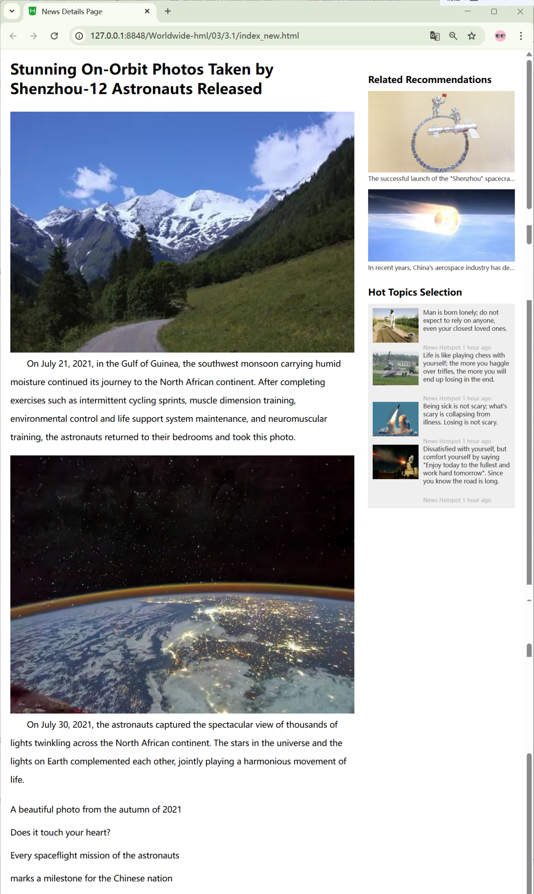
</p>

<p align="center"><em>Figure 3-1 Rendering of the News Detail Page</em></p>

### 3.1.2 Knowledge Preparation
CSS stands for Cascading Style Sheet, which is a technology used to control the appearance of web pages.
HTML, CSS, and JavaScript are the three core elements of front-end technologies. HTML controls the structure of web pages, CSS controls the appearance of web pages, and JavaScript controls the behavior of web pages. Next, we will start learning CSS-related knowledge.

#### 1.Basic CSS Syntax
CSS is mainly used to control page elements, and a style is the smallest syntax unit of CSS. Each style consists of two parts: a selector and a declaration (rule), as shown in Figure 3-2.
<p align="center">
  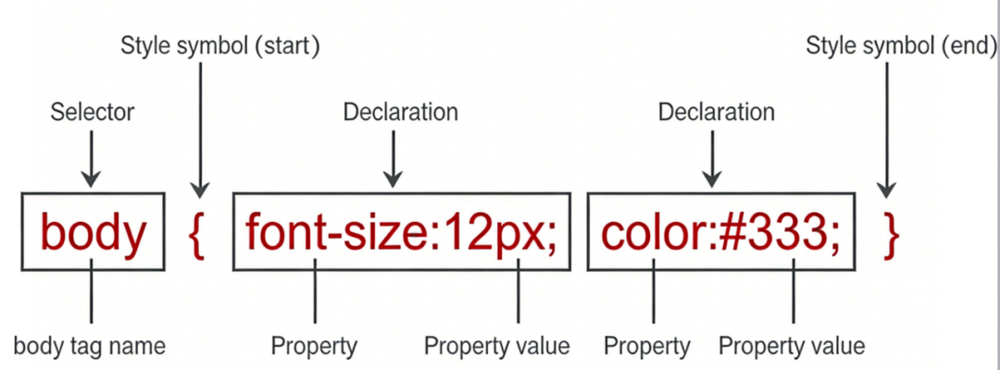
</p>

<p align="center"><em>Figure 3-2 Basic Structure of CSS Styles</em></p>

##### (1) Selector
The selector tells the browser which elements on the page the style will apply to. These elements can be a specific tag, all page elements, a specified class or ID value, etc. When parsing the style, the browser renders the display effect of the elements according to the selector.

##### (2) Declaration

```
There can be one or multiple declarations, which tell the browser how to render the elements specified by the selector. All declarations are placed inside a pair of curly braces { }.
```

A declaration must consist of two parts: a property and a property value, and a semicolon is used to mark the end of a declaration. The semicolon for the last declaration in a style can be omitted.

##### (3) Property
A property is a predefined style option provided by CSS. A property name consists of one or more words, connected by hyphens. This allows the style effect to be set by the property to be expressed intuitively.

##### (4) Value
The value is a parameter used to display the effect of the property. It includes a numeric value with a unit, or a keyword.

#### 2. CSS Categories and Introduction Methods
There are four ways to add CSS: inline styles, internal styles, external styles, and imported style sheets.
The imported style sheet method is very similar to the external style sheet method. However, in actual development, we rarely use the imported style sheet method and prefer the link method (external style). The reason is that the imported style sheet loads HTML first and then CSS, while link loads CSS first and then HTML. If HTML is loaded before CSS, the page experience is very poor. Therefore, we do not need to learn the imported style sheet method for now.

##### (1) Inline Style Sheet
Basic format:

```html
<Tag name style="property1: value1; property2: value2;"> Content </Tag name>
```

##### (2) Internal Style Sheet
Basic format:

```html
<style type="text/css">
  Selector { Property name: Property value; }
</style>
```

##### (3) External Style Sheet
Basic format:

```html
<link type="text/css" rel="stylesheet" href="URL of the CSS file">
```

#### 3. CSS Selectors
CSS selectors mainly include element name selectors, ID selectors, class selectors, and others.
CSS selector naming follows these rules:

##### (1) Use hyphenated naming, e.g., my-title;
(2) Names may only contain characters [a-z, A-Z, 0-9], ISO 10646 characters U+00A1 and above, plus hyphens (-) and underscores (_). They must not start with a digit, or a hyphen followed by a digit.
Classification of CSS Selectors

##### (1) Element Name Selector
Basic format:

```
Tag name { property1: value1; property2: value2; property3: value3;... }
```

The element name selector categorizes elements by their tag name and applies uniform CSS styles to a certain type of tag on the page. Its biggest advantage is quickly styling all elements of the same type uniformly. However, this is also its disadvantage: it cannot achieve differentiated style design.

##### (2) ID Selector
Basic format:

```
#id-property-value { property1: value1; property2: value2;... }
```

Note: The ID name must be prefixed with #, otherwise the selector will not work.

##### (3) Class Selector
Basic format:

```
.class-property-value { property1: value1; property2: value2;... }
```

The class selector allows us to assign a class name to the same or different elements, then apply CSS styles to all elements with that class.

##### (4) Descendant Selector
Basic format:

```
Outer tag Inner tag { property1: value1; property2: value2;... }
```

Note: The descendant selector selects elements that are descendants of a specified element. A space separates the ancestor (outer) element and descendant (inner) element, meaning all inner elements inside the outer element are selected.

##### (5) Pseudo-class Selectors
In CSS, pseudo-class selectors fall into three main categories: structural pseudo-classes, pseudo-element selectors, and link pseudo-classes.
Structural Pseudo-class Selectors (8 types).
① :root selector
As the name implies, this matches the root element of the document where an element resides. In HTML documents, the root element is always &lt;html&gt;. Styles defined with :root apply to all elements on the page.
② :not selector
Also called the negation pseudo-class, it selects all elements except the specified one. Useful for excluding certain elements from a style rule.
③ :only-child selector
Matches an element that is the only child of its parent element.
④ :first-child and :last-child selectors
As the names suggest, they target the first child and last child elements of a parent, respectively.
⑤ :nth-child(n) and :nth-last-child(n) selectors
The :first-child and :last-child selectors only apply to the first and last child elements respectively, while the :nth-child(n) and :nth-last-child(n) selectors complement them and are used to target any element between the second and the second‑last.
The parameter n can be:
· an integer (1, 2, 3, 4)
· an expression (2n+1, -n+7)
· a keyword (odd, even)
However, n always starts from 1, not 0. In other words, when n is 0, the selector will not match any element.
In the :nth-last-child(n) selector, the word "last" means counting backward from the last child element of the parent to select a specific element.
⑥ :nth-of-type(n) and :nth-last-of-type(n) selectors
type refers to the element type.
Unlike :nth-child(n), which matches the nth child regardless of type, :nth-of-type(n) only matches the nth element of a specific type within its parent.
⑦ :empty selector
Selects every element that has no children (including text nodes and empty tags).
⑧ :target selector
Matches the target element identified by a fragment identifier in the URL (the part after #). For example, #respond will match the element with id="respond".
Pseudo-element Selectors (2 types)
Pseudo-elements are not real elements in the HTML structure.
a. :before selector
Inserts a pseudo-element at the beginning of an element’s content. Its content is controlled by the content property, which may contain text or an empty string.
b.:after Selector
The :after selector is used to add a pseudo-element at the end of the content inside an element. The content of this pseudo-element is controlled by the content property. We can write text in the content property, but in most cases it is set to an empty string.
It should be noted that pseudo-element selectors must have the content property set, and they are inline elements by default. Since pseudo-elements do not exist in the actual DOM structure, :hover cannot be directly applied to them. They are commonly used for clearing floats or adding small decorative icons.
Finally, we will talk about link pseudo-class selectors, which are generally divided into four types:
① :link
Represents the state of an unvisited link
② :visited
Represents the style change for a visited link
③ :hover
Represents the style change when the mouse hovers over the link
④ :active
Represents the style change when the mouse is held down and the link is being actively selected

##### (6) Group Selector
Basic format:

```
Selector 1, Selector 2 { property1: value1; property2: value2; }
```

A group selector applies the same style rules to multiple selectors at the same time.Often, several parts of our CSS styles require the same settings. Writing them one by one results in high repetition, verbosity, and poor maintainability. We can combine these selectors with identical settings to simplify the code.
Note: In a group selector, multiple selectors must be separated by an English comma (,), otherwise the group selector will not take effect.

#### 4. CSS Selector Priority
Priority, as the name suggests, means order of precedence. From lowest to highest:
Browser default styles (lowest), internal and external styles (medium), inline styles (highest).
Note: Selector priority — we assign weights to different selectors (to mark the importance of the current selector; higher weight means higher priority).
· Element selectors / Pseudo-element selectors: 1
· Class selectors / Pseudo-class selectors / Attribute selectors: 10
· ID selectors: 100
· Inline styles: 1000
· !important: 10000
The weights of each group of selectors are added together. The one with greater weight has higher priority. If weights are equal, the nearest rule applies: the style closer to the tag content takes precedence.

#### 5. CSS Text Style Rules
In web development, the first consideration is the text style properties of the page. Text style properties usually include font, size, weight, color, etc.

##### (1) Font type: font-family
Basic format:

```html
p{font-family:"Microsoft YaHei";}
Example:
<!DOCTYPE html>
<html lang="en">
  <head>
    <meta charset="utf-8">
    <title></title>
    <style type="text/css">
      #a {
      font-family: SimSun;
      }
      #b {
      font-family: "Microsoft YaHei";
      }
    </style>
  </head>
  <body>
    <p id="a">Font is SimSun</p>
    <p id="b">Font is Microsoft YaHei</p>
  </body>
</html>
```

The preview effect in the browser is shown in Figure 3-3:
<p align="center">
  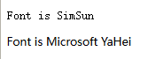
</p>

<p align="center"><em>Figure 3-3 Font Types</em></p>
We can specify multiple fonts at the same time, separated by commas. This means that if the browser does not support the first font, it will try the next one until a suitable font is found.
Basic format:

```css
body{font-family:"ST Caiyun", "SimSun", "SimHei";}
```

When using font-family to set fonts, please note the following points:
① Multiple fonts must be separated by commas in English format.
② Chinese fonts need to be enclosed in English quotation marks, while English fonts generally do not need quotation marks. When setting English fonts, the English font name must be placed before the Chinese font name.

```css
③ If the font name contains spaces, #, $, or other symbols, the font must be enclosed in single or double quotation marks in English format, for example:font-family: "Times New Roman";
```

④ Try to use system default fonts to ensure correct display in any user’s browser.

##### (2) Font Size: font-size
In CSS, we use the font-size property to define the size of text.
Basic format:

```css
font-size: keyword/pixel value;
```

Description: There are two ways to set the value of font-size: using keywords or using numerical values with px as the unit.
The available keyword values are shown in Table 3-1.

**Table 3-1 Values for the font-size property**

| Property Value | Description |
| --- | --- |
| xx-small | Extra extra small |
| x-small | Extra small |
| small | Small |
| Medium | Default value, normal |
| Large | Large |
| x-large | Extra large |
| xx-large | Extra extra large |

Example:

```html
<!DOCTYPE html>
<html lang="en">
  <head>
    <title> font- size property</title>
    <style type="text/css">
      #p1 {
      font-size: small;
      }
      #p2 {
      font-size: medium;
      }
      #p3 {
      font-size: large;
      }
    </style>
  </head>
  <body>
    <p id="p1">Font size is "small"</p>
    <p id="p2">Font size is "medium (normal)"</p>
    <p id="p3">Font size is "large (large)"</p>    </body>
  </html>
```

The preview effect in the browser is shown in Figure 3-4:
<p align="center">
  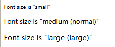
</p>

<p align="center"><em>Figure 3-4 Effects of Different Font Sizes</em></p>

##### (3) Font Weight: font-weight
In CSS, we can use the font-weight property to define the thickness of the font.
Basic format:

```css
font-weight: weight value;
```

Note:
The font-weight property accepts two types of values: keywords, and numerical values ranging from 100 to 900.
The keyword values for the font-weight property are shown in Table 3-2.

**Table 3-2 font-weight property values**

| Property Value | Description |
| --- | --- |
| normal | Default value, normal weight |
| lighter | Lighter weight |
| bold | Bold weight |
| bolder | Extra bold (effect is similar to bold) |

A font-weight value of 400 corresponds to the normal font weight (normal), and 700 corresponds to bold.
Higher values represent thicker fonts, while lower values represent thinner fonts.
For Chinese web pages, only bold and normal are commonly used; using numerical values (100–900) is not recommended.
Example:

```html
<!DOCTYPE html>
<html lang="en">
  <head>
    <title> font- weight Property </title>
    <style type="text/css">
      #p1 {
      font-weight: lighter;
      }
      #p2 {
      font-weight: normal;
      }
      #p3 {
      font-weight: bold;
      }
    </style>
  </head>
  <body>
    <p id="p1">Font weight is: lighter</p>
    <p id="p2">Font weight is: normal (normal font) </p>
    <p id="p3">Font weight is: bold</p>
  </body>
</html>
```

The preview effect in the browser is shown in Figure 3-5.
<p align="center">
  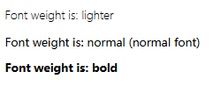
</p>

<p align="center"><em>Figure 3-5 Effects of Different Font Weights</em></p>

##### (5) Font Color: color
In CSS, we can use the color property to define the font color.
Basic format:

```css
color:color value;
```

Note:
A color value can be a keyword or a hexadecimal RGB value.

##### (1) Using keywords with the color property
Keywords refer to the English names of colors, such as red, blue, green, etc.

##### (2) Using hexadecimal RGB with the color property
The color property can also use hexadecimal RGB values. Hexadecimal RGB values refer to formats like #FF0000, #FF6600, #29D794, etc. This method supports more than 16.7 million colors. In practical work, hexadecimal is the most common way to define colors.

##### (3) RGB code: for example, red can be expressed as rgb(255, 0, 0) or (100%, 0%, 0%).
Example:

```html
<!DOCTYPE html>
<html lang="en">
  <head>
    <meta charset="utf-8">
    <title></title>
    <style type="text/css">
      #a {
      color: red;
      }
      #b {
      color: orange;
      }
      #c {
      color: blue;
      }
    </style>
  </head>
  <body>
    <p id="a">The font color is red</p>
    <p id="b">The font color is orange</p>
    <p id="c">The font color is blue</p>
  </body>
</html>
```

The preview effect in the browser is shown in Figure 3-6.
<p align="center">
  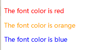
</p>

<p align="center"><em>Figure 3-6 Effects of Different Font Colors</em></p>

##### (6) Text Effects
In CSS, we can use the font-style property to define the italic effect of the font.
The basic format is as follows:

```css
font-style: property value;
```

**Table 3-2 Values for the font-style property**

| Property Value | Description |
| --- | --- |
| normal | Default value, normal style |
| italic | Italic |
| oblique | Displays an oblique font style |

Example:

```html
<!DOCTYPE html>
<html lang="en">
  <head>
    <meta charset="utf-8">
    <title></title>
    <style type="text/css">
      #a {
      font-style: normal;
      }
      #b {
      font-style: italic;
      }
      #c {
      font-style: oblique;
      }
    </style>
  </head>
  <body>
    <p id="a">The font style is set to normal</p>
    <p id="b">The font style is set to italic</p>
    <p id="c">The font style is set to oblique</p>
  </body>
  <html>
    The preview effect in the browser is shown in Figure 3-7:
```

<p align="center">
  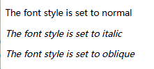
</p>

<p align="center"><em>Figure 3-7 Effects of Different Font Styles</em></p>

##### (7) Text Decoration: text-decoration
In CSS, we use the text-decoration property to define underlines, strikethroughs, and overlines for paragraph text.
The basic format is as follows:

```css
text-decoration:property value;
```

**Table 3-3 Values for the text-decorati**

| Property Value | Description |
| --- | --- |
| none | Default value. This value can remove existing underline, strikethrough, or overline styles |
| underline | Underline |
| line-through | Strikethrough |
| overline | Overline |

Example:

```html
<!DOCTYPE html>
<html lang="en">
  <head>
    <meta charset="utf-8">
    <title></title>
    <style type="text/css">
      #a {
      text-decoration: underline;
      }
      #b {
      text-decoration: line-through;
      }
      #c {
      text-decoration: overline;
      }
    </style>
  </head>
  <body>
    <p id="a">This is the "underline" effect</p>
    <p id="b">This is the "line-through" effect</p>
    <p id="c">This is the "overline" effect</p>    </body>
  </html>
```

The preview effect in the browser is shown in Figure 3-8:
<p align="center">
  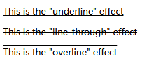
</p>

<p align="center"><em>Figure 3-8 Text Decoration Effects</em></p>

##### (8) Text Styles
Font styles mainly relate to the visual effect of the font itself, while text styles mainly relate to the layout effect of multiple characters, that is, the layout effect of the entire paragraph. The following introduces text styles.
① First-line Indentation
In CSS, we can use the text-indent property to define the first-line indentation of a paragraph.
Basic format:

```css
text-indent:pixel value;
```

② Horizontal Alignment
In CSS, we use the text-align property to control the horizontal alignment of text: left alignment, center alignment, and right alignment.
Basic format:

```css
text-align:property value;
```

Description:

**Table 3-4 Values for the text-align property**

| Property Value | Description |
| --- | --- |
| left | Default value, left alignment |
| center | center alignment |
| right | right alignment |

③ Letter Case
In CSS, we can use the text-transform property to convert the case of text. This applies only to English, since Chinese has no uppercase or lowercase distinction.
Basic format:

```css
text-transform:property value;
```

**Table 3-5 Values for the text-transform property**

| Property Value | Description |
| --- | --- |
| none | Default value, no conversion |
| uppercase | convert to uppercase |
| lowercase | convert to lowerc |
| capitalize | capitalize the first letter of each English word, no conversion for other letters |

Example:

```html
<!DOCTYPE html>
<html lang="en">
  <head>
    <meta charset="utf-8">
    <title></title>
    <style type="text/css">
      #a {
      text-transform: uppercase;
      }
      #b {
      text-transform: lowercase;
      }
      #c {
      text-transform: capitalize;
      }
    </style>
  </head>
  <body>
    <p id="a">Uppercase: There is no royal road to learning</p>
    <p id="b">Lowercase: There is no royal road to learning</p>
    <p id="c">Capitalized (only first letter): There is no royal road to learning</p>
  </body>
</html>
```

The preview effect in the browser is shown in Figure 3-9.
<p align="center">
  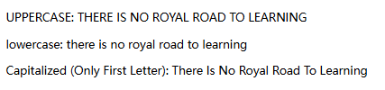
</p>

<p align="center"><em>Figure 3-9 Effects of Case Conversion</em></p>
④ Line Height
In CSS, we can use the line-height property to control the line height of text.
The basic format is as follows:

```css
line-height: pixel value;
```

Note:
In basic CSS learning, we use pixels as the unit.
Example:

```html
<!DOCTYPE html>
<html lang="en">
  <head>
    <meta charset="utf-8">
    <title></title>
    <style type="text/css">
      #a {
      line-height: 12px;
      }
      #b {
      line-height: 17px;
      }
      #c {
      line-height: 22px;
      }
    </style>
  </head>
  <body>
    <p id="a">Northern landscape:A thousand miles of ice sealed,Ten thousand miles of snow flying.Looking beyond the Great Wall, all is vast white;The Yellow River, up and down, stops its flowing.Mountains dance like silver snakes,Plains run like waxen elephants,Daring to compete with the sky in height.Wait for a sunny day:See red dress on white snow,Charming and bright.</p>
    <p id="a">Northern landscape:A thousand miles of ice sealed,Ten thousand miles of snow flying.Looking beyond the Great Wall, all is vast white;The Yellow River, up and down, stops its flowing.Mountains dance like silver snakes,Plains run like waxen elephants,Daring to compete with the sky in height.Wait for a sunny day:See red dress on white snow,Charming and bright.</p>
    <p id="a">Northern landscape:A thousand miles of ice sealed,Ten thousand miles of snow flying.Looking beyond the Great Wall, all is vast white;The Yellow River, up and down, stops its flowing.Mountains dance like silver snakes,Plains run like waxen elephants,Daring to compete with the sky in height.Wait for a sunny day:See red dress on white snow,Charming and bright.</p>
  </body>
</html>
```

The preview effect in the browser is shown in Figure 3-10.
<p align="center">
  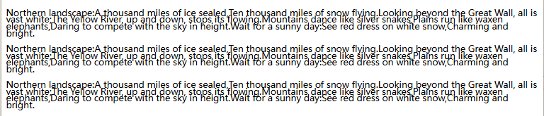
</p>

<p align="center"><em>Figure 3-10 Effects of Line Height Changes</em></p>
⑤ Line Spacing and Character Spacing
a. Line spacing:
The word-spacing property defines the distance between words within a line.
Example:

```html
<!DOCTYPE html>
<html lang="en">
  <head>
    <meta charset="utf-8">
    <title></title>
    <style type="text/css">
      #a {
      word-spacing: 0px;
      }
      #b {
      word-spacing: 3px;
      }
      #c {
      word-spacing: 5px;
      }
    </style>
  </head>
  <body>
    <p id="a">Practice makes perfect.</p>
    <p id="b">Practice makes perfect.</p>
    <p id="c">Practice makes perfect.</p>
  </body>
</html>
```

The preview effect in the browser is shown in Figure 3-11.
<p align="center">
  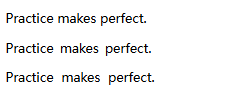
</p>

<p align="center"><em>Figure 3-11 Effects of Line Spacing Changes</em></p>
b. Character Spacing:
The letter-spacing property is used to define the character spacing.
Example:

```html
<!DOCTYPE html>
<html lang="en">
  <head>
    <meta charset="utf-8">
    <title></title>
    <style type="text/css">
      #a {
      letter-spacing: 0px;
      }
      #b {
      letter-spacing: 3px;
      }
      #c {
      letter-spacing: 5px;
      }
    </style>
  </head>
  <body>
    <p id="a">Practice makes perfect.</p>
    <p id="b">Practice makes perfect.</p>
    <p id="c">Practice makes perfect.</p>
  </body>
</html>
```

The preview effect in the browser is shown in Figure 3-12.
<p align="center">
  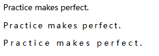
</p>

<p align="center"><em>Figure 3-12 Effects of Character Spacing Changes</em></p>
Note: letter-spacing controls character spacing, and each English letter is also treated as one "character"! Please pay attention to this detail.

#### 6. Common CSS Style Rules
In addition to text styling, CSS has many other common style rules, which we will cover below.

##### (1) width Property
width defines the width of an element’s content area. The default value is auto. It can also be set using units such as px, cm, etc.
Example:
width: 300px; sets the width to 300 pixels.
Percentages can also be used, e.g. width: 50%; sets the width to occupy 50% of the available space.

##### (2) height Property
height defines the height of an element’s content area. It uses the same length units as width.

##### (3) list-style Property
list-style is a shorthand property that sets all list properties in one declaration.
Example:

```css
list-style: square outside url('1.gif');
```

This code sets the list marker type to square, positions the marker outside the list item, and uses the image 1.gif to replace the list item marker.

##### (4) overflow Property
The overflow property specifies how to handle content that overflows the element’s box. If set to scroll, the user agent will provide a scrolling mechanism whether needed or not.
Common values and descriptions are as follows:

**Table 3-6 overflow Property Values**

| Value | Description |
| --- | --- |
| visible | Default value. Content is not clipped and may be rendered outside the element’s box. |
| hidden | Content is clipped, and the remaining content is invisible. |
| scroll | Content is clipped, but the browser displays scrollbars to allow viewing the rest. |
| auto | If content is clipped, the browser displays scrollbars to allow viewing the rest. |
| inherit | Specifies that the overflow value should be inherited from the parent element. |

（5）background-color Property
background-color sets the background color of an element. The available color values are as follows:

**Table 3-7 background-color Property Values**

| Value | Description |
| --- | --- |
| color_name | Specifies the background color using a color name (e.g. red). |
| hex_number | Specifies the background color using a hexadecimal value (e.g. #ff0000). |
| rgb_number | Specifies the background color using an RGB code (e.g. rgb(255,0,0)). |
| transparent | Specifies the background color using an RGB code (e.g. rgb(255,0,0)). |

### 3.1.3 Task Implementation

#### Step 1: Create a new HTML page.
Open the development tool, go to File → New HTML page. After creation, set the title to "News Detail Page". The code is as follows.

```html
<!DOCTYPE html>
<html lang="en">
  <head>
    <meta charset="utf-8">
    <title>News Details Page</title>
    <!-- Introduce CSS files -->
    <link rel="stylesheet" type="text/css" href="./css/index.css" />
  </head>
  ……
```

#### Step 2: Create the news detail page.
The code for creating the news page is as follows.

```html
<body>
  <div class="news">
    <div class="news-left">
      <h1 class="title">Stunning On-Orbit Photos Taken by Shenzhou-12 Astronauts Released</h1>
      <div class="new-left-content">
        
        <p>On July 21, 2021, in the Gulf of Guinea, the southwest monsoon carrying humid moisture continued its journey to the North African continent. After completing exercises such as intermittent cycling sprints, muscle dimension training, environmental control and life support system maintenance, and neuromuscular training, the astronauts returned to their bedrooms and took this photo.</p>
      </div>
      <div class="new-left-content">
        
        <p>On July 30, 2021, the astronauts captured the spectacular view of thousands of lights twinkling across the North African continent. The stars in the universe and the lights on Earth complemented each other, jointly playing a harmonious movement of life.</p>
      </div>
      <p>A beautiful photo from the autumn of 2021</p>
      <p>Does it touch your heart?</p>
      <p>Every spaceflight mission of the astronauts</p>
      <p>marks a milestone for the Chinese nation</p>
      <p>in its march toward the farther and higher starry sky</p>        </div>
    </div>
  </body>
  The styles used are as follows.
  * {
  padding: 0;
  margin: 0;
  }
  .news{
  width: 1100px;
  height: 500px;
  margin: 20px auto;/* Horizontally centered */
  }
  .news-left{
  width: 750px;
  float: left;/* Float left */
  }
  .news-left>p{
  line-height: 50px;
  font-size: 18px;
  }
  .news-left .title{
  margin-bottom: 30px;
  }
  .new-left-content{
  /* Width set to 100%, same as parent width */
  width: 100%;
  margin-bottom: 20px;
  }
  .new-left-content>img{
  width: 100%;
  }
  .new-left-content>p{
  text-indent: 2em;
  font-size: 18px;
  /* Line height */
  line-height: 40px;
  /* Allow long words to wrap to the next line */
  word-wrap: break-word;}
```

#### Step 3: Create related recommendations on the right side.
The code for creating related recommendations on the right side is as follows.

```html
<div class="news-right">
  <div class="news-right-ost">
    <h2>Related Recommendations</h2>
    <div class="ost-content">
      
      <a href="#">The successful launch of the "Shenzhou" spacecraft marks that China's aerospace technology has reached a new level. China's aerospace industry has achieved amazing accomplishments.</a>
    </div>
    <div class="ost-content">
      
      <a href="#">In recent years, China's aerospace industry has developed by leaps and bounds, including the Chang'e lunar exploration program, the crewed Shenzhou missions, and the successfully docked Shenzhou-8 spacecraft.</a>
    </div>
  </div>
</div>
The styles are as follows.
.news-right{
width: 320px;
float: right;
}
.news-right h2{
line-height: 30px;
font-size: 20px;
margin: 30px 0 10px;
}
.ost-content{
width: 100%;
margin-bottom: 15px;
}
.ost-content>img{
width: 100%;
}
.ost-content>a{
display: block;
width: 100%;
font-size: 13px;
color: #333;
/* Remove text underline */
text-decoration: none;
/* Show ellipsis when content overflows */
overflow: hidden;    white-space: nowrap;
text-overflow: ellipsis;
}
/* Hover effect for <a> tag text */
  .ost-content>a:hover{
  color: #2291f7;
  }
  .news-right-ost>ul{
  list-style: none;
  width: 300px;
  padding: 10px;
  background-color: #efefef;
  overflow: hidden;
  }
  .news-right-ost>ul>li{
  width: 100%;
  height: 80px;
  margin-bottom: 10px;
  }
  .news-right-ost>ul>li>img{
  width: 100px;
  height: 75px;
  float: left;
  }
  .host-content{
  width: 190px;
  float: left;
  margin-left: 10px;
  }
  .host-content>a{
  display: block;
  text-decoration: none;
  color: #333;
  font-size: 13px;
  }
  .host-content>p{
  font-size: 12px;
  color: #afafaf;
  margin-top: 25px;
  }
  .news-host:hover{
  cursor: pointer;
  font-weight: bold;
  color: #000000;
  }
```

#### Step 4: Create featured hot news on the right side.
The code for creating featured hot news on the right side is shown below. The styles used are the same as those in Step 3.

```html
<div class="news-right-ost">
  <h2>Hot Topics Selection</h2>
  <ul>
    <li>
      
      <div class="host-content">
        <a href="#">Man is born lonely; do not expect to rely on anyone, even your closest loved ones.</a>
        <p>
          <span class="news-host">News Hotspot</span>
          <span>1 hour ago</span>
        </p>
      </div>
    </li>
    <li>
      
      <div class="host-content">
        <a href="#">Life is like playing chess with yourself; the more you haggle over trifles, the more you will end up losing in the end.</a>
        <p>
          <span class="news-host">News Hotspot</span>
          <span>1 hour ago</span>
        </p>
      </div>
    </li>
    <li>
      
      <div class="host-content">
        <a href="#">Being sick is not scary; what's scary is collapsing from illness. Losing is not scary.</a>
        <p>
          <span class="news-host">News Hotspot</span>
          <span>1 hour ago</span>
        </p>
      </div>
    </li>
    <li>
      
      <div class="host-content">
        <a href="#">Dissatisfied with yourself, but comfort yourself by saying "Enjoy today to the fullest and work hard tomorrow". Since you know the road is long.</a>
        <p>
          <span class="news-host">News Hotspot</span>
          <span>1 hour ago</span>
        </p>
      </div>
    </li>
  </ul>
</div>
```

## Task 3.2 Personal Photo Album Production

### 3.2.1 Task Description
A personal photo album displays a person’s personal style. A reasonable layout makes the album look neater and more attractive, improving the viewing experience for users.
<p align="center">
  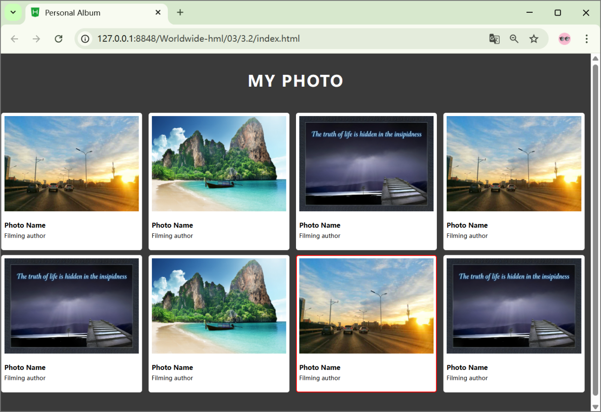
</p>

To complete the production of a personal photo album, the box model needs to be used, including setting the height, size, inner and outer margins of the box model, etc. The effect is shown in Figure 3-13.
<p align="center"><em>Figure 3-13 Rendering of Personal Photo Album</em></p>

### 3.2.2 Knowledge Preparation
The box model is the core of CSS positioning and layout. It defines how elements are displayed and how they interact with each other. Every element on a page is regarded as a rectangular box, which consists of the element's content, padding, border, and margin. Web page layout focuses on how these boxes are arranged and nested on the page. When many boxes are placed together, the key factors to consider are box size calculation and document flow, as shown in Figure 3-14.
<p align="center">
  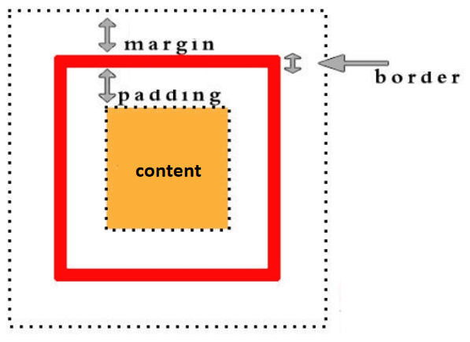
</p>

<p align="center"><em>Figure 3-14 Schematic diagram of the box model</em></p>

#### 1.Width and Height
In the box model, each element needs a defined width and height. The width and height properties are used in CSS to set the size of an element.
Width and height use the same value formats, as shown in Table 3-8.

**Table 3-8 Values for width and height**

| Value | Description |
| --- | --- |
| length | Defines a fixed width or height value (using pixels, pt, em, etc.) |
| % | Defines width or height as a percentage of the containing block object |
| auto | Default. The browser calculates the actual width and height. |

Setting width and height for the box model:

```css
width:200px;
height:100px;
```

When creating a box model, you must first set its width and height. Only then does it make sense to set other properties such as padding, margin, and border. If width and height are not set, other properties will be meaningless.

#### 2. Padding
Padding appears around the content area. If a background is applied to an element, the background applies to the area consisting of the element's content and padding. Therefore, padding can be used to create a separation zone around the content so that the content does not blend with the background. When the padding of an element is cleared, the "released" area will be filled with the element's background color. The value formats are shown in Table 3-9.

**Table 3-9 Padding Values**

| Value | Description |
| --- | --- |
| length | Defines a fixed padding value (in pixels, pt, em, etc.) |
| % | Defines padding using a percentage value |

In CSS, it can specify different padding values for different sides.

```css
padding-top:25px;
padding-bottom:25px;
padding-left:50px;
padding-right:50px;
```

The above properties can be abbreviated as padding.
The padding property can have 1 to 4 values.

```css
padding:25px 50px 75px 100px;
```

top padding: 25px
right padding: 50px
bottom padding: 75px
left padding: 100px

```css
padding:25px 50px 75px;
```

top padding: 25px
left and right padding: 50px
bottom padding: 75px

```css
padding:25px 50px;
```

top and bottom padding: 25px
left and right padding: 50px

```css
padding:25px;
```

all paddings: 25px
Example:

```html
<html>
  <head>
    <title>Padding</title>
    <style type="text/css">
      p {
      background-color: yellow;
      }
      p.padding {
      padding-top: 50px;
      padding-bottom: 50px;
      padding-right: 50px;
      padding-left: 50px;
      }
      p.paddings {
      padding: 25px;
      }
    </style>
  </head>
  <body>
    <p>This is a paragraph without specified padding.</p>
    <p class="padding">This is a paragraph with specified padding.</p>
    <p class="paddings">This is a paragraph with specified padding.</p>
  </body>
</html>
```

By running the HTML file, the result is shown in Figure 3-15.
<p align="center">
  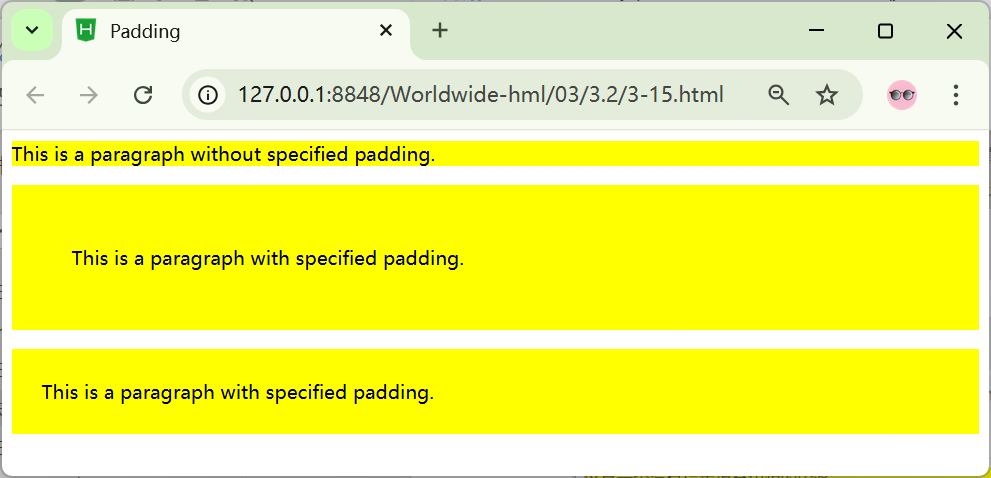
</p>

Figure 3‑15 Effect of Using Padding

#### 3.Margin
The margin property defines the space around an element. Margin clears the area outside the border around an element. Margin has no background color and is completely transparent.
You can change the top, bottom, left, and right margins of an element individually, or set all margin properties at once. The available values are shown in Table 3‑10.
Table 3‑10 Margin Values

| Value | Description |
| --- | --- |
| length | Defines a fixed margin value (using pixels, pt, em, etc.) |
| % | Defines margin using a percentage |
| auto | Lets the browser calculate the margin. The result depends on the browser |

Negative values can be used for margin, which will cause content to overlap.
In CSS, different margins can be specified for different sides.

```css
margin-top:100px;
margin-bottom:100px;
margin-right:50px;
margin-left:50px;
```

The shorthand property for all margin properties is margin. The margin property can have one to four values. The assignment method is the same as for padding and will not be repeated here.

#### 4. Border
The border property is used to set the color, style, and width of an object's border. When setting the border properties of an object, you must first set the height and width of the object. The border color, border style, and border width are explained separately below.

##### (1) Border Style
Used to set the style of the border (border-style). The border style also has four parameters, and the assignment method is the same as for border color, so it will not be repeated here. The specific border styles provided in CSS are shown in Table 3-11.

**Table 3-11 Border Styles**

| Border Style | Dscription |
| --- | --- |
| none | No border |
| hidden | Hidden border |
| dotted | Dotted border |
| dashed | Dashed border |
| solid | Solid border |
| double | Double border. The sum of the two single lines and the space |
|  | between equals the specified border-width value |
| groove | 3D grooved border drawn according to the border-color value |
| ridge | 3D ridged border drawn according to the border-color value |
| inset | 3D inset border drawn according to the border-color value |
| outset | 3D outset border drawn according to the border-color value |

The effect is shown in Figure 3-16:
<p align="center">
  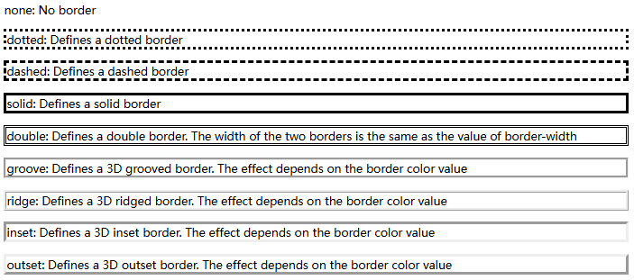
</p>

<p align="center"><em>Figure 3-16 Border Style Effects</em></p>

##### (2) Border Width
Used to set the width of the border (border-width). The width can be specified using keywords or custom numerical values. The border width also requires four values to be assigned. The three keywords for width values are as follows:
medium: default width
thin: smaller than the default width
thick: larger than the default width
To apply the above three properties to a single border, simply add the border position. For example, to set the width property for the top border, you can use the following declaration:

```css
border-top-width:keyword;
```

Notes:
① CSS does not define the exact pixel widths of the three keywords. Therefore, one user agent may render thick, medium, and thin as 5px, 3px, and 2px respectively, while another may render them as 3px, 2px, and 1px.
② border-color has no effect when used alone; border-style must be used first to set the border style.

##### (3) Border Color
Used to set the color of the border (border-color). There are three ways to specify the color value, as shown in Table 3-12.

**Table 3-12 border-color Values**

| Value | Description |
| --- | --- |
| name | Specifies the name of a color, such as "red" |
| RGB | Specifies an RGB value, such as "rgb(255,0,0)" |
| Hex | Specifies a hexadecimal value, such as "#ff0000" |

You can also set the border color to "transparent".
The color property accepts four values. Depending on the number of values assigned, the following cases apply:

```css
padding:red blue green yellow;
```

top padding is red
right padding is blue
bottom padding is green
left padding is yellow

```css
padding: red blue green;
```

top padding is red
left and right padding are blue
bottom padding is green

```css
padding: red blue;
```

top and bottom padding are red
left and right padding are blue

```css
padding: red;
```

all padding areas are red
Note: border-color has no effect when used alone; border-style must be used first to set the border style.

#### 5.CSS Outline
An outline is a line drawn around an element, which specifies the style, color and width of the element’s outline. It is located outside the border edge and can be used to highlight the element.Table 3-13 defines all outline properties.

**Table 3-13 Outline Properties**

| Property | Description | Values |
| --- | --- | --- |
| outline | Sets all the outline properties in one declaration | outline-color<br>outline-style<br>outline-width<br>inherit |
| outline-color | Sets the color of the outline | color-name<br>hex-number<br>rgb-number<br>invert<br>inherit |
| outline-style | Sets the style of the outline | none<br>dotted<br>dashed<br>solid<br>double<br>groove<br>ridge<br>inset<br>outset<br>inherit |
| outline-width | Sets the width of the outline | thin<br>medium<br>thick<br>length<br>inherit |

Example:

```html
<html>
  <head>
    <title>CSS Outline</title>
    <style>
      p {
      border: 1px solid red;
      outline-style: dotted;
      outline-color: #00ff00;
      outline-width: 3px;
      margin-top: 50px;
      }
    </style>
  </head>
  <body>
    <p><b>Note:</b> IE 8 supports the outline property only if a !DOCTYPE is specified.</p>
  </body>
</html>
```

View this HTML via Chrome, and the result is shown in Figure 3-17.
<p align="center">
  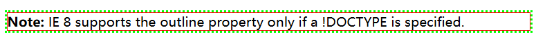
</p>

<p align="center"><em>Figure 3-17 Example of CSS Outline Properties</em></p>

### 3.2.3 Task Implementation

#### Step 1: Create a new HTML page and set global styles
Create a new HTML page. The global styles are set as follows:

```css
* {
  margin: 0;
  padding: 0;
}
body {
  background: #3a3a3a;
}
```

#### Step 2: Create the first photo album
The HTML code is as follows:

```html
<body>
  <h1 class="title">MY PHOTO</h1>
  <div id="box">
    <div class="photo-box">
      
      <h5>Photo Name</h5>
      <p>Filming author</p>
    </div>
  </body>
  The styles are as follows:
  .title {
  text-align: center;
  letter-spacing: 2px;
  color: #fff;
  font-family: "Microsoft YaHei UI";
  margin: 35px 0;
  }
  .photo-box {
  width: 274px;
  background: #fff;
  padding: 5px;
  display: inline-block;
  margin: 10px 8px 0 0;
  border: 2px solid transparent;
  border-radius: 5px;
  }
  .photo-box:hover{
  border-color: #f00;
  }
  .photo-box>img {
  width: 270px;
  height: 194px;
  }
  .photo-box>h5 {
  margin-top: 15px;
  }
  .photo-box>p {
  font-size: 12px;
  margin: 5px 0 15px 0;
  }
  #box {
  width: 1200px;
  margin: 0 auto;
  margin-bottom: 50px;
  }
```

#### Step 3: Create the remaining photo albums one by one
Following the production of the first photo album, complete the remaining albums. The code is as follows.

```html
<div class="photo-box">
  
  <h5>Photo Name</h5>
  <p>Filming author</p>
</div>
<div class="photo-box">
  
  <h5>Photo Name</h5>
  <p>Filming author</p>
</div>
<div class="photo-box">
  
  <h5>Photo Name</h5>
  <p>Filming author</p>
</div>
<div class="photo-box">
  
  <h5>Photo Name</h5>
  <p>Filming author</p>
</div>
……
<div class="photo-box">
  
  <h5>Photo Name</h5>
  <p>Filming author</p>
</div>
```

## Task 3.3 Mall List Layout

### 3.3.1 Task Description
Shopping websites usually have a display page for product lists, which are placed on the homepage to show popular products and attract customers' attention. The implementation of the product list needs to be completed using the knowledge of float. The effect diagram is shown in Figure 3-18.
<p align="center">
  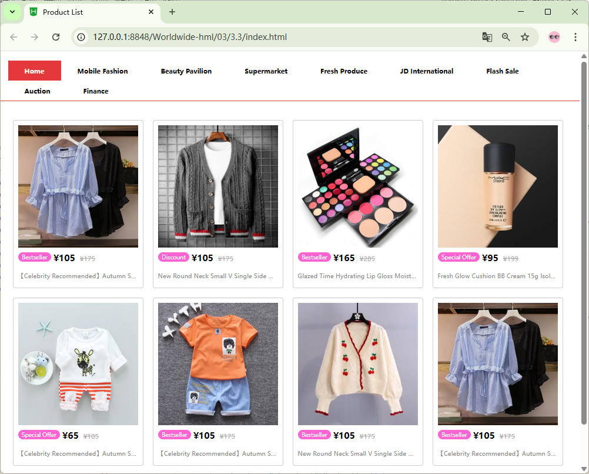
</p>

<p align="center"><em>Figure 3-18 Effect Diagram of Mall List Layout</em></p>

### 3.3.2 Knowledge Preparation

#### 1.Block-level elements, inline elements, and inline-block elements
Block-level elements: These elements occupy one or more lines. Even if their width is less than that of the parent element, they still take up an entire line and cannot be placed side by side with other elements.
Inline elements: These elements can be placed side by side in one line and will wrap to the next line only when the total width of all elements exceeds the line width.
Inline-block elements: These are elements that are originally inline but converted to block-level behavior. They do not wrap automatically, but their width and height can be set. Inline-block elements are arranged from left to right.

#### 2.Introduction to Normal Document Flow
Document flow refers to the position of HTML elements on the page, that is, the space occupied by elements during layout. Under normal circumstances, elements are arranged in the order they appear: block-level elements occupy a whole line, while inline elements are arranged from left to right. The normal document flow divides the window into rows, which are filled by various elements in sequence.
The opposite of normal document flow is out of document flow. An HTML document without CSS styling is rendered in the order it is written. As shown in Figure 3-19 below, three div elements are added and displayed normally in sequence.
<p align="center">
  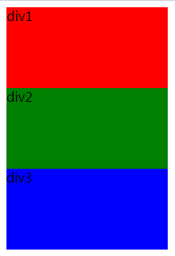
</p>

<p align="center"><em>Figure 3-19 Three div tags displayed normally</em></p>
Being out of the normal document flow means that the element is no longer in its original position and "floats" above other elements. We apply CSS styling to the three div tags mentioned above, and the effect is shown in Figure 3-20 below.
<p align="center">
  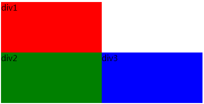
</p>

<p align="center"><em>Figure 3-20 Effect diagram of elements out of the document flow</em></p>
From this example, we can see that being out of the document flow means the element is no longer in its original position. In CSS layout, elements can be taken out of the normal flow by using float and positioning. Next, we will first learn about float.

#### 3.How Float Works
By using the float property, elements can be made to "float" and break away from the normal document flow. In other words, elements without the float property will be displayed in sequence according to the standard flow, while floating elements that are out of the flow are no longer restricted by it and float above normal elements.
Let’s understand this with an example.
<p align="center">
  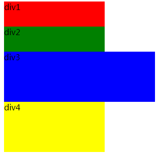
</p>

<p align="center"><em>Figure 3-21 Div tags displayed normally</em></p>
As shown in Figure 3-21, there are four div tags in the document. Since div is a block-level element, it will occupy an entire line even if the width of each div does not fill the line.In Figure 3-22, the four div tags are in the normal document flow. We set a left float effect for div2, and the display effect in the browser is shown in Figure 3-22.
We can see that div2 is out of the document flow after being floated. The document flow will treat div3 as the element immediately after div1, so div3 will take the position originally belonging to div2.Since div2 is set to float left, it will follow the previous normal flow element, that is, behind div1. Therefore, div2 floats above div3 and covers part of its content.
<p align="center">
  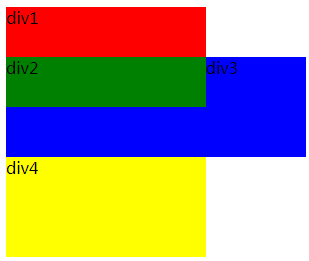
</p>

<p align="center"><em>Figure 3-22 Effect of Floated Div Elements</em></p>
With floating, block-level elements can be displayed side by side in one line, unless their total width exceeds the line width. This makes full use of browser space and presents web content more reasonably and clearly within a limited interface.

#### 4.Float Style Rules
The float property is set using the float keyword. The property values are shown in Table 3-14.

**Table 3-14 Float Property Values**

| Value | Funcgion |
| --- | --- |
| none | No floating |
| left | Float to the left |
| right | Float to the right |

Sample code is as follows:

```css
{ float: left; }
```

Sets the element to float to the left.

#### 5.Effects of Floating
Floating has the following effects:
(1) It makes the layout more flexible. Without floating, block-level elements occupy an entire line, resulting in a lot of wasted space. By using floating to make elements "float", a wider variety of layouts can be achieved.
(2) It makes the page structure cleaner and more attractive. Floating allows for efficient use of space, resulting in a more compact page structure.
(3) Floated elements are removed from the normal document flow, which causes the height of their parent element to collapse. Without supporting content, the parent element will have a height of zero.

##### (4) Floating also affects the layout of sibling elements of the parent element.

#### 6.Clearing Floats
Since floating can affect the layout of text, parent elements, and sibling elements of the parent element, it is necessary to clear floats.
There are four main ways to clear floats:

##### (1) Clearing Floats with the clear Style
The clear property is used to clear floating effects. It includes clearing left floats, clearing right floats, and clearing both left and right floats. The usage is as follows:
clear: left; : Clears left floats
clear: right; : Clears right floats
clear: both; : Clears all floating effects (most commonly used)
Sample code is as follows:

```css
.textDiv {
  color: blue;
  border: 2px solid blue;
  clear: left;
}
```

##### (2) Insert a Block-level Element to Clear Floats Before the Parent Element's Closing Tag
This method involves inserting an empty block-level div element at the end of the parent element containing floated elements, and applying the clear style to it. The code is as follows:

```html
<div style ="clear:both;">
</div>
```

##### (3) Using Pseudo-elements (clearfix)
This method adds an :after pseudo-element to the end of the parent element. By clearing the float of this pseudo-element, the parent element's height is supported, thereby eliminating the impact of floats. Sample code is as follows:

```css
.div1:after {
  content: "";
  height: 0;
  display: block;
  clear: both;
}
```

##### (4) Clearing Floats with overflow
This method sets the overflow property of the parent element to auto (i.e., overflow: auto;). This immediately expands the parent element's height to wrap the floated elements inside it. Sample code is as follows:

```css
.div1{
  overflow: auto;
}
```

By setting just one value on the parent element, the parent’s height is immediately extended to enclose the floated elements inside. It appears that the float has been cleared and no longer affects the rendering of subsequent elements. Strictly speaking, however, this has nothing to do with clearing floats, since no element’s float is actually removed — we need not dwell on this distinction.
In fact, any valid value for overflow other than "visible" will work here. All of them can achieve the goal of supporting the parent element’s height and resolving the layout issues caused by floating.

### 3.3.3 Task Implementation

#### Step 1: Create a new HTML page
Create a new HTML page and set the page title to "Product List". The code is as follows.

```html
<head>
  <meta charset="utf-8">
  <title>Product List</title>
  <link rel="stylesheet" type="text/css" href="css/index.css" />
</head>
```

#### Step 2: Create the top menu navigation bar.
It is implemented using a layout with lists and floats. The code is as follows.

```html
<body>
  <!-- Page header -->
  <div class="header">
    <div class="nav">
      <ul class="container clear">
        <li class="on">Home</li>
        <li>Mobile Fashion</li>
        <li>Beauty Pavilion</li>
        <li>Supermarket</li>
        <li>Fresh Produce</li>
        <li>JD International</li>
        <li>Flash Sale</li>
        <li>Auction</li>
        <li>Finance</li>
      </ul>
    </div>
  </div>
</body>
The styles are as follows:
* {
margin: 0;
padding: 0;
}
ul,
ol {
list-style: none;
}
.container {
width: 1200px;
margin: 0 auto;
}
/* Clear float */
.clear::after {
content: "";
display: block;
clear: both;
}
/*  Page header */
.header {
border-bottom: 2px solid #E4393C;
}
.nav {
margin-top: 20px;
}
.nav>ul {
margin-bottom: -1px;
}
.nav>ul>li {
float: left;
padding: 12px 18px;
font-weight: bold;
font-size: 14px;
/* Show hand cursor */
cursor: pointer;
}
.nav>ul>li:hover {
background-color: #E4393C;
color: #fff;
}
.nav>ul>li.on {
background-color: #E4393C;
color: #fff;
}
```

#### Step 3: Create the product list
It is implemented using lists, float layout and style settings. The code is as follows.

```html
<div class="container">
  <!-- Product List -->
  <ul class="shop-list">
    <li class="list-item">
      
      <div class="shop-intr">
        <p class="shop-host">Bestseller</p>
        <h3 class="shop-price">¥105</h3>
        <p class="shop-dis">¥175</p>
      </div>
      <p>【Celebrity Recommended】Autumn Striped Silk Chiffon Shirt with Lace Embroidery for Women</p>
    </li>
    <li class="list-item">
      
      <div class="shop-intr">
        <p class="shop-host">Discount</p>
        <h3 class="shop-price">¥105</h3>
        <p class="shop-dis">¥175</p>
      </div>
      <p>New Round Neck Small V Single Side Wave Edge Smooth Drape Fashion Urban Long Sleeve Shirt for Men</p>
    </li>
    <li class="list-item">
      
      <div class="shop-intr">
        <p class="shop-host">Bestseller</p>
        <h3 class="shop-price">¥165</h3>
        <p class="shop-dis">¥285</p>
      </div>
      <p>Glazed Time Hydrating Lip Gloss Moisturizing and Pigmented Lipstick for Women Long-Lasting Lip Gloss</p>
    </li>
    ……
    <li class="clear-float"></li>
  </ul>
</div>
The styles are as follows:
/* Product List */
.shop-list {
width: 100%;
margin-top: 30px;
margin-bottom: 100px;
}
.shop-list .list-item{
width: 255px;
height: 335px;
padding: 10px;
margin: 10px;
float: left;
border: 1px solid #cfcfcf;
border-radius: 5px;
}
.shop-list .list-item:hover{
box-shadow: 0px 0px 5px #2291F7;
}
/* Clear float */
.clear-float{
clear: both;
}
.list-item>img{
width: 100%;
height: 260px;
}
/* Fix float issue by setting height for parent element */
.shop-intr{
width: 100%;
height: 25px;
margin-top: 5px;
}
.shop-host{
float: left;
background-color: #fc64d4;
color: #fff;
font-size: 12px;
padding: 2px 8px;
border-radius: 15px;
margin-top: 2px;
}
.shop-price{
float: left;
margin-left: 5px;
}
.shop-dis{
float: left;
text-decoration: line-through;
color: #adadad;
font-size: 14px;
margin-left: 10px;
margin-top: 5px;
}
.list-item>p{
font-size: 13px;
color: #888888;
margin-top: 18px;
/* Show ellipsis when content overflows */
overflow: hidden;
text-overflow:ellipsis;
white-space: nowrap;
}
```

## Task 3.4 Creating a Common Website Sidebar

### 3.4.1 Task Description
A side navigation bar places the navigation menu at the edge of the page, helping users quickly locate the desired channel. It not only saves users' time scrolling through the page but also improves the user experience.
The creation of the side navigation bar is implemented using list tags combined with positioning settings. The effect diagrams are shown in Figure 3-23 and Figure 3-24.
<p align="center">
  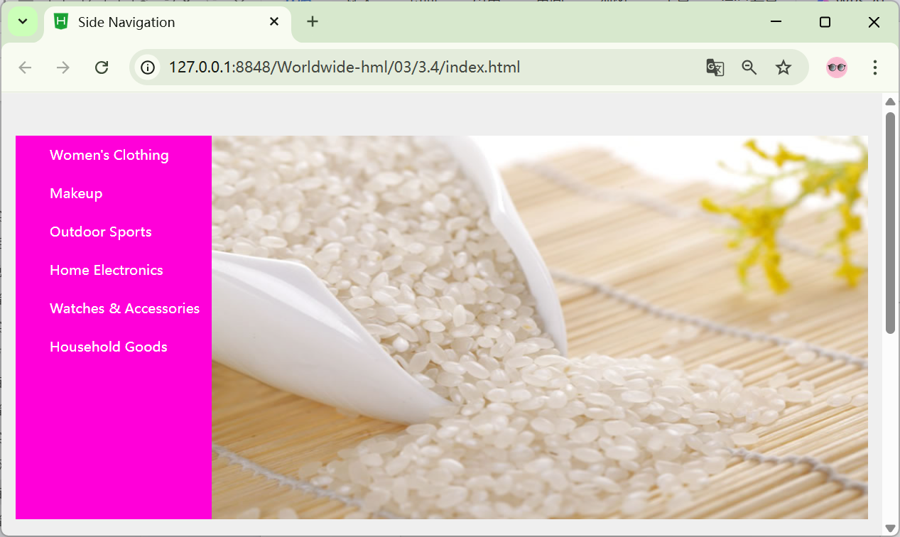
</p>

<p align="center"><em>Figure 3-23 Side Navigation Diagram</em></p>
<p align="center">
  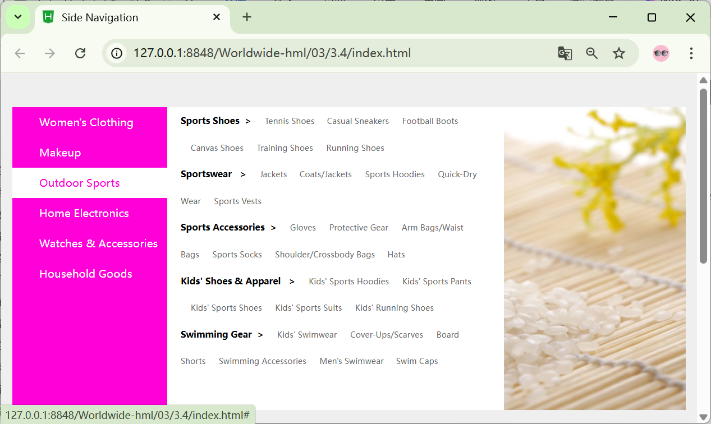
</p>

、
<p align="center"><em>Figure 3-24 Side Navigation Effect Diagram</em></p>

### 3.4.2 Knowledge Reserve
Positioning means placing an element at a specified position to complete the interface design. Positioning is divided into relative positioning, absolute positioning, and fixed positioning.
The positioning mode is set using the position property, and the offset position is calculated based on the distance from the top, bottom, left, and right boundaries.

#### 1. Static Positioning
Static positioning means the element remains in its original position without being repositioned. The default value of the position property is static. Static positioning applies to elements with no specified position property.
Basic format:

```css
position:static;
```

#### 2. Relative Positioning
Relative positioning means that when the element’s position changes, it uses its original position as the reference. A relatively positioned element does not break away from the normal document flow; it is offset based on its current position. The offset can be set in four directions: left, right, top, and bottom.
Basic format:

```css
position:relative;
```

As shown in Figure 3-25 below, there are six div tags in the normal document flow, displayed in sequence in the browser. Now we set relative positioning for div2 and div5.
<p align="center">
  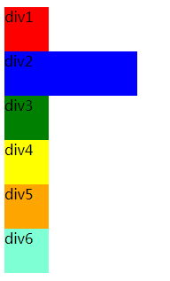
</p>

<p align="center"><em>Figure 3-25 A normally displayed div tag</em></p>
The styles are as follows:

```css
.blue {
  background-color: blue;
  width: 150px;
  position: relative;
  left: 20px;
  top: 30px;
}
.orange {
  background-color: orange;
  position: relative;
  left: 100px;
  bottom: 20px;
}
```

With relative positioning applied in the above settings, div2 is moved 20px to the right and 30px downward from its original position. Div5 is positioned 100px to the right and 20px upward from its original position. The effect is shown in Figure 3-26.
<p align="center">
  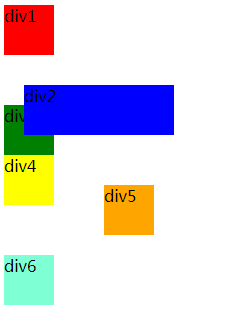
</p>

<p align="center"><em>Figure 3-26 Effect of Setting Relative Positioning</em></p>

#### 3.Absolute Positioning
Absolute positioning means the element is removed from the normal document flow. Its offset position is relative to its parent element. If there is no positioned parent element, it will be offset relative to the browser window instead.
The basic format is as follows:

```css
position:absolute;
```

In the above example, absolute positioning is applied to div2 and div5. The styles are as follows:

```css
.blue {
  background-color: blue;
  width: 150px;
  position: absolute;
  left: 20px;
  top: 30px;
}
.orange {
  background-color: orange;
  position: absolute;
  left: 100px;
  top: 30px;
}
```

div2 is offset 20px from the left of the browser and 30px from the top; div5 is offset 100px from the left of the browser and 300px from the top. The effect is shown in Figure 3-27.
Since div2 and div5 use absolute positioning, they are removed from the normal document flow. Only div1, div3, div4, and div6 remain in the normal flow and are arranged in sequence. With no positioned parent elements, div2 and div5 are offset relative to the browser.
<p align="center">
  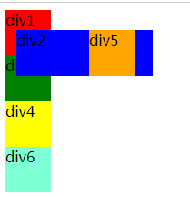
</p>

<p align="center"><em>Figure 3-27 Effect of Absolute Positioning</em></p>

#### 4.Fixed Positioning
Fixed positioning means that the position of an element remains unchanged, with the browser window as the reference system. The coordinates of a fixed-positioned element do not change, nor do they scroll as the browser scrolls. Common applications include: pop-up ads fixed at the bottom right corner of the browser, and the bottom navigation bar in mobile apps.
The basic format is as follows:

```css
position:fixed;
```

### 3.4.3 Task Implementation

#### Step 1: Create a new HTML page
Create a new HTML page, set the page title to "Side Navigation", and set the background color at the same time. The code is as follows.

```html
<head>
  <meta charset="utf-8">
  <title>Side Navigation</title>
  <link rel="stylesheet" type="text/css" href="./css/index.css" />
</head>
```

The styles are as follows:

```css
* {
  margin: 0;
  padding: 0;
}
body {
  background-color: #efefef;
  height: 900px;
}
```

#### Step 2: Import navigation images
The code is as follows:

```html
<body>
  <div class="nav-left">
    
  </div>
</body>
```

The styles are as follows:

```css
.nav-left {
  width: 1000px;
  height: 350px;
  background-color: paleturquoise;
  margin: 50px auto;
  position: relative;
}
.nav-img {
  width: 770px;
  height: 450px;
  position: absolute;
  left: 230px;
  top: 0;
}
```

#### Step 3: Set the menu bar in its default state.
The code is as follows:

```html
<body>
  <div class="nav-left">
    
    <ul>
      <li>
        <a href="#">Women's Clothing</a>
      </li>
      <li>
      </li>
      <li>
        <a href="#">Makeup</a>
      </li>
      <li>
        <a href="#">Outdoor Sports</a>
      </li>
      <li>
        <a href="#">Home Electronics</a>
      </li>
      <li>
        <a href="#">Watches & Accessories</a>
      </li>
      <li>
        <a href="#">Household Goods</a>
      </li>
    </ul>
  </div>
</body>
```

The styles are as follows:

```css
ul {
  list-style: none;
}
a {
  text-decoration: none;
}
```

#### Step 4: Set the secondary menu and its effects to be displayed on mouse hover.
The code is as follows:

```html
<body>
  <div class="nav-left">
    
    <ul>
      <li> <a href="#">Women's Clothing</a>
        <ul class="nav-menu">
          <li class="aside-menu">
            <div class="aside-content">
              <h5>Popular Clothing &nbsp;> </h5>
              <span>Sun Protection Clothing </span>
              <span>Shorts</span>
              <span>Jeans</span>
              <span>Maternity & Mom Wear</span>
              <span>Plus Size Women's Clothing</span>
              <span>Coats</span>
            </div>
            <div class="aside-content">
              <h5>Skirt Wardrobe&nbsp; > </h5>
              <span>One-Piece Dresses</span>
              <span>Skirts</span>
              <span>Skirt Suits</span>
              <span>Figure-Hugging Dresses</span>
              <span>White One-Piece Dresses</span>
            </div>
            <div class="aside-content">
              <h5>Versatile Tops&nbsp;> </h5>
              <span>Sweaters</span>
              <span>Cashmere/Wool Sweaters</span>
              <span>Knitwear</span>
              <span>Shirts</span>
              <span>T-Shirts </span>
              <span>Trench Coats</span>
            </div>
            <div class="aside-content">
              <h5>Outerwear &nbsp;&nbsp;&nbsp;&nbsp;&nbsp;&nbsp; > </h5>
              <span>Cotton Coats</span>
              <span>Vests</span>
              <span>Blazers</span>
              <span>Down Jackets</span>
              <span>Woolen Coats </span>
              <span>Knit Outerwear</span>
            </div>
            <div class="aside-content">
              <h5>Featured Apparel&nbsp; > </h5>
              <span>Middle/Aged Women's Clothing</span>
              <span>Plus Size Women's Clothing</span>
              <span>Mall-Style Items</span>
              <span>Designer Pieces</span>
              <span>Ethnic Style </span>
              <span>Evening Gowns</span>
            </div>
          </li>
        </ul>
      </li>
      ……
    </ul>
  </div>
</body>
```

The styles are as follows:

```css
.nav-left>ul{
  width: 230px;
  height: 450px;
  background-color: #ff00d9;
  position: relative;
}
.nav-left>ul>li{
  height: 45px;
  width: 230px;
}
.nav-left>ul>li>a{
  display: block;
  padding-left: 40px;
  line-height: 45px;
  color: #fff;
}
.nav-left>ul>li:hover a{
  background-color: #fff;
  color: #ff00d9;
}
.nav-left>ul>li>ul{
  width: 500px;
  height: 350px;
  background-color: #fff;
  position: absolute;
  top: 0;
  left: 230px;
  display: none;
}
.nav-left>ul>li:hover .aside-menu{
  display: block;
}
.nav-left>ul>li>ul>li{
  width: 450px;
  height: 100px;
  line-height: 38px;
  padding: 0 20px;
}
.aside-content>h5{
  display: inline-block;
}
.aside-content>span{
  font-size: 12px;
  margin-left: 15px;
  color: #666;
  cursor: pointer;
}
.aside-content>span:hover{
  color: #ff00d9;
}
```

## Task 3.5 Project Practice – Map Attractions (Section F)

### 3.5.1 Task Description
This project practice implements the production of the map attractions section in a tour guide project. There is a section on the right displaying a map (static, image format), and three attraction cards on the left. The map on the right is static. Above the map image, there are three locations corresponding to the three attraction cards on the left.
The left side is a 2×2 grid containing three attraction card elements linked to attractions, with the fourth space being a link to all attractions. Since this project is still a prototype, only empty URLs are placed in these links.
Box-shadow effect: scale up to 1.05 times, with a box shadow that offsets 5px on the Y-axis, has a blur radius of 5px, color black, and opacity of 30%. When the mouse hovers over an attraction card, the card displays both the aforementioned focus effect and a subtle light gradient effect, with the light effect moving from left to right.

### 3.5.2 Effect Display
The implemented effect of the map attractions section is shown in Figure 3-28 below.
<p align="center">
  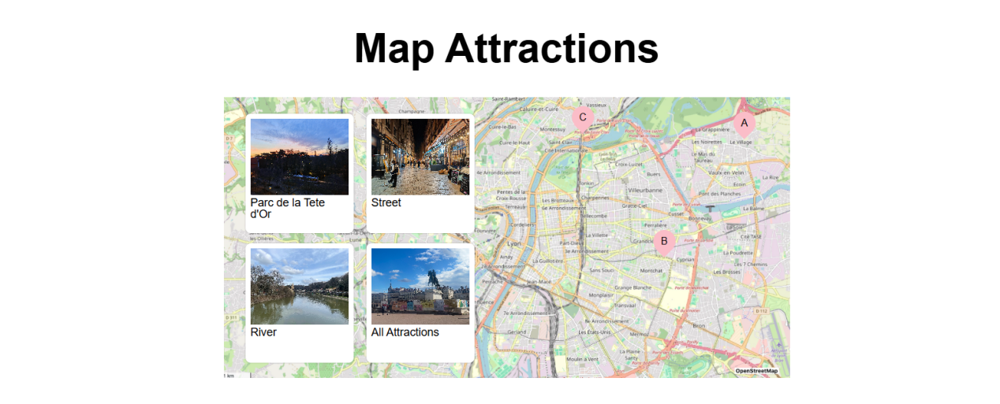
</p>

<p align="center"><em>Figure 3-28 Map Attractions Effect</em></p>

### 3.5.3 Task Implementation

#### Step 1: Edit the index.html file and place the map attractions section.
The code is as follows:

```html
<!DOCTYPE html>
<html lang="en">
  <head>
    <!-- Meta Tags -->
    <meta charset="UTF-8" />
    <meta name="viewport" content="width=device-width, initial-scale=1.0" />
    <title>Welcome Lyon</title>
    <!-- Links -->
    <link rel="stylesheet" href="styles/index.css" />
  </head>
  <body>
    <!-- Header -->
    <main>
      <!-- Hero Section -->
      <!-- Map attraction section -->
      <section class="map">
        <h2>Map Attractions</h2>
        <div class="map-container">
          <!-- Attractions -->
          <div class="attractions">
            <a class="card" href="#" id="attraction-a">
              <picture>
                <source
                srcset="assets/images/attraction-a.jpg"
                media="(min-width: 760px)"
                />
                
              </picture>
              <span>Parc de la Tete d'Or</span>
            </a>
            <a class="card" href="#" id="attraction-b">
              <picture>
                <source
                srcset="assets/images/attraction-b.jpg"
                media="(min-width: 760px)"
                />
                
              </picture>
              <span>Street</span>
            </a>
            <a class="card" href="#" id="attraction-c">
              <picture>
                <source
                srcset="assets/images/attraction-c.jpg"
                media="(min-width: 760px)"
                />
                
              </picture>
              <span>River</span>
            </a>
            <a class="card" href="#">
              <picture>
                <source
                srcset="assets/images/all-attractions.jpg"
                media="(min-width: 760px)"
                />
                
              </picture>
              <span>All Attractions</span>
            </a>
          </div>
          <!-- Dots -->
          <div
          class="map-dot"
          id="map-dot-1"
          aria-label="Highlight the first attraction"
          tabindex="0"
          >
          <span>A</span>
        </div>
        <div
        class="map-dot"
        id="map-dot-2"
        aria-label="Highlight the second attraction"
        tabindex="0"
        >
        <span>B</span>
      </div>
      <div
      class="map-dot"
      id="map-dot-3"
      aria-label="Highlight the third attarction"
      tabindex="0"
      >
      <span>C </span>
    </div>
    <!-- Image -->
    <picture>
      <source
      srcset="assets/images/lyon-map.jpg"
      media="(min-width: 760px)"
      />
      
    </picture>
  </div>
</section>
</main>
</body>
</html>
Create the _map.css file. The styles are as follows:
/* Styles for the map section */
.map {
width: min(100%, 890px);
margin: 0 auto;
margin-bottom: 38px;
margin-top: 60px;
display: flex;
flex-direction: column;
gap: 40px;
}
.map-container {
width: 100%;
height: 466px;
position: relative;
}
/* Map image */
.map-container image,
.map-container > img {
position: absolute;
width: 100%;
height: 100%;
inset: 0;
object-position: center top;
}
/* Map dots */
.map-dot {
position: absolute;
z-index: 5;
background-color: #fbbdc8;
width: 35px;
height: 35px;
border-radius: 50%;
display: flex;
align-items: center;
justify-content: center;
cursor: pointer;
}
.map-dot span {
position: relative;
z-index: 6;
}
.map-dot::before {
content: "";
position: 0;
width: 20px;
z-index: 4;
height: 20px;
position: absolute;
background-color: #fbbdc8;
transform: translateY(20%) rotate(45deg);
bottom: 0;
}
#map-dot-1 {
top: 23px;
right: 54px;
}
#map-dot-3 {
top: 14px;
right: 308px;
}
#map-dot-2 {
top: 209px;
right: 180px;
}
/* Attractions */
.attractions {
gap: 16px 20px;
display: grid;
grid-template-columns: repeat(2, 1fr);
position: absolute;
left: 34px;
z-index: 10;
top: 26px;
}
.events-container .card,
.attractions .card {
box-shadow: 0 0 2px rgba(0, 0, 0, 0.25);
width: 170px;
min-width: 170px;
border-radius: 0.5rem;
min-height: 188px;
background-color: white;
padding: 8px;
display: flex;
flex-direction: column;
gap: 0.25rem;
transition: 0.15s;
overflow: hidden;
position: relative;
}
.events-container .card img,
.events-container .card picture,
.attractions .card img,
.attractions .card picture {
width: 100%;
height: 120px;
}
.events-container .card span,
.attractions .card span {
font-size: 1.1rem;
color: black;
line-height: 1;
}
/* Title */
.map h2 {
font-size: 4rem;
text-align: center;
font-weight: bold;
}
```

.map-container:has(#map-dot-1:hover) #attraction-a,
.map-container:has(#map-dot-2:hover) #attraction-b,
.map-container:has(#map-dot-3:hover) #attraction-c,

```css
.attractions .card:hover,
.events-container .card:hover {
  transform: scale(1.05);
  box-shadow: 0 5px 5px rgba(0, 0, 0, 0.3);
}
.attractions .card::before,
.events-container .card::before {
  content: "";
  position: absolute;
  top: 0;
  left: -80px;
  height: 100%;
  width: 50px;
  background: linear-gradient(
  to bottom,
  rgba(255, 255, 255, 0.75),
  rgba(255, 255, 255, 0.25)
  );
  transform: rotate(8deg);
  transition: 0.5s;
}
.events-container .card:hover::before,
.attractions .card:hover::before {
  left: 200px;
}
```

#### Step 2: Import the _map.css file into the index.css file. The code is as follows:

```css
@import url("./_base.css");
@import url("./_header.css");
@import url("./_hero.css");
@import url("./_map.css");
```
