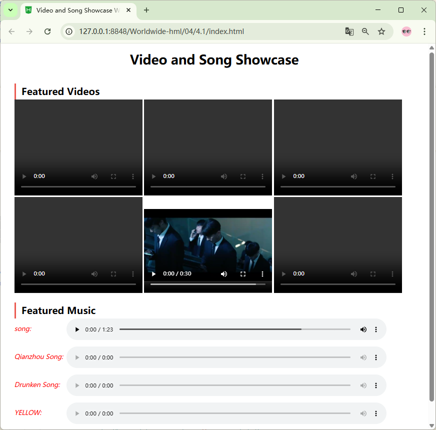

# Project 4 Building Websites with HTML5 --- Laying a Solid Foundation for Cross-Platform Compatibility

## Content Guide
This project mainly covers three tasks: a video/music display website, an employee onboarding information website, and a school website.
By learning the video/music display website, you will understand the usage of video and audio tags, as well as semantic layout tags;By learning the employee onboarding information website, you will understand the control types of the input tag, as well as the datalist tag and its related attributes;By learning the school website, you will achieve a comprehensive application of the knowledge points related to the new features of HTML5.

## Learning Objectives
- ① Understand the layout structure of website construction.
- ② Master the usage of audio and video tags and their attributes.
- ③ Master the usage of semantic layout tags.
- ④ Master the usage of input tag types, the datalist tag and their attributes.

## Task 4.1 Video/Music Display Website

### 4.1.1 Task Description
The interface of the video and music display website uses HTML5 tags to present videos and audio on the page. The overall structure is divided into three parts: title, featured videos, and featured music. Video and audio tags are used to display the content. Both videos and audio are equipped with control bars for normal playback and pause. The effect is shown in Figure 4-1.
<p align="center">
  
</p>

<p align="center"><em>Figure 4-1 Video and Music Display Interface</em></p>

### 4.1.2 Knowledge Preparation
This section introduces the multimedia features of HTML5. Before the advent of HTML5, there was no standard way to embed video and audio into web pages. In most cases, multimedia content was placed on pages through third-party plugins or applications integrated into web browsers.
Audio and video functions implemented in this way not only rely on third-party plugins but also involve complex and lengthy code. By using the newly added &lt;video&gt; and `` tags in HTML5, such problems can be avoided, making the webpage code structure clear and simple.
To date, many browsers have supported the &lt;video&gt; and `` tags in HTML5. The browser support status is shown in Table 4-1.

**Table 4-1 Browser Support**

| Browser | Supported Versions |
| --- | --- |
| Edge | 16 and above |
| Firefox | 3.5and above |
| Opera | 10.5and above |
| Chrome | 3.0and above |
| Safari | 3.2and above |

#### 1.The Audio Tag and Its Attributes
An audio format refers to the format of an audio file for playback or processing on a computer. The main audio formats embedded in HTML5 include Vorbis, MP3, Wav, etc., which are described in detail below.
Vorbis: Another free, open-source audio codec similar to AAC, serving as a next-generation audio compression technology designed to replace MP3.
MP3: An audio compression technology, whose full name is Moving Picture Experts Group Audio Layer III, referred to as MP3. It is designed to significantly reduce audio data volume.
Wav: The standard Windows file format used for recording, with the file extension “WAV”. The raw data format is PCM or compressed, and it is a type of lossless music format.
In HTML5, the audio tag is used to define the standard for playing audio files. It supports three audio formats: Ogg, MP3, and Wav. Its basic syntax is as follows:

```html
<audio src="audio_file_path" controls="controls">
  Your browser does not support the audio tag.
</audio>
```

The src attribute is used to set the path of the audio file, and the controls attribute provides playback controls for the audio. Similarly, text can be inserted between and to improve user experience, such as prompts for browser compatibility issues.
Notably, other attributes can be added to the `` element to further optimize audio playback. The details are shown in Table 4‑2.
Table 4‑2 Attributes of the audio Element

| Attribute | Value | Description |
| --- | --- | --- |
| autoplay | autoplay | Automatically plays the audio once the page has finished loading. |
| loop | loop | Restarts playback when the audio ends. |
| preload | preload | Loads the audio when the page loads and prepares it for playback. Ignored if “autoplay” is used. |
| controls | controls | Displays audio controls to the user (such as play/pause buttons). |
| muted | muted | Mutes the audio output. |
| src | URL | Specifies the URL of the audio file. |

#### 2. The Video Tag and Its Attributes
To embed video files in a web page, you must first select the correct video file format, embedding method, and browser support status.
A video format includes video coding, audio coding, and container format. The main video formats embedded in HTML5 include Ogg, MPEG 4, WebM, etc., which are described in detail below.
Ogg: Refers to Ogg files with Theora video coding and Vorbis audio coding.
MPEG 4: Refers to MPEG 4 files with H.264 video coding and AAC audio coding.
WebM: Refers to WebM files with VP8 video coding and Vorbis audio coding.
In HTML5, the &lt;video&gt; tag is used to define the standard for playing video files. It supports three video formats: Ogg, WebM, and MPEG 4. Its basic syntax is as follows.

```html
<video src="video_file_path" controls="controls">
  Your browser does not support the video tag.
</video>
```

The src attribute is used to set the path of the video file, and the controls attribute is used to provide playback controls for the video. These two attributes are the basic attributes of the &lt;video&gt; element.
Notably, other attributes can be added to the &lt;video&gt; element to further optimize the video playback effect, as shown in Table 4-3.
表4-3 video元素属性

| Attribute | Value | Description |
| --- | --- | --- |
| autoplay | autoplay | &lt;video&gt; 标签Automatically plays the video when the page finishes loading. Internet Explorer 8 and earlier versions do not support the &lt;video&gt; tag. |
| loop | loop | Restarts playing the video when it ends. |
| preload | preload | If present, the video loads when the page loads and is ready for playback. This attribute is ignored if "autoplay" is used. |
| src | url | Specifies the URL of the video to be played. |
| controls | controls | Displays controls to the user, such as a play button. |
| Height/width | pixels | Sets the height/width of the video player. |
| muted | muted | Specifies that the video output should be muted. |

#### 3. Semantic Layout Tags (header, footer, nav, section, aside, article)
HTML semantic tags: semantics refers to the correct interpretation of the meaning of a word or sentence. Many HTML tags also carry semantic meaning, meaning the element itself conveys information about the type of content it contains.
For example, when the browser parses the &lt;h1&gt;&lt;/h1&gt; tag, it interprets it as the most important heading for that section of content. The semantics of the h1 tag are to identify the most important title of a particular page or section.

##### (1) header tag
The header element in HTML5 is a structural element used for introduction and navigation. It can contain all content typically placed in the header of a page. Its basic syntax is as follows:

```html
<header>
  <h1>Webpage Theme</h1>
  ...
</header>
```

##### (2) footer tag
The footer element is used to define the bottom section of a page or area. It can contain all content usually placed at the bottom of a page.
Before HTML5, the bottom of a page was generally defined using &lt;div id="footer"&gt;&lt;/div&gt;, but this can be easily achieved using the HTML5 footer element.

##### (3) nav tag
The nav element, new in HTML5, is used to define navigation links. It groups navigation-related links into one area, making the semantics of page elements clearer. Sample code is as follows:

```html
<nav>
  <ul>
    <li><a href="#">Home</a></li>
    <li><a href="#">About Us</a></li>
    <li><a href="#">Products</a></li>
    <li><a href="#">Contact Us</a></li>
  </ul>
</nav>
```

##### (4) section tag
The section element is used to divide content on a page within a website or application. A section element usually consists of content and a heading.
When using the section element, note the following three points:
Do not use the section element as a styling container — that is the purpose of the div tag.
Do not use section if the article, aside, or nav elements are more appropriate.
Do not use section for content blocks without a heading.

##### (5) aside element
The aside element defines supplementary information for the current page or article. It may contain references, sidebars, advertisements, navigation bars, or other similar content separate from the main content.
There are two main uses of the aside element:
Included inside an article element as supplementary information for the main content.
Used outside an article element as global supplementary information for the page or site.

##### (6) figure and figcaption elements
The figure element is used to define independent flow content (images, diagrams, photos, code, etc.), generally as a self-contained unit. Its content should be related to the main content but can be removed without affecting the document flow.
The figcaption element adds a caption to a figure group. Only one figcaption is allowed per figure, and it should be placed as either the first or last child element of figure.

##### (7) article tag
The article element represents an independent, self-contained section within a document, page, or application. It is often used to define a blog post, news article, user comment, etc.
An article is often divided into multiple section elements, and multiple article elements may appear on a single page.

### 4.1.3 Task Implementation

#### Step 1: Create a new index.html file in the project directory and write the overall page framework.

```html
<!DOCTYPE html>
<html lang="en">
  <head>
    <meta charset="utf-8">
    <title>Video and Song Showcase Website</title>
    <link rel="stylesheet" type="text/css" href="./css/style.css"/>
  </head>
  <body>
    <header>
      <h1 align="center">Video and Song Showcase Area</h1>
    </header>
    ……
  </body>
</html>
```

#### Step 2: Use the video tag to create the Featured Videos section.

```html
<section class="content">
  <h2>Featured Videos</h2>
  <!-- Use the first video as the primary version; prepare multiple formats for browser compatibility -->
  <article class="video-list">
    <video width="320" height="240" controls>
      <source src="./img/video/water.mp4" type="video/mp4">
      <source src="./img/video/water.webm" type="video/webm">
      Your browser does not support the HTML5 video tag.
    </video>
    <video width="320" height="240" controls>
      <source src="./img/video/hah.mp4" type="video/mp4">
      Your browser does not support the HTML5 video tag.
    </video>
    <video width="320" height="240" controls>
      <source src="./img/video/cat.mp4" type="video/mp4">
      Your browser does not support the HTML5 video tag.
    </video>
    <video width="320" height="240" controls>
      <source src="./img/video/bobby.mp4" type="video/mp4">
      Your browser does not support the HTML5 video tag.
    </video>
    <video width="320" height="240" controls>
      <source src="./img/video/xcz.mp4" type="video/mp4">
      Your browser does not support the HTML5 video tag.
    </video>
    <video width="320" height="240" controls>
      <source src="./img/video/vi.mp4" type="video/mp4">
      Your browser does not support the HTML5 video tag.
    </video>
  </article>
  ……
</section>
```

#### Step 3: Use the audio tag to create the Featured Music section.

```html
<article class="content">
  <h2>Featured Music</h2>
  <!-- Use the first video as the primary version; prepare multiple formats for browser compatibility -->
  <div class="video-list">
    <div class="video-item">
      <p>
        <font size="3" color="red"><i>song:</i></font>
      </p>
      <audio controls="controls">
        <source src="./img/audio/song.ogg" type="audio/ogg">
        <source src="./img/audio/song.mp3" type="audio/mp3">
        Your browser does not support this audio format.
      </audio>
    </div>
    <div class="video-item">
      <p>
        <font size="3" color="red"><i>Qianzhou Song:</i></font>
      </p>
      <audio controls="controls">
        <source src="./img/audio/qianzhou.mp3" type="audio/mpeg">
        <embed height="100" width="100" src="./img/audio/qianzhou.mp3" />
        Your browser does not support this audio format.
      </audio>
    </div>
    <div class="video-item">
      <p>
        <font size="3" color="red"><i>Drunken Song:</i></font>
      </p>
      <audio controls="controls">
        <source src="/i/song.ogg" type="audio/ogg">
        <embed height="100" width="100" src="./img/audio/drunken.mp3" />
        Your browser does not support this audio format.
      </audio>
    </div>
    <div class="video-item">
      <p>
        <font size="3" color="red"><i>YELLOW:</i></font>
      </p>
      <audio controls="controls">
        <source src="/i/song.ogg" type="audio/ogg">
        <source src="./img/video/Moo-tracker.mp3" type="audio/mpeg">
        <embed height="100" width="100" src="./img/video/Moo-tracker.mp3" />
        Your browser does not support this audio format.
      </audio>
    </div>
  </div>
</article>
```

#### Step 4: Write the player styles in style.css.

```css
*{
  padding: 0;
  margin: 0;
}
header>h1{
  line-height: 80px;
}
.content{
  width: 1000px;
  margin: 20px auto 50px;
}
.content>h2{
  border-left: 4px solid #e73c31d9;
  text-indent: .6em;
  line-height: 40px;
}
.video-list{
  width: 100%;
  overflow: hidden;
}
.video-item{
  width: 100%;
  height: 70px;
}
.video-item>p{
  width: 130px;
  float: left;
  line-height: 50px;
}
.video-item>audio{
  width: 80%;
  float: left;
}
```

#### Step 5: View the running effect of the index.html file in the browser.

## Task 4.2 Practical Project — Video Playback and Contact Form (Module F)

### 4.2.1 Task Description
After the map attractions section comes the video section. The video is muted and has no audio. When the user scrolls down and the video enters the viewport, the video plays automatically. When the video is off-screen (i.e., not in the viewport), it pauses automatically. If the video reappears in the viewport, playback resumes and continues from where it left off. The video starts playing automatically when approximately 50% of it is visible. This also applies to page visibility: playback pauses when the webpage is not visible, and resumes when the webpage becomes visible again.
The bottom part consists of a contact form with the given fields: first name, gender, contact email address, and contact phone number.

### 4.2.2 Effect Display
The renderings of the video playback are shown in Figure 4-3.
<p align="center">
  
</p>

Figure 4‑3 Video Playback Interface
The effect of the contact form is shown in Figure 4‑4.
<p align="center">
  
</p>

<p align="center"><em>Figure 4-4 Contact Form Interface</em></p>

### 4.2.3 Task Implementation

#### Step 1: Edit the index.html file, add video playback, and insert the following code.

```html
<!DOCTYPE html>
<html lang="en">
  <head>
    <!-- Meta Tags -->
    <meta charset="UTF-8" />
    <meta name="viewport" content="width=device-width, initial-scale=1.0" />
    <title>Welcome Lyon</title>
    <!-- Links -->
    <link rel="stylesheet" href="styles/index.css" />
  </head>
  <body>
    <!-- Header -->
    <main>
      <!-- Hero Section -->
      <!-- Map attraction section -->
      <section class="video">
        <video autoplay muted>
          <source src="assets/lyon.mp4" />
        </video>
      </section>
    </main>
  </body>
</html>
Create a _video.css file with the following styles:
/* Styles for the video section */
.video {
width: min(100%, 1920px);
margin: 0 auto;
height: 936px;
}
.video video {
height: 100%;
width: 100%;
object-fit: cover;
}
```

#### Step 2: Import the _video.css file into the index.css file, with the code as follows:

```css
@import url("./_base.css");
@import url("./_header.css");
@import url("./_hero.css");
@import url("./_map.css");
@import url("./_video.css");
```

#### Step 3: Edit the index.html file and create the contact form section, including first name, gender, contact email address, and contact phone number.

```html
<!DOCTYPE html>
<html lang="en">
  <head>
    <!-- Meta Tags -->
    <meta charset="UTF-8" />
    <meta name="viewport" content="width=device-width, initial-scale=1.0" />
    <title>Welcome Lyon</title>
    <!-- Links -->
    <link rel="stylesheet" href="styles/index.css" />
  </head>
  <body>
    <!-- Header -->
    <main>
      <!-- Hero Section -->
      <!-- Map attraction section -->
      <!-- Video Section -->
      <section class="video">
        <video autoplay muted>
          <source src="assets/lyon.mp4">
        </video>
      </section>
      <!-- Contact Form Section -->
      <seciton class="contact">
        <h2>Contact Us</h2>
        <form class="fields" action="#">
          <label>
            First name
            <input type="text" />
          </label>
          <label>
            Last name
            <input type="text" />
          </label>
          <label>
            Email
            <input type="text" />
          </label>
          <label>
            Phone
            <input type="text" />
          </label>
        </form>
      </seciton>
    </main>
  </body>
</html>
Create a _contact.css file with the following styles:
/* Styles for the contact section */
.contact {
margin: 0 auto;
padding: 1rem;
width: min(100%, 900px);
border: 2px solid #cccccc;
padding: 50px 36px;
padding-top: 0;
display: block;
margin-top: 100px;
}
.contact .fields {
display: grid;
grid-template-columns: repeat(2, 1fr);
gap: 36px;
width: 100%;
}
.contact .fields label {
white-space: nowrap;
}
.contact .fields input {
border: 1px solid #767676;
border-radius: 0.25rem;
}
.contact h2 {
padding: 2rem;
border: 2px solid #cccccc;
font-size: 3rem;
font-weight: bold;
transform: translateY(-50%);
background-color: white;
width: fit-content;
margin: 0 auto;
}
```

#### Step 4: Import the _contact.css file into the index.css file, with the code as follows:

```css
@import url("./_base.css");
@import url("./_header.css");
@import url("./_hero.css");
@import url("./_map.css");
@import url("./_video.css");
@import url("./_contact.css");
```

#### Step 5: View the running effect of the index.html file in the browser.
Part 2 Styling for Better Appearance &amp; More Attractive Web Pages
