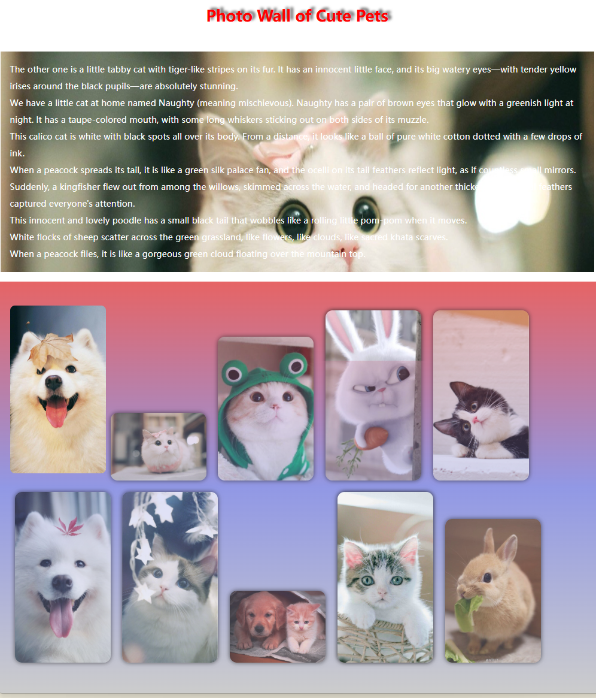
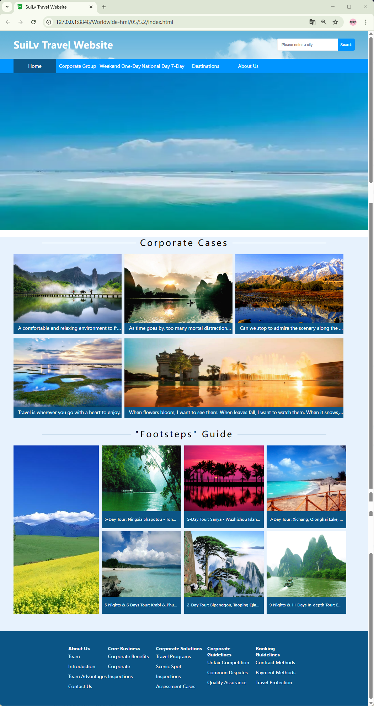
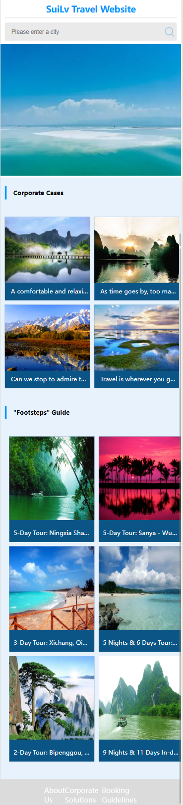
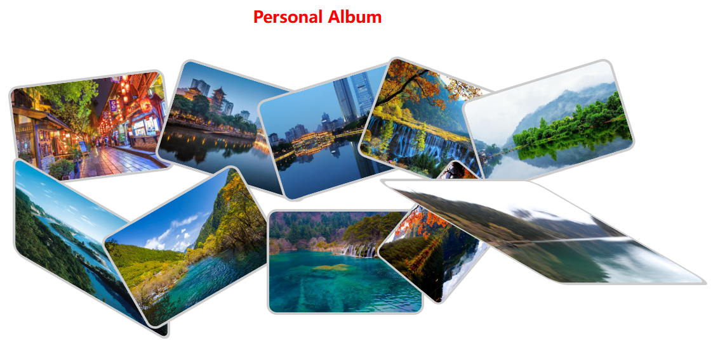
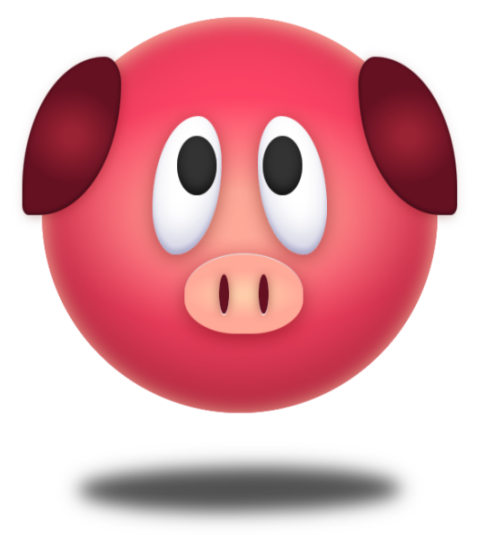
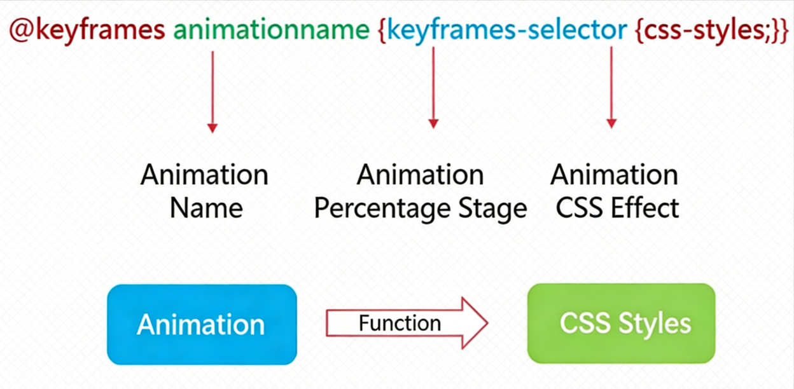
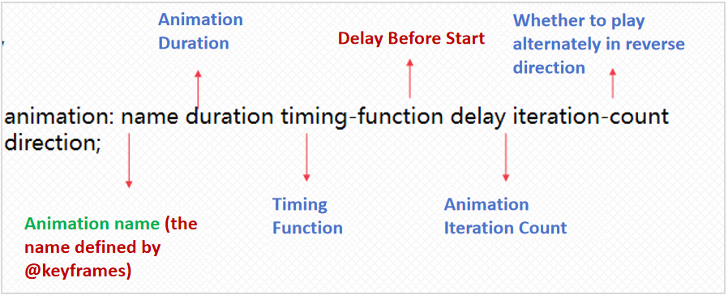
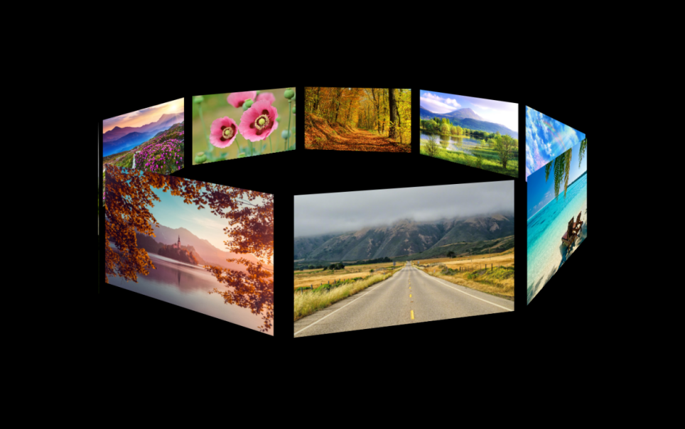
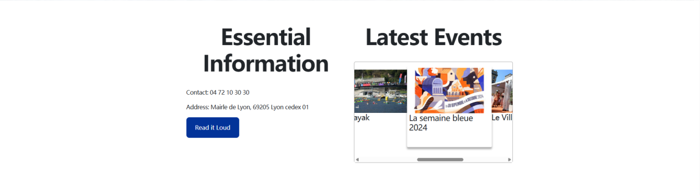

# Project 5 New Features of CSS3 --- Laying a Solid Foundation for Stunning Visuals and Creating Gorgeous Web Designs

## Content Guide
This project mainly focuses on the new features of CSS3, including background styles, box shadows, text shadows, and background gradient properties. It implements page layout through flex layout and the box-sizing rule, and uses @media queries to create responsive designs adapted to different screen sizes. It also introduces properties such as @keyframes, animation, transform-style, and perspective to achieve animated effects on web pages.

## Learning Objectives
- ① Master the usage of background image styles, shadows, transparency styles, and gradients.
- ② Master the usage of flex layout, box-sizing, and media queries.
- ③ Master the usage of transform and transition style rules.
- ④ Master the usage of @keyframes and CSS animations.
- ⑤ Master the usage of transform-style and perspective style rules.

## Task 5.1 Photo Wall

### 5.1.1 Task Description
This is a photo wall display interface that shows introductions and photos of cute pets. The overall structure is divided into three parts: top, middle, and bottom. Background images are used to display content, and relevant tags are applied to achieve rounded corners, box shadows, text shadows, transparency effects, and background image color gradients. The effect is shown in Figure 5-1.
<p align="center">
  
</p>

<p align="center"><em>Figure 5-1 Photo Wall Interface</em></p>

### 5.1.2 Knowledge Preparation
This section introduces background settings in CSS3 styles, mainly including background images, background colors, background image sizes, background image tiling methods and styles, background clipping, background attachment, background image position, and the shorthand syntax for background settings. Details are as follows.

#### 1. Background Image
The background-image property sets the background to an image. This property inserts the image directly into the web page without adjustment, which may result in image repetition or scrolling based on the actual image size.
Syntax:

```css
background-image:value;
```

Set the web page background image by specifying an absolute or relative path in url(), for example:

```css
background-image: url(xxx.jpg);
```

If no image is used, the value is none, which is also the default value.

#### 2. Background Image Tiling
The background-repeat property sets the tiling mode of the background image.
Syntax:

```css
background-repeat:value;
```

Its values are shown in Table 5‑1:
Table 5‑1 Values of the background-repeat Property

| Value | Description |
| --- | --- |
| repeat | The background image is tiled. |
| repeat-x | The image is tiled horizontally. |
| repeat-y | The image is tiled vertically. |
| norepeat | The background image is not tiled. |

。
The default value is repeat.

#### 3. Background Image Tiling Origin
In CSS3, the background-origin property can be used to set the starting position for tiling the element’s background image.
Syntax:

```css
background-origin:Property Value;
```

Values of the background-origin property are shown in Table 5‑2:
Table 5‑2 Values of the background-origin Property

| Property Value | Description |
| --- | --- |
| border-box | The background image starts tiling from the border. |
| padding-box | The background image starts tiling from the padding (default value). |
| content-box | The background image starts tiling from the content area. |

Borders, padding, and content areas are part of the CSS3 Box Model. In the CSS3 Box Model, “every element can be regarded as a box”. Using background-origin, we can control whether the background image starts tiling from the border, padding, or content area.

#### 4. Background Image Clipping
In CSS3, the background-clip property is used to clip the background image as needed. It specifies the areas where the background can be displayed, independent of where the background starts drawing (i.e., the background-origin property).
Syntax:

```css
background-clip:Property Value;
```

Values of the background-clip property are shown in Table 5‑3:
Table 5‑3 Values of the background-clip Property

| Property Value | Description |
| --- | --- |
| border-box | Default value; clipping starts from the border. |
| padding-box | Clipping starts from the padding. |
| content-box | Clipping starts from the content area. |

#### 5. Fixed or Scrolling Background
The background-attachment property sets whether the background image scrolls with the content or remains fixed.
Syntax:

```css
background-attachment:Property Value;
```

Values of the background-attachment property are shown in Table 5‑4:
Table 5‑4 Values of the background-attachment Property

| Property Value | Description |
| --- | --- |
| scroll | The background image scrolls with the content. |
| fixed | The background image is fixed and does not move when content scrolls. |

#### 6. Rounded Corners
The border-radius property sets the curvature of the element’s four corners. By default, corners are 90-degree angles. Adjusting the radius gradually rounds the corners: a square becomes a circle, and a rectangle becomes an ellipse.
Syntax:

```css
border-radius:1-4 length|%/ 1-4 length|%;
```

1-4 refers to four radius values; length and % are units.
The values before / represent the horizontal radii of the corners; values after / represent the vertical radii.
Values are applied in order. If bottom-left is omitted, it equals top-right. If bottom-right is omitted, it equals top-left. If top-right is omitted, it equals top-left.

#### 7. Box Shadow
The box-shadow property adds one or more shadows to an element.
Syntax:

```css
box-shadow: h-shadow v-shadow blur spread color inset;
```

h-shadow: Required. Horizontal shadow position. Negative values allowed.
v-shadow: Required. Vertical shadow position. Negative values allowed.
blur: Optional. Blur distance.
spread: Optional. Shadow size.
color: Optional. Shadow color.
inset: Optional. Changes outer shadow (outset) to inner shadow.

#### 8.Text Shadow
The text-shadow property applies shadows to text. It is a comma-separated list of shadows, each defined by two or three length values and an optional color. Omitted lengths default to 0.
Syntax:

```css
text-shadow: h-shadow v-shadow blur color;
```

h-shadow: Required. Horizontal shadow position. Negative values allowed.
v-shadow: Required. Vertical shadow position. Negative values allowed.
blur: Optional. Blur distance.
color: Optional. Shadow color.

#### 9.Transparency (opacity)
The opacity property sets the opacity level of an element.
Syntax:

```css
opacity: value | inherit;
```

value: Specifies opacity, ranging from 0.0 (fully transparent) to 1.0 (fully opaque).
inherit: Inherits the opacity value from the parent element.

#### 10. Background Color Gradients (Radial & Linear)
Radial Gradient
The radial-gradient() function creates an “image” using a radial gradient, defined from a center point. At least two color stops are required.
Syntax:
```
background-image: radial-gradient(shape size at position, start-color, ..., last-color);
```

- shape: Defines the gradient shape.
- ellipse (default): Elliptical radial gradient.
- circle: Circular radial gradient.
- size: Defines the gradient size.
- farthest-corner (default): Radius extends to the farthest corner.
- closest-side: Radius extends to the closest side.
- closest-corner: Radius extends to the closest corner.
- farthest-side: Radius extends to the farthest side.
- position: Defines the center of the gradient.
- center (default): Center vertically and horizontally.
- top: Top as the vertical center.
- bottom: Bottom as the vertical center.
• start-color, ..., last-color: Gradient start and end colors.
Linear Gradient:
The linear-gradient() function creates an image with a linear transition between two or more colors.
At least two colors are required. Gradients can be directional (by angle) or default to top-to-bottom.
Syntax:

```css
background-image: linear-gradient(direction,color-stop1,color-stop2,…);
```

direction:Specifies gradient direction or angle.
color-stop1, color-stop2:Gradient start and end colors.

### 5.1.3 Task Implementation

#### Step 1: Create a new index.html file in the project directory and write the page structure.

```html
<!DOCTYPE html>
<html lang="en">
  <head>
    <meta charset="utf-8">
    <title>Photo Wall of Cute Pets</title>
    <link rel="stylesheet" type="text/css" href="./css/style.css" />
  </head>
  <body>
    ……
  </body>
</html>
```

#### Step 2: Create the header section of the photo wall website.

```html
<h1>Photo Wall of Cute Pets</h1>
<div class="desc">
  <p>The other one is a little tabby cat with tiger-like stripes on its fur. It has an innocent little face, and its big watery eyes—with tender yellow irises around the black pupils—are absolutely stunning.</p>
  <p>We have a little cat at home named Naughty (meaning mischievous). Naughty has a pair of brown eyes that glow with a greenish light at night. It has a taupe-colored mouth, with some long whiskers sticking out on both sides of its muzzle.</p>
  <p>This calico cat is white with black spots all over its body. From a distance, it looks like a ball of pure white cotton dotted with a few drops of ink.</p>
  <p>When a peacock spreads its tail, it is like a green silk palace fan, and the ocelli on its tail feathers reflect light, as if countless small mirrors.</p>
  <p>Suddenly, a kingfisher flew out from among the willows, skimmed across the water, and headed for another thicket. Its beautiful feathers captured everyone's attention.</p>
  <p>This innocent and lovely poodle has a small black tail that wobbles like a rolling little pom-pom when it moves.</p>
  <p>White flocks of sheep scatter across the green grassland, like flowers, like clouds, like sacred khata scarves.</p>
  <p>When a peacock flies, it is like a gorgeous green cloud floating over the mountain top.</p>
</div>
```

#### Step 3: Create the photo display section of the photo wall website.

```html
<div class="content">
  <div class="phone-wall">
    <div class="cat-phone"></div>
    
    
    
    
    
    
    
    
    
  </div>
</div>
```

#### Step 4: Write the styles (style.css) for the school website.

```css
* {
  padding: 0;
  margin: 0;
}
.content{
  width: 100%;
  top: 0;
  left: 0;
  background-image: linear-gradient(#e66465, #9198e5,#ccc);
  background-repeat: no-repeat;
  padding: 50px 0px;
}
.phone-wall {
  width: 1200px;
  overflow: hidden;
  margin: auto;
}
.cat-phone{
  width: 200px;
  height: 350px;
  float: left;
  background-image: url(../img/p1.jpg);
  background-repeat: no-repeat;
  background-position: 100% 100%;
  background-size: 100% 100%;
  border-radius: 10px;
}
h1 {
  text-align: center;
  line-height: 150px;
  color: #f00;
  text-shadow: 7px -4px 5px #5a5a5a;
}
.phone-wall>img {
  width: 200px;
  margin: 10px;
  border-radius: 15px;
  box-shadow: 0px 0px 10px #212121;
  cursor: pointer;
  opacity: 0.7;
}
.phone-wall>img:hover {
  opacity: 1;
}
.desc{
  width: 1200px;
  background-image: ;
  margin: auto;
  margin-bottom: 20px;
  background-image: url(../img/p2.jpg);
  background-repeat: no-repeat;
  background-size: 100% 100%;
  padding: 20px;
  background-attachment: fixed;
}
.desc>p{
  font-size: 18px;
  line-height: 35px;
  color: #fff;
}
```

#### Step 5: View the running effect of the index.html file in the browser.

## Task 5.2 Tourism Website Homepage (Responsive)

### 5.2.1 Task Description
The tourism website includes two interface layouts for PC and mobile devices. The PC interface uses tag elements to display sections such as titles, navigation, scenery images, and company cases. The mobile interface has a maximum screen width of 500px and mainly displays titles, search boxes, company cases, "Footsteps" guides, About Us, enterprise cases, and booking notes.
The overall structure is divided into three parts: top, middle, and bottom. Content is displayed using flex layout and media queries. The effects are shown in Figure 5-2 and Figure 5-3.
<p align="center">
  
</p>

<p align="center"><em>Figure 5-2 Tourism Website PC Interface</em></p>
<p align="center">
  
</p>

<p align="center"><em>Figure 5-3 Tourism Website Mobile Interface</em></p>

### 5.2.2 Knowledge Preparation
This section describes how to use the box-sizing rule and flexbox elements for content layout in CSS3.

#### 1. Flex Layout and Attribute Application
Flexbox is a new layout model in CSS3. It ensures that elements behave appropriately when the page needs to adapt to different screen sizes and device types.
The purpose of introducing the flexbox layout model is to provide a more efficient way to arrange, align, and distribute empty space among child elements within a container.
A flexbox consists of a flex container and flex items.
A flex container is defined by setting the display property to flex or inline-flex. The flex container contains one or more flex items.

```css
.flex-container {
  display: -webkit-flex;
  display: flex;
  width: 400px;
  height: 250px;
  background-color: lightgrey;
}
.flex-item {
  background-color: cornflowerblue;
  width: 100px;
  height: 100px;
}
```

An element with Flex layout applied is called a flex container (referred to as "container" for short). All its child elements automatically become members of the container and are called flex items (referred to as "items" for short).
Six properties (flex-direction, flex-wrap, flex-flow, justify-content, align-items, align-content) are set on the container, each serving a distinct purpose.
The flex-direction property determines the direction of the main axis (i.e., the arrangement direction of flex items).

```css
.box {
  flex-direction: row | row-reverse | column | column-reverse;
}
```

row: The main axis is horizontal (default).
row-reverse: The main axis is horizontal and reversed.
column: The main axis is vertical.
column-reverse: The main axis is vertical and reversed.
The flex-wrap property specifies whether a flex container is single-line or multi-line, and the direction of the cross axis determines the stacking direction of new lines. By default, all items are arranged in a single line (also called the "main axis").

```css
.box{
  flex-wrap: nowrap | wrap | wrap-reverse;
}
```

nowrap: No wrapping (default).
wrap: Wraps onto multiple lines, with the first line at the top.
wrap-reverse: Wraps onto multiple lines, with the first line at the bottom.
The flex-flow property is a shorthand for flex-direction and flex-wrap. It is used to set or retrieve the arrangement of child elements of a flex container.

```css
.box{
  flex-flow: flex-direction flex-wrap | initial | inherit;
}
```

The justify-content property is used to set or retrieve the alignment of flex items along the main axis (horizontal axis).

```css
.box{
  justify-content: flex-start | flex-end | center | space-between | space-around | initial | inherit;
}
```

flex-start: Default value. Items are aligned at the start of the container.
flex-end: Items are aligned at the end of the container.
center: Items are centered within the container.
space-between: Items are distributed evenly; the first item is at the start, the last at the end.
space-around: Items are distributed evenly with equal space around each item.
initial: Sets the property to its default value.
inherit: Inherits the property value from the parent element.
The align-items property defines the alignment of flex items along the cross axis (vertical axis) of the current line in the flex container.

```css
.box{
  align-items: stretch | center | flex-start | flex-end | baseline;
}
```

stretch: Default value. Items are stretched to fill the container (respecting min/max-width/height).
center: Items are centered along the cross axis.
flex-start: Items are aligned at the start of the cross axis.
flex-end: Items are aligned at the end of the cross axis.
baseline: Items are aligned based on their baselines.
The align-content property aligns the lines of a flex container along the cross axis when the items do not occupy all available space on the cross axis (vertical alignment). It only takes effect on multi-line flex containers.

```css
.box{
  align-content: stretch | center | flex-start | flex-end | space-between | space-around;
}
```

stretch: Default value. Lines are stretched to fill the container.
center: Lines are centered within the container.
flex-start: Lines are aligned at the start of the container.
flex-end: Lines are aligned at the end of the container.
space-between: Lines are distributed evenly; the first line is at the start, the last at the end.
space-around: Lines are distributed evenly with equal space around each line.

#### 2.box-sizing Style Rule
The box-sizing property defines how the total width and height of an element are calculated, mainly determining whether padding and borders should be included. The syntax is as follows:

```css
box-sizing: content-box|border-box|inherit;
```

content-box: Default value. If you set an element’s width to 100px, its content area will be 100px wide. Any border and padding widths will be added to the final rendered width of the element.
border-box: The specified border and padding values are included within the declared width. For example, if you set an element’s width to 100px, that 100px will include its border and padding. The actual width of the content area equals the declared width minus (border + padding).
inherit: The value of the box-sizing property is inherited from the parent element.

#### 3.Media Queries (@media)
Using the @media query, you can define different styles for different media types.

```css
@media allows you to set different styles for different screen sizes, and it is especially useful when you need to design responsive pages. The syntax is as follows.
@media mediatype and | not | only (media feature) {
  CSS-Code;
}
```

### 5.2.3 Task Implementation

#### Step 1: Create a new index.html file in the project directory and write the page structure.

```html
<!DOCTYPE html>
<html lang="en">
  <head>
    <meta charset="utf-8">
    <meta name="viewport" content="width=device-width, initial-scale=1, maximum-scale=1, user-scalable=no">
    <title>SuiLv Travel Website</title>
    <link rel="stylesheet" type="text/css" href="css/style.css"/>
  </head>
  <body>
    ……
  </body>
</html>
```

#### Step 2: Create the header of the tourism website, including the name, search box, and search button.

```html
<header class="boo-top">
  <div class="nav-content">
    <h1>SuiLv Travel Website</h1>
    <div class="search">
      <input type="text" name="" id="" value="" placeholder="Please enter a city"/>
      <button>Search</button>
    </div>
  </div>
</header>
```

#### Step 3: Create the navigation menu for the tourism website, including Home, Private Group Tours, One-Day Weekend Trips & Seven-Day National Day Tours, Destinations, and About Us.

```html
<nav>
  <ul>
    <li class="active">Home</li>
    <li>Corporate Group Tours</li>
    <li>Weekend One-Day Tours</li>
    <li>National Day 7-Day Tours</li>
    <li>Destinations</li>
    <li>About Us</li>
  </ul>
</nav>
<div class="banner">
  
</div>
```

#### Step 4: Create the company case section of the tourism website.

```html
<div class="content">
  <div class="lv-title">
    <fieldset>
      <legend>Corporate Cases</legend>
    </fieldset>
  </div>
  <ul class="lv-list">
    <li>
      
      <h3>A comfortable and relaxing environment to free yourself and enjoy nature</h3>
    </li>
    <li>
      
      <h3>As time goes by, too many mortal distractions erode our souls all the time. This thing called "life" has been tightly wrapping our hearts, and the past lingers like a shadow.</h3>
    </li>
    <li>
      
      <h3>Can we stop to admire the scenery along the way? When tired, let me rest for a while and continue rushing towards the future.</h3>
    </li>
    <li>
      
      <h3>Travel is wherever you go with a heart to enjoy.</h3>
    </li>
    <li>
      
      <h3>When flowers bloom, I want to see them. When leaves fall, I want to watch them. When it snows, I also want to see the snow. Each season has its own beauty, and this summer I'm going to the seaside to listen to the waves.</h3>
    </li>
  </ul>
  ……
</div>
```

#### Step 5: Create the "Footsteps" guide module of the tourism website.

```html
<div class="lv-title">
  <fieldset>
    <legend>"Footsteps" Guide</legend>
  </fieldset>
</div>
<ul class="route-guide">
  <li></li>
  <li>
    <ul>
      <li>
        
        <h3>5-Day Tour: Ningxia Shapotou - Tonghu Grassland - Western Film Studio - Helan Mountain Rock Paintings</h3>
      </li>
      <li>
        
        <h3>5-Day Tour: Sanya - Wuzhizhou Island - Tianya Haijiao</h3>
      </li>
      <li>
        
        <h3>3-Day Tour: Xichang, Qionghai Lake, Lushan Mountain</h3>
      </li>
      <li>
        
        <h3>5 Nights & 6 Days Tour: Krabi & Phuket - 2 Nights at 5-Star International Pool Villa (Parson Hill) + 6 Parson Experiences + Leisure Time</h3>
      </li>
      <li>
        
        <h3>2-Day Tour: Bipenggou, Taoping Qiang Village, Ganbao Tibetan Village - Comfort Hotel - Taoping Qiang Village Included</h3>
      </li>
      <li>
        
        <h3>9 Nights & 11 Days In-depth Tour: England & Scotland (Flight + Local Stay) - Windsor Castle, Stonehenge, Bicester Village, Oxford, Cambridge, 2 Free Days in London, 4-Star Hotels Throughout</h3>
      </li>
    </ul>
  </li>
</ul>
```

#### Step 6: Create the footer section of the tourism website.

```html
<footer>
  <dl>
    <dt>About Us</dt>
    <dd>Team Introduction</dd>
    <dd>Team Advantages</dd>
    <dd>Contact Us</dd>
  </dl>
  <dl>
    <dt>Core Business</dt>
    <dd>Corporate Benefits</dd>
    <dd>Corporate Inspections</dd>
  </dl>
  <dl>
    <dt>Corporate Solutions</dt>
    <dd>Travel Programs</dd>
    <dd>Scenic Spot Inspections</dd>
    <dd>Assessment Cases</dd>
  </dl>
  <dl>
    <dt>Corporate Guidelines</dt>
    <dd>Unfair Competition</dd>
    <dd>Common Disputes</dd>
    <dd>Quality Assurance</dd>
  </dl>
  <dl>
    <dt>Booking Guidelines</dt>
    <dd>Contract Methods</dd>
    <dd>Payment Methods</dd>
    <dd>Travel Protection</dd>
  </dl>
</footer>
```

#### Step 7: Write the style.css for the tourism website.

```css
*{
  padding: 0;
  margin: 0;
}
a{
  text-decoration: none;
}
ul{
  list-style: none;
}
/* PC End  */
.boo-top{
  width: 100%;
  height: 100px;
  background-image: url(../img/logo.jpg);
  background-repeat: no-repeat;
  background-size: 100% 100px;
}
.nav-content{
  width: 1200px;
  height: 100px;
  margin: auto;
  display: flex;
  justify-content: space-between;
  align-items: center;
}
.nav-content>h1{
  color: #fff;
  font-size: 34px;
}
.search{
  display: flex;
  justify-content: flex-start;
}
.search>input{
  width: 220px;
  height: 40px;
  border: 1px solid #efefef;
  border-radius: 3px;
  text-indent: 1em;
  outline: navajowhite;
}
.search>button{
  width: 60px;
  height: 42px;
  border: none;
  outline: navajowhite;
  border-top-right-radius: 5px;
  border-bottom-right-radius: 5px;
  margin-left: -10px;
  color: #fff;
  background-color: #0095ff;
  cursor: pointer;
}
/* Nav Style */
nav{
  width: 100%;
  height: 50px;
  background-color: #0095FF;
  color: #fff;
}
nav>ul{
  width: 1200px;
  height: 50px;
  margin: auto;
  text-align: center;
  line-height: 50px;
  color: #fff;
  display: flex;
  justify-content: flex-start;
}
nav>ul>li{
  width: 150px;
  height: 50px;
  cursor: pointer;
}
.active{
  background-color: #0B5586;
}
.banner{
  width: 100%;
}
.banner>img{
  width: 100%;
  height: 550px;
}
.content{
  width: 100%;
  background-color: #e7f2fd;
  padding-bottom: 50px;
}
.lv-title{
  width: 1000px;
  height: 40px;
  line-height: 40px;
  text-align: center;
  margin: 20px auto;
}
.lv-title>fieldset{
  border: none;
  border-top: 1px solid #0B5586;
}
.lv-title>fieldset>legend{
  padding: 0 15px;
  font-size: 30px;
  letter-spacing: 5px;
}
.lv-list{
  width: 1200px;
  margin: auto;
  display: flex;
  justify-content: flex-start;
  flex-wrap: wrap;
}
.lv-list>li{
  width: 380px;
  height: 280px;
  margin-right: 10px;
  background-color: #0B5586;
  margin-bottom: 15px;
}
.lv-list>li>img{
  width: 100%;
  height: 240px;
}
.lv-list>li>h3{
  width: 100%;
  height: 40px;
  overflow: hidden;
  white-space:nowrap;
  text-overflow:ellipsis;
  color: #fff;
  font-weight: normal;
  font-size: 16px;
  line-height: 30px;
  text-indent: 1em;
}
.lv-list>li:nth-child(5){
  width: 770px;
}
.route-guide{
  width: 1200px;
  margin: auto;
  display: flex;
  justify-content: flex-start;
}
.route-guide>li:nth-child(1){
  width: 300px;
  height: 600px;
}
.route-guide>li:nth-child(1)>img{
  width: 300px;
  height: 590px;
}
.route-guide>li:nth-child(2){
  flex: 1;
  height: 600px;
}
.route-guide>li:nth-child(2)>ul{
  width: 100%;
  height: 600px;
  display: flex;
  justify-content: flex-start;
  flex-wrap: wrap;
}
.route-guide>li:nth-child(2)>ul>li{
  width: 280px;
  height: 290px;
  margin-left: 10px;
  margin-bottom: 10px;
  background-color: #0B5586;
}
.route-guide>li:nth-child(2)>ul>li>img{
  width: 280px;
  height: 230px;
  color: #fff;
  font-weight: normal;
}
.route-guide>li:nth-child(2)>ul>li>h3{
  padding: 0 10px;
  overflow: hidden;
  white-space:nowrap;
  text-overflow:ellipsis;
  font-size: 14px;
  color: #fff;
  font-weight: normal;
  line-height: 50px;
}
/* Footer */
footer{
  height: auto;
  display: flex;
  padding: 50px 240px;
  justify-content: space-around;
  background-color: #0B5586;
  color: #fff;
}
footer>dl>dt{
  font-weight: bold;
}
footer>dl>dd{
  line-height: 35px;
}
/* Mobile End */
@media  (max-width:500px) {
  .boo-top{
    background-image: none;
  }
  .nav-content{
    width: 95%;
    margin: auto;
    display: flow-root;
  }
  .nav-content>h1{
    width: 100%;
    line-height: 40px;
    font-size: 20px;
    text-align: center;
    color: #0095FF;
    border-bottom: 1px solid #DEDEDE;
  }
  .search{
    width: 100%;
    height: 40px;
    color: #838383;
    margin-top: 10px;
  }
  .search>input{
    width: 100%;
    height: 40px;
    background-color: #EAEAEA;
    background-image: url(../img/search.png);
    background-repeat: no-repeat;
    background-size: 30px 30px;
    background-position: center right;
  }
  .search>button{
    display: none;
  }
  nav{
    display: none;
  }
  .banner>img{
    height: 300px;
  }
  .content{
    width: 100%;
    overflow: hidden;
    padding-bottom: 20px;
  }
  .lv-title{
    width: 95%;
    height: 40px;
  }
  .lv-title>fieldset{
    border: none;
    text-align: left;
    line-height: 30px;
    margin-top: 10px;
  }
  .lv-title>fieldset>legend{
    font-size: 14px;
    font-weight: bold;
    letter-spacing: normal;
    border-left: 4px solid #0095FF;
  }
  .lv-list{
    width: 100%;
    padding: 10px;
  }
  .lv-list>li{
    width: 47%;
    height: 190px;
    margin: 0 10px 10px 0px;
  }
  .lv-list>li>img{
    width: 100%;
    height: 150px;
  }
  .lv-list>li>h3{
    font-size: 14px;
  }
  .lv-list>li:nth-child(5){
    display: none;
  }
  .route-guide{
    width: 100%;
    padding: 10px;
  }
  .route-guide>li:nth-child(1){
    display: none;
  }
  .route-guide>li:nth-child(2){
    width: 100%;
    height: auto;
  }
  .route-guide>li:nth-child(2)>ul{
    width: 100%;
    height: auto;
    display: flex;
    justify-content: flex-start;
    flex-wrap: wrap;
  }
  .route-guide>li:nth-child(2)>ul>li{
    width: 47%;
    height: 240px;
    margin-left: 10px;
    margin-bottom: 10px;
    background-color: #0B5586;
  }
  .route-guide>li:nth-child(2)>ul>li>img{
    width: 100%;
    height: 190px;
    color: #fff;
    font-weight: normal;
  }
  .route-guide>li:nth-child(2)>ul>li>h3{
    padding: 0 10px;
    overflow: hidden;
    white-space:nowrap;
    text-overflow:ellipsis;
    font-size: 14px;
    color: #fff;
    font-weight: normal;
    line-height: 50px;
  }
  footer{
    height: 30px;
    padding: 15px 100px;
    background-color: #dbdbdb;
  }
  footer>dl>dd{
    display: none;
  }
  footer>dl:nth-child(2n){
    display: none;
  }
  footer>dl>dt{
    font-weight: normal;
  }
}
```

#### Step 8: View the running effect of the index.html file in a browser.

## Task 5.3 Personal Photo Album

### 5.3.1 Task Description
The interface of the personal photo album website displays the content of a personal photo album. Its overall structure is divided into two parts (upper and lower). Deformation and transition properties are used for presentation to achieve the scaling animation effect of album images, as shown in Figure 5-4.
<p align="center">
  
</p>

<p align="center"><em>Figure 5-4 Personal Album Interface</em></p>

### 5.3.2 Knowledge Preparation
This section introduces the transform property and transition styles in CSS3, with specific details as follows.

#### 1. transform Transformation Style Rules (translate, rotate, scale, skew)
The transform property applies 2D or 3D transformations to an element. It allows elements to be rotated, scaled, moved, or skewed. The syntax is as follows:

```css
transform: none | transform-functions;
```

The property values are shown in Table 5-5.

**Table 5-5 Values of the transform Property**

| Property Value | Description |
| --- | --- |
| none | Defines no transformation. |
| translate(x,y) | Defines a 2D translation. |
| translate3d(x,y,z) | Defines a 3D translation. |
| translateX(x) | Defines a translation using only the value for the X-axis. |
| translateY(y) | Defines a translation using only the value for the Y-axis. |
| translateZ(z) | Defines a 3D translation using only the value for the Z-axis. |
| scale(x[,y]) | Defines a 2D scale transformation. |
| scale3d(x,y,z) | Defines a 3D scale transformation. |
| scaleX(x) | Defines a scale transformation using only the value for the X-axis. |
| scaleY(y) | Defines a scale transformation using only the value for the Y-axis. |
| scaleZ(z) | Defines a 3D scale transformation using only the value for the Z-axis. |
| rotate(angle) | Defines a 2D rotation, with the angle specified in the parameter. |
| rotate3d(x,y,z,angle) | Defines a 3D rotation. |
| rotateX(angle) | Defines a 3D rotation along the X-axis. |
| rotateY(angle) | Defines a 3D rotation along the Y-axis. |
| rotateZ(angle) | Defines a 3D rotation along the Z-axis. |
| skew(x-angle,y-angle) | Defines a 2D skew transformation along the X and Y axes. |
| skewX(angle) | Defines a 2D skew transformation along the X-axis. |
| skewY(angle) | Defines a 2D skew transformation along the Y-axis. |
| perspective(n) | Defines a perspective view for a 3D transformed element. |

#### 2.transition Transition Style Rules
The transition property is a shorthand property used to set four transition-related properties. Its syntax is as follows:

```css
transition: property duration timing-function delay;
```

The property values are shown in Table 5-6.

**Table 5-6 Values of the transition Property**

| Property Value | Description |
| --- | --- |
| transition-property | Specifies the name of the CSS property to which the transition effect is applied. |
| transition-duration | Specifies the number of seconds or milliseconds required to complete the transition effect. |
| transition-timing-function | Specifies the speed curve of the transition effect. |
| transition-delay | Defines when the transition effect starts. |

The transition-delay property specifies when the transition effect will start. Its value is measured in seconds or milliseconds. The syntax is as follows.

```css
transition-delay: time;
```

The property values are shown in Table 5-7.

**Table 5-7 Values of the transition-delay Property**

| Property Value | Description |
| --- | --- |
| time | Specifies the time to wait before the transition effect starts, measured in seconds (s) or milliseconds (ms). |

The transition-duration property specifies the time (in seconds or milliseconds) required to complete the transition effect.
Its syntax is as follows:

```css
transition-duration: time;
```

The property values are shown in Table 5-8.

**Table 5-8 Values of the transition-duration Property**

| Property Value | Description |
| --- | --- |
| time | Specifies the time required to complete the transition effect, measured in seconds (s) or milliseconds (ms). |

The default value is 0, which means no transition effect will occur.
Transition effects (controlled by transition-property) typically trigger when the user hovers the mouse pointer over an element.
Its syntax is as follows:

```css
transition-property: none | all | property;
```

The property values are shown in Table 5-9.

**Table 5-9 Values of the transition-property Property**

| Property Value | Description |
| --- | --- |
| none | No properties will have a transition effect. |
| all | All properties will have a transition effect. |
| property | Defines a comma-separated list of CSS property names to which the transition effect is applied. |

The transition-timing-function property allows the transition effect to change its speed over time.
Its syntax is as follows:

```css
transition-timing-function: linear | ease | ease-in | ease-out | ease-in-out | cubic-bezier(n,n,n,n);
```

The property values are shown in Table 5-10.

**Table 5-10 Values of the transition-timing-function Property**

| Property Value | Description |
| --- | --- |
| linear | Specifies a transition effect with the same speed from start to end (equivalent to cubic-bezier(0,0,1,1)). |
| ease | Specifies a transition effect that starts slowly, speeds up, then ends slowly (cubic-bezier(0.25,0.1,0.25,1)). |
| ease-in | Specifies a transition effect that starts slowly (equivalent to cubic-bezier(0.42,0,1,1)). |
| ease-out | Specifies a transition effect that ends slowly (equivalent to cubic-bezier(0,0,0.58,1)). |
| ease-in-out | Specifies a transition effect that starts and ends slowly (equivalent to cubic-bezier(0.42,0,0.58,1)). |
| cubic-bezier(n,n,n,n) | Defines a custom speed curve using the cubic-bezier function. Possible values are numbers between 0 and 1. |

### 5.3.3 Task Implementation

#### Step 1: Create a new index.html file in the project directory and write the page structure.

```html
<!DOCTYPE html>
<html lang="en">
  <head>
    <meta charset="utf-8">
    <title>>Personal Album</title>
    <link rel="stylesheet" type="text/css" href="css/style.css"/>
  </head>
  <body>
    ……
  </body>
</html>
```

#### Step 2: Create the display images for the personal photo album.

```html
<h1>>Personal Album</h1>
<div class="photo-content">
  
  
  
  
  
  
  
  
  
  
</div>
```

#### Step 3: Write the style.css stylesheet for the personal photo album.

```css
* {
  padding: 0;
  margin: 0;
}
h1 {
  text-align: center;
  color: #f00;
  line-height: 80px;
}
.photo-content {
  width: 1200px;
  margin: 80px auto;
  position: relative;
}
.photo-content>img {
  width: 300px;
  position: absolute;
  border-radius: 20px;
  border: 5px solid #ccc;
}
.photo-content>img:nth-child(1) {
  top: 0;
  transform: rotate(-7deg)
}
.photo-content>img:nth-child(2) {
  top: 0;
  left: 300px;
  transform: rotate(17deg);
}
.photo-content>img:nth-child(3) {
  top: 0;
  left: 500px;
  transform: rotate(-17deg);
}
.photo-content>img:nth-child(4) {
  top: 0;
  left: 700px;
  transform: rotate(20deg);
}
.photo-content>img:nth-child(5) {
  top: 0;
  left: 900px;
  transform: rotate(-17deg);
}
.photo-content>img:nth-child(6) {
  left: 0;
  top: 240px;
  transform: skewY(30deg);
}
.photo-content>img:nth-child(7) {
  left: 200px;
  top: 230px;
  transform: rotate(-30deg);
}
.photo-content>img:nth-child(8) {
  left: 500px;
  top: 260px;
}
.photo-content>img:nth-child(9) {
  left: 700px;
  top: 200px;
  transform: scale(0.8) rotate(-50deg);
}
.photo-content>img:nth-child(10) {
  right: 0;
  top: 200px;
  transform: skewX(60deg);
}
.photo-content>img:hover {
  transform: scale(2);
  transition: all 0.8s ease 0s;
  z-index: 99;
}
```

#### Step 4: View the running effect of the index.html file in a browser.

## Task 5.4 The Angry Piglet

### 5.4.1 Task Description
The interface of The Angry Piglet displays the animation effect of the piglet. Construct the overall structure and use CSS animation to show the content, as shown in Figure 5-5.
<p align="center">
  
</p>

<p align="center"><em>Figure 5-5 The Angry Piglet Interface</em></p>

### 5.4.2 Knowledge Preparation
This section introduces how to create animations in CSS3 styles, which can replace animated images, Flash animations, and JavaScript in many web pages.

#### 1. @keyframes
Animations can be created using the @keyframes rule. The principle of creating animations is to gradually change one set of CSS styles into another. During the animation, this set of CSS styles can be changed multiple times.
The timing of the changes can be specified using percentages, or through the keywords from and to, which are equivalent to 0% and 100%.
0% is the start time of the animation, and 100% is the end time of the animation.
For the best browser support, you should always define both the 0% and 100% selectors.
Note: Use animation properties to control the appearance of the animation, and bind the animation to a selector at the same time, as shown in Figure 5-6.
<p align="center">
  
</p>

<p align="center"><em>Figure 5-6 Animation Properties</em></p>

#### 2.animation
The animation property is a shorthand property used to set six animation attributes. The syntax is as follows.

```css
animation: name duration timing-function delay iteration-count direction;
```

The property values are shown in Table 5-11.

**Table 5-11 Values of the animation Property**

| Property Value | Description |
| --- | --- |
| animation-name | Specifies the name of the @keyframes to be bound to the selector. |
| animation-duration | Specifies how long the animation takes to complete, in seconds or milliseconds. |
| animation-timing-function | Specifies the speed curve of the animation. |
| animation-delay | Specifies a delay before the animation starts. |
| animation-iteration-count | Specifies the number of times the animation should be played. |
| animation-direction | Specifies whether the animation should play backwards in alternate cycles. |
| all | All properties will have transition effects. |

The animation-play-state property specifies whether the animation is running or paused. The syntax is as follows.

```css
animation-play-state: paused | running;
```

The property values are shown in Table 5-12.

**Table 5-12 Values of the animation-play-state Property**

| Property Value    Description | Description |
| --- | --- |
| paused | Specifies that the animation is paused. |
| running | Specifies that the animation is playing. |

Note: Always set the animation-duration property; otherwise the duration will be 0 and the animation will not play, as shown in Figure 5-7.
<p align="center">
  
</p>

<p align="center"><em>Figure 5-7 Animation Properties</em></p>

### 5.4.3 Task Implementation

#### Step 1: Create a new pig.html file in the project directory and write the page structure.

```html
<!DOCTYPE html>
<html lang="en">
  <head>
    <meta charset="UTF-8">
    <title>The Furious Piglet</title>
    <link rel="stylesheet" type="text/css" href="css/style.css"/>
  </head>
  <body>
    ……
  </body>
</html>
```

#### Step 2: Write the main part of The Angry Piglet website.

```html
<div id="pig">
  <div class="ear right"></div>
  <div class="ear left"></div>
  <div class="eye right"></div>
  <div class="eye left"></div>
  <div class="nose"></div>
</div>
```

#### Step 3: Write the style.css stylesheet for The Angry Piglet website.

```css
html {
  height: 100%;
}
#pig {
  height: 20em;
  width: 20em;
  margin: 5em auto;
  position: relative;
  border-radius: 50%;
  box-shadow: 0 0.125em 1em #fca inset, 0 -1.5em 5em #923 inset;
  background: radial-gradient(50% 30%, #fa9 20%, #f46 100%);
  animation: float ease-in-out 1.5s infinite;
}
#pig:before {
  animation: shadow ease-in-out 1.5s infinite;
  content: '';
  display: block;
  position: relative;
  top: 10em;
  height: .5em;
  margin: 0 2em;
  border-radius: 80% 60%;
  box-shadow: 0 14em 1em 1em rgba(0, 0, 0, .7);
  background: rgba(0, 0, 0, 0);
  opacity: .5;
}
.ear {
  height: 8em;
  width: 5em;
  position: absolute;
  top: 2em;
  background: radial-gradient(50% 30%, #923 20%, #612 100%);
}
.ear.left {
  left: -1em;
  border-radius: 250% 50% 250% 20%;
  box-shadow: 0.125em 0.125em 0.5em rgba(90, 0, 0, 0.25), 0 -0.0625em 0.25em rgba(0, 0, 0, 0.5) inset;
}
.ear.right {
  right: -1em;
  border-radius: 50% 250% 20% 250%;
  box-shadow: -0.125em 0.125em 0.5em rgba(90, 0, 0, 0.25), 0 -0.0625em 0.25em rgba(0, 0, 0, 0.5) inset;
}
.eye {
  height: 7em;
  width: 3.5em;
  position: absolute;
  top: 5em;
  box-shadow: 0 -1em 1em rgba(0, 0, 100, 0.15) inset, 0 -0.25em 0.25em rgba(0, 0, 100, 0.2) inset, 0 0.125em 0.75em rgba(90, 0, 0, 0.2), 0 0.25em 1em rgba(90, 0, 0, 0.3);
  background: #fff;
}
.eye.left {
  left: 28%;
  border-radius: 100% 50%;
}
.eye.right {
  right: 28%;
  border-radius: 50% 100%;
}
.eye:after {
  height: 3em;
  width: 2em;
  position: absolute;
  top: 1em;
  border-radius: 100%;
  box-shadow: 0 -0.25em 0.5em #111 inset;
  content: '';
  background: #333;
}
.eye.left:after {
  left: 35%;
}
.eye.right:after {
  right: 35%;
}
.nose {
  height: 4em;
  width: 6em;
  position: absolute;
  top: 60%;
  left: 36%;
  border-radius: 80% 80% 70% 70%;
  box-shadow: 0 0.25em 1em rgba(90, 0, 0, 0.5), 0 -0.0625em #fff;
  background: -webkit-radial-gradient(50% 30%, #fca 20%, #fa9 100%);
  background: radial-gradient(50% 30%, #fca 20%, #fa9 100%);
}
.nose:before,
.nose:after {
  height: 2em;
  width: 0.5em;
  position: absolute;
  top: 1em;
  border-radius: 100%;
  -webkit-box-shadow: 0 0.0625em #fff, 0 0 0.5em rgba(90, 0, 0, 0.5);
  box-shadow: 0 0.0625em #fff, 0 0 0.5em rgba(90, 0, 0, 0.5);
  content: '';
  background: #612;
}
.nose:before {
  left: 1.75em;
}
.nose:after {
  right: 1.75em;
}
@keyframes float {
  0% {
    -webkit-transform: translateY(0);
    transform: translateY(0);
  }
  50% {
    -webkit-transform: translateY(1em);
    transform: translateY(1em);
  }
  100% {
    -webkit-transform: translateY(0);
    transform: translateY(0);
  }
}
@keyframes shadow {
  0% {
    -webkit-transform: translateY(0);
    transform: translateY(0);
    opacity: .5;
  }
  50% {
    -webkit-transform: translateY(1em) scale(.9);
    transform: translateY(1em) scale(.9);
    opacity: 1;
  }
  100% {
    -webkit-transform: translateY(0);
    transform: translateY(0);
    opacity: .5;
  }
}
```

#### Step 4: View the running effect of the pig.html file in a browser.

## Task 5.5 3D Photo Album Ring

### 5.5.1 Task Description
The 3D photo album ring interface uses CSS3 styles to display the 3D rotation effect of the album images. Construct the overall structure, use the transform-style and perspective properties to display the content, and achieve a dynamic 3D rotating effect of the photo album, as shown in Figure 5-8.
<p align="center">
  
</p>

<p align="center"><em>Figure 5-8 3D Photo Album Ring Interface</em></p>

### 5.5.2 Knowledge Preparation
This section introduces 3D transformations in CSS3 styles, which specify how nested elements are rendered in 3D space.

#### 1. transform-style Property Rules
This property specifies how nested elements are rendered in 3D space.
Note: This property must be used together with the transform property.
Its syntax is as follows:

```css
transform-style: flat | preserve-3d;
```

The property values are shown in Table 5-13.

**Table 5-13 Values of the transform-style Property**

| Property Value    Description | Description |
| --- | --- |
| flat | Child elements will not preserve their 3D position. |
| preserve-3d | Child elements will preserve their 3D position. |

#### 2. perspective Property Rules
The perspective property defines the distance between a 3D element and the view, measured in pixels. This property allows changing the view of 3D elements when looking at them.
When the perspective property is defined for an element, its child elements get the perspective effect (not the element itself).
Note: The perspective property only affects 3D transformed elements.
Its syntax is as follows:

```css
perspective: number | none;
```

The property values are shown in Table 5-14.

**Table 5-14 Values of the perspective Property**

| Property Value | Description |
| --- | --- |
| number | The distance between the element and the view, measured in pixels. |
| none | Default value. Equivalent to 0. No perspective is set. |

### 5.5.3 Task Implementation

#### Step 1: Create a new index.html file in the project directory and write the page structure.

```html
<!DOCTYPE html>
<html lang="en">
  <head>
    <meta charset="UTF-8">
    <title>3D Photo Album Ring</title>
    <link rel="stylesheet" type="text/css" href="css/style.css"/>
  </head>
  <body>
    ……
  </body>
</html>
```

#### Step 2: Write the main part of the 3D character photo album website.

```html
<div class="stage">  <!-- Main Container -->
  <div class="unit">  <!-- Stage -->
    <ul class="container">  <!-- Photo Album Container -->
      <li></li>
      <li></li>
      <li></li>
      <li></li>
      <li></li>
      <li></li>
      <li></li>
      <li></li>
      <li></li>
    </ul>
  </div>
</div>
```

#### Step 3: Write the style.css stylesheet for the 3D character photo album website.

```css
* {
  margin: 0;
  padding: 0;
}
li{
  list-style: none;
}
body {
  background: black;
  color: #ccc;
  cursor: pointer;
}
.stage{
  width: 800px;
  height: 500px;
  margin: 20px auto;
}
.unit {
  perspective: 800px;
  width: 800px;
}
.container {
  width: 800px;
  margin: 0 auto;
  position: relative;
  transform-style: preserve-3d;
  animation: spin 15s ease-in-out infinite;
}
.container>li {
  width: 200px;
  height: 118px;
  line-height: 118px;
  text-align: center;
  position: absolute;
  top: 160px;
  left: 300px;
  box-shadow: 0 0 20px rgba(0, 0, 0, 0.9) inset;
  background: pink;
}
.container>li>img{
  width: 200px;
  height: 118px;
}
.container>li:nth-child(1) {
  transform: rotateY(0deg) translateZ(300px);
}
.container>li:nth-child(2) {
  transform: rotateY(40deg) translateZ(300px);
}
.container>li:nth-child(3){
  transform: rotateY(80deg) translateZ(300px);
}
.container>li:nth-child(4){
  transform: rotateY(120deg) translateZ(300px);
}
.container>li:nth-child(5) {
  transform: rotateY(160deg) translateZ(300px);
}
.container>li:nth-child(6) {
  transform: rotateY(200deg) translateZ(300px);
}
.container>li:nth-child(7){
  transform: rotateY(240deg) translateZ(300px);
}
.container>li:nth-child(8) {
  transform: rotateY(280deg) translateZ(300px);
}
.container>li:nth-child(9) {
  transform: rotateY(320deg) translateZ(300px);
}
@keyframes spin {
  from {
    transform: rotateY(0deg);
  }
  to {
    transform: rotateY(360deg);
  }
}
```

#### Step 4: View the running effect of the index.html file in a browser.

## Task 5.6 Project Practice — Latest Activities (Module F)

### 5.6.1 Task Description
After the video section comes the mandatory information section, which contains important contact addresses and phone numbers. There is also a button in this section.
The latest activities section includes activity cards. The cards are aligned horizontally and will scroll horizontally when the number of cards exceeds the page width. The style of the cards is consistent with that of the map scenic spot ticket opening section.

### 5.6.2 Effect Display
This section is a comprehensive application of CSS3 styles, which consolidates and expands the knowledge points learned previously, as shown in Figure 5-9.
<p align="center">
  
</p>

<p align="center"><em>Figure 5-9 Latest Activities Interface</em></p>

### 5.6.3 Task Implementation

#### Step 1: Edit the index.html file, add the latest activities interface, and insert the following code.

```html
<!DOCTYPE html>
<html lang="en">
  <head>
    <!-- Meta Tags -->
    <meta charset="UTF-8" />
    <meta name="viewport" content="width=device-width, initial-scale=1.0" />
    <title>Welcome Lyon</title>
    <!-- Links -->
    <link rel="stylesheet" href="styles/index.css" />
  </head>
  <body>
    <!-- Header -->
    <main>
      <!-- Hero Section -->
      <!-- Map attraction section -->
      <!-- Video Section -->
      <!-- Section for the essential information and the events -->
      <section class="info">
        <!-- Essential Information -->
        <div class="essential">
          <h2>Essential Information</h2>
          <span>Contact: 04 72 10 30 30</span>
          <span>Address: Mairie de Lyon, 69205 Lyon cedex 01</span>
          <button class="read" id="read">Read it Loud</button>
        </div>
        <!-- Latest Events -->
        <div class="events">
          <h2>Latest Events</h2>
          <div class="events-container" tabindex="0">
            <!-- Event Card -->
            <div class="card">
              <picture>
                <source
                srcset="
                assets/images/latest-events-images/worldskills-2024-p.jpg
                "
                media="(min-width: 760px)"
                />
                
              </picture>
              <span>
                Lyon accueille la finale mondiale des Worldskills 2024
              </span>
            </div>
            <!-- Event Card -->
            <div class="card">
              <picture>
                <source
                srcset="assets/images/latest-events-images/fda-p.jpg"
                media="(min-width: 760px)"
                />
                
              </picture>
              <span>Forum des associations 2024 </span>
            </div>
            <!-- Event Card -->
            <div class="card">
              <picture>
                <source
                srcset="assets/images/latest-events-images/lyon-kayak-p-0.jpg"
                media="(min-width: 760px)"
                />
                
              </picture>
              <span>Lyon Kayak</span>
            </div>
            <!-- Event Card -->
            <div class="card">
              <picture>
                <source
                srcset="
                assets/images/latest-events-images/semaine-bleue-2024-p.jpg
                "
                media="(min-width: 760px)"
                />
                
              </picture>
              <span>La semaine bleue 2024</span>
            </div>
            <!-- Event Card -->
            <div class="card">
              <picture>
                <source
                srcset="
                assets/images/latest-events-images/village-des-metiers-p.jpg
                "
                media="(min-width: 760px)"
                />
                
              </picture>
              <span>Le Village des Métiers</span>
            </div>
            <!-- Event Card -->
            <div class="card">
              <picture>
                <source
                srcset="
                assets/images/latest-events-images/journees_portes_ouvertes_entreprises_2023_p.jpg "  media="(min-width: 760px)"/>
                
              </picture>
              <span>Les Journées Portes Ouvertes des Entreprises</span>
            </div>
          </div>
        </div>
      </section>
      <!-- Contact Form Section -->
    </main>
  </body>
</html>
```

#### Step 2: Create the _info.css file with the following styles:

```css
/* Styles for the info seciton */
.info {
  margin: 0 auto;
  padding: 1rem;
  width: min(100%, 860px);
  display: grid;
  grid-template-columns: repeat(2, 1fr);
  gap: 1rem;
  margin-top: 54px;
}
.essential {
  display: flex;
  flex-direction: column;
  display: flex;
  flex-direction: column;
  gap: 1rem;
}
.info h2 {
  font-weight: bold;
  text-align: center;
  font-size: 2.5rem;
  margin-bottom: 1rem;
}
.info .read {
  width: 172px;
  height: 56px;
  border-radius: 0.5rem;
  background-color: #023399;
  color: white;
  display: flex;
  align-items: center;
  justify-content: center;
  font-size: 1.05rem;
  cursor: pointer;
}
/* Events */
.events-container {
  width: 411px;
  overflow-x: auto;
  padding: 0.75rem;
  border: 1px solid #cdcdcd;
  padding: 10px;
  display: flex;
  align-items: flex-start;
  border-radius: 0.5rem;
}
```

#### Step 3: Import the _info.css file into the index.css file with the following styles:

```css
@import url("./_base.css");
@import url("./_header.css");
@import url("./_hero.css");
@import url("./_map.css");
@import url("./_video.css");
@import url("./_info.css");
@import url("./_contact.css");
```

#### Step 4: View the running effect of the index.html file in a browser.
