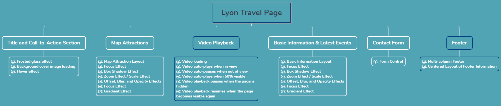

# Project 6 Comprehensive Project — Lyon Tourism Page (Module F)

## Content Guide
After in-depth learning of the knowledge from the previous five chapters, it is believed that beginners have mastered HTML5-related tags, CSS3 style properties, layout and typesetting, and CSS3 advanced skills proficiently. To consolidate the learned knowledge in a timely and effective manner, this project will use the basic knowledge from the first five chapters to develop a comprehensive website project — the Lyon Tourism Page.
This project includes nine modules: website title, call-to-action section, map scenic spots, video playback, basic information, latest activities, information tags, contact form, and footer.

## Learning Objectives
- ① Use knowledge of common HTML tags, hyperlinks, images, lists, tables, forms, and multimedia to build the structure of the web page.
- ② Use knowledge of CSS selectors, common styles, positioning, floating, etc., to complete the style design of the web page.

#### 6.1 Scoring Summary

| No. | Sub-criterion | Score |
| --- | --- | --- |
| 1 | Responsive Loading | 2.25 |
| 2 | Video Playback | 2.0 |
| 3 | Design &amp; Layout Implementation | 2.75 |
| 4 | Effects | 3.0 |
| 5 | Accessibility | 2.5 |
| 6 | Tags | 1.0 |

#### 6.2 Project Introduction
This project requires developing a tourism information page for global visitors, showcasing tourist attractions, cultural events, and other highlights of Lyon. The website consists of nine modules: header, call-to-action section, map attractions, video playback, basic information, latest activities, information tabs, contact form, and footer.
The Lyon tourism page includes text, images, hyperlinks, lists, forms, navigation, and other elements. In terms of styling and layout, it involves page layout and positioning, font effects, image carousel effects, image zoom effects, and other designs. This allows learners to comprehensively apply the knowledge they have learned through hands-on practice and achieve the expected effect of this textbook’s comprehensive project.

#### 6.3 Requirement Analysis
The Lyon tourism page is divided into nine major modules: website header, call-to-action section, map attractions, video playback, basic information, latest activities, information tabs, contact form, and footer. The functional description of each module is as follows.
The project function structure diagram is shown in Figure 7-1.
<p align="center">
  
</p>

<p align="center"><em>Figure 6-1 Functional Structure Diagram</em></p>

#### 1. Lyon Tourism Page
The Lyon Tourism Page includes common effects such as images, text, layout, and hyperlinks, as well as elements like video playback and font effects. It is the most comprehensive page in the comprehensive project in terms of both effects and functions.

##### (1) Header and Call-to-Action Section
The header navigation must be fixed at the top when scrolling, with a frosted glass effect.
The call-to-action section loads a full background cover image, with a call-to-action button centered in the area.
The CTA button has a mouse-following hover effect and a flashing border effect.

##### (2) Map Attractions
This module implements focus effects, shadow effects, zoom-in, highlight effects, and light gradient effects.

##### (3) Video Playback
This module mainly implements video playback functions:
• The video autoplays when scrolling into view.
• The video automatically pauses when it is out of the viewport.

##### (4) Basic Information and Latest Activities
This module is mainly implemented using inline elements, text decoration elements, and styled button controls.
The latest activities module implements focus effects, shadow effects, zoom-in, highlight effects, and light gradient effects.

##### (5) Contact Form
This module mainly includes forms, form controls, and buttons to implement a complete contact form.

##### (6) Footer
The footer is mainly text-based, implemented using hyperlinks, lists, and corresponding style settings.

#### 6.4 Page Design

### 6.3.1. Directory Structure
The project is named "module_f", and the resource folder contains the files as shown in Table 6-1:

**Table 6-1 Resource Folder Content**

| No. | Directory/ Main File Name | Included Files | File Description |
| --- | --- | --- | --- |
| 1 | css | index.css | Style for the website's homepage |
| 2 |  | _base.css | Common/shared styles |
| 3 |  | _header.css | Styles for header and navigation |
| 4 |  | _hero.css | Styles for call-to-action section |
| 5 |  | _map.css | Styles for map attractions |
| 6 |  | _video.css | Styles for video playback |
| 7 |  | _info.css | Styles for basic information |
| 8 |  | _contact.css | Styles for contact form |
| 9 |  | _footer.css | Styles for footer |
| 10 |  | _other-info.css | Styles for information tabs |
| 11 | assets | Image resources | Folder for image assets |
| 12 | index.html | Lyon tourism main page |  |

### 6.3.2 Design Concept

##### (1) Navigation and Footer
The navigation and footer sections are consistent throughout the project and appear on every page, so they can be designed and developed separately.
① The navigation is implemented using sequential layout and hyperlinks, as shown in Figure 6-2.
<p align="center">
  
</p>

<p align="center"><em>Figure 6-2 Website Navigation</em></p>
② Footer information is laid out in centered alignment, as shown in Figure 6-3.
<p align="center">
  
</p>

<p align="center"><em>Figure 6-3 Footer Display</em></p>

##### (2) Call-to-Action Section
The call-to-action section consists of the heading, navigation with frosted glass effect, cover background image, call-to-action button, and hover effects for the button, as shown in Figure 6-4.
<p align="center">
  
</p>

<p align="center"><em>Figure 6-4 Call-to-Action</em></p>

##### (3) Map Attractions Section
The map attractions section includes a static graphic on the right and three attraction cards on the left. It implements focus effects, box shadows, zoom effects, offset, blur, opacity, highlight effects, and gradient effects, as shown in Figure 6-5.
<p align="center">
  
</p>

<p align="center"><em>Figure 6-5 Map Attractions</em></p>

##### (4) Video Playback Section
The video playback section includes video loading, autoplay when the video enters the viewport, auto-pause when it leaves the viewport, autoplay when 50% visible, pause when the webpage is hidden, and resume playback when the webpage becomes visible again, as shown in Figure 6-6.
<p align="center">
  
</p>

<p align="center"><em>Figure 6-6 Video Playback</em></p>

##### (5) Basic Information and Latest Activities Section
The basic information and latest activities module includes layout for basic information, plus focus effects, box shadows, zoom effects, offset, blur, opacity, highlight effects, and gradient effects, as shown in Figure 6-7.
<p align="center">
  
</p>

<p align="center"><em>Figure 6-7 Service Overview</em></p>

##### (6) Information Tabs
The information tabs module is mainly implemented with custom tab elements. Users can switch tabs by clicking. It uses aria-selected, aria-hidden, and aria-labelledby to associate tab titles with corresponding content, as shown in Figure 6-8.
<p align="center">
  
</p>

<p align="center"><em>Figure 6-8 Information Tabs</em></p>

##### (7) Contact Form
The contact form module includes the following fields: first name, last name, contact email address, and contact phone number, as shown in Figure 6-9.
<p align="center">
  
</p>

<p align="center"><em>Figure 6-9 Contact Form</em></p>

#### 6.5 Project Implementation
Task 1: Call-to-Action

#### Step 1: Create the Directory Structure,The directory structure is as follows:
• module_f :Project root directory
• assets:Directory for images and videos
• scripts:Directory for JavaScript files
• styles:Directory for style files
• index.html:Entry HTML file

#### Step 2: Create a New HTML Page
Create a new HTML page named index.html, and after successful creation, change the page title to "Welcome Lyon". The code is as follows:

```html
<!DOCTYPE html>
<html lang="en">
  <head>
    <!-- Meta Tags -->
    <meta charset="UTF-8" />
    <meta name="viewport" content="width=device-width, initial-scale=1.0" />
    <title>Welcome Lyon</title>
    <!-- Links -->
  </head>
  <body>
  </body>
</html>
```

#### Step 3: Create the index.css style file with the path styles/index.css. Import the _base.css style file in the index.css file with the following code:

```css
@import url("./_base.css");
```

#### Step 4: Create the _base.css style file with the path styles/_base.css, and add the following code to it:

```css
*,
*::before,
*::after {
  box-sizing: border-box;
  padding: 0;
  margin: 0;
  font-family: Arial, Helvetica, sans-serif;
  font-weight: 400;
  font-size: 1rem;
  text-decoration: none;
  border: 0;
}
body {
  display: flex;
  flex-direction: column;
  min-height: 100vh;
  overflow-x: hidden;
}
img {
  max-width: 100%;
  object-fit: cover;
  object-position: center;
}
```

#### Step 5: Edit the index.html file to create the web page logo and navigation section. The code is as follows:

```html
<!DOCTYPE html>
<html lang="en">
  <head>
    <!-- Meta Tags -->
    <meta charset="UTF-8" />
    <meta name="viewport" content="width=device-width, initial-scale=1.0" />
    <title>Welcome Lyon</title>
    <!-- Links -->
    <link rel="stylesheet" href="styles/index.css" />
  </head>
  <body>
    <!-- Header -->
    <header>
      <div class="header-container">
        <h1 class="logo">WELCOME LYON</h1>
        <!-- Navigation -->
        <nav>
          <a href="#">Link</a>
          <a href="#">Link</a>
          <a href="#">Link</a>
        </nav>
      </div>
    </header>
  </body>
</html>
```

#### Step 6: Create the _header.css file with the path styles/_header.css, and add the following code to it:

```css
/* Styles for the header */
header {
  background-color: rgba(255, 255, 255, 0.85);
  position: fixed;
  top: 0;
  width: 100%;
  backdrop-filter: blur(2rem);
  box-shadow: 0 2px 4px rgba(0, 0, 0, 0.25);
  z-index: 1000;
}
.header-container {
  margin: 0 auto;
  padding: 1rem;
  width: min(100%, 860px);
  display: flex;
  align-items: center;
  justify-content: space-between;
}
.header-content .logo {
  color: black;
  text-transform: uppercase;
}
/* Navigation */
header nav {
  display: flex;
  align-items: center;
  gap: 150px;
}
header nav a {
  color: #0504c8;
}
```

#### Step 7: Import the _header.css file into the index.css file. The code is as follows:

```css
@import url("./_base.css");
@import url("./_header.css");
```

#### Step 8: Edit the index.html file to implement the Call to Action (CTA) section. Place the code below the header section, as shown below:

```html
<!DOCTYPE html>
<html lang="en">
  <head>
    <!-- Meta Tags -->
    <meta charset="UTF-8" />
    <meta name="viewport" content="width=device-width, initial-scale=1.0" />
    <title>Welcome Lyon</title>
    <!-- Links -->
    <link rel="stylesheet" href="styles/index.css" />
  </head>
  <body>
    <!-- Header -->
    <main>
      <!-- Hero Section -->
      <div class="hero">
        
        <div class="cta-container" id="cta-container">
          <button class="cta">Call to Action</button>
        </div>
      </div>
    </main>
  </body>
</html>
```

#### Step 9: Create the _hero.css file with the path styles/_hero.css, and add the following code to it:

```css
.hero {
  height: 1023px;
  padding: 1rem;
  position: relative;
}
.hero img {
  width: 100%;
  position: absolute;
  inset: 0;
  height: 100%;
}
/* Hero Button */
.cta-container {
  height: 112px;
  width: 278px;
  background: transparent;
  border-radius: 0.5rem;
  position: absolute;
  left: 50%;
  top: 50%;
  transform: translate(-50%, -50%);
  z-index: 10;
  padding: 3px;
  transition: 0.2s;
}
.cta-container button {
  width: 100%;
  height: 100%;
  border-radius: 0.5rem;
  background-color: #e0e0e0;
  font-size: 1.2rem;
  cursor: pointer;
}
.cta-container:hover {
  transform: scale(1.03) translate(-50%, -50%);
}
```

#### Step 10: Import the _hero.css file into the index.css file. The styles are as follows:

```css
@import url("./_base.css");
@import url("./_header.css");
@import url("./_hero.css");
```

#### Step 11: Run the index.html file to check the effect.
<p align="center">
  
</p>

Task 2: Map Attractions

#### Step 1: Edit the index.html file to add the map attractions layout. Place the code below the Call to Action (CTA) section, with the code as follows:

```html
<!DOCTYPE html>
<html lang="en">
  <head>
    <!-- Meta Tags -->
    <meta charset="UTF-8" />
    <meta name="viewport" content="width=device-width, initial-scale=1.0" />
    <title>Welcome Lyon</title>
    <!-- Links -->
    <link rel="stylesheet" href="styles/index.css" />
  </head>
  <body>
    <!-- Header -->
    <main>
      <!-- Hero Section -->
      <!-- Map attraction section -->
      <section class="map">
        <h2>Map Attractions</h2>
        <div class="map-container">
          <!-- Attractions -->
          <div class="attractions">
            <a class="card" href="#" id="attraction-a">
              <picture>
                <source
                srcset="assets/images/attraction-a.jpg"
                media="(min-width: 760px)"
```

/&gt;
&lt;img

```html
src="assets/images/attraction-a-low-res.jpg"
alt="Parce de la Tete"
/>
</picture>
<span>Parc de la Tete d'Or</span>
</a>
<a class="card" href="#" id="attraction-b">
  <picture>
    <source
    srcset="assets/images/attraction-b.jpg"
    media="(min-width: 760px)"
```

/&gt;
&lt;img

```html
src="assets/images/attraction-b-low-res.jpg"
alt="Street"
/>
</picture>
<span>Street</span>
</a>
<a class="card" href="#" id="attraction-c">
  <picture>
    <source
    srcset="assets/images/attraction-c.jpg"
    media="(min-width: 760px)"
    />
    
  </picture>
  <span>River</span>
</a>
<a class="card" href="#">
  <picture>
    <source
    srcset="assets/images/all-attractions.jpg"
    media="(min-width: 760px)"
```

/&gt;
&lt;img

```html
src="assets/images/all-attractions-low-res.jpg"
alt="All Attractions"
/>
</picture>
<span>All Attractions</span>
</a>
</div>
<!-- Dots -->
<div
class="map-dot"
id="map-dot-1"
aria-label="Highlight the first attraction"
tabindex="0"
>
<span>A</span>
</div>
<div
class="map-dot"
id="map-dot-2"
aria-label="Highlight the second attraction"
tabindex="0"
>
<span>B</span>
</div>
<div
class="map-dot"
id="map-dot-3"
aria-label="Highlight the third attarction"
tabindex="0"
>
<span>C </span>
</div>
<!-- Image -->
<picture>
  <source
  srcset="assets/images/lyon-map.jpg"
  media="(min-width: 760px)"
  />
  
</picture>
</div>
</section>
</main>
</body>
</html>
```

#### Step 2: Create the _map.css file with the path styles/_map.css, and add the following code to it:

```css
/* Styles for the map section */
.map {
  width: min(100%, 890px);
  margin: 0 auto;
  margin-bottom: 38px;
  margin-top: 60px;
  display: flex;
  flex-direction: column;
  gap: 40px;
}
.map-container {
  width: 100%;
  height: 466px;
  position: relative;
}
/* Map image */
.map-container image,
.map-container > img {
  position: absolute;
  width: 100%;
  height: 100%;
  inset: 0;
  object-position: center top;
}
/* Map dots */
.map-dot {
  position: absolute;
  z-index: 5;
  background-color: #fbbdc8;
  width: 35px;
  height: 35px;
  border-radius: 50%;
  display: flex;
  align-items: center;
  justify-content: center;
  cursor: pointer;
}
.map-dot span {
  position: relative;
  z-index: 6;
}
.map-dot::before {
  content: "";
  position: 0;
  width: 20px;
  z-index: 4;
  height: 20px;
  position: absolute;
  background-color: #fbbdc8;
  transform: translateY(20%) rotate(45deg);
  bottom: 0;
}
#map-dot-1 {
  top: 23px;
  right: 54px;
}
#map-dot-3 {
  top: 14px;
  right: 308px;
}
#map-dot-2 {
  top: 209px;
  right: 180px;
}
/* Attractions */
.attractions {
  gap: 16px 20px;
  display: grid;
  grid-template-columns: repeat(2, 1fr);
  position: absolute;
  left: 34px;
  z-index: 10;
  top: 26px;
}
.events-container .card,
.attractions .card {
  box-shadow: 0 0 2px rgba(0, 0, 0, 0.25);
  width: 170px;
  min-width: 170px;
  border-radius: 0.5rem;
  min-height: 188px;
  background-color: white;
  padding: 8px;
  display: flex;
  flex-direction: column;
  gap: 0.25rem;
  transition: 0.15s;
  overflow: hidden;
  position: relative;
}
.events-container .card img,
.events-container .card picture,
.attractions .card img,
.attractions .card picture {
  width: 100%;
  height: 120px;
}
.events-container .card span,
.attractions .card span {
  font-size: 1.1rem;
  color: black;
  line-height: 1;
}
/* Title */
.map h2 {
  font-size: 4rem;
  text-align: center;
  font-weight: bold;
}
```

.map-container:has(#map-dot-1:hover) #attraction-a,
.map-container:has(#map-dot-2:hover) #attraction-b,
.map-container:has(#map-dot-3:hover) #attraction-c,

```css
.attractions .card:hover,
.events-container .card:hover {
  transform: scale(1.05);
  box-shadow: 0 5px 5px rgba(0, 0, 0, 0.3);
}
.attractions .card::before,
.events-container .card::before {
  content: "";
  position: absolute;
  top: 0;
  left: -80px;
  height: 100%;
  width: 50px;
  background: linear-gradient(
  to bottom,
  rgba(255, 255, 255, 0.75),
  rgba(255, 255, 255, 0.25)
  );
  transform: rotate(8deg);
  transition: 0.5s;
}
.events-container .card:hover::before,
.attractions .card:hover::before {
  left: 200px;
}
```

#### Step 3: Import the _map.css file into the index.css file. The code is as follows:

```css
@import url("./_base.css");
@import url("./_header.css");
@import url("./_hero.css");
@import url("./_map.css");
```

#### Step 4: Run the index.html file to check the effect.
<p align="center">
  
</p>

Task 3: Video Playback

#### Step 1: Edit the index.html file to add video loading functionality. Place the code below the map attractions section, with the code as follows:

```html
<!DOCTYPE html>
<html lang="en">
  <head>
    <!-- Meta Tags -->
    <meta charset="UTF-8" />
    <meta name="viewport" content="width=device-width, initial-scale=1.0" />
    <title>Welcome Lyon</title>
    <!-- Links -->
    <link rel="stylesheet" href="styles/index.css" />
  </head>
  <body>
    <!-- Header -->
    <main>
      <!-- Hero Section -->
      <!-- Map attraction section -->
      <!-- Video Section -->
      <section class="video">
        <video autoplay muted>
          <source src="assets/lyon.mp4" />
        </video>
      </section>
    </main>
  </body>
</html>
```

#### Step 2: Create the _video.css file with the path styles/_video.css, and add the following code to it:

```css
/* Styles for the video section */
.video {
  width: min(100%, 1920px);
  margin: 0 auto;
  height: 936px;
}
.video video {
  height: 100%;
  width: 100%;
  object-fit: cover;
}
```

#### Step 3: Import the _video.css file into the index.css file. The code is as follows:

```css
@import url("./_base.css");
@import url("./_header.css");
@import url("./_hero.css");
@import url("./_map.css");
@import url("./_video.css");
```

#### Step 4: Run the index.html file to check the effect.
<p align="center">
  
</p>

Task 4 Basic Information and Latest Events

#### Step 1: Edit the index.html file to add the layout for basic information and latest events. Place the code below the video playback module. The code is as follows:

```html
<!DOCTYPE html>
<html lang="en">
  <head>
    <!-- Meta Tags -->
    <meta charset="UTF-8" />
    <meta name="viewport" content="width=device-width, initial-scale=1.0" />
    <title>Welcome Lyon</title>
    <!-- Links -->
    <link rel="stylesheet" href="styles/index.css" />
  </head>
  <body>
    <!-- Header -->
    <main>
      <!-- Hero Section -->
      <!-- Map attraction section -->
      <!-- Video Section -->
      <!-- Section for the essential information and the events -->
      <section class="info">
        <!-- Essential Information -->
        <div class="essential">
          <h2>Essential Information</h2>
          <span>Contact: 04 72 10 30 30</span>
          <span>Address: Mairie de Lyon, 69205 Lyon cedex 01</span>
          <button class="read" id="read">Read it Loud</button>
        </div>
        <!-- Latest Events -->
        <div class="events">
          <h2>Latest Events</h2>
          <div class="events-container" tabindex="0">
            <!-- Event Card -->
            <div class="card">
              <picture>
                <source
                srcset="
```

assets/images/latest-events-images/worldskills-2024-p.jpg
"

```
media="(min-width: 760px)"
```

/&gt;
&lt;img

```html
src="assets/images/latest-events-images/worldskills-2024-p-low-res.png"
alt="Event"
/>
</picture>
<span>
  Lyon accueille la finale mondiale des Worldskills 2024
</span>
</div>
<!-- Event Card -->
<div class="card">
  <picture>
    <source
    srcset="assets/images/latest-events-images/fda-p.jpg"
    media="(min-width: 760px)"
```

/&gt;
&lt;img

```html
src="assets/images/latest-events-images/fda-p-low-res.jpg"
alt="Event"
/>
</picture>
<span>Forum des associations 2024 </span>
</div>
<!-- Event Card -->
<div class="card">
  <picture>
    <source
    srcset="assets/images/latest-events-images/lyon-kayak-p-0.jpg"
    media="(min-width: 760px)"
```

/&gt;
&lt;img

```html
src="assets/images/latest-events-images/lyon-kayak-p-0-low-res.jpg"
alt="Event"
/>
</picture>
<span>Lyon Kayak</span>
</div>
<!-- Event Card -->
<div class="card">
  <picture>
    <source
    srcset="
```

assets/images/latest-events-images/semaine-bleue-2024-p.jpg
"

```
media="(min-width: 760px)"
```

/&gt;
&lt;img

```html
src="assets/images/latest-events-images/semaine-bleue-2024-p-low-res.jpg"
alt="Event"
/>
</picture>
<span>La semaine bleue 2024</span>
</div>
<!-- Event Card -->
<div class="card">
  <picture>
    <source
    srcset="
```

assets/images/latest-events-images/village-des-metiers-p.jpg
"

```
media="(min-width: 760px)"
```

/&gt;
&lt;img

```html
src="assets/images/latest-events-images/village-des-metiers-p-low-res.jpg"
alt="Event"
/>
</picture>
<span>Le Village des Métiers</span>
</div>
<!-- Event Card -->
<div class="card">
  <picture>
    <source
    srcset="
```

assets/images/latest-events-images/journees_portes_ouvertes_entreprises_2023_p.jpg
"

```
media="(min-width: 760px)"
```

/&gt;
&lt;img

```html
src="assets/images/latest-events-images/journees_portes_ouvertes_entreprises_2023_p-low-res.jpg"
alt="Event"
/>
</picture>
<span>Les Journées Portes Ouvertes des Entreprises</span>
</div>
</div>
</div>
</section>
</main>
</body>
</html>
```

#### Step 2: Create the _info.css file with the path styles/_info.css, and add the following code to it:

```css
/* Styles for the info seciton */
.info {
  margin: 0 auto;
  padding: 1rem;
  width: min(100%, 860px);
  display: grid;
  grid-template-columns: repeat(2, 1fr);
  gap: 1rem;
  margin-top: 54px;
}
.essential {
  display: flex;
  flex-direction: column;
  display: flex;
  flex-direction: column;
  gap: 1rem;
}
.info h2 {
  font-weight: bold;
  text-align: center;
  font-size: 2.5rem;
  margin-bottom: 1rem;
}
.info .read {
  width: 172px;
  height: 56px;
  border-radius: 0.5rem;
  background-color: #023399;
  color: white;
  display: flex;
  align-items: center;
  justify-content: center;
  font-size: 1.05rem;
  cursor: pointer;
}
/* Events */
.events-container {
  width: 411px;
  overflow-x: auto;
  padding: 0.75rem;
  border: 1px solid #cdcdcd;
  padding: 10px;
  display: flex;
  align-items: flex-start;
  border-radius: 0.5rem;
}
```

#### Step 3: Import the _info.css file into the index.css file. The code is as follows:

```css
@import url("./_base.css");
@import url("./_header.css");
@import url("./_hero.css");
@import url("./_map.css");
@import url("./_video.css");
@import url("./_info.css");
```

#### Step 4: Open the index.html file to preview the effect.
<p align="center">
  
</p>

Task 5 Information Tabs

#### Step 1: Edit the index.html file to add the information tabs layout. Place the code below the basic information and latest events section. The code is as follows:

```html
<!DOCTYPE html>
<html lang="en">
  <head>
    <!-- Meta Tags -->
    <meta charset="UTF-8" />
    <meta name="viewport" content="width=device-width, initial-scale=1.0" />
    <title>Welcome Lyon</title>
    <!-- Links -->
    <link rel="stylesheet" href="styles/index.css" />
  </head>
  <body>
    <!-- Header -->
    <main>
      <!-- Hero Section -->
      <!-- Map attraction section -->
      <!-- Video Section -->
      <!-- Section for the essential information and the events -->
      <!-- Other information -->
      <section class="other-info">
        <h2>Other Information</h2>
        <fieldset class="tabs" id="tab-container" tabindex="0">
          <label class="tab">
            <span>Tab 1</span>
            <input type="radio" value="tab-1" id="tab-1" name="tabs" checked />
          </label>
          <label class="tab">
            <span>Tab 2</span>
            <input type="radio" value="tab-2" id="tab-2" name="tabs" />
          </label>
          <label class="tab">
            <span>Tab 3</span>
            <input type="radio" value="tab-3" id="tab-3" name="tabs" />
          </label>
          <!-- <x-tab id="tab-1" checked="true">Tab 1</x-tab>
          <x-tab id="tab-2">Tab 2</x-tab>
          <x-tab id="tab-3">Tab 3</x-tab> -->
        </fieldset>
        <div class="tab-content">
          <div id="tab-1-content" aria-labelledby="tab-1">
            This is the content for Tab 1.
          </div>
          <div id="tab-2-content">This is the content for Tab 2.</div>
          <div id="tab-3-content">This is the content for Tab 3.</div>
        </div>
      </section>
    </main>
  </body>
</html>
```

#### Step 2: Create the _other-info.css file with the path styles/_other-info.css, and add the following code to it:

```css
/* Styles for the other informations */
.other-info {
  width: min(700px, 100%);
  padding: 1rem;
  display: flex;
  flex-direction: column;
  gap: 40px;
  margin: 0 auto;
  margin-top: 50px;
  margin-bottom: 30px;
}
.other-info h2 {
  font-weight: bold;
  font-size: 2.5rem;
  text-align: center;
}
.tabs {
  border-bottom: 2px solid #cccccc;
  width: 100%;
  display: flex;
  outline-offset: 5px;
  outline-color: #eee;
  /* height: 33px; */
}
.tabs .tab {
  padding: 14px 24px;
  line-height: 1;
  text-align: center;
  cursor: pointer;
  background-color: #f0f0f0;
  border-bottom: 2px solid #ccc;
  transition: 0.2s;
  margin-bottom: -2px;
}
.tabs .tab:hover {
  background-color: #f9f9f9;
}
.tabs .tab:has(:checked) {
  background-color: white;
  border-bottom-color: #037afe;
}
.tabs .tab input {
  display: none;
}
```

#### Step 3: Import the _map.css file into the index.css file. The code is as follows:

```css
@import url("./_base.css");
@import url("./_header.css");
@import url("./_hero.css");
@import url("./_map.css");
@import url("./_video.css");
@import url("./_info.css");
@import url("./_other-info.css");
```

#### Step 4: Run the index.html file to check the effect.
<p align="center">
  
</p>

Task 6 Contact Form

#### Step 1: Edit the index.html file and add the contact form layout. The code is as follows:

```html
<!DOCTYPE html>
<html lang="en">
  <head>
    <!-- Meta Tags -->
    <meta charset="UTF-8" />
    <meta name="viewport" content="width=device-width, initial-scale=1.0" />
    <title>Welcome Lyon</title>
    <!-- Links -->
    <link rel="stylesheet" href="styles/index.css" />
  </head>
  <body>
    <!-- Header -->
    <main>
      <!-- Hero Section -->
      <!-- Map attraction section -->
      <!-- Video Section -->
      <!-- Section for the essential information and the events -->
      <!-- Other information -->
      <!-- Contact Form Section -->
      <seciton class="contact">
        <h2>Contact Us</h2>
        <form class="fields" action="#">
          <label>
            First name
            <input type="text" />
          </label>
          <label>
            Last name
            <input type="text" />
          </label>
          <label>
            Email
            <input type="text" />
          </label>
          <label>
            Phone
            <input type="text" />
          </label>
        </form>
      </seciton>
    </main>
  </body>
</html>
```

#### Step 2: Create the _contact.css file with the path styles/_contact.css, and place the following code inside:

```css
/* Styles for the contact section */
.contact {
  margin: 0 auto;
  padding: 1rem;
  width: min(100%, 900px);
  border: 2px solid #cccccc;
  padding: 50px 36px;
  padding-top: 0;
  display: block;
  margin-top: 100px;
}
.contact .fields {
  display: grid;
  grid-template-columns: repeat(2, 1fr);
  gap: 36px;
  width: 100%;
}
.contact .fields label {
  white-space: nowrap;
}
.contact .fields input {
  border: 1px solid #767676;
  border-radius: 0.25rem;
}
.contact h2 {
  padding: 2rem;
  border: 2px solid #cccccc;
  font-size: 3rem;
  font-weight: bold;
  transform: translateY(-50%);
  background-color: white;
  width: fit-content;
  margin: 0 auto;
}
```

#### Step 3: Import the _map.css file in the index.css file. The code is as follows:

```css
@import url("./_base.css");
@import url("./_header.css");
@import url("./_hero.css");
@import url("./_map.css");
@import url("./_video.css");
@import url("./_info.css");
@import url("./_contact.css");
@import url("./_other-info.css");
```

#### Step 4: Run the index.html file to view the effect.
<p align="center">
  
</p>

Task 7 Footer

#### Step 1: Edit the index.html file, add the footer layout, place the code below the contact form, as follows:

```html
<!DOCTYPE html>
<html lang="en">
  <head>
    <!-- Meta Tags -->
    <meta charset="UTF-8" />
    <meta name="viewport" content="width=device-width, initial-scale=1.0" />
    <title>Welcome Lyon</title>
    <!-- Links -->
    <link rel="stylesheet" href="styles/index.css" />
  </head>
  <body>
    <!-- Header -->
    <main>
      <!-- Hero Section -->
      <!-- Map attraction section -->
      <!-- Video Section -->
      <!-- Section for the essential information and the events -->
      <!-- Other information -->
      <!-- Contact Form Section -->
    </main>
    <!-- Footer -->
    <footer>
      <div class="footer-row">
        <div class="footer-col">
          <a href="#">About Us</a>
          <a href="#">Getting Here</a>
          <a href="#">FAQs</a>
        </div>
        <div class="footer-col">
          <a href="#">Places to Stay</a>
          <a href="#">Things to Do</a>
          <a href="#">Event Calendar</a>
        </div>
        <div class="footer-col">
          <a href="#">Restaurants</a>
          <a href="#">Nightlife</a>
          <a href="#">Shopping</a>
        </div>
        <div class="footer-col">
          <a href="#">Plan Your Trip</a>
          <a href="#">Contact Us</a>
          <a href="#">Newsletter <br />Signup</a>
        </div>
      </div>
      <span>&copy; 2024. All Rights Reserved.</span>
    </footer>
  </body>
</html>
```

#### Step 2: Create the _footer.css file under the path styles/_footer.css and insert the following code:

```css
/* Styles for the footer */
footer {
  background-color: #efefef;
  border-top: 2px solid #cccccc;
  display: flex;
  flex-direction: column;
  gap: 42px;
  padding: 1rem;
  padding-top: 40px;
  align-items: center;
  margin-top: 90px;
}
.footer-row {
  display: flex;
  align-items: flex-start;
  gap: 110px;
  align-items: center;
}
.footer-col {
  display: flex;
  flex-direction: column;
  gap: 0.75rem;
}
.footer-col a,
footer span {
  line-height: 1;
  color: #2e2e2e;
}
```

#### Step 3: Import the _footer.css file in the index.css file. The code is as follows:

```css
@import url("./_base.css");
@import url("./_header.css");
@import url("./_hero.css");
@import url("./_map.css");
@import url("./_video.css");
@import url("./_info.css");
@import url("./_contact.css");
@import url("./_footer.css");
@import url("./_other-info.css");
```

#### Step 4: Run the index.html file to view the effect.
<p align="center">
  
</p>

Part 3 Responsive Design &amp; Cross-Device Compatibility
