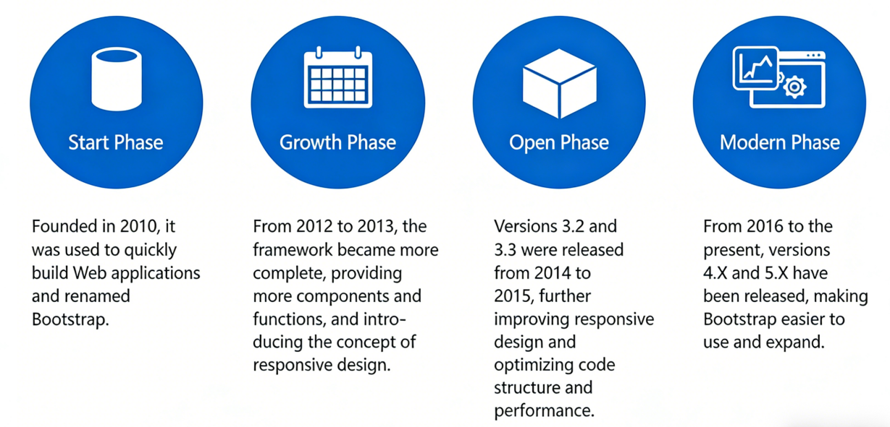
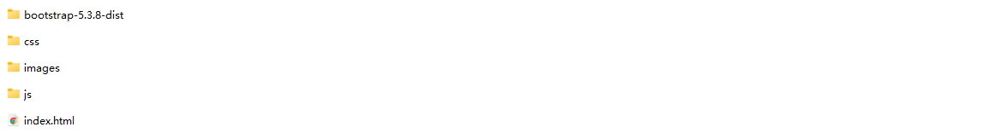
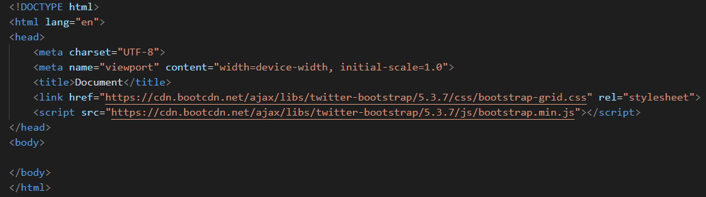

# Project 7 Basics of Bootstrap Framework — Responsiveness Is Not Compromise, But Wisdom

## Content Guide
This project mainly focuses on the core functions of the Bootstrap framework. It covers implementing visual effects such as background styles, box shadows, text shadows, and background gradients through predefined classes and custom CSS; optimizing page structure and size calculation by using Flexbox elastic layout combined with the box-sizing: border-box rule; building responsive design based on @media queries to meet layout requirements for different screen sizes. Meanwhile, @keyframes keyframe animations, the animation property, transform-style for 3D transformations, and perspective effects are introduced to add dynamic interaction and stereoscopic visual presentation to page elements, comprehensively improving web compatibility and user experience.

## Learning Objectives
- ① Master background styles (images, colors, transparency), box shadows (box-shadow), text shadows (text-shadow), and CSS gradients.
- ② Proficient in Flexbox elastic layout (.d-flex, .justify-content-*, .align-items-*) and the Bootstrap grid system (.col-*, .order-*), and achieve precise size control combined with box-sizing: border-box.
- ③ Skillfully use media queries (@media) to adjust layouts for different breakpoints (sm/md/lg/xl), ensuring adaptive display of pages on mobile devices, tablets, and desktops.
- ④ Master the transform properties (rotation, scaling, translation, skewing) and transition effects to implement smooth interactions such as button hover and card flipping.

## Task 7.1 Introduction to Bootstrap

### 7.1.1 The Development History and Structure of Bootstrap

#### 1. History of Bootstrap

#### 2.Basic CSS
Global CSS styles are set; basic HTML elements can be styled via classes for enhanced effects. It also includes an advanced grid system.

#### 3.Components
Numerous reusable components, including glyph icons, dropdown menus, navigations, alert bars, popovers, and many more features.

#### 4.JavaScript Components
Plugins give life to the components in Bootstrap.

### 7.1.2 Bootstrap Installation
Bootstrap is the world's most popular open-source front-end toolkit. It supports Sass variables and mixins, a responsive grid system, a large number of built-in components, and many powerful JavaScript plugins. With the powerful features provided by Bootstrap, you can quickly design and customize your website.

#### 1. Local Download and Integration
Download the precompiled package from the official Bootstrap website at https://v5.bootcss.com (bootstrap-5.3.8-dist.zip). After extraction, you will get the css and js folders.
Copy the downloaded compressed file to the root directory of your own project, extract it to the current folder, and delete the downloaded zip file, as shown in Figure 5-1 below.

#### 2. CDN Integration
Go to the URL https://www.bootcdn.cn/twitter-bootstrap/, select the corresponding version, and copy the links for bootstrap.min.css and bootstrap.min.js. Embed these links into your existing project to load the resources directly via the public CDN—no need to download any files locally, as shown in the figure below.

