# Project 8 Grid Layout and Flex Layout — Responsive Design for the Future

## Content Guide
This project focuses on the Bootstrap framework as the core learning content, covering its core mechanism for quickly building responsive pages. It uses the predefined grid system (12-column layout, responsive breakpoints sm/md/lg/xl) to achieve flexible page structure division, and container classes (.container / .container-fluid) to control content width and alignment. Combined with component-based design (such as navigation bars, cards, carousels, etc.), it can quickly build standardized interactive modules. With utility classes (spacing m-*/p-*, colors text-*/bg-*, display properties d-*), it enables efficient style reuse. Finally, through the collaboration of media queries and the grid system, it completes responsive design adapted to multiple devices, ensuring that the page maintains a reasonable layout and user experience on different screen sizes.

## Learning Objectives
- ① Master page layout and typesetting.
- ② Master responsive layout of images.
- ③ Master the grid layout structure of Bootstrap.
- ④ Master Flex layout.
- ⑤ Master the six properties of containers.

## Task 8.1 Frosted Glass Navigation

### 8.1.1 Task Description
Implement a frosted glass navigation bar that stays fixed at the top when scrolling. It also features a frosted glass effect and uses a responsive layout to display the navigation and logo. The navigation bar is fixed at the top, remains fixed during scrolling, and applies a frosted glass effect. The effect is shown in Figure 8-1.
<p align="center">
  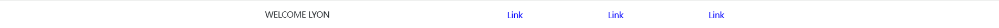
</p>

<p align="center"><em>Figure 8-1 Frosted Glass Navigation</em></p>

### 8.1.2 Knowledge Preparation
Bootstrap’s Flexbox layout is a layout model for creating flexible, responsive page layouts. It has become the default layout model in Bootstrap 4 and Bootstrap 5, making it easier and more controllable to build complex web page layouts. Its main features are summarized as follows:
Container Definition: Use the .d-flex class to set an element as a block-level flex container, and the .d-inline-flex class to set an element as an inline-level flex container. Child elements inside a flex container automatically become flex items and can be arranged using Flexbox layout.
Main Axis Direction: Use the .flex-row class to arrange flex items horizontally (default direction), and .flex-row-reverse to align items starting from the right. In addition, .flex-column can be used to arrange items vertically, and .flex-column-reverse to reverse the vertical order of items.
Alignment and Spacing: Flexbox allows precise control over the alignment and spacing of child elements within the container. For example, use .justify-content-* classes to adjust the arrangement of flex items (such as centering, space-between, etc.), and .align-items-* classes to adjust their alignment along the cross axis.
Order Control: Change the display order of child elements in the container without modifying the HTML structure. For example, use the .order-* classes to set the sorting order of flex items.
Space Distribution: Allocate available space by adjusting the weight among flex items to achieve different width ratios. For example, use .flex-fill to force equal widths for all flex items, or .flex-grow-* to make items take up remaining space.

#### 1.Flex Container
A flex container is defined using the .d-flex (block-level) or .d-inline-flex (inline-level) classes. Details are as follows:

##### (1) Basic Classes
① :d-flex: Sets an element as a block-level flex container (occupies a full line).
Example:

```html
<div class="d-flex p-3 bg-secondary text-white">
  <div class="p-2 bg-info">Child 1</div>
  <div class="p-2 bg-warning">Child 2</div>
  <div class="p-2 bg-danger">Child 3</div>
</div>
```

View this HTML in Chrome; the result is shown in Figure 8-2.
<p align="center">
  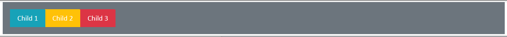
</p>

<p align="center"><em>Figure 8-2 Example of CSS Outline Property</em></p>
② :d-inline-flex: Sets an element as an inline-level flex container (shares a line with other elements).
Example:

```html
<div class="d-inline-flex p-3 bg-secondary text-white">
  <div class="p-2 bg-info">Child 1</div>
  <div class="p-2 bg-warning">Child 2</div>
  <div class="p-2 bg-danger">Child 3</div>
</div>
```

View this HTML in Chrome; the result is shown in Figure 8-3.
<p align="center">
  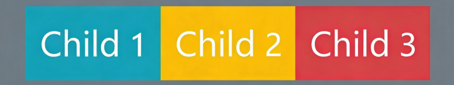
</p>

<p align="center"><em>Figure 8-3 Example of CSS Outline Property</em></p>

##### (2) Direction Control
① :flex-row (default): Main axis is horizontal, items are arranged left to right.
② :flex-row-reverse: Reversed main axis, items are arranged right to left, as shown in Figure 8-4.
<p align="center">
  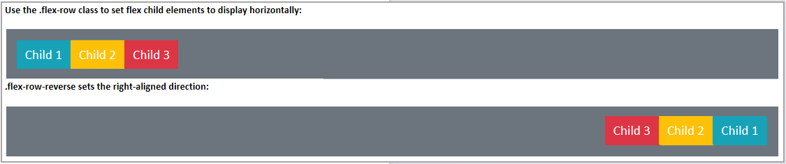
</p>

<p align="center"><em>Figure  8-4</em></p>
③:flex-column: Main axis is vertical, items are arranged top to bottom.
④:flex-column-reverse: Reversed main axis, items are arranged bottom to top, as shown in Figure 8-5.
<p align="center">
  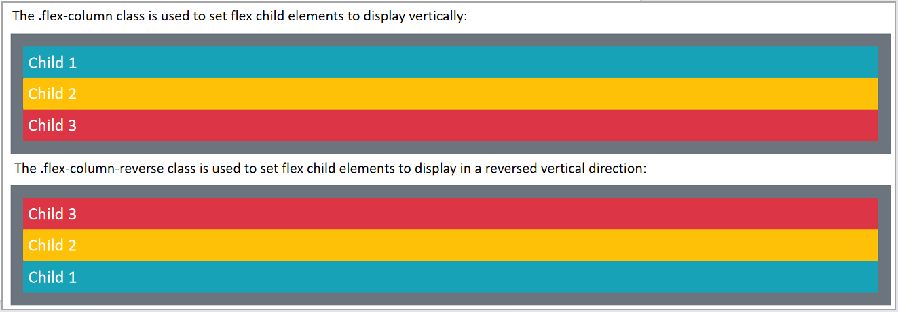
</p>

<p align="center"><em>Figure  8-5</em></p>

#### 2.Main Axis Alignment（justify-content-*）
Controls the distribution of child elements along the main axis:
① :justify-content-start: Align to the left (default).
② :justify-content-end: Align to the right.
③ :justify-content-center: Align center.
④ :justify-content-between: Align with space between items, evenly spaced.
⑤ :justify-content-around: Align with space around items, equal spacing on both sides.
⑥ :justify-content-evenly (Bootstrap 5+): Evenly distributed, including equal space at both ends.

#### 3.Cross Axis Alignment (align-items-*)
Controls the alignment of child elements along the cross axis (perpendicular to the main axis):
① :align-items-start: Align to the top.
② :align-items-end: Align to the bottom.
③ :align-items-center: Align vertically center.
④ :align-items-baseline: Align along the text baseline.
⑤ :align-items-stretch (default): Stretch to fill the container height.

#### 4.Flex Wrapping and Spacing
flex-wrap controls whether child elements wrap to a new line:

##### (1) Auto Wrapping
① :flex-nowrap (default): No wrapping.
② :flex-wrap: Allow wrapping.
③ :flex-wrap-reverse: Wrap in reverse order.

##### (2) Combined Classes
① :flex-row-wrap: Horizontal arrangement + auto wrapping.
② :flex-column-nowrap: Vertical arrangement + no wrapping.

### 8.1.3 Task Implementation
The frosted glass navigation module is divided into the following nine steps, as detailed below.

#### Step 1: Create the directory structure. The directory structure is as follows:
module_f :Project root directory
├─assets: Directory for storing images and videos
├─js: Directory for storing JavaScript files
├─css:Directory for storing style files
├─bootstrap-5.3.3.min.css
├─main.css
├─images:Directory for storing image resources
├─video:Directory for storing video resources
├─index.html:Entry webpage file

#### Step 2: Create the HTML page.

```html
<!DOCTYPE html>
<html lang="en">
  <head>
    <meta charset="utf-8">
    <title>Lyon Tourist</title>
  </head>
  <body>
  </body>
</html>
```

#### Step 3: Edit the index.html file and import the bootstrap-5.3.3.min.css file.

```html
<!DOCTYPE html>
<html>
  <head>
    <meta charset="utf-8">
    <title>Lyon Tourist</title>
    <link rel="stylesheet" href="./assets/css/bootstrap-5.3.3.min.css">
  </head>
  <body>
  </body>
</html>
```

#### Step 4: Edit the index.html file and use the &lt;header&gt; tag to define the header section of the page, which usually contains global elements such as the website LOGO, navigation menu, search box, etc.

```html
<header>
</header>
```

#### Step 5: Edit the index.html file. Take the navigation content in the header as a whole, enable the Flexbox layout to arrange child elements horizontally, and support alignment control to center child elements vertically. Ensure that the two parts are vertically centered in the container and aligned at both ends horizontally, with the remaining space automatically distributed between child elements, so as to achieve the layout of "title on the left + navigation on the right". Set the container as a responsive container to adapt to layout settings of different screen sizes.

```html
<header>
  <div class="container d-flex align-items-center justify-content-between">
  </div>
</header>
```

#### Step 6: Edit the index.html file and add the page title. Use the heading level 1 tag &lt;h1&gt;&lt;/h1&gt; with the content WELCOME LYON.

```html
<header>
  <div class="container d-flex align-items-center justify-content-between">
    <h1>WELCOME LYON</h1>
  </div>
</header>
```

#### Step 7: Edit the index.html file and define the navigation link area. Use semantic markup to represent a group of navigation links containing three &lt;a&gt; links.

```html
<header>
  <div class="container d-flex align-items-center justify-content-between">
    <h1>WELCOME LYON</h1>
    <nav>
      <a href="#cta">Link</a>
      <a href="#cta">Link</a>
      <a href="#cta">Link</a>
    </nav>
  </div>
</header>
```

#### Step 8: Go to the main.css file to implement the frosted glass navigation effect and beautify the style.

```css
/* reset */
* {
  margin: 0;
  padding: 0;
  box-sizing: border-box;
}
body {
  letter-spacing: -0.025em;
  overflow-x: hidden;
}
img, video {
  object-position: center;
  object-fit: cover;
}
/* common */
picture > * {
  width: 100%;
}
.container {
  padding: 0;
  width: 890px;
}
h2 {
  font-weight: bold;
  font-size: 60px;
  letter-spacing: -0.03em;
  text-align: center;
}
section {
  padding-top: 45px;
  padding-bottom: 45px;
}
/* sections */
/* Header */
header {
  position: sticky;
  left: 0;
  right: 0;
  top: 0;
  padding: 1rem 0;
  backdrop-filter: blur(10px);
  background: rgba(255, 255, 255, .7);
  z-index: 999;
}
header a {
  text-decoration: none;
  color: blue;
}
header h1 {
  font-size: 1rem;
  margin-bottom: 0;
}
header nav {
  width: 50%;
  display: flex;
  align-items: center;
  justify-content: space-between;
}
header nav a {
  padding: 0 1rem;
}
```

#### Step 9: Load the main.css and min.js files in the index.html page and insert the following code.

```html
<link rel="stylesheet" href="./assets/css/main.css">
<script src="./assets/js/bootstrap.min.js"></script>
```

## Task 8.2 Call to Action

### 8.2.1 Task Description
Through this practical project, implement the production of the call-to-action section in the tour guide project. The header navigation will be fixed at the top when scrolling, and it also features a frosted glass effect. The next section is the call-to-action section, which has a large cover image as the background. In the center of this section, there is a call-to-action button. The call-to-action button has a hover effect that follows the mouse cursor, which is a shimmer effect with a border. The effect is shown in Figure 8-6.
<p align="center">
  
</p>

<p align="center"><em>Figure 8-6 Call to Action</em></p>

### 8.2.2 Knowledge Preparation
Bootstrap includes several predefined button styles, each serving its own semantic purpose, with a few extra buttons available as well. The .btn classes are designed to be used with the &lt;button&gt; element. These classes can also be applied to &lt;a&gt; or &lt;input&gt; elements. Their main features are summarized as follows:

#### 1. &lt;button&gt; Element
The attributes of the button tag are shown in Table 8-1.

**Table 8-1 Button Attributes**

| Class or Attribute | Explanation |
| --- | --- |
| .btn | Button base style |
| .btn-* | Button color variant |
| .btn-outline-* | Outlined button |
| .btn-lg/sm | Button size (large / small) |
| .btn-block | Block-level button |
| .active .disabled | State: active / disabled |
| data-toggle | Toggle active state |

#### 2.Button Colors

**Table 8-2 Button Attributes**

| Attribute | Explanation |
| --- | --- |
| btn-primary | Table width, can be expressed in pixels or percentages. |
| btn-secondary | Table height, can be expressed in pixels or percentages. |
| btn-success | Border, common value is 0. |
| btn-danger | Distance between content and border, common value is 0. |
| btn-warning | Spacing between cells, common value is 0. |
| btn-info | Alignment. |
| btn-light | Background color. |
| btn-dark | Background image. |
| btn-link | Link button. |

#### 3.Button Size
Use the .btn-lg or .btn-sm classes to set different button sizes. The default size is medium; lg makes it larger, and sm makes it smaller. You can also use .btn-block to create a block-level button.
Example:

```html
<button type="button" class="btn btn-primary btn-lg">Large Button</button>
<button type="button" class="btn btn-success btn-lg">Confirm</button>
<hr>
<button type="button" class="btn btn-primary">Default Button</button>
<button type="button" class="btn btn-success">Reset</button>
<hr>
<button type="button" class="btn btn-primary btn-sm" btn-sm>Small Button</button>
<button type="button" class="btn btn-success btn-sm">Cancel</button>
<hr>
<button type="button" class="btn btn-primary btn-block">Block-level Button</button>
<button type="button" class="btn btn-success btn-block">Login</button>
```

View this HTML in the Chrome browser; the result is shown in Figure 8-7.
<p align="center">
  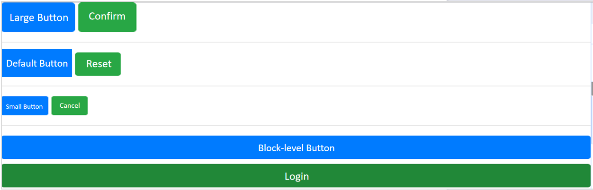
</p>

<p align="center"><em>Figure 8-7 Example of CSS Outline Property</em></p>

#### 4.Button States
When a button is active, it appears pressed: its background and border become darker, and an inset shadow is displayed if shadow effects are enabled. To force this effect programmatically, use the .active class (along with the aria-pressed="true" attribute).
① Adding the .disabled class to a button makes it appear inactive.
② The data-toggle="button" attribute can also be used to toggle the active state of a button.
Example:

```html
<button type="button" class="btn btn-primary btn-block active">Active</button>
<button type="button" class="btn btn-primary btn-block">Default</button>
<button type="button" class="btn btn-primary btn-block disabled">Disabled</button>
<hr>
<button type="button" class="btn btn-primary btn-block active" data-toggle="button">Active Toggle</button>
```

View this HTML in the Chrome browser; the result is shown in Figure 8-8.
<p align="center">
  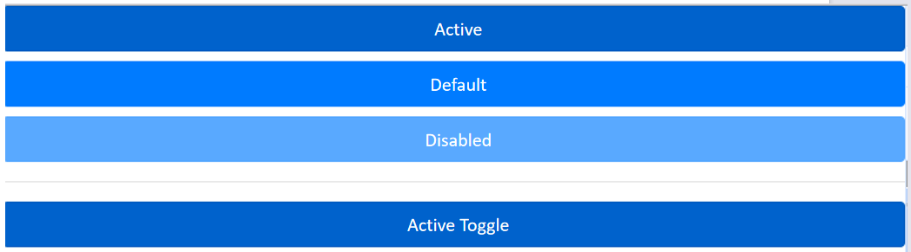
</p>

<p align="center"><em>Figure 8-8 Button State Example</em></p>

#### 5.Images
Bootstrap applies the following styles to images using class names.
① Responsive images (img-fluid)
② Thumbnails (img-thumbnail)
③ Image alignment (float-right, float-left)
④ Rounded corners (rounded)
⑤ Circle / ellipse images (rounded-circle)
⑥ Centered images (mx-auto and d-block)
Example:

```html
<div class="container-fluid">
  
  
  
  
  
  
</div>
```

View this HTML in the Chrome browser; the result is shown in Figure 8-9.
<p align="center">
  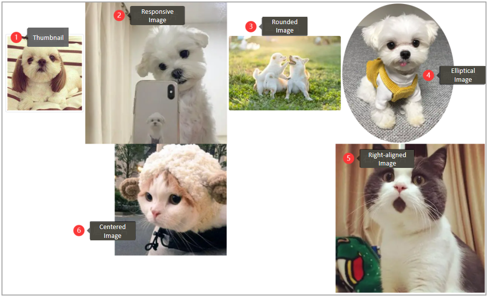
</p>

<p align="center"><em>Figure 8-9 Example of Image Attributes</em></p>

#### 6.&lt;picture&gt;
(1) If you use the &lt;picture&gt; element to specify multiple &lt;source&gt; elements for an &lt;img&gt;, make sure to add the .img-* classes to the &lt;img&gt; element rather than the &lt;picture&gt; element.

##### (2) Usage
① Can display combinations of text and images
② Can display different images based on different screen sizes
Example:

```html
<picture>
  <!--When the screen width is greater than or equal to 600px, display pic01.jpg; when the screen width is less than 600px, display pic06.png-->
  <source srcset="../img/pic01.jpg" media="(min-width:600px)">
  
</picture>
<!--Image and text combination-->
<picture>
  
  <figcaption class="figure-caption text-center">Cute pet born</figcaption>
</picture>
```

### 8.2.3 Task Implementation
The call-to-action module is divided into the following six steps, as detailed below.

#### Step 1: Create the directory structure. The directory structure is as follows:
module_f :Project root directory
├─assets: Directory for images and videos
├─js: Directory for JavaScript files
├─css:Directory for style files
├─bootstrap-5.3.3.min.css
├─main.css
├─images:Directory for image resources
├─video:Directory for video resources
├─index.html:Entry webpage file

#### Step 2: Edit the index.html file. Wrap the outer layer with &lt;section id="cta"&gt; to semantically identify the call-to-action area. Place the code below the &lt;header&gt; tag.

```html
<main>
  <section id="cat">
  </section>
</main>
```

#### Step 3: Edit the index.html file. Use the &lt;picture&gt; element to implement art-directed image selection. Load cover.jpg for devices ≥760px (desktop/tablet) and cover-low-res.jpg for devices ≤760px (mobile).

```html
<main>
  <!--Call to Action Section-->
  <section id="cta">
    <picture class="bgImage">
      <source srcset="./assets/images/cover.jpg" media="(min-width: 760px)">
      <source srcset="./assets/images/cover-low-res.jpg" media="(max-width: 760px)">
      
    </picture>
    <!-- Interactive Button Design -->
  </section>
  <!-- Map Attractions -->
</main>
```

#### Step 4: In main.css, implement and control the image styles.

```css
/* Call to Action Section */
#cta {
  padding: 0;
}
#cta .bgImage {
  width: 100%;
  height: 100vh;
}
#cta .bgImage img {
  height: 100vh;
}
```

#### Step 5: Edit the index.html file for interactive button design. Use btn / btn-lg to control the basic button style and large size variant, and cta-btn for the custom action button style. Beautify the button with the class name ctaBtn. Place the code below the &lt;picture&gt; tag.

```html
<button class="ctaBtn btn  btn-lg cta-btn">
  <span class="inner">Call to Action</span>
  <span class="light"></span>
</button>
```

#### Step 6: In main.css, beautify the button using the class name ctaBtn.

```css
#cta .ctaBtn {
  position: absolute;
  left: 50%;
  top: 50%;
  transform: translate(-50%, -50%);
  width: 280px;
  height: 110px;
  padding: 3px;
  border-radius: 10px;
  border: none;
  transition: .3s;
  display: flex;
  --location-x: 0;
  --location-y: 0;
  overflow: hidden;
}
#cta .ctaBtn:hover {
  transform: translate(-50%, -50%) scale(1.1);
}
#cta .ctaBtn .inner {
  display: flex;
  justify-content: center;
  align-items: center;
  width: 100%;
  height: 100%;
  border-radius: inherit;
  background: #e1e1e1;
  z-index: 2;
  position: relative;
  font-weight: bold;
}
#cta .ctaBtn .light {
  position: absolute;
  left: var(--location-x);
  top: var(--location-y);
  width: 300px;
  aspect-ratio: 1/1;
  border-radius: 50%;
  background: #ff6200;
  filter: blur(100px);
  transform: translate(-50%, -50%);
}
```

## Task 8.3 Map Attractions and Video Playback

### 8.3.1 Task Description
The map attractions section includes a static graphic on the right and three attraction cards displayed on the left. It consists of focus effects, box-shadow effects, zoom effects, offset, blur, opacity effects, focus effects, and gradient effects, as shown in Figure 8-10.
<p align="center">
  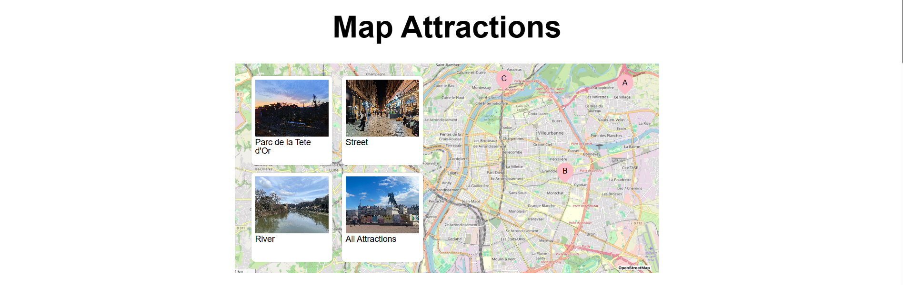
</p>

<p align="center"><em>Figure 8-10 Map Attractions</em></p>

### 8.3.2 Knowledge Preparation
Responsive layout design allows a page to automatically adjust its layout based on the size of the user's device or browser window.
From desktop monitors to laptop screens, from tablets to mobile interfaces, screen sizes vary even among products of the same type from different manufacturers, making page design quite difficult. Responsive layout was created to solve this problem and has now become the mainstream design approach, as shown in Figure 8-11 below.
<p align="center">
  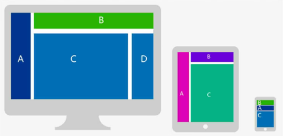
</p>

<p align="center"><em>Figure 8-11</em></p>

#### 1. Grid System
Bootstrap comes with a responsive, mobile-first fluid grid system that automatically divides into up to 12 columns as the screen or viewport size increases, as shown in Figure 8-12 below.
<p align="center">
  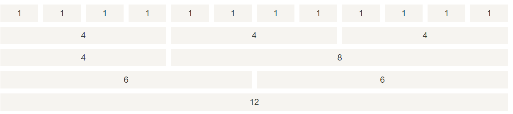
</p>

<p align="center"><em>Figure 8-12</em></p>

#### 2.Grid System (also known as Grid Layout)

**Table 8-3 Button Properties**

| Class | Description |
| --- | --- |
| .col-* | Targets all devices |
| .col-sm-* | Tablets – screen width ≥ 576px |
| .col-md-* | Desktop monitors – screen width ≥ 768px |
| .col-lg-* | pxLarge desktop monitors – screen width ≥ 992px |
| .col-xl-* | Extra large desktop monitors – screen width ≥ 1200px |

#### 3.Grid Options

**Table 8-4 Grid Options**
<p align="center">
  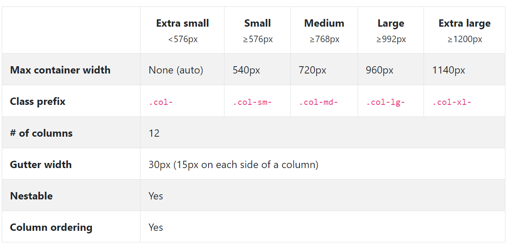
</p>

#### 4.Grid System Rules
Grid rows must be placed inside a container with the .container (fixed width) or .container-fluid (full width) class, which automatically sets some margin and padding.
Use rows to create horizontal groups of columns.
Content must be placed inside columns, and only columns may be direct children of rows.
Predefined classes such as .row and .col-sm-4 can be used to quickly create grid layouts.
Columns create gutters (gaps between column content) via padding. These gutters are offset by negative margin on .row for the first and last columns.
Grid columns are created by spanning a specified number of the 2 available columns.
Example:

```html
<div class="row">
  <div class="col-1">1 column</div>
  <div class="col-1">1 column</div>
  <div class="col-1">1 column</div>
</div>
<div class="row">
  <div class="col-md-3 col-sm-6">4 columns on desktop, 2 columns on tablet</div>
  <div class="col-md-3 col-sm-6">4 columns on desktop, 2 columns on tablet</div>
  <div class="col-md-3 col-sm-6">4 columns on desktop, 2 columns on tablet</div>
  <div class="col-md-3 col-sm-6">4 columns on desktop, 2 columns on tablet</div>
</div>
```

### 8.3.3 Task Implementation
The map attractions module is divided into the following ten steps, as detailed below.

#### Step 1: Create the directory structure as follows:
module_f :Project root directory
├─assets: Directory for images and videos
├─js: Directory for JavaScript files
├─css:Directory for style files
├─bootstrap-5.3.3.min.css
├─main.css
├─images:Directory for image resources
├─video:Directory for video resources
├─index.html:Entry webpage file

#### Step 2: Edit the index.html file, wrap the outer layer with &lt;section id="map" class="container"&gt; to semantically identify the map section, and place it as follows.

```html
<!-- Map Attractions -->
<section id="map" class="container">
</section>
```

#### Step 3: Edit the index.html file and use the &lt;h2&gt; tag for the title area.

```html
<!-- Map Attractions -->
<section id="map" class="container">
  <h2>Map Attractions</h2>
</section>
```

#### Step 4: Edit the index.html file to create the responsive main map image area.

```html
<!-- Map Attractions -->
<section id="map" class="container">
  <h2>Map Attractions</h2>
  <div class="mapContainer">
    <picture class="w-100">
      <source srcset="./assets/images/lyon-map.jpg" media="(min-width: 760px)">
      <source srcset="./assets/images/lyon-map-low-res.jpg" media="(max-width: 760px)">
      
    </picture>
  </div>
</section>
```

#### Step 5: Write styles for the responsive main map image area in main.css.

```css
/* Map Attractions Section */
#map {
  padding: 0;
}
#map h2 {
  margin: 90px 0;
  font-size: 80px;
}
#map .mapContainer {
  position: relative;
}
#map .mapContainer > picture {
  position: absolute;
  left: 0;
  right: 0;
  top: 0;
  bottom: 0;
  z-index: -1;
}
#map .mapContainer > picture img {
  height: 100%;
  object-position: left bottom;
}
```

#### Step 6: Edit the index.html file to create the attraction card matrix, using a 4×2 grid layout (implemented via row &gt; col-6). Each card contains:

```html
<!-- Map Attractions -->
<section id="map" class="container">
  <h2>Map Attractions</h2>
  <div class="mapContainer">
    <picture class="w-100">
      <source srcset="./assets/images/lyon-map.jpg" media="(min-width: 760px)">
      <source srcset="./assets/images/lyon-map-low-res.jpg" media="(max-width: 760px)">
      
    </picture>
    <div class="row">
      <div class="col-6">
        <div class="cardContainer">
          <!-- card list -->
          <div class="row">
            <div class="col-6">
              <article class="photoCard">
                <div class="photoBox">
                  <picture>
                    <source srcset="./assets/images/attraction-a.jpg" media="(min-width: 760px)">
                    <source srcset="./assets/images/attraction-a-low-res.jpg" media="(max-width: 760px)">
                    
                  </picture>
                </div>
                <h3 class="title"><a href="">Parc de la Tete d'Or</a></h3>
              </article>
            </div>
            <!-- The structure is the same as other cards -->
          </div>
        </div>
      </div>
    </div>
  </div>
</section>
```

#### Step 7: Write styles for the attraction card matrix in main.css.

```css
#map .cardContainer > .row {
  --bs-gutter-x: 2rem;
  --bs-gutter-y: 2rem;
}
#map .cardContainer {
  padding: 2rem;
}
```

#### Step 8: Edit the index.html file for the location marker module, and create a positioning container using position-relative.

```html
<!-- Map Attractions -->
<section id="map" class="container">
  <h2>Map Attractions</h2>
  <div class="mapContainer">
    <picture class="w-100">
      <source srcset="./assets/images/lyon-map.jpg" media="(min-width: 760px)">
      <source srcset="./assets/images/lyon-map-low-res.jpg" media="(max-width: 760px)">
      
    </picture>
    <div class="row">
      <div class="col-6">
        <div class="cardContainer">
          <!-- card list -->
          <div class="row">
            <div class="col-6">
              <article class="photoCard">
                <div class="photoBox">
                  <picture>
                    <source srcset="./assets/images/attraction-a.jpg" media="(min-width: 760px)">
                    <source srcset="./assets/images/attraction-a-low-res.jpg" media="(max-width: 760px)">
                    
                  </picture>
                </div>
                <h3 class="title"><a href="">Parc de la Tete d'Or</a></h3>
              </article>
            </div>
            <!-- The structure is the same as other cards -->
          </div>
        </div>
      </div>
      <div class="col-6 position-relative">
        <div class="spot spot-a"></div>
        <div class="spot spot-b"></div>
        <div class="spot spot-c"></div>
      </div>
    </div>
  </div>
</section>
<!-- video -->
```

#### Step 9: Write styles for the location marker in main.css.

```css
#map .spot {
  position: absolute;
  width: 30px;
  height: 37px;
}
#map .spot-a {
  background: url("../images/a.png") center/cover;
  left: 80%;
  top: 7%;
}
#map .spot-b {
  background: url("../images/b.png") center/cover;
  top: 40%;
  left: 50%;
}
#map .spot-c {
  background: url("../images/c.png") center/cover;
  top: 3%;
  left: 24%;
}
#map .photoCard {
  height: 180px;
}
/* Common card design */
.photoCard {
  border-radius: 3px;
  padding: 5px;
  background: #ffffff;
  transition: .3s;
}
.photoCard:hover {
  transform: scale(1.05);
  box-shadow: 0 5px 5px rgba(0, 0, 0, .3);
}
.photoCard picture {
  aspect-ratio: 4/3;
}
.photoCard .title {
  font-size: 1.3rem;
}
.photoCard .title a {
  color: inherit;
  text-decoration: none;
}
.photoCard .photoBox {
  position: relative;
  overflow: hidden;
}
.photoCard .photoBox::after {
  content: "";
  width: 3rem;
  height: 150%;
  position: absolute;
  transform-origin: top;
  transform: rotate(15deg) translate(-100%, -20px);
  left: 0;
  top: 0;
  background: linear-gradient(rgba(255, 255, 255, .8), rgba(255, 255, 255, .2));
  transition: .4s;
}
.photoCard:hover .photoBox::after {
  left: 100%;
  transform: rotate(15deg) translate(100%, -20px);
}
```

#### Step 10: Edit the index.html file and load the video via the &lt;video&gt;&lt;/video&gt; tag.

```html
<!-- video -->
<section class="video">
  <video autoplay muted>
    <source src="./assets/video/lyon.mp4" />
  </video>
</section>
<!-- Essential Information | Latest Events -->
```
