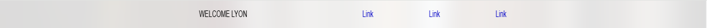
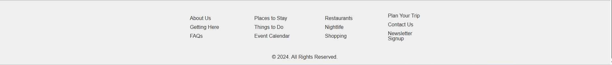
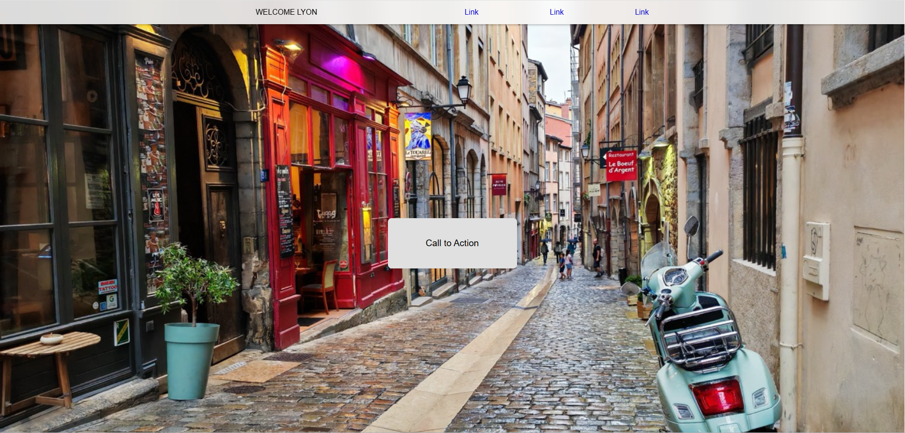
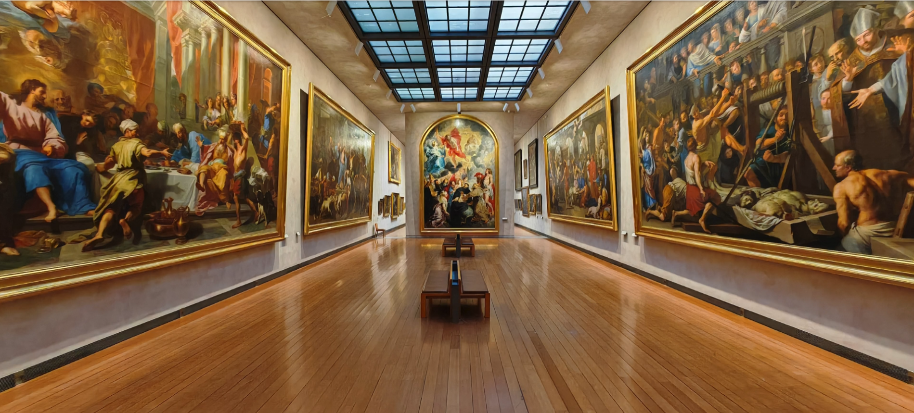
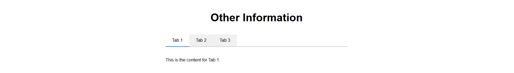
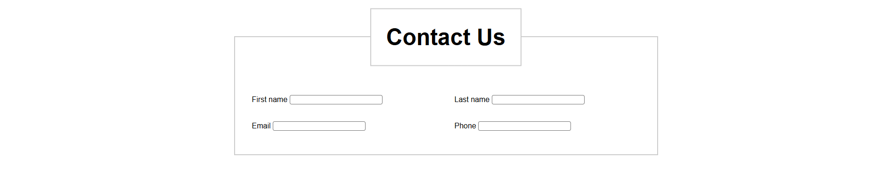
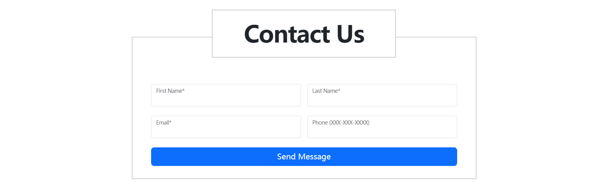

# Project 11 Comprehensive Project – Lyon Tourism Page (Section F)

## Content Guide
After studying the contents of the previous five chapters in depth, it is believed that beginners have mastered HTML5-related tags, CSS3 style properties, layout and typesetting, as well as advanced CSS3 techniques. To consolidate what has been learned in a timely and effective manner, this project will use the basic knowledge covered in the first five chapters to develop a comprehensive website project – the Lyon Tourism Page. The project consists of nine modules: website header, call-to-action section, scenic spots on the map, video playback, basic information, latest events, information tabs, contact form, and footer.

## Learning Objectives
- ① Use knowledge of common HTML tags, hyperlinks, images, lists, tables, forms and multimedia to build the webpage structure.
- ② Use knowledge of CSS selectors, common styles, positioning, floating and other properties to complete the webpage style design.

#### 11.1 Grading Summary

| No. | Sub-criterion | Marks |
| --- | --- | --- |
| 1 | Responsive loading | 2.25 |
| 2 | Video playback | 2.0 |
| 3 | Design and layout implementation | 2.75 |
| 4 | Effects | 3.0 |
| 5 | Accessibility | 2.5 |
| 6 | Labels | 1.0 |

#### 11.2 Project Introduction
This project requires developing a tourism information page for global visitors, showcasing tourist attractions, cultural events, and more in Lyon. The website consists of nine modules: header, call-to-action section, map attractions, video playback, basic information, latest events, information tabs, contact form, and footer.
The Lyon tourism page includes text, images, hyperlinks, lists, forms, navigation, and other content. In terms of styling and layout, it features various designs such as page layout and positioning, font effects, image carousel effects, and image zoom effects. This allows learners to comprehensively apply the knowledge they have learned through hands-on practice and achieve the comprehensive project objectives of this textbook.

#### 11.3 Requirement Analysis
The Lyon tourism page is divided into nine major modules, including the website header, call-to-action section, map attractions, video playback, basic information, latest events, information tabs, contact form, and footer. The functional description of each module is as follows.
The project function structure diagram is shown in Figure 7-1.


_Figure 6-1 Function Structure Diagram_

#### 1. Lyon Tourism Page
The Lyon tourism page includes common effects such as images, text, layout, and hyperlinks, as well as elements like video playback and font effects. It is the page with the most complete effects and functions in the comprehensive project.

##### (1) Header and Call-to-Action Section
The header must remain fixed at the top when scrolling, with a frosted glass effect. The call-to-action section displays a background cover image, with a call-to-action button at the center. The button features a mouse-following hover effect and a glowing border effect.

##### (2) Map Attractions
This module implements focus effects, shadow effects, zoom effects, focus effects, light gradient effects, etc.

##### (3) Video Playback
This module mainly includes video playback functions: the video auto-plays when scrolling into view and auto-pauses when out of view.

##### (4) Basic Information and Latest Events
This module is implemented using inline elements, text decoration elements, and button control styling. The latest events section features focus effects, shadow effects, zoom effects, focus effects, light gradient effects, etc.

##### (5) Contact Form
This module mainly includes forms, form controls, and buttons to implement the contact form.

##### (6) Footer
The footer mainly contains text, implemented with hyperlinks, lists, and style settings.

#### 11.4 Page Design

### 11.4.1. Directory Structure
The project is named “module_f”, and its resource folders are shown in Table 7-1 below.

**Table 6-1 Resource Folder Contents**

| No. | Directory &amp; Main Filename | Files Included | Description |
| --- | --- | --- | --- |
| 1 | assets/css | bootstrap-5.3.3.min.css | Core Bootstrap framework CSS file |
| 2 |  | main.css | Custom style file |
| 3 | assets/images | (Image resources) | Image resource folder |
| 4 | assets/js | bootstrap.min.js | Bootstrap dynamic plugins |
| 5 | assets/video | (Video resources) | Video resource folder |
| 6 | index.html | Lyon tourism page |  |

### 11.4.2 Design Concept

##### (1) Navigation and Footer
The navigation and footer sections are consistent across all pages and can be designed and produced separately.
①Navigation is implemented using sequential layout and hyperlinks, as shown in Figure 7-2.


_Figure 6-2 Website Navigation_
②Footer information is displayed in a centered layout, as shown in Figure 6-3.


_Figure 6-3 Footer Display_

##### (2) Call-to-Action Section
The call-to-action section consists of a header, navigation with frosted glass effect, cover image, call-to-action button, and button hover effect, as shown in Figure 6-4.


_Figure 6-4 Call-to-Action_

##### (3) Map Attractions Section
The map attractions section includes a static graphic on the right and three attraction cards on the left. It features focus effects, box-shadow effects, zoom effects, offset, blur, opacity effects, focus effects, and gradient effects, as shown in Figure 6-5.


_Figure 6-5 Map Attractions_

##### (4) Video Playback Section
The video playback section includes video loading, auto-play when in view, auto-pause when out of view, auto-play when 50% visible, pause when the page is inactive, and resume playback when the page becomes visible again, as shown in Figure 6-6.


_Figure 6-6 Video Playback_

##### (5) Basic Information and Latest Events Section
The basic information and latest events module includes layout design, focus effects, box-shadow effects, zoom effects, offset, blur, opacity effects, focus effects, and gradient effects, as shown in Figure 6-7.


_Figure 6-7 Service Brief_

##### (6) Information Tabs
The information tabs module uses custom elements to implement tabs that switch on mouse click, using aria-selected, aria-hidden, and aria-labelledby to display corresponding tab titles and content, as shown in Figure 6-8.


_Figure 6-8 Information Tabs_

##### (7) Contact Form
The contact form module includes the provided fields: first name, last name, contact email address, and contact phone number, as shown in Figure 6-9.


_Figure 6-9 Contact Form_

#### 11.5 Project Implementation
Task 1 Frosted Glass Navigation

#### Step 1: Create the directory structure as follows:
module_f: Project Root Directory
├─assets: Directory for images and videos
├─js: Directory for JavaScript files
├─css:Directory for style files
├─bootstrap-5.3.3.min.css
├─main.css
├─images:Directory for image resources
├─video:Directory for video resources
├─index.html:Entry webpage file

#### Step 2: Create a new HTML page named index.html. After creation, change the page title to "Welcome Lyon". The code is as follows:

```html
<!DOCTYPE html>
<html lang="en">
<head>
<!-- Meta Tags -->
<meta charset="UTF-8" />
<meta name="viewport" content="width=device-width, initial-scale=1.0" />
<title>Welcome Lyon</title>
<!-- Links -->
</head>
<body>
</body>
</html>
```

#### Step 3: Edit the index.html file, create an assets folder, and create the css, images, js, and video folders separately under the assets folder. Place the bootstrap-5.3.3.min.css core file in the css folder, and create the main.css file at the same time. Place the bootstrap.min.js core file in the js folder, and import the corresponding files in the index.html file. The code is as follows:

```html
<link rel="stylesheet" href="./assets/css/bootstrap-5.3.3.min.css">
<link rel="stylesheet" href="./assets/css/main.css">
<script src="./assets/js/bootstrap.min.js"></script>
```

#### Step 4: Create the main.css style file under css/main.css, and add the following code:

```css
/* reset */
* {
margin: 0;
padding: 0;
box-sizing: border-box;
}
body {
letter-spacing: -0.025em;
overflow-x: hidden;
}
img, video {
object-position: center;
object-fit: cover;
}
/* common */
picture > * {
width: 100%;
}
.container {
padding: 0;
width: 890px;
}
h2 {
font-weight: bold;
font-size: 60px;
letter-spacing: -0.03em;
text-align: center;
}
section {
padding-top: 45px;
padding-bottom: 45px;
}
```

#### Step 5: Edit the index.html file and add the webpage logo and navigation section. The code is as follows:

```html
<!-- header -->
<header>
<div class="container d-flex align-items-center justify-content-between">
<h1>WELCOME LYON</h1>
<nav>
<a href="#cta">Link</a>
<a href="#cta">Link</a>
<a href="#cta">Link</a>
</nav>
</div>
</header>
```

#### Step 6: Create the main.css style file at the path css/main.css and add the following code:

```css
/* sections */
/* Header */
header {
position: sticky;
left: 0;
right: 0;
top: 0;
padding: 1rem 0;
backdrop-filter: blur(10px);
background: rgba(255, 255, 255, .7);
z-index: 999;
}
header a {
text-decoration: none;
color: blue;
}
header h1 {
font-size: 1rem;
margin-bottom: 0;
}
header nav {
width: 50%;
display: flex;
align-items: center;
justify-content: space-between;
}
header nav a {
padding: 0 1rem;
}
```

#### Step 7: Run the index.html file to check the effect.


Task 2 Call to Action

#### Step 1: Edit the index.html file and wrap all the body content with the &lt;main&gt;&lt;/main&gt; tag. The code is as follows:

```html
<!-- main -->
<main>
<!-- Call to Action -->
<section id="cta">
...
</section>
<!-- Map Attractions -->
<section id="map" class="container">
...
</section>
<!-- video -->
<section class="video">
...
</section>
<!-- Essential Information | Latest Events -->
<div class="container">
...
</div>
<!-- Other Information -->
<section id="other" class="container">
...
</section>
<!-- Contact Us -->
<section id="contact" class="container">
...
</section>
</main>
```

#### Step 2: Edit the index.html file and add the call to action section. The code is as follows:

```html
<!-- Call to Action -->
<section id="cta">
<picture class="bgImage">
<source srcset="./assets/images/cover.jpg" media="(min-width: 760px)">
<source srcset="./assets/images/cover-low-res.jpg" media="(max-width: 760px)">

</picture>
<button class="ctaBtn btn  btn-lg cta-btn">
<span class="inner">Call to Action</span>
<span class="light"></span>
</button>
</section>
```

#### Step 3: Add the following code to the main.css file (path: css/main.css):

```css
/* Call to Action Section */
#cta {
padding: 0;
}
#cta .bgImage {
width: 100%;
height: 100vh;
}
#cta .bgImage img {
height: 100vh;
}
#cta .ctaBtn {
position: absolute;
left: 50%;
top: 50%;
transform: translate(-50%, -50%);
width: 280px;
height: 110px;
padding: 3px;
border-radius: 10px;
border: none;
transition: .3s;
display: flex;
--location-x: 0;
--location-y: 0;
overflow: hidden;
}
#cta .ctaBtn:hover {
transform: translate(-50%, -50%) scale(1.1);
}
#cta .ctaBtn .inner {
display: flex;
justify-content: center;
align-items: center;
width: 100%;
height: 100%;
border-radius: inherit;
background: #e1e1e1;
z-index: 2;
position: relative;
font-weight: bold;
}
#cta .ctaBtn .light {
position: absolute;
left: var(--location-x);
top: var(--location-y);
width: 300px;
aspect-ratio: 1/1;
border-radius: 50%;
background: #ff6200;
filter: blur(100px);
transform: translate(-50%, -50%);
}
```

#### Step 4: Run the index.html file to preview the effect.


Task 3 Map Attractions

#### Step 1: Edit the index.html file and add the map attractions section. The code is as follows:

```html
<!-- Map Attractions -->
<section id="map" class="container">
<h2>Map Attractions</h2>
<div class="mapContainer">
<picture class="w-100">
<source srcset="./assets/images/lyon-map.jpg" media="(min-width: 760px)">
<source srcset="./assets/images/lyon-map-low-res.jpg" media="(max-width: 760px)">

</picture>
<div class="row">
<div class="col-6">
<div class="cardContainer" >
<!-- card list -->
<div class="row">
<div class="col-6">
<article class="photoCard">
<div class="card photoBox">
<picture>
<source srcset="./assets/images/attraction-a.jpg"
media="(min-width: 760px)">
<source srcset="./assets/images/attraction-a-low-res.jpg"
media="(max-width: 760px)">

</picture>
</div>
<h3 class="title"><a href="">Parc de la Tete d'Or</a></h3>
</article>
</div>
<!-- The structure is the same as other cards -->
</div>
</div>
</div>
<div class="col-6 position-relative">
<div class="spot spot-a"></div>
<div class="spot spot-b"></div>
<div class="spot spot-c"></div>
</div>
</div>
</div>
</section>
```

#### Step 2: Add the following code to the main.css file located at css/main.css:

```css
/* Map Attractions Section */
#map {
padding: 0;
}
#map h2 {
margin: 90px 0;
font-size: 80px;
}
#map .mapContainer {
position: relative;
}
#map .mapContainer > picture {
position: absolute;
left: 0;
right: 0;
top: 0;
bottom: 0;
z-index: -1;
}
#map .mapContainer > picture img {
height: 100%;
object-position: left bottom;
}
#map .cardContainer > .row {
--bs-gutter-x: 2rem;
--bs-gutter-y: 2rem;
}
#map .cardContainer {
padding: 2rem;
}
#map .spot {
position: absolute;
width: 30px;
height: 37px;
}
#map .spot-a {
background: url("../images/a.png") center/cover;
left: 80%;
top: 7%;
}
#map .spot-b {
background: url("../images/b.png") center/cover;
top: 40%;
left: 50%;
}
#map .spot-c {
background: url("../images/c.png") center/cover;
top: 3%;
left: 24%;
}
#map .photoCard {
height: 180px;
}
/* Common card design */
.photoCard {
border-radius: 3px;
padding: 5px;
background: #ffffff;
transition: .3s;
}
.photoCard:hover {
transform: scale(1.05);
box-shadow: 0 5px 5px rgba(0, 0, 0, .3);
}
.photoCard picture {
aspect-ratio: 4/3;
}
.photoCard .title {
font-size: 1.3rem;
}
.photoCard .title a {
color: inherit;
text-decoration: none;
}
.photoCard .photoBox {
position: relative;
overflow: hidden;
}
.photoCard .photoBox::after {
content: "";
width: 3rem;
height: 150%;
position: absolute;
transform-origin: top;
transform: rotate(15deg) translate(-100%, -20px);
left: 0;
top: 0;
background: linear-gradient(rgba(255, 255, 255, .8), rgba(255, 255, 255, .2));
transition: .4s;
}
.photoCard:hover .photoBox::after {
left: 100%;
transform: rotate(15deg) translate(100%, -20px);
}
```

#### Step 3: Run the index.html file to check the effect.


Task 4 Video Playback

#### Step 1: Edit the index.html file and add the video playback section. The code is as follows:

```html
<!-- video -->
<section class="video">
<video autoplay muted>
<source src="./assets/video/lyon.mp4" />
</video>
</section>
```

#### Step 2: Add the following code to the main.css file (path: css/main.css):

```css
/* video */
#video {
padding-bottom: 0;
}
#video video {
width: 100%;
}
```

#### Step 3: Run the index.html file to check the effect.


Task 5 Basic Information and Latest Events

#### Step 1: Edit the index.html file and add the basic information and latest events section. The code is as follows:

```html
<!-- Essential Information | Latest Events -->
<div class="container">
<div class="row">
<div class="col-6">
<!-- Essential Information -->
<section id="information">
<h2>Essential Information</h2>
<ul>
<li>Contact: 04 72 10 30 30</li>
<li>Address: Mairle de Lyon, 69205 Lyon cedex 01</li>
</ul>
<button id="readIt" type="button">Read it Loud</button>
</section>
</div>
<div class="col-6">
<!-- Latest Events -->
<section id="events">
<h2>Latest Events</h2>
<div class="listContainer" id="eventListBox">
<div class="listWrapper">
<article class="photoCard">
<div class="card photoBox">
<picture>
<source srcset="./assets/images/latest-events-images/worldskills-2024-p.jpg"
media="(min-width: 760px)">
<source                        srcset="./assets/images/latest-events-images/worldskills-2024-p-low-res.png"
media="(max-width: 760px)">

</picture>
</div>
<div class="card-body">
<h5 class="card-title">Lyon accueille la finale mondiale des Worldskills 2024</h5>
</div>
</article>
<!-- The structure is the same as other cards -->
</div>
</div>
</section>
</div>
</div>
</div>
```

#### Step 2: Add the following code to the main.css file at the path css/main.css:

```css
/* Essential Information */
#information ul {
list-style: none;
padding-left: 0;
margin-top: 2rem;
}
#information ul li {
margin-bottom: 1rem;
}
#information #readIt {
background: #023399;
color: #fff;
border-radius: .5rem;
border: none;
padding: 1rem 1.5rem;
}
/* Events */
#events h2 {
margin-bottom: 2rem;
}
#events .listWrapper {
display: flex;
flex-wrap: nowrap;
width: min-content;
padding-bottom: 1rem;
}
#events .listContainer {
border: 1px solid #aaa;
border-radius: 5px;
padding: 1rem;
overflow-x: scroll;
}
#events .photoCard {
width: 220px;
}
```

#### Step 3: Run the index.html file to check the effect.


Task 6 Information Tabs

#### Step 1: Edit the index.html file and add the information tabs section. The code is as follows:

```html
<!-- Other Information -->
<section id="other" class="container">
<h2>Other Information</h2>
<div class="tabBox">
<!-- Bootstrap Tabs Structure -->
<ul class="nav nav-tabs" role="tablist">
<li class="nav-item" role="presentation">
<button class="nav-link active" id="tab1-tab" data-bs-toggle="tab" data-bs-target="#tab1" type="button" role="tab" aria-controls="tab1"
aria-selected="true">Tab 1</button>
</li>
<li class="nav-item" role="presentation">
<button class="nav-link" id="tab2-tab" data-bs-toggle="tab" data-bs-target="#tab2" type="button"
role="tab" aria-controls="tab2" aria-selected="false">Tab 2</button>
</li>
<li class="nav-item" role="presentation">
<button class="nav-link" id="tab3-tab" data-bs-toggle="tab" data-bs-target="#tab3" type="button"
role="tab" aria-controls="tab3" aria-selected="false">Tab 3</button>
</li>
</ul>
<div class="tabContents">
<div class="tab-pane fade show active" id="tab1" role="tabpanel" aria-labelledby="tab1-tab">
This is the content for Tab 1.
</div>
<div class="tab-pane fade" id="tab2" role="tabpanel" aria-labelledby="tab2-tab">
This is the content for Tab 2.
</div>
<div class="tab-pane fade" id="tab3" role="tabpanel" aria-labelledby="tab3-tab">
This is the content for Tab 3.
</div>
</div>
</div>
</section>
```

#### Step 2: Add the following code to the main.css file located at css/main.css

```css
/* custom tag */
#other [role="tablist"] {
border-bottom: 2px solid #cccccc;
display: flex;
}
#other [role="tablist"] [role="tab"] {
padding: .5rem 1rem;
position: relative;
border: none;
}
#other [role="tablist"] [role="tab"][aria-selected="true"] {
background: #fff;
}
#other [role="tablist"] [role="tab"][aria-selected="true"]::after {
content: "";
position: absolute;
left: 0;
right: 0;
bottom: 0;
height: 2px;
background: #0a53be;
}
#other [role="tablist"] [role="tab"][aria-selected="false"] {
background: #eeeeee;
}
#other .tabContents [role="tabpanel"] {
padding: 2rem;
}
#other .tabContents [role="tabpanel"][aria-hidden="true"] {
display: none;
}
```

#### Step 3: Run the index.html file to check the effect.


Task 7 Contact Form

#### Step 1: Edit the index.html file and add the contact form section. The code is as follows:

```html
<!-- Contact Us -->
<section id="contact" class="container">
<div class="title">
<h2>Contact Us</h2>
</div>
<form class="needs-validation" novalidate>
<div class="row g-3 gy-4">
<!-- First Name -->
<div class="col-md-6">
<div class="form-floating">
<input type="text" id="contact_first_name" class="form-control" required>
<label for="contact_first_name" class="form-label">First Name*</label>
<div class="invalid-feedback">Please enter your name</div>
</div>
</div>
<!-- Last Name -->
<div class="col-md-6">
<div class="form-floating">
<input type="text" id="contact_last_name" class="form-control" required>
<label for="contact_last_name" class="form-label">Last Name*</label>
<div class="invalid-feedback">Please enter your last name</div>
</div>
</div>
<!-- Email -->
<div class="col-md-6">
<div class="form-floating">
<input type="email" id="contact_email" class="form-control" required>
<label for="contact_email" class="form-label">Email*</label>
<div class="invalid-feedback">Please enter a valid email address</div>
</div>
</div>
<!-- Phone -->
<div class="col-md-6">
<div class="form-floating">
<input type="tel" id="contact_phone" class="form-control"
pattern="[0-9]{3}-[0-9]{3}-[0-9]{4}">
<label for="contact_phone" class="form-label">Phone (XXX-XXX-XXXX)</label>
<div class="invalid-feedback">Please enter a valid phone number format</div>
</div>
</div>
</div>
<!-- Submit button -->
<div class="d-grid mt-4">
<button type="submit" class="btn btn-primary btn-lg">Send Message</button>
</div>
</form>
</section>
```

#### Step 2: Add the following code to the main.css file at the path css/main.css:

```css
/* Contact Us */
#contact {
margin-bottom: 50px;
}
#contact .title {
display: flex;
justify-content: center;
}
#contact .title h2 {
padding: 1.5rem 5rem;
border: 2px solid #cfcfcf;
background: #fff;
transform: translateY(50%);
}
#contact form {
border: 2px solid #cfcfcf;
padding: 120px 3rem 2rem;
}
```

#### Step 3: Run the index.html file to check the effect.


Task 7 Footer Information

#### Step 1: Edit the index.html file and add the footer information section. The code is as follows:

```html
<!-- Footer -->
<footer>
<div class="container">
<nav class="row gx-0">
<ul class="col-3">
<li><a href="#cta">About Us</a></li>
<li><a href="#cta">Getting Here</a></li>
<li><a href="#cta">FAQs</a></li>
</ul>
<ul class="col-3">
<li><a href="#cta">Places to Stay</a></li>
<li><a href="#cta">Things to Do</a></li>
<li><a href="#cta">Events Calendar</a></li>
</ul>
<ul class="col-3">
<li><a href="#cta">Restaurants</a></li>
<li><a href="#cta">Nightlife</a></li>
<li><a href="#cta">Shopping</a></li>
</ul>
<ul class="col-3">
<li><a href="#cta">Plan Your Trip</a></li>
<li><a href="#cta">Contact Us</a></li>
<li><a href="#cta">Newsletter<br>Signup</a></li>
</ul>
</nav>
</div>
<p class="copyright">&copy; 2024. All Rights Reserved.</p>
</footer>
```

#### Step 2: Add the following code to the main.css file (path: css/main.css):

```css
/* Footer */
footer {
margin-top: 80px;
padding-top: 50px;
background: #ededed;
border-top: 4px solid #cccccc;
}
footer nav ul {
list-style: none;
}
footer nav ul li {
margin-bottom: .5rem;
line-height: 1.2;
}
footer nav a {
text-decoration: none;
color: #555;
}
footer .copyright {
text-align: center;
margin-bottom: 0;
padding-bottom: .5rem;
color: #555;
margin-top: 1rem;
}
```

#### Step 3: Run the index.html file to check the effect.


Part 4 Every JavaScript Developer Should Have Their Own Library
