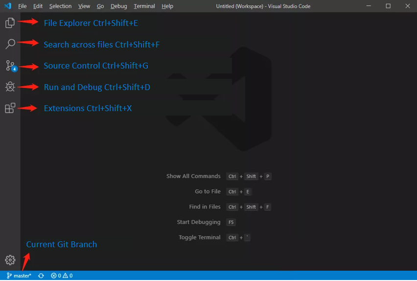
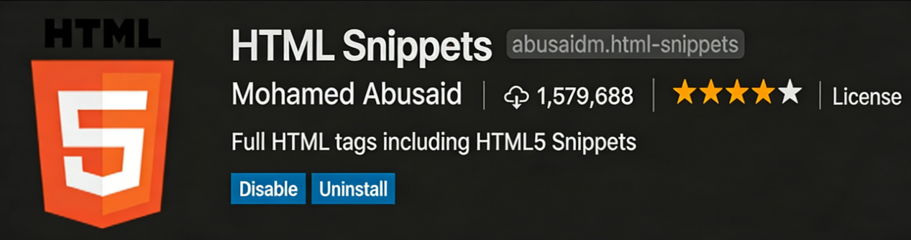
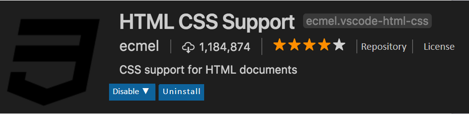
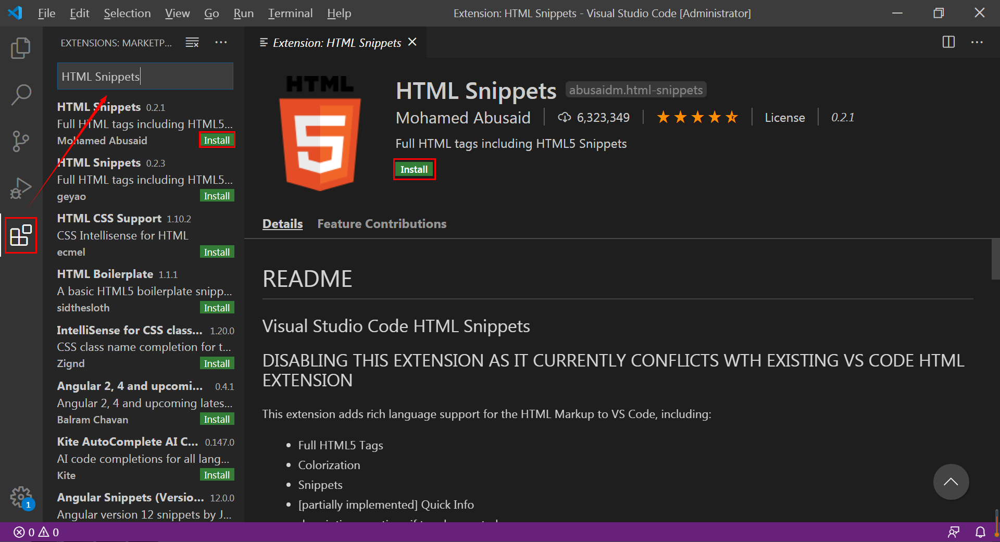

# Project 12 Introduction to JavaScript — Building a Solid Foundation for High-Quality Programming

## Content Guide
This project focuses on the JavaScript knowledge system, covering two key modules: basic concepts and development practice.
In the basic concepts module, we will trace the origin and development of JavaScript, analyze its operating mechanisms in different runtime environments, and systematically sort out its fundamental syntax, including core points such as variables, data types, and operators, helping to build a comprehensive basic understanding of JavaScript.
In the development practice module, centering on the Web Technology competition event of the WorldSkills Competition, we will systematically organize the full-process technology stack for Web development. Combining competition requirements and industry practices, the "basic theory + case-driven + hands-on practice" model provides an excellent learning and growth opportunity for WorldSkills competitors. During preparation, participants need to conduct in-depth research on various aspects of JavaScript and master its core technologies and best practices.

## Learning Objectives
- ① Understand the origin and development of JavaScript.
- ② Understand the characteristics of JavaScript.
- ③ Understand the composition of JavaScript.
- ④ Master the methods of using scripts on web pages.
- ⑤ Be familiar with JavaScript development tools.
- ⑥ Understand the Chrome DevTools Console.

## Task 12.1 Introduction to JavaScript

### 12.1.1 Getting to Know JavaScript
JavaScript is currently the most popular scripting language on the Internet. With its powerful dynamic interaction capabilities and wide range of application scenarios, it has become an indispensable key technology in numerous competition events.
From the perspective of diversified technical competitions in the WorldSkills Competition, an in-depth understanding of JavaScript reveals that it is the core scripting language for building dynamic web pages and interactive applications. Featuring dynamic typing, prototype-based object orientation, event-driven architecture, and asynchronous programming, JavaScript enables rich interactive effects in web front-end development, boosts development efficiency when used with front-end frameworks, and supports full-stack development by integrating back-end technologies via Node.js. It is a crucial skill that competitors in WorldSkills-related events must master and study in depth.

#### 1. Origin and Development of JavaScript
JavaScript was created in 1995 by Netscape Communications to enhance web page interactivity as a lightweight scripting language. Originally named LiveScript, it was later renamed JavaScript for joint promotion with Sun Microsystems’ Java language. Despite the similar name, the two languages are fundamentally different in design and purpose.
With the rapid development of the Internet, JavaScript has continuously evolved. From early use in simple form validation and page visual effects, it has grown into a core technology for building complex web applications, and its development history reflects the tremendous transformation of web technologies. Web technology events in the WorldSkills Competition also keep pace with this trend, requiring competitors to master the latest JavaScript features such as classes, modules, and arrow functions introduced in ES6+ to meet increasingly complex development demands.

#### 2. Core Features

##### (1) Dynamic Typing and Flexibility
JavaScript is a dynamically typed language where variable types are determined at runtime, making code writing more flexible. Competitors can leverage this feature in the WorldSkills Competition to quickly implement various dynamic effects without declaring variable types in advance as in statically typed languages. For example, in a real-time data display project, JavaScript can easily handle different data types to achieve dynamic data updates and visual presentation.

##### (2) Prototype-Based Object-Oriented Programming
Unlike traditional class-based object-oriented programming languages, JavaScript uses a prototype-based object-oriented model. This model provides more flexible inheritance and extension mechanisms for objects, allowing competitors to implement code reuse and modular design through prototype chains. In software development projects of the WorldSkills Competition, reasonable object design and prototype inheritance help build efficient, maintainable code structures and improve development efficiency.

##### (3) Event-Driven and Asynchronous Programming
JavaScript is a typical event-driven language that realizes user interaction by listening to and handling various events (such as mouse clicks, keyboard inputs, and page loading). Meanwhile, JavaScript’s asynchronous programming model (including callback functions, Promise, and async/await) allows competitors to handle time-consuming operations (such as network requests and file reading/writing) without blocking program execution. In web application development for the WorldSkills Competition, asynchronous programming is key to handling complex business logic and improving user experience.

#### 3. Application Fields

##### (1) Web Front-End Development
In WorldSkills web technology events, JavaScript serves as the core technology for implementing dynamic web page interaction. By manipulating the DOM (Document Object Model) and BOM (Browser Object Model), competitors can create diverse user interfaces and interactive effects. Combined with HTML5 and CSS3, JavaScript supports responsive web design that adapts to displays on different devices and screen sizes.

##### (2) Application of Front-End Frameworks and Libraries
As web development grows more complex, a variety of front-end frameworks and libraries have emerged. In the WorldSkills Competition, competitors must be proficient in mainstream front-end frameworks (such as React, Vue, and Angular) and libraries (such as jQuery). These tools provide efficient and convenient development methods to help quickly build large-scale web applications. For instance, React enables component-based development to improve code maintainability and reusability, while jQuery simplifies DOM operations and AJAX requests to boost efficiency.

##### (3) Integration with Back-End Technologies
In WorldSkills software development projects, JavaScript is not limited to front-end development but can integrate with back-end technologies. Using the Node.js platform, JavaScript runs on the server side to support full-stack development. Competitors can use Node.js to build high-performance web servers that handle concurrent requests and database operations. Combined with frameworks like Express, they can rapidly develop RESTful APIs to provide data support for the front end. This integrated front-end and back-end development model is gaining increasing importance in the competition, requiring competitors to possess comprehensive technical capabilities and cross-domain knowledge.

### 12.1.2 Setting Up a JavaScript Development Environment
Since its release, JavaScript has been highly popular among developers. To develop JavaScript code and view the corresponding results, two tools are required: a code editor and a web browser. This section will guide you through setting up a JavaScript development environment.

#### 1. Visual Studio Code
Visual Studio Code, abbreviated as VS Code, is a free and open-source front-end code editor. It supports syntax highlighting, intelligent code completion, custom hotkeys, code comparison and other features for almost all mainstream development languages. It also supports plugin extensions and is optimized for web development and cloud application development. It offers many powerful features and numerous plugins, and is easy to install.

##### (1) Software Introduction
The software can be downloaded from the official VS Code website. After installation, the icon is shown in Figure 12-1 below.


_Figure 12-1 Visual Studio Code Icon_
The interface after launching is shown in Figure 12-2.


_Figure 12-2 Visual Studio Code running interface_

##### (2) Commonly used plugins
HTML Snippets plugin: Provides basic H5 code snippets and hints for beginners, as shown in Figure 12-3.


_Figure 12-3 HTML Snippets Plugin_
HTML CSS Support plugin: Provides intelligent class name suggestions for HTML tags based on supported styles in the current project, as shown in Figure 12-4.


_Figure 12-4 HTML CSS Support Plugin_
Plugin installation is shown in Figure 12-5:


_Figure 12-5 Plugin installation method_

#### 2. Chrome Browser
Chrome is a browser developed by Google. It is powerful and stable, and is widely used for front-end development, as shown in Figure 12-6:


_Figure 12-6 Chrome Browser_

#### 3. JavaScript Placement
To use JavaScript code in HTML, we need to place it inside the script tag, as shown below:

```html
<script>
// Write JavaScript statements here
</script>
```

The script tag can be placed inside the head section of the page, and is often placed just before the closing body tag. Examples are shown below.

```html
<!DOCTYPE html>
<html lang="en">
<head>
<meta charset="UTF-8">
<meta name="viewport" content="width=device-width, initial-scale=1.0">
<title>Document</title>
<script>
// The script tag can be placed in the head section
</script>
</head>
<body>
<script>
// It can also be placed in the body section
</script>
</body>
</html>
```

#### 4. Ways to Import JavaScript
JavaScript code can be written separately in a .js file and then imported into the page using the script tag. For example:

```html
<script src="script/index.js"></script>
```

You can also use the src attribute to import an online JavaScript library file. For example:

```html
<script src="http://www.xxx.com/script/jquery.js"></script>
```

If you import files using the src attribute, it is recommended to place the import statements inside the head tag.
