# Project 13 Basic JavaScript Syntax
--- Great Things Come from Small Beginnings

## Content Guide
This project systematically teaches basic JavaScript syntax through five progressive tasks. Although the programming journey starts with the first Hello, World!, the excitement goes far beyond that. Beginning with simple programs, learners will gradually master the basic code format and core syntax rules, including common input and output statements (such as console.log()), heading tag manipulation, and commenting standards for single-line // and multi-line /* */ comments.
Taking the Mini Speed Test project in Module A of the WorldSkills Competition Web Technology as a practical scenario, this project integrates syntax elements such as variable declaration, conditional judgment, and loop control into interactive function development. Through tasks including dynamic timing and key response, it strengthens DOM operation and event handling capabilities, ultimately achieving an integrated improvement of both syntax application and engineering practice abilities.

## Learning Objectives
- ① Master the definition of variables.
- ② Master JavaScript data types.
- ③ Master conditional statements and loop statements.
- ④ Master the use and definition of functions.

## Task 13.1 The Programming Journey Begins with the First "Hello, World!", But the Excitement Goes Far Beyond That

### 13.1.1 Task Description
In the introductory stage of JavaScript programming, when you first write console.log("Hello, World!"); in the editor and press the run button, the long-dormant code will be activated in the browser console.
It is not only ceremonial code for verifying that the development environment is ready, but also allows beginners to intuitively experience the interaction between code and reality through instant feedback in the browser console.
After mastering DOM manipulation, with just a simple click, you can make a button do the robot dance, put funny sunglasses on a cat picture, and make it wiggle its hips to the music. What is this if not programming? It is clearly directing a wonderful life with code.
The effect of the example is shown in Figure 13-1.
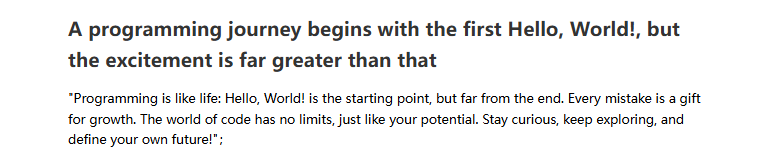

_Figure 13-1 The Programming Journey Begins with the First "Hello, World!", But the Excitement Goes Far Beyond That_

### 13.1.2 Knowledge Preparation

#### 1. Output Statements and Comments
In previous content, we have learned a lot of basic knowledge about JavaScript. Every language has its corresponding output and input statements. Below we will learn relevant knowledge in JavaScript.

##### (1) Common Input and Output Statements
① document.write
This statement outputs content into the web page.

```html
<script src="script/index.js"></script>
// "Today's efforts are tomorrow's strength! Keep it up, you're the best!" Output on the webpage
document.write("Today's efforts are tomorrow's strength! Keep it up, you're the best!");
// document.write can recognize tags, the content output below will be displayed as an h2 tag structure on the webpage
document.write("<h2>When your code fails to run, don't lose heart. It's just a small episode on the road to success. Take it as a learning opportunity, adjust your mindset, and start again.</h2>");
```

② alert
This statement pops up a dialog box with an OK button.

```
alert("You are standing at the starting point of your programming growth, about to embark on a magnificent transformation. The initial learning phase may make you feel uncomfortable, but this is an inevitable part of growth. Every challenge is an opportunity for transformation; when you successfully overcome difficulties, you will find yourself becoming stronger and stronger. Define your programming life with growth!");
```

③ confirm
This statement pops up a dialog box containing OK and Cancel buttons.

```css
const confirm1 = confirm("It's said that 99% of programmers have shaky hands when writing 'Hello World' for the first time.\n\nBut 100% of them become experts later!\n\nAre you ready to go from 'shaky hands' to 'keyboard hero'?");
if (confirm1) {
alert("Let's go! Open your password box!");
} else {
alert("A little secret: If you run away now, you'll regret it in the future~");
}
```

④console.log
This statement outputs content to the console.

```js
console.log("Hello World! Code is like coffee—bitter at first sip, yet sweet in aftertaste.");
```

Press the F12 key in Chrome to open the console, find the Console tab, and you can see the content printed by console.log, as shown in Figure 13-2.
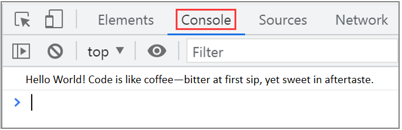

_Figure 13-2 Console output result_

#### 2.Code Comments
（1）Single-line Comment

```html
<script>
// Single-line comment
//console.log("Hmph, rookie");
</script>
（2）Multi-line Comment
<script>
/*Multi-line comment*/
/*
This is a multi-line comment
alert("Hello World! Hmph, rookie.\n\nDon't think printing this sentence is easy —\n\nThis is your first conversation with the computer, and it's secretly evaluating your IQ.\n\nBut don't be afraid, all experts started showing off with 'Hello World'.\n\nNow, study hard for me! You'll come back to thank this sentence in three years!");
*/
</script>
```

#### 3.Variables

##### (1) In JavaScript, variables can be used directly without declaration.

##### (2) Variables start with let or var, followed by the variable name.

##### (3) In JavaScript, variable names are case-sensitive. A JavaScript variable is a container for storing data.

```html
<script>
var a;//Declare a variable
a="Effort may not lead to immediate success, but lack of effort will definitely result in failure; every effort you make is accumulating luck for the future";//Assign a value to the variable
var b = 10;//Initialize a variable
var lastName = "Doe",age=30,job="carPenter";
var x,y,z=1;
console.log(a,b);
console.log(lastName,age,job);
console.log(x,y,z);
</script>
```

#### 4.Variable Naming Rules

##### (1) Names can contain letters, numbers, underscores, and dollar signs.

##### (2) Names must begin with a letter.

##### (3) Names can also start with and.​
(4)Case−sensitive:JavaScriptvariablenamesarecase−sensitive.Forexample,name and $Name are two different variables.

##### (5) Reserved words (such as JavaScript keywords) cannot be used as variable names.

##### (6) For multi-word variable names, you can use camelCase or connect multiple words with an underscore.

### 13.1.3 Task Implementation
Life is like a journey, which is divided into the following three steps, as detailed below.

#### Step 1: Create an HTML page.

```html
<!DOCTYPE html>
<html lang='zh-CN'>
<head>
<meta charset='UTF-8'>
<meta name='viewport' content='width=device-width, initial-scale=1.0'>
<title>Dynamic Life Title</title>
<!-- Style Construction -->
</head>
<body>
</body>
</html>
```

#### Step 3: Run the index.html file to view the effect.

```html
<!DOCTYPE html>
<html lang='zh-CN'>
<head>
<meta charset='UTF-8'>
<meta name='viewport' content='width=device-width, initial-scale=1.0'>
<title>Dynamic Life Title</title>
<style>
body {
font-family: 'Microsoft YaHei', sans-serif;
max-width: 800px;
margin: 0 auto;
padding: 20px;
line-height: 1.6;
}
.title {
color: #333;
margin-bottom: 10px;
}
</style>
</head>
<body>
</body>
<script>
document.write(`
<h2 class='title'>A programming journey begins with the first Hello, World!, but the excitement is far greater than that</h2>
<div class='content'>
<p>"Programming is like life: Hello, World! is the starting point, but far from the end. Every mistake is a gift for growth. The world of code has no limits, just like your potential. Stay curious, keep exploring, and define your own future!"；
</p>
</div>`)
</script>
</html>
```

#### Step 3: Run the index.html file to view the effect.

## Task 13.2 The Wonderful Blend of Numbers and Strings: The Mystery of '1' + '1' = '11'

### 13.2.1 Task Description
Among JavaScript data types, when numbers wear the "cloak" of strings, the + operator quietly turns into a "concatenation expert"!
For example, with '1' + '1', when these two string partners meet, the + sign is no longer dull arithmetic addition, but a "master of concatenation". It directly combines the two 1s into a new string '11'.
At this moment, the real number 2 stamps its feet in anger: "I’m clearly the correct answer!" But the plus sign laughs and says: "In the world of strings, we only join for fun, not for calculation!"
The page effect is shown in Figure 13-3.
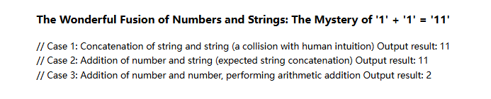

Figure 13‑3 The Wonderful Blend of Numbers and Strings

### 13.2.2 Knowledge Preparation

#### 1. Data Types
JavaScript is a weakly typed language, which means you do not need to specify a data type when creating a variable; you can assign a value directly. However, variables themselves do have types. JavaScript data types are divided into two categories: value types and reference types.
Value types (also called primitive types):String, Number, Boolean, Undefined, Null.
Reference data types:Object, Array, Function.

#### 2. Basic Types

##### (1) String
A string is a piece of text enclosed in single or double quotes. For example:

```js
let str1 = "Effort may not bring immediate success, but a lack of effort will definitely lead to failure; every effort you make is accumulating luck for the future";
let str2 = "Life is like a cup of tea—it won't be bitter for a lifetime, but it will be bitter for a while";
```

##### (2) Boolean
The Boolean type, also known as logical type, is one of the most commonly used types in JavaScript. It has only two values: true and false. These are special values.

```js
let flag = true;
let mark = false;
```

##### (3) Number
The Number type includes integers and floating-point numbers. For example:

```js
let num1 = 28;
let num2 = 3.1415;
```

##### (4) Infinity
When a number used in JavaScript is larger than the maximum value JavaScript can represent,JavaScript will output it as Infinity, meaning infinity. If a number is smaller than the minimum value JavaScript can represent, it will also output Infinity.

##### (5) NaN
Short for "not a number". It usually results from arithmetic operations mixing numbers and non-numbers. You can use the isNaN() function to check whether a result is NaN.

```js
console.log('Hahaha' - 123);    // NaN (Not a Number)
console.log('abc' * 20);        // NaN (Not a Number)
isNaN('haha');     // true, it is not a number
isNaN(123);        // false, it is a number
```

##### (6) Undefined
When a variable is declared but not assigned a value, its default value is undefined. For example:

```js
let myHeight;
```

Only the variable myHeight is declared, but no value is assigned. At this point, the value stored in myHeight is undefined.

##### (7) Null
The value null represents an empty value, used to indicate an object that does not yet exist. When a variable is declared but not assigned any value, or when attempting to return an object that does not exist, the value will be null.
In fact, undefined is derived from null, so JavaScript treats them as equal. For example:

```js
let a;
console.log(a); // a is declared but not assigned a value, so it's undefined
let b = null;
console.log(a == b); // Returns true
```

Although the two values are equal, their meanings are different:undefined means a variable is declared but not assigned;null means the variable has been explicitly assigned an empty value.

#### 3.Data Type Conversion
Data type conversion refers to converting one data type to another. It is common to convert data to string type, numeric type, or Boolean type.

##### (1) Convert to String Type
There are three ways to convert to a string:

| Method | Example |
| --- | --- |
| toString() | let flag = true;flag.toString() |
| String() | let num = 10; String(num) |
| + | let PI = 3.14; PI + '' |

**Table 13-1**
The + operator is used for string concatenation. Any numeric type concatenated with a string using + will be implicitly converted to a string.

##### (2) Convert to Numeric Type
It is common to convert numeric strings to numeric types, such as '10', '123', '3.1415'.
There are four ways to convert to a number:

| Method | Example |
| --- | --- |
| parseInt | parseInt('123'); parseInt('-108'); |
| parseFloat | parseFloat('3.14'); |
| Number | Number('86400'); |
| -、*、/ | '123' - 0;  '123' * 1; '123' / 1 |

Conversion using the -, *, / operators is called implicit conversion.

```js
// Numeric strings can be directly converted to numeric type
console.log(parseInt('123'));
console.log(parseInt('-308'));
console.log(parseFloat('3.14'));
// Convert using the Number function
console.log(Number('123'));
console.log(Number('3.14'));
// Implicit conversion
console.log('123' - 0)
console.log('123' * 1)
console.log('123' / 1)
```

##### (3) Convert to Boolean Value
There is only one method to convert to a Boolean value: Boolean()
Numeric and string values will be converted to true
Empty strings and 0 will be converted to false
undefined, null, and NaN will be converted to false

```js
// Non-empty strings and numeric types are converted to true
console.log(Boolean('Xiao Bai')); // true
console.log(Boolean(12));    // true
console.log(Boolean(3.14));  // true
// Empty strings and 0 are converted to false
console.log(Boolean(''));    // false
console.log(Boolean(0));     // false
// Others are converted to false
console.log(Boolean(NaN));   // false
console.log(Boolean(null));  // false
console.log(Boolean(undefined)); // false
```

#### 4. Variable Operations

##### (1) Determine the Type of a Variable
Basic format:
The function is_integer() checks whether a variable is an integer.
The function is_string() checks whether a variable is a string.
The function is_double() checks whether a variable is a floating-point number.
The function is_array() checks whether a variable is an array.

##### (2) Get the Type of a Variable
Basic format:

```
gettype(variable) gets the type of the variable
```

#### 5.String Extensions
ES6 has enhanced support for Unicode and extended the string object. In practical applications, template strings are commonly used. A template string is an enhanced version of a string, identified by backticks ( `). It can be used as a regular string, to define multi-line strings, or to embed variables within a string.
We can understand template strings by comparing them with traditional string definitions:

```js
// Traditional JavaScript uses the + operator to concatenate strings
var str =
```

"&lt;h1&gt;Commonly Used Technologies for Frontend Development&lt;/h1&gt;" +
"&lt;ul&gt;" +
"&lt;li&gt;HTML5&lt;/li&gt;" +
"&lt;li&gt;CSS3&lt;/li&gt;" +

```html
"</ul>";
```

The above syntax is quite cumbersome and inconvenient. ES6 introduced template strings to solve this problem:

```html
var str =`
<h1>Commonly Used Technologies for Frontend Development</h1>
<ul>
<li>HTML5</li>
<li>CSS3</li>
</ul>
```

`
Template strings support line breaks conveniently without using the + operator for concatenation. If you need to insert variables, you can wrap the variable with ${ }.

```js
let myName = `Xue'er`; // Use backticks
let age = 18;
let str = `${myName}'s age is ${age}`;  // Xue'er's age is 18
console.log(str);
```

The running result of the above code is shown in Figure 13-4:
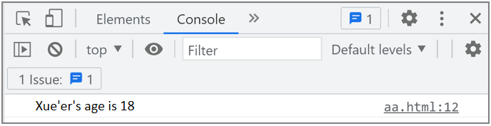

_Figure 13-4 Output result using variables in template strings_

### 13.2.3 Task Implementation
The wonderful fusion of numbers and strings: The mystery of '1' + '1' = '11' is divided into the following three steps, as detailed below.

#### Step 1: Create an HTML page

```html
<!DOCTYPE html>
<html lang='zh-CN'>
<head>
<meta charset='UTF-8'>
<meta name='viewport' content='width=device-width, initial-scale=1.0'>
<title>The secret of '1' + '1' = '11'</title>
</head>
<body>
</body>
</html>
```

#### Step 2: Output the mystery of '1' + '1' = '11' using JavaScript

```html
<!DOCTYPE html>
<html lang='zh-CN'>
<head>
<meta charset='UTF-8'>
<meta name='viewport' content='width=device-width, initial-scale=1.0'>
<title>{$this->title}</title>
<style>
body {
font-family: 'Microsoft YaHei', sans-serif;
max-width: 800px;
margin: 0 auto;
padding: 20px;
line-height: 1.6;
}
.title {
font-size: 2.5em;
color: #333;
text-align: center;
margin-bottom: 10px;
}
.subtitle {
font-size: 1.2em;
color: #666;
text-align: center;
margin-bottom: 30px;
}
.author {
text-align: right;
font-style: italic;
color: #888;
}
</style>
</head>
<body>
<script>
let result1 = '1' + '1'; // Concatenation of string and string;
let result2 = 1 + '1'; // Human: This should be '11'!
let result3 = 1 + 1; // Human: This should be 2!
document.write(`<div class='content'>
<h3>The Wonderful Fusion of Numbers and Strings: The Mystery of '1' + '1' = '11'</h3>
<p>
// Case 1: Concatenation of string and string (a collision with human intuition)
Output result: ${result1}</br>
// Case 2: Addition of number and string (expected string concatenation)
Output result: ${result2} </br>
// Case 3: Addition of number and number, performing arithmetic addition
Output result: ${result3}
</p >
</div >`)
</script>
</body>
</html>
```

#### Step 3: Run the index.html file to view the effect

## Task 13.3 Age Calculator: Time Travel Using Arithmetic Operators

### 13.3.1 Task Description
Age Calculator: Time Travel Using Arithmetic Operators. Operators and variables are essential components of any programming language. An operator is a symbol that performs a specific operation on one or more operands, also known as an operation symbol. We will understand operators through practical project examples. The page effect is shown in Figure 13-5.
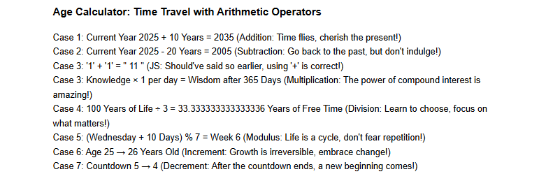

Figure 135 Age Calculator: Time Travel Using Arithmetic Operators

### 13.3.2 Knowledge Preparation

#### 1. Arithmetic Operators
Arithmetic operators in JavaScript include addition +, subtraction -, multiplication *, division /, modulus %, increment ++, and decrement --, as shown in Table 13‑1:
Table 13‑1 Arithmetic Operators

| Arithmetic Operator | Example | Description |
| --- | --- | --- |
| + | a = 1 + 1 | Addition |
| - | a = 1 - 1 | Subtraction |
| * | a = 2 * 3 | Multiplication |
| / | a = 8 / 2 | Division |
| % | a = 11 % 2 | Modulus (remainder) |
| ++ | a++ | Increment |
| -- | a-- | Decrement |

Another function of + is string concatenation.

```js
var a = 10;
var b = 'abc';
console.log(a + b);//10abc
The ++ and -- operators increase or decrease a variable by 1 respectively.
var a = 10;
a++;                // The variable a is incremented by 1 here, becoming 11
console.log(a);     // The output value is 11
var b = 20;
b--;                // The variable b is decremented by 1 here, becoming 19
console.log(b);     // The output value is 19
```

Prefix and Postfix:Increment and decrement operators can be placed before or after a variable.
a++: ++ after the variable is called postfix increment. Return first, then calculate.
++a: ++ before the variable is called prefix increment. Calculate first, then return.

```js
var a = 10;
console.log(a++);   // 10, returns the value of a first for console output, then increments a
console.log(++a);      // 12, increments a first, then outputs the value
```

#### 2. String Operators
In JavaScript, the + sign has two meanings:When used between numbers, it performs arithmetic addition;It acts as a string concatenation operator.
It returns a new string formed by joining its left and right operands. This operator can concatenate not only two strings but also a string with any scalar value, always resulting in a new string.
Assignment Operators
Assignment operators are used to assign values to variables. They are binary operators, where the left operand must be a variable and the right operand can be an expression. Common operators include: =, +=, -=, *=, /=, %=, as shown in Table 13-2:

**Table 13-2 Assignment Operators**

| Assignment Operator | Example | Equivalent To |
| --- | --- | --- |
| = | x = y | x = y |
| += | x += y | x = x + y |
| -= | x -= y | x = x - y |
| *= | x *= y | x = x * y |
| /= | x /= y | x = x / y |
| %= | x %= y | x = x % y |


```js
var a = 10;     // Assignment operator
// Equivalent to a = a + 5; calculate a + 5 first, then assign the result to a
a += 5;
// Equivalent to a = a - 2; calculate a - 2 first, then assign the result to a
a -= 2;
```

#### 4. Comparison Operators
Comparison operators, also known as relational operators, are used to compare the operands on both sides of the operator. The result of the operation is a Boolean value.Comparison operators include: &gt;, &lt;, &gt;=, &lt;=, ==, !=, ===, !==, as shown in Table 13-3:

**Table 13-3 Comparison Operators**

| Comparison Operator | Example | Description |
| --- | --- | --- |
| == | A==b | Equal to |
| === | A===b | Strict equal (same value and same type) |
| != | A!=b | Not equal to |
| !== | A!==b | Strict not equal (different value or different type) |
| &gt; | A&gt;b | Greater than |
| &lt; | A&lt;b | Less than |
| &gt;= | A&gt;=b | Greater than or equal to |
| &lt;= | A&lt;=b | Less than or equal to |

#### 4. Logical Operators
Logical operators are used to determine whether a condition is "true" or "false".
The operands of logical operators can only be Boolean values, and the result after evaluation is also a Boolean value.
The operators include: AND (&amp;&amp;), OR (||), NOT (!), as shown in Table 13‑4:
Table 13‑4 Logical Operators

| Logical Operators | Example | Equivalent To |
| --- | --- | --- |
| &amp;&amp; | a == 1 &amp;&amp; b == 1 | Logical AND (and) |
| \|\| | a == 1 \|\| b == 1 | Logical OR (or) |
| ！ | !a | Logical NOT (opposite) |

### 13.3.3 Task Implementation
Age Calculator: Time Travel Using Arithmetic Operators is divided into the following three steps, as detailed below.

#### Step 1: Create an HTML page.

```html
<!DOCTYPE html>
<html lang='zh-CN'>
<head>
<meta charset='UTF-8'>
<meta name='viewport' content='width=device-width, initial-scale=1.0'>
<title>Age Calculator: Time Travel with Arithmetic Operators</title>
</head>
<body>
</body>
</html>
```

#### Step 2: Output the age calculator using JavaScript.

```html
<!DOCTYPE html>
<html lang='zh-CN'>
<head>
<meta charset='UTF-8'>
<meta name='viewport' content='width=device-width, initial-scale=1.0'>
<title>{$this->title}</title>
<style>
body {
font-family: 'Microsoft YaHei', sans-serif;
max-width: 800px;
margin: 0 auto;
padding: 20px;
line-height: 1.6;
}
.title {
font-size: 2.5em;
color: #333;
text-align: center;
margin-bottom: 10px;
}
.subtitle {
font-size: 1.2em;
color: #666;
text-align: center;
margin-bottom: 30px;
}
.author {
text-align: right;
font-style: italic;
color: #888;
}
</style>
</head>
<body>
<script>
// Case 1: Addition (+) — Accumulation of Time
let years = 2025;
let future_years = years + 10;
// Case 2: Subtraction (-) — Rewinding Memories
let past_years = years - 20;
// Case 3: Explicit String Concatenation (Correct Usage)
let result4 = '1' + '1'; // Human: This is what I wanted!
// Case 3: Multiplication (*) — The Miracle of Compound Interest
let knowledge = 1;
knowledge *= 365; // Learn a little every day
// Case 4: Division (/) — Choices in Life
let time = 100; // Assume life spans 100 years
let free_time = time / 3; // One-third is free time
// Case 5: Modulus (%) — Wisdom of Cycles
let days_in_week = 7;
let today = 3; // Assume today is Wednesday
let next_week = (today + 10) % days_in_week;
// Case 6: Increment (++) — Steps of Growth
let age = 25;
// Case 7: Decrement (--) — Meaning of Countdown
let countdown = 5;
document.write(`
<div class='content'>
<h3>Age Calculator: Time Travel with Arithmetic Operators</h3>
<p>
```

Case 1: Current Year ${years} + 10 Years = ${future_years} (Addition: Time flies, cherish the present!)&lt;/br&gt;
Case 2: Current Year ${years} - 20 Years = ${past_years} (Subtraction: Go back to the past, but don't indulge!)&lt;/br&gt;
Case 3: '1' + '1' = "  ${result4}  " (JS: Should've said so earlier, using '+' is correct!)&lt;/br&gt;
Case 3: Knowledge × 1 per day = Wisdom after ${knowledge} Days (Multiplication: The power of compound interest is amazing!)&lt;/br&gt;
Case 4: 100 Years of Life ÷ 3 = ${free_time} Years of Free Time (Division: Learn to choose, focus on what matters!)&lt;/br&gt;
Case 5: (Wednesday + 10 Days) % 7 = Week ${next_week} (Modulus: Life is a cycle, don't fear repetition!)&lt;/br&gt;
Case 6: Age ${age} →  ${++age} Years Old (Increment: Growth is irreversible, embrace change!)&lt;/br&gt;
Case 7: Countdown  ${countdown--}   →   ${countdown}   (Decrement: After the countdown ends, a new beginning comes!)\n

```html
</p>
</div>
`)
</script> </body>
</html>
```

#### Step 3: Run the index.html file to view the effect.

## Task 13.4 Weather Forecaster: Intelligent Dialogue Between Conditional Statements and API Data

### 13.4.1 Task Description
Weather Forecaster: Intelligent Dialogue Between Conditional Statements and API Data. This project demonstrates how to use conditional statements to handle different weather scenarios, and provide personalized advice based on conditions such as temperature and weather conditions. Different conditional branches are triggered according to different user questions. The page effect is shown in Figure 13-6.
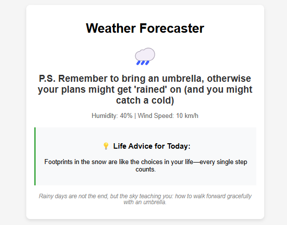

Figure 13‑6 Weather Forecaster

### 13.4.2 Knowledge Preparation

#### 1.if...else Statement
The if...else statement is called a branching structure. This structure requires conditional judgment and executes code based on the result.

##### (1) Using if alone
Basic format:

```html
<!DOCTYPE html>
if (condition) {
code block
}
When the result of the if conditional expression is true, the code block inside {} is executed.
let a = 10;
if(a >= 10){
console.log('ok');
}
```

In the example above, the result of the condition a &gt;= 10 in the if statement is false, so the print code inside the curly braces is executed; otherwise, it is not executed.

#### 2. Using if with else

```
if (condition) {
code block 1;
} else {
code block 2;
}
```

If the result of the conditional expression in the if statement is true, the code inside the if block is executed; if the result is false, the code inside the else block is executed.

```js
let username = 'castle';
if(username == 'admin'){
console.log('ok');
}else{
console.log('error');
}
```

In the example above, the result of username == 'admin' is false, so the code in the else block is executed and "error" is printed to the console. If the result is true, the code in the if block is executed instead.

#### 3. if...else if...else Structure

```
if (condition) {
code block 1;
} else if (condition) {
code block 2;
} else if (condition) {
code block 3;
} else {
code block n;
}
```

In this way, a multi-level if statement can be created. Once one condition is satisfied, the remaining conditions will not be evaluated. If none of the previous conditions are met, the final else block will be executed.

#### 4. Ternary Operator
Syntax structure of the ternary operator:
condition ? statement1 : statement2
Execution flow of the ternary expression:
First evaluate the condition. If the result is true, execute statement1 and return its result; if false, execute statement2 and return its result.

```js
let username = 'castle';
if(username == 'admin'){
console.log('ok');
}else{
console.log('error');
}
```

In real development, ternary expressions are often used to replace simple if...else structures. Example:

```js
let flag = true;
if(flag){
a=1;
}else{
a=0
}
```

The if...else structure above is simple and can be simplified using the ternary operator:

```js
let flag = true;
let a == flag ? 1 : 0;
```

#### 5.switch
The switch statement is another branching structure that executes different code blocks based on the value of an expression.

```css
switch (expression) {
case value1:
code block 1;
break;
case value2:
code block 2;
break;
...
case valuen:
code block n;
break;
default:
default code block;
}
```

In the switch structure, the expression is first evaluated, then matched against the case values. When a match is found, the corresponding code is executed until a break statement is encountered. If none of the case values match, the code in the default block is executed.

```css
let tmp = 3;
switch(tmp) {
case 0:
console.log('This is 0000');
break;
case 1:
console.log('This is 1111');
break;
case 2:
console.log('This is 2222');
break;
case 3:
console.log('This is 3333');
break;
default:
console.log('No matches found at all');
}
```

The variable tmp is initialized to 3. The switch statement matches tmp with case 3, so "This is 3333" is printed to the console.If tmp is changed to 0, "This is 0000" is printed.
If tmp is changed to 6, none of the cases match, so the default code runs and prints "No matches found at all".

### 13.4.3 Task Implementation
The Weather Forecaster: Intelligent Dialogue Between Conditional Statements and API Data is divided into the following three steps, as detailed below.

#### Step 1: Create an HTML page.

```html
<!DOCTYPE html>
<html lang='zh-CN'>
<head>
<meta charset='UTF-8'>
<meta name='viewport' content='width=device-width, initial-scale=1.0'>
<title>Weather Forecast</title>
</head>
<body>
</body>
</html>
```

#### Step 2: Embed JavaScript code.

```html
<!DOCTYPE html>
<html lang='zh-CN'>
<head>
<meta charset='UTF-8'>
<meta name='viewport' content='width=device-width, initial-scale=1.0'>
<title>Weather Forecast</title>
<style>
body {
font-family: 'Arial', sans-serif;
max-width: 600px;
margin: 0 auto;
padding: 20px;
background-color: #f5f5f5;
}
.weather-card {
background: white;
border-radius: 10px;
padding: 20px;
box-shadow: 0 4px 8px rgba(0, 0, 0, 0.1);
text-align: center;
}
.weather-icon {
font-size: 48px;
margin: 10px 0;
}
.temp {
font-size: 24px;
font-weight: bold;
color: #333;
}
.details {
color: #666;
margin: 15px 0;
}
.advice {
margin-top: 20px;
padding: 15px;
border-left: 4px solid #4CAF50;
background-color: #f8f9fa;
}
.footer {
margin-top: 20px;
font-style: italic;
color: #888;
font-size: 0.9em;
}
</style>
</head>
<body>
<div class="weather-card">
<h1>Weather Forecaster</h1>
<div class="weather-icon">🌧️</div>
<div class="temp" id="temp"></div>
<div class="details">
```

Humidity: 40% |
Wind Speed: 10 km/h

```html
</div>
<div class="advice">
<h3>💡 Life Advice for Today:</h3>
<p>Footprints in the snow are like the choices in your life—every single step counts.</p>
</div>
<div class="footer">
<p>Rainy days are not the end, but the sky teaching you: how to walk forward gracefully with an umbrella.</p>
</div>
</div>
<script>
let city = "Rainy";
let citys = "";
switch (city) {
case 'Sunny':
citys = 'Current Weather: <span style="text-transform: capitalize;">$city</span><br>'
citys = 'Temperature: 30°C'
break;
case 'Rainy':
citys = "P.S. Remember to bring an umbrella, otherwise your plans might get 'rained' on (and you might catch a cold)\n";
break;
case 'Cloudy':
citys = "P.S. Cloudy days are perfect for pondering life's big questions—like: What should I have for lunch?\n";
break;
case 'Thunderstorm':
citys = "P.S. If you hear thunder, that's the weather jamming to rock music\n";
break;
}
let temps = document.getElementById("temp");
temps.innerHTML = citys;
</script>
</body>
</html>
```

#### Step 3: Run the index.html file to view the effect.

## Task 13.5 The Problem: How Long Does It Take a Frog to Jump Out of a Well

### 13.5.1 Task Description
The problem of how long it takes a frog to jump out of a well contains the content we need to learn. We simulate the frog’s daily jumping process using loops. To solve this problem, we must master the for loop in JavaScript for fixed-step iteration scenarios. The page effect is shown in Figure 13-7.
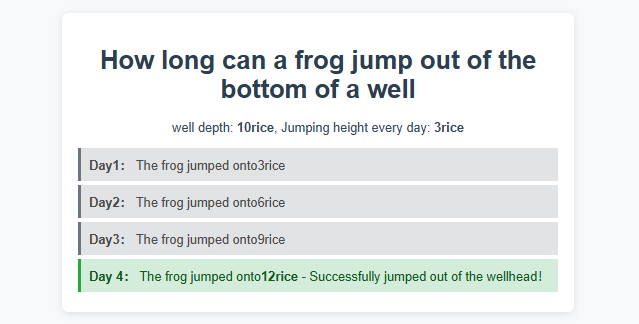

_Figure 13-7 The Problem: How Long Does It Take a Frog to Jump Out of a Well_

### 13.5.2 Knowledge Preparation

#### 1. for Loop
If you want to run the same code over and over again, you can use a loop.
Basic format:

```
for (assignment expression; condition; increment/decrement expression) {
code block
}
```

The assignment expression initializes a variable to control the starting point of the loop.
The result of the condition expression must be true or false. When the result is true, the code block inside the curly braces is executed; when false, the loop ends.
The increment/decrement expression sets the increase or decrease of the variable.
Example 1: Output 100 asterisks on the page.

```js
for(let i = 0;i < 100; i++){
document.wirte('*');
}
```

The variable i in the example above can also be used inside the loop. This variable can be used to write more versatile code.
Example 2: Output numbers from 1 to 100

```js
for(let i = 1; i <= 100;i++){
console.log(i);
}
值Example 3: Calculate the sum from 1 to 50
let sum = 0;
for(let i = 1;i <= 50;i++){
Sum += i;
}
console.log(sum);
```

#### 2.While
Unlike the for loop, which creates a variable and sets constraints directly, the while loop is more suitable for situations where the number of executions is unknown in advance. As long as the condition is true, the while loop will keep executing the code block.
Its basic syntax is as follows:
Basic format:

```
while (condition) {
code block;
}
```

It evaluates the condition first and then executes. The JavaScript statements run when the condition is true, and the loop exits when the condition becomes false.

```js
let i = 0;
while (i < 10) {
console.log('The number is ' + i);
i++;
}
```

### 13.5.3 Task Implementation
The problem of how long it takes a frog to jump out of a well is divided into the following three steps, as detailed below.

#### Step 1: Create an HTML page.

```html
<!DOCTYPE html>
<html lang='zh-CN'>
<head>
<meta charset='UTF-8'>
<meta name='viewport' content='width=device-width, initial-scale=1.0'>
<title>Frog jumping well simulation</title>
</head>
<body>
</body>
</html>
```

#### Step 2: Embed the JavaScript code.

```html
<!DOCTYPE html>
<html lang='zh-CN'>
<head>
<meta charset='UTF-8'>
<meta name='viewport' content='width=device-width, initial-scale=1.0'>
<title>Frog jumping well simulation</title>
<style>
body {
font-family: 'Arial', sans-serif;
background-color: #f8f9fa;
margin: 0;
padding: 20px;
}
.container {
max-width: 600px;
margin: 0 auto;
background-color: white;
padding: 20px;
border-radius: 8px;
box-shadow: 0 2px 10px rgba(0, 0, 0, 0.1);
}
h1 {
color: #2c3e50;
text-align: center;
margin-bottom: 20px;
}
</style>
</head>
<body>
<div class="container">
<h1>How long can a frog jump out of the bottom of a well</h1>
<div id="welldata"></div>
</div>
<script>
// How long can a frog jump out of the bottom of a well
let wellDepth = 10;    // Well depth of 10 meters
let jumpHeight = 3;    // Jump 3 meters every day
let position = 0;  // Initial position at the bottom of the well
let wellstr = "";
wellstr = `<p style='color: #34495e; text-align: center;'>well depth: <strong>${wellDepth}rice</strong>, Jumping height every day: <strong>${jumpHeight}rice</strong></p>`;
for (let days = 1; position < wellDepth; days++) {
position += jumpHeight;
// Set different styles based on whether they jump out of the wellhead or not
if (position >= wellDepth) {
wellstr += "<div style='padding: 10px; margin: 5px 0; background-color: #d4edda; color: #155724; border-left: 4px solid #28a745;'>";
wellstr += `<strong>Day ${days}：</strong> The frog jumped onto<strong>${position}rice</strong> - Successfully jumped out of the wellhead！`;
wellstr += "</div>";
} else {
wellstr += "<div style='padding: 10px; margin: 5px 0; background-color: #e2e3e5; color: #4a4a4a; border-left: 4px solid #6c757d;'>";
wellstr += `<strong>Day${days}：</strong> The frog jumped onto${position}rice`;
wellstr += "</div>";
}
}
document.getElementById('welldata').innerHTML = wellstr
</script>
</body>
</html>
```

#### Step 3: Run the index.html file to view the effect.

## Task 13.6 Array Sorting Rules for "Music Chart"

### 13.6.1 Task Description
The music chart example covers the content we need to learn. Through this music chart case, we understand the application of arrays, retrieve data via arrays, and display the song rankings (1st to 5th places), song names and artist information. To implement a music chart, you need to master the application of arrays in JavaScript. The page effect is shown in Figure 13-8.
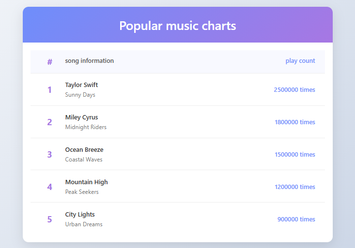

_Figure 13-8 Music Chart_

### 13.6.2 Knowledge Preparation

#### 1. Declaring an Array
An array is used to store multiple pieces of data in a single variable. There are two ways to declare an array in JavaScript: using a literal and using the new keyword.
Basic format:

```js
let arr1 = [1,2,3];
let arr2 = new Array('Mercedes-Benz', 'BMW', 'Audi');
let arr3 = [1, 'BYD', 'Han', true];
```

The first statement declares an array using the literal method, which stores 3 values. The literal method is the most commonly used.
The second statement declares an array using the new keyword, which also stores 3 values.

#### 2. Accessing Array Elements
An array can store multiple pieces of data, each stored in a separate element. Each element has a number called an index (or subscript). Indexes start at 0 and increase sequentially, as shown in Figure 13‑9.
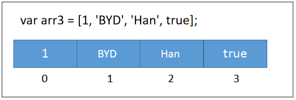

Figure 13‑9 Array Structure
The array arr3 has four elements, so its length is 4.
The first element, at index 0, stores the value 1.
The second element, at index 1, stores the value BYD.
The third element, at index 2, stores the value Han.
The fourth element, at index 3, stores the value true.
You can use the index to find or modify the value of the corresponding element.

```js
console.log(arr3[0]); //1
console.log(arr3[1]); //BYD
console.log(arr3[4]); //undefined
arr3[2] = 'Tang';
arr3[3] = false;
```

The first statement finds the element of arr3 at index 0 and prints it to the console using console.log.
The second statement finds the element of arr3 at index 1 and prints it to the console.
The third statement returns undefined because arr3 has no element at index 4.
The fourth statement finds the element of arr3 at index 2 and changes its value to 'Tang'.
The fifth statement finds the element at index 3 and changes its value to false.

#### 3. Array Traversal
Array traversal means operating on each element in the array one by one.
Example: Output the value of each element in the array

```js
let arr = ['Mercedes-Benz', 'BMW', 'Audi'];
// Original writing
console.log(arr[0]);
console.log(arr[1]);
// Using loop
for (var i = 0; i < arr.length; i++) {
console.log(arr[i]);
}
```

With the traditional method, we must output each element by its index one by one. This is impractical when there are many elements, as it requires a large amount of code. The only repeated action is console.log(arr[x]); everything else is the same except for the changing value of x. This structure is highly suitable for implementation using a loop.
length in arr.length is a property that returns the length of the array. In this example, the array has 3 elements, so its length is 3, and the value of arr.length is 3, which perfectly meets the needs of the loop.

### 13.6.3 Task Implementation
The "Music Chart" task is divided into the following three steps, as detailed below.

#### Step 1: Create an HTML page.

```html
<!DOCTYPE html>
<html lang='zh-CN'>
<head>
<meta charset='UTF-8'>
<meta name='viewport' content='width=device-width, initial-scale=1.0'>
<title>Music Chart</title>
</head>
<body>
</body>
</html>
```

#### Step 2: Embed the JavaScript code.

```html
<!DOCTYPE html>
<html lang='zh-CN'>
<head>
<meta charset='UTF-8'>
<meta name='viewport' content='width=device-width, initial-scale=1.0'>
<title>Music Chart</title>
<style>
body {
font-family: 'Segoe UI', Tahoma, Geneva, Verdana, sans-serif;
background: linear-gradient(135deg, #f5f7fa 0%, #c3cfe2 100%);
margin: 0;
padding: 20px;
min-height: 100vh;
}
.container {
max-width: 800px;
margin: 30px auto;
background: white;
border-radius: 15px;
box-shadow: 0 10px 30px rgba(0, 0, 0, 0.1);
overflow: hidden;
}
h1 {
background: linear-gradient(135deg, #6e8efb, #a777e3);
color: white;
padding: 25px;
margin: 0;
text-align: center;
font-weight: 600;
}
.chart-container {
padding: 20px;
}
.song-item {
display: flex;
align-items: center;
padding: 18px 25px;
border-bottom: 1px solid #eee;
transition: all 0.3s ease;
position: relative;
}
.song-item:last-child {
border-bottom: none;
}
.song-item:hover {
background-color: #f8f9ff;
transform: translateX(10px);
}
.rank {
font-size: 1.4em;
font-weight: bold;
color: #a777e3;
width: 50px;
text-align: center;
}
.song-info {
flex: 1;
padding: 0 15px;
}
.song-title {
font-weight: 600;
margin-bottom: 5px;
color: #333;
}
.song-artist {
color: #777;
font-size: 0.95em;
}
.plays {
width: 150px;
text-align: right;
color: #6e8efb;
font-weight: 500;
}
.play-icon {
margin-right: 12px;
color: #a777e3;
font-size: 1.1em;
}
.chart-header {
display: flex;
padding: 15px 25px;
background-color: #f8f9ff;
font-weight: 600;
color: #555;
border-bottom: 1px solid #eee;
}
</style>
</head>
<body>
<div class="container">
<h1>Top Music Chart</h1>
<div class="chart-container">
<div class="chart-header">
<div class="rank">#</div>
<div class="song-info">Song Info</div>
<div class="plays">Plays</div>
</div>
<div id="song-item">
</div>
</div>
</div>
<script>
let musicList = [
{'title' : 'Taylor Swift', 'artist' : 'Sunny Days', 'plays' : 2500000},
{'title' : 'Miley Cyrus', 'artist' : 'Midnight Riders', 'plays' : 1800000},
{'title' : 'Ocean Breeze', 'artist' : 'Coastal Waves', 'plays' : 1500000},
{'title' : 'Mountain High', 'artist' : 'Peak Seekers', 'plays' : 1200000},
{'title' : 'City Lights', 'artist' : 'Urban Dreams', 'plays' : 900000},
];
let songitemstr = "";
musicList.forEach((item,index) => {
songitemstr += `
<div class="song-item">
<div class="rank">
${index + 1}
</div>
<div class="song-info">
<div class="song-title">
${item.title}
</div>
<div class="song-artist">
${item.artist}
</div>
</div>
<div class="plays">
${item.plays}times
</div>
</div>
`
});
document.getElementById("song-item").innerHTML = songitemstr
</script>
</body>
</html>
```

#### Step 3: Run the index.html file to view the effect.

## Task 13.7 Making a "Simple Calculator" with Functions

### 13.7.1 Task Description
The "Simple Calculator" example covers the content we need to learn. Through this simple calculator project, we understand the declaration and invocation of functions. After the user enters the first number, the second number, and an operator, the result will be displayed on the page. To implement a simple calculator, you need to master the application of functions in JavaScript. The page effect is shown in Figure 13‑10.
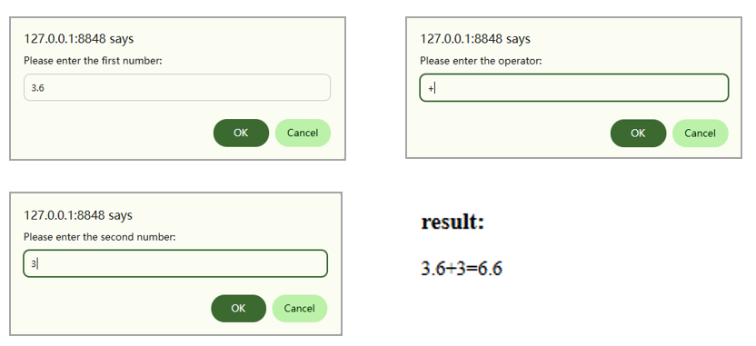

Figure 13‑10 Simple Calculator

### 13.7.2 Knowledge Preparation

#### 1. Function Definition and Invocation
Functions in JavaScript are defined using the function keyword. It is very convenient to use functions to encapsulate key code when a large section of code needs to be reused.
A function can be defined as follows. Once defined, it will not be executed immediately; it will only run when called. The basic syntax for defining a function is as follows:
Basic format:

```js
function functionName([parameter1, parameter2, ...]) {
// JavaScript statements
[return [returnValue];]
}
```

Explanation:

##### (1) function is the keyword for defining a function and is required.

##### (2) Parameter 1, Parameter 2, etc., are the parameters of the function and are optional.

##### (3) The function body is written inside curly braces.

##### (4) The return statement is used to set the return value of the function and is also optional.
Example:

```css
function sayHello(name){
alert('Hello:' + name);
}
```

A function will not execute after it is declared; it must be called when needed.

```
sayHello('Wang Xiaoming');
```

There is another way to declare a function: store the function body in a variable, as shown below:

```js
// Declare a variable to store a function body
let add = function(a, b) {
return a + b;
};
// Calling method
add(10, 20);
```

#### 2. Variable Scope
Scope refers to the area where a variable takes effect. In JavaScript, there are two types: local scope and global scope.

##### (1) Global Scope: Variables declared within a &lt;script&gt; tag are valid across the entire page.

```html
<script>
// Variables declared within a <script> tag are called global variables, which take effect throughout the entire scope of the <script> tag
// Therefore, this variable can also be used directly inside a function
var username = 'admin';
function fn () {
console.log(username);
}
</script>
```

##### (2) Local Scope: Variables declared inside a function body are only valid within that function body.

```js
function myFunc () {
password = "123456";
}
myFunc();
// password is defined inside the myFunc function and is a local variable.
// password cannot be used outside the function body, and the output result here is undefined
console.log(password);
```

### 13.7.3 Task Implementation
The "Simple Calculator" task is divided into the following three steps, as detailed below.

#### Step 1: Create the HTML page.

```html
<!DOCTYPE html>
<html lang='zh-CN'>
<head>
<meta charset='UTF-8'>
<meta name='viewport' content='width=device-width, initial-scale=1.0'>
<title>Simple Calculator</title>
</head>
<body>
</body>
</html>
```

#### Step 2: Embed the JavaScript code.

```html
<!DOCTYPE html>
<html lang='zh-CN'>
<head>
<meta charset='UTF-8'>
<meta name='viewport' content='width=device-width, initial-scale=1.0'>
<title>Simple Calculator</title>
</head>
<body>
<script>
var num1 = prompt('Please enter the first number:');
var opt = prompt('Please enter the operator:');
var num2 = prompt('Please enter the second number:');
function calculate(x, y, opt) {
var result;
switch (opt) {
case '+':
result = parseFloat(x) + parseFloat(y);
break;
case '-':
result = x - y;
break;
case '*':
result = x * y;
break;
case '/':
result = x / y;
break;
}
document.write('<h3>result:</h3>');
document.write(x + opt + y + '=' + result);
}
// call a function
calculate(num1, num2, opt);
</script>
</body>
</html>
```

#### Step 3: Run the index.html file to view the effect.

## Task 13.8 Collaboration of Objects and Functions for "Smart Lighting"

### 13.8.1 Task Description
The "Smart Lighting" case covers the content we need to learn. Brightness adjustment (range 0–100) is realized by dragging the slider and clicking buttons. The system adopts a modular design: the state management module maintains the current brightness value and handles boundary verification; the input control module listens to the real-time input event of the slider and the click event of the buttons to implement continuous adjustment and step adjustment respectively; the UI synchronization module automatically updates the value display and slider position when the state changes, ensuring the three states are consistent. The page effect is shown in Figure 13‑11.
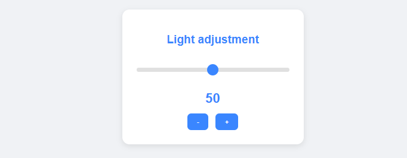

_Figure 13-11 Lighting Control_

### 13.8.2 Knowledge Preparation

#### 1.Basic Objects
An object is a collection of properties and methods used to describe a thing.
For example, to describe a mobile phone product:
A mobile phone has basic parameters such as brand, color, size, and weight, as well as functions like making calls, playing games, listening to music, and watching videos.
Generally, these basic parameters can be represented by properties, and functions can be defined by methods, as shown in Figure 13-12 below:
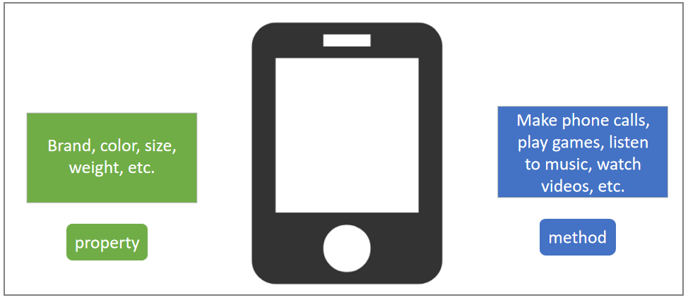

_Figure 13-12 Object_
Another important concept in JavaScript is that everything is an object. This means that everything is an object—strings, arrays, numbers, and so on can all be regarded as objects.
There are three ways to create objects in JavaScript: object literal, new Object(), and constructor functions. We will introduce each of them below.

#### 2. Object Literal

##### (1) Declaring an Object
An object literal is a set of key-value pairs enclosed in curly braces. A key is also called a property name and can be customized. A value is also called a property value and can be any data type.
The following example uses an object to describe a mobile phone product:

```css
let phone = {
brand: 'AIWA',
color: 'Charming Red',
hardware: {
mem: '512G'
},
tel: function (num) {
console.log('Calling ' + num + ' now');
}
};
```

In the example above, the variable phone is declared and assigned an object.
brand, color, hardware on the left side of the object are called property names.
'AIWA', 'Charming Red' on the right side are called property values.
It can be seen that property values can be any data type (note: function is also a data type).

##### (2) Accessing Properties and Methods
There are two ways to access properties and methods:object.propertyName or object['propertyName']

```js
console.log(phone.brand);         // AIWA
console.log(phone['color']);      // Charming Red
console.log(phone.hardware.mem);  // 512G
phone.tel(18612345678);           // When you define a method with formal parameters, you must pass actual arguments when you call it.
```

##### (3) this
Inside an object, to access the object's own properties and methods, you must use the this keyword.

```css
var userInfo = {
username: 'admin',
show: function () {
// The value of the username property in the object is called here, so "this" must be used
console.log('Welcome back, respected administrator: ' + this.username);
}
};
userInfo.show();     // Welcome back, respected administrator: admin
```

##### (4) Constructor Function
A constructor function is a special type of function.Properties and methods can be declared inside a constructor function, but they must be specified with this.
After the constructor function is declared, you need to use the new keyword to instantiate it and create an object.

```js
// Constructor function
function Hero (heroNme, gender, age) {
this.heroName = heroName;
this.gender = gender;
this.age = age;
}
// Instantiate an object using the "new" keyword
var h = new Hero('Jax', 'Male', 30);
console.log(h.heroName);   // Jax
console.log(h.age);        // 30
```

### 13.8.3 Task Implementation
The "Lighting Control" task is divided into the following four steps, as detailed below.

#### Step 1: Create the HTML page.

```html
<!DOCTYPE html>
<html lang='zh-CN'>
<head>
<meta charset='UTF-8'>
<meta name='viewport' content='width=device-width, initial-scale=1.0'>
<title>Living room lighting control</title>
</head>
<body>
</body>
</html>
```

#### Step 2: Build the styles.

```html
<!DOCTYPE html>
<html lang='zh-CN'>
<head>
<meta charset='UTF-8'>
<meta name='viewport' content='width=device-width, initial-scale=1.0'>
<title>Living room lighting control</title>
<style>
body {
background: #f0f2f5;
display: flex;
justify-content: center;
align-items: center;
height: 100vh;
margin: 0;
font-family: Arial, sans-serif;
}
.control-panel {
background: white;
padding: 30px;
border-radius: 15px;
box-shadow: 0 4px 12px rgba(0,0,0,0.1);
text-align: center;
width: 320px;
}
h2 {
color: #3a86ff;
margin-bottom: 20px;
}
.slider {
width: 100%;
height: 8px;
-webkit-appearance: none;
background: #e0e0e0;
border-radius: 4px;
outline: none;
margin: 25px 0;
}
.slider::-webkit-slider-thumb {
-webkit-appearance: none;
width: 24px;
height: 24px;
border-radius: 50%;
background: #3a86ff;
cursor: pointer;
}
.value {
font-size: 28px;
font-weight: bold;
color: #3a86ff;
margin: 15px 0;
}
.btn {
padding: 10px 20px;
border: none;
border-radius: 8px;
background: #3a86ff;
color: white;
font-weight: bold;
cursor: pointer;
margin: 0 5px;
}
.btn:hover {
background: #2a6ddf;
}
</style>
</head>
<body>
<div class="control-panel">
<h2>Living room lighting control</h2>
<input type="range" min="0" max="100" value="50" class="slider"
oninput="document.getElementById('val').textContent=this.value">
<div class="value" id="val">50</div>
<button class="btn" onclick="setBrightness(parseInt(document.getElementById('val').textContent)-10)">-</button>
<button class="btn" onclick="setBrightness(parseInt(document.getElementById('val').textContent)+10)">+</button>
</div>
</body>
</html>
```

#### Step 3: Embed the JavaScript code.

```html
<script>
function setBrightness(value) {
if(value < 0) value = 0;
if(value > 100) value = 100;
document.querySelector('.slider').value = value;
document.getElementById('val').textContent = value;
}
</script>
```

#### Step 4: Run the index.html file to view the effect.

## Task 13.9 Practical Project – Fractal Triangle (Module A)

### 13.9.1 Task Description
In this practical project, you will create a fractal triangle for a mini speed test program.The interface includes a canvas area, a form for entering numbers, and a button.After entering the number of iterations and clicking the button, a fractal image will be drawn.The generated image has an equilateral triangle structure.

### 13.9.2 Effect Display
The effect of the fractal triangle is shown in Figure 13‑13.


Figure 13‑13 Fractal Triangle

### 13.9.3 Task Implementation

#### Step 1: Create the fractal triangle page.
Create a new HTML page named index.html.It contains a canvas area, a form for entering numbers, and a button.Write the page structure.
The code is as follows:

```html
<!DOCTYPE html>
<html lang="en">
<head>
<!-- Meta Tags -->
<meta charset="UTF-8" />
<meta name="viewport" content="width=device-width, initial-scale=1.0" />
<title>Document</title>
</head>
<body>
<canvas width="800" height="800"></canvas>
<input type="number" id="maxNumberInput">
<button onclick="draw()">Draw</button>
</body>
</html>
```

#### Step 2: Style construction.
The code is as follows:

```html
<!DOCTYPE html>
<html lang="en">
<head>
<!-- Meta Tags -->
<meta charset="UTF-8" />
<meta name="viewport" content="width=device-width, initial-scale=1.0" />
<title>Document</title>
<style>
* {
margin: 0;
padding: 0;
box-sizing: border-box;
}
body {
height: 100vh;
background: #dddddd;
display: flex;
align-items: center;
justify-content: center;
}
canvas {
background: #fff;
}
input {
margin-left: 2rem;
}
</style>
</head>
<body>
<canvas width="800" height="800"></canvas>
<input type="number" id="maxNumberInput">
<button onclick="draw()">Draw</button>
</body>
</html>
```

#### Step 3: Clear the canvas and draw the initial large triangle.
The code is as follows:

```html
<script>
const cSize = 800;
function draw(){
const maxCount = document.querySelector("#maxNumberInput").value;
const canvas = document.querySelector("canvas");
const ctx = canvas.getContext("2d");
ctx.clearRect(0, 0, cSize, cSize);
ctx.moveTo(cSize / 2, 0);//top vertex
ctx.lineTo(cSize, cSize);//bottom right vertex
ctx.lineTo(0, cSize);//lower left vertex
ctx.fillStyle = "black";
ctx.fill();//Fill with black background
//Start recursive drawing
ctx.fillStyle = "white";
function repeat(x, y, size, count) {
//Recursion termination condition: Exceeding the maximum number of iterations
if(++count > maxCount) return;
//Draw an inverted small triangle
ctx.beginPath();
ctx.moveTo(x - size / 2, y - size);//apex
ctx.lineTo(x + size / 2, y - size);//upper right vertex
ctx.lineTo(x, y);//lower vertex
ctx.fill();//fill white
//Three-direction recursion (up, left-down, right-down)
repeat(x, y - size, size / 2, count);//above
repeat(x - size/2, y, size / 2, count);//lower left
repeat(x + size/2, y, size / 2, count);//lower right
}
//Start from the bottom center
repeat(cSize / 2, cSize, cSize / 2, 0);
}
</script>
```
