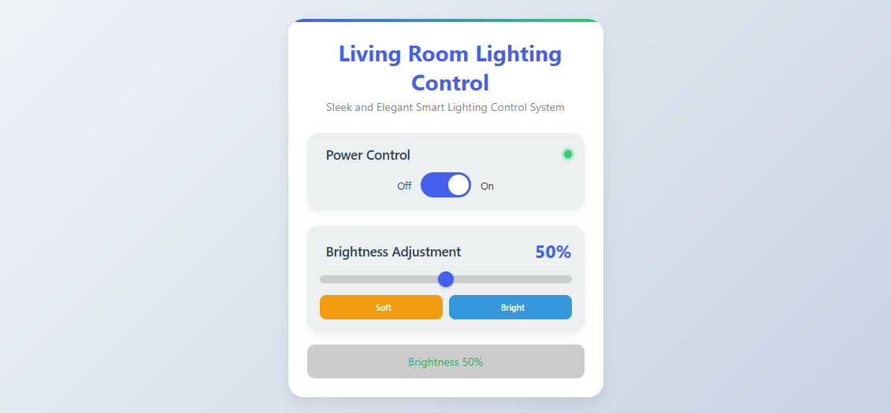
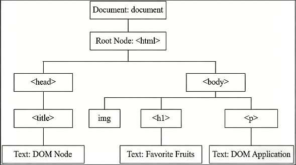
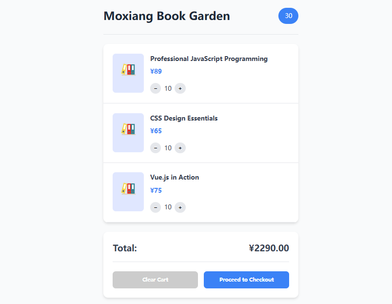
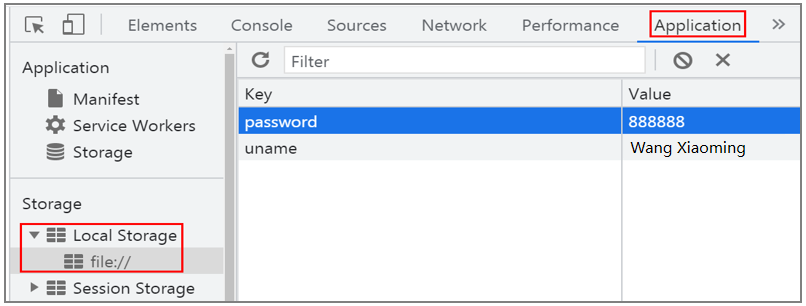
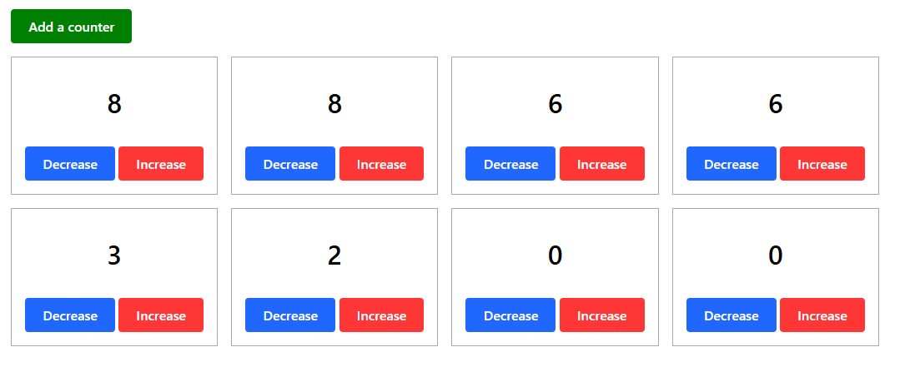

# Project 14 DOM Programming

--- A journey of a thousand miles begins with a single step.

## Content Guide

In the JavaScript section of WorldSkills website technology, DOM programming implements dynamic interaction by manipulating the Document Object Model. Taking the graphics comparison module of the mini speed test project as an example, developers use document.getElementById() or querySelector() to precisely locate DOM elements, dynamically update test data and graphic status through innerHTML / textContent, monitor user operations with addEventListener() to trigger real-time redrawing, and manage style classes using classList.toggle() for visual feedback. Finally, efficient DOM operations ensure that the graphics comparison module maintains smooth interface response and accurate visual presentation even under high-speed data updates.

## Learning Objectives

- ① Understand the DOM model.
- ② Master the methods of locating DOM elements.
- ③ Master the methods of manipulating nodes using Core DOM.
- ④ Master the methods of manipulating nodes using HTML DOM.

## Task 14.1 Smart Home System – Bringing Intelligence into Life

### 14.1.1 Task Description

In the smart home system that brings intelligence into life, operators and variables are essential components of any programming language. An operator is a symbol that performs a certain operation on one or more operands, also known as an operation symbol. We will understand operators through practical project examples, and the effect is shown in Figure 14‑1.

<p align="center">
  
</p>

<p align="center"><em>Figure 14-1 Smart Home System</em></p>

### 14.1.2 Knowledge Preparation

#### 1. What is DOM

DOM stands for Document Object Model.

When a user visits a web page, the browser parses each HTML element. The DOM parses the document into a structured set of nodes and objects (objects containing properties and methods), forming a hierarchical node structure known as the DOM tree.

All nodes in the tree can be accessed through scripting languages such as JavaScript. All HTML element nodes can be created, added, or removed.

##### (1) In the DOM hierarchical nodes, the page is represented as a hierarchical node diagram.

##### (2) The entire document is a document node, like the root of a tree.

##### (3) Each HTML tag element is an element node.

##### (4) Text inside HTML elements is a text node.

##### (5) Each HTML attribute is an attribute node.

Analyze the following HTML structure:

```html
<html>
  <head>
    <title>DOM Nodes</title>
  </head>
  <body>
    
    <h1>Favorite Fruits</h1>
    <p>DOM Application</p>
  </body>
</html>
```

When visiting the page, the browser parses each HTML element, creates a virtual structure of the HTML document, and stores it in memory. The HTML page is then converted into a tree structure, where each HTML element becomes a leaf node connected to the parent branch, as shown in Figure 14‑2.

<p align="center">
  
</p>

Figure 14‑2 Node Tree Structure

#### 2. Locating Page Elements

##### (1) getElementById Method

This method retrieves the corresponding element by the node's id value. Since the id value is unique, only one element can be obtained.

```html
<div id="myDiv"></div>
<script>
  var divObj = document.getElementById("myDiv");
  console.log(divObj);
  console.dir(divObj);
</script>
```

##### (2) getElementsByTagName Method

This method retrieves elements by their tag name. Because multiple identical tags may appear on a page, the result is a pseudoarray.

```html
<div>Gousheng</div>
<div>Cuihua</div>
<div>Bangchui</div>
<script>
  var divs = document.getElementsByTagName("div");
</script>
```

##### (3) getElementsByClassName Method

This method retrieves elements by their class attribute value. Because multiple tags may use the same class name on a page, the result is a pseudo‑array.

```html
<div class="a">I am a div tag</div>
<p class="a">I am a div tag</p>
<script>
  car eleList = document.getElementsByClassName("a");
</script>
```

Since both the div and p tags have the class name a, both elements can be retrieved at the same time.

##### (4) querySelector Method

This method obtains a tag object using a CSS selector. Basic selectors, compound selectors, and new CSS3 selectors are all supported. This method returns only one tag object.

```html
<div id="box">
  <h2>Title</h2>
  <div class="font100">Main Content</div>
</div>
<script>
  var box = document.querySelector("#box");
  var a = document.querySelector(".font100");
  var h2 = document.querySelector("#box>h2");
</script>
```

##### (5) querySelectorAll Method

This method obtains tag objects using a CSS selector. Basic selectors, compound selectors, and new CSS3 selectors are all supported. This method can get multiple tag objects at the same time.

```html
<ul id="emperor">
  <li>Qin Shi Huang</li>
  <li>Emperor Taizong of Tang</li>
  <li>Kangxi Emperor</li>
</ul>
<script>
  var lis1 = document.querySelectorAll("li");
  var lis2 = document.querySelectorAll("#emperor li");
</script>
```

### 14.1.3 Task Implementation

The "Smart Home System" is divided into the following five steps, as detailed below.

#### Step 1: Create the HTML page.

```html
<!DOCTYPE html>
<html lang='zh-CN'>
  <head>
    <meta charset='UTF-8'>
    <meta name='viewport' content='width=device-width, initial-scale=1.0'>
    <title>Smart Lighting Control System for Living Room</title>
  </head>
  <body>
  </body>
</html>
```

#### Step 2: Build the styles.

```html
<style>
  :root {
    --primary: #4361ee;
    --secondary: #3f37c9;
    --warm: #f39c12;
    --cool: #3498db;
    --light: #ecf0f1;
    --dark: #2c3e50;
    --card-shadow: 0 10px 20px rgba(0,0,0,0.08);
    --success: #2ecc71;
    --danger: #e74c3c;
  }
  * {
    margin: 0;
    padding: 0;
    box-sizing: border-box;
    font-family: 'Segoe UI', system-ui, sans-serif;
  }
  body {
    background: linear-gradient(135deg, #f5f7fa 0%, #c3cfe2 100%);
    color: var(--dark);
    min-height: 100vh;
    display: flex;
    justify-content: center;
    align-items: center;
    padding: 20px;
  }
  .card {
    background: white;
    border-radius: 25px;
    padding: 30px;
    width: 100%;
    max-width: 500px;
    box-shadow: var(--card-shadow);
    text-align: center;
    position: relative;
    overflow: hidden;
  }
  .card::before {
    content: "";
    position: absolute;
    top: 0;
    left: 0;
    right: 0;
    height: 5px;
    background: linear-gradient(90deg, var(--primary), var(--success));
  }
  h1 {
    color: var(--primary);
    margin-bottom: 5px;
    font-size: 2.2rem;
    display: flex;
    align-items: center;
    justify-content: center;
    gap: 15px;
  }
  .subtitle {
    color: #7f8c8d;
    margin-bottom: 30px;
    font-size: 1.1rem;
  }
  .control-panel {
    display: flex;
    flex-direction: column;
    gap: 25px;
  }
  .control-group {
    background: var(--light);
    border-radius: 18px;
    padding: 20px;
    box-shadow: 0 5px 12px rgba(0,0,0,0.05);
  }
  .control-header {
    display: flex;
    justify-content: space-between;
    align-items: center;
    margin-bottom: 15px;
  }
  .control-title {
    font-size: 1.3rem;
    font-weight: 600;
    display: flex;
    align-items: center;
    gap: 10px;
  }
  .control-value {
    font-size: 1.8rem;
    font-weight: bold;
    color: var(--primary);
  }
  .status-indicator {
    width: 12px;
    height: 12px;
    border-radius: 50%;
    background: var(--danger);
  }
  .status-indicator.active {
    background: var(--success);
    box-shadow: 0 0 0 4px rgba(46, 204, 113, 0.3);
  }
  /* Switch Style */
  .power-toggle {
    display: flex;
    align-items: center;
    justify-content: center;
    gap: 15px;
    margin-top: 15px;
  }
  .switch {
    position: relative;
    width: 80px;
    height: 40px;
  }
  .switch input {
    opacity: 0;
    width: 0;
    height: 0;
  }
  .slider {
    position: absolute;
    cursor: pointer;
    top: 0;
    left: 0;
    right: 0;
    bottom: 0;
    background-color: #ccc;
    transition: .3s;
    border-radius: 30px;
  }
  .slider:before {
    position: absolute;
    content: "";
    height: 32px;
    width: 32px;
    left: 4px;
    bottom: 4px;
    background-color: white;
    transition: .3s;
    border-radius: 50%;
  }
  input:checked + .slider {
    background-color: var(--primary);
  }
  input:checked + .slider:before {
    transform: translateX(40px);
  }
  /*  Slider Style */
  .control-slider {
    width: 100%;
    height: 12px;
    -webkit-appearance: none;
    background: #ccc;
    border-radius: 10px;
    outline: none;
  }
  .control-slider::-webkit-slider-thumb {
    -webkit-appearance: none;
    width: 25px;
    height: 25px;
    border-radius: 50%;
    background: var(--primary);
    cursor: pointer;
    box-shadow: 0 2px 5px rgba(0,0,0,0.2);
  }
  /* Quick Buttons */
  .scene-buttons {
    display: grid;
    grid-template-columns: repeat(2, 1fr);
    gap: 10px;
    margin-top: 15px;
  }
  .scene-btn {
    padding: 10px;
    border: none;
    border-radius: 10px;
    font-weight: 600;
    cursor: pointer;
    transition: all 0.3s ease;
    display: flex;
    align-items: center;
    justify-content: center;
    gap: 8px;
  }
  .scene-btn.warm {
    background: var(--warm);
    color: white;
  }
  .scene-btn.cool {
    background: var(--cool);
    color: white;
  }
  .scene-btn:hover {
    transform: translateY(-3px);
    box-shadow: 0 5px 15px rgba(0,0,0,0.1);
  }
  /* Status Display */
  .status-display {
    margin-top: 20px;
    padding: 15px;
    background: #ccc;
    border-radius: 12px;
    font-size: 1.1rem;
  }
  /* Responsive Design */
  @media (max-width: 600px) {
    .card {
      padding: 20px;
    }
    h1 {
      font-size: 1.8rem;
    }
  }
</style>
```

#### Step 3: Set up lighting state management, switch power, update brightness, and set brightness shortcuts.

```html
<script>
  // Lighting status management
  const light = {
    isOn: false,
    brightness: 50, // 0-100%
  };
  // Toggle power
  function togglePower() {
    light.isOn = !light.isOn;
    updateUI();
  }
  // Update brightness
  function updateBrightness(value) {
    light.brightness = value;
    updateUI();
  }
  // Set brightness shortcut
  function setBrightness(value) {
    light.brightness = value;
    document.getElementById('brightnessSlider').value = value;
    updateUI();
  }
</script>
```

#### Step 4: Update power status, update brightness display, update current status display, and update slider disabled status.

```html
<script>
  // Lighting status management
  const light = {
    isOn: false,
    brightness: 50, // 0-100%
  };
  // Toggle power
  function togglePower() {
    light.isOn = !light.isOn;
    updateUI();
  }
  // Update brightness
  function updateBrightness(value) {
    light.brightness = value;
    updateUI();
  }
  // Set brightness shortcut
  function setBrightness(value) {
    light.brightness = value;
    document.getElementById('brightnessSlider').value = value;
    updateUI();
  }
  // Update UI display
  function updateUI() {
    // Update power status
    const powerToggle = document.getElementById('powerToggle');
    powerToggle.checked = light.isOn;
    const powerStatus = document.getElementById('powerStatus');
    powerStatus.classList.toggle('active', light.isOn);
    // Update brightness display
    document.getElementById('brightnessValue').textContent = light.brightness + '%';
    // Update current status display
    const statusElement = document.getElementById('statusDisplay');
    if (light.isOn) {
      statusElement.innerHTML = `Brightness ${light.brightness}%`;
      statusElement.style.color = '#27ae60';
    } else {
      statusElement.textContent = 'Current Status: Off';
      statusElement.style.color = '#7f8c8d';
    }
    // Update slider disabled state
    const brightnessSlider = document.getElementById('brightnessSlider');
    brightnessSlider.disabled = !light.isOn;
  }
</script>
```

#### Step 5: Initialize after the page finishes loading.

```html
<script>
  // Lighting status management
  const light = {
    isOn: false,
    brightness: 50, // 0-100%
  };
  // Toggle power
  function togglePower() {
    light.isOn = !light.isOn;
    updateUI();
  }
  // Update brightness
  function updateBrightness(value) {
    light.brightness = value;
    updateUI();
  }
  // Set brightness shortcut
  function setBrightness(value) {
    light.brightness = value;
    document.getElementById('brightnessSlider').value = value;
    updateUI();
  }
  // Update UI display
  function updateUI() {
    // Update power status
    const powerToggle = document.getElementById('powerToggle');
    powerToggle.checked = light.isOn;
    const powerStatus = document.getElementById('powerStatus');
    powerStatus.classList.toggle('active', light.isOn);
    // Update brightness display
    document.getElementById('brightnessValue').textContent = light.brightness + '%';
    // Update current status display
    const statusElement = document.getElementById('statusDisplay');
    if (light.isOn) {
      statusElement.innerHTML = `Brightness ${light.brightness}%`;
      statusElement.style.color = '#27ae60';
    } else {
      statusElement.textContent = 'Current Status: Off';
      statusElement.style.color = '#7f8c8d';
    }
    // Update slider disabled state
    const brightnessSlider = document.getElementById('brightnessSlider');
    brightnessSlider.disabled = !light.isOn;
  }
  // Initialization
  function init() {
    updateUI();
  }
  // Initialize after page load completion
  window.addEventListener('DOMContentLoaded', init);
</script>
```

## Task 14.2 Mall Bookstore System – Making Management Easier

### 14.2.1 Case Description

The frontend dynamically renders the product list (including book title, price, stock and other information) via innerHTML to realize product display. The backend uses local storage (localStorage) to persistently save product data, user shopping cart status and order records, ensuring data will not be lost after page refresh. Meanwhile, it supports administrators to add, delete and modify product information through interfaces, finally realizing a lightweight bookstore management solution without a server. The page effect is shown in Figure 143.

<p align="center">
  
</p>

<p align="center"><em>Figure 14-3 Ink Fragrance Book Garden</em></p>

### 14.2.2 Knowledge Preparation

#### 1. innerHTML Method

innerHTML is a property of DOM elements, used to get or set the HTML content inside an element (including tags, text, styles, etc.).

Reading: element.innerHTML returns a string representation of the HTML inside the element (including all child nodes and tags).

Writing: element.innerHTML = "new content" will completely replace the existing content of the element and parse the new string into DOM nodes.

Example:

```html
<div id="motto"></div>
<script>
  const mottoLibrary = [
    "Hard work may not lead to immediate success, but without hard work, success will never come; every effort you make is accumulating luck for the future.",
    "Life is like a cup of tea—it won't be bitter forever, but it will be bitter for a while.",
    "Life isn't about waiting for the storm to pass, but learning to dance in the rain."
  ];
  let motto = document.getElementById("motto");
  motto.innerHTML = mottoLibrary;
</script>
```

#### 2. localStorage

The localStorage has a permanent lifetime. When data is stored using localStorage, the data will not disappear even if you close the browser. This means that the information will exist forever unless the user actively clears the localStorage data.

The general storage size is 5MB, and it is only saved on the client side (i.e., the browser) and does not participate in communication with the server. localStorage can be shared across different windows under the same origin, but cannot be shared across different browsers.

```
localStorage can only store string types. For complex objects, the stringify() and parse() methods of the JSON object provided by ECMAScript can be used for processing.
```

The commonly used methods of localStorage are shown in Table 14‑1 below:

| Method | Description |
| --- | --- |
| localStorage.setItem(key, value) | Saves or sets data to localStorage |
| localStorage.getItem(key) | Retrieves a specified item from localStorage |
| localStorage.removeItem(key) | Deletes a specified saved item from localStorage |

Table 14‑1 Commonly used localStorage methods

Example of using localStorage:

```js
// Set localStorage items
localStorage.setItem('uname', 'Wang Xiaoming');
localStorage.setItem('password', '888888');
// Get value by key
console.log(localStorage.getItem('uname'));
// Remove item by key
localStorage.removeItem('password');
```

The storage location of localStorage is shown in Figure 14-4:

<p align="center">
  
</p>

<p align="center"><em>Figure 14-4 localStorage Storage Location</em></p>

### 14.2.3 Task Implementation

The mall bookstore system is divided into the following five steps, as detailed below.

#### Step 1: Create the HTML page.

```html
<!DOCTYPE html>
<html lang='zh-CN'>
  <head>
    <meta charset='UTF-8'>
    <meta name='viewport' content='width=device-width, initial-scale=1.0'>
    <title>Moxiang Book Garden</title>
  </head>
  <body>
  </body>
</html>
```

#### Step 2: Style construction.

```html
<!DOCTYPE html>
<html lang='zh-CN'>
  <head>
    <meta charset='UTF-8'>
    <meta name='viewport' content='width=device-width, initial-scale=1.0'>
    <title>Moxiang Book Garden</title>
    <style>
      :root {
        --p: #3B82F6;
        /* primary */
        --s: #10B981;
        /* secondary */
        --d: #1F2937;
        /* dark */
        --l: #F3F4F6;
        /* light */
        --r: 12px;
        /* radius */
        --s: #ccc;
        /* shadow */
        --t: all 0.3s ease;
        /* transition */
      }
      * {
        margin: 0;
        padding: 0;
        box-sizing: border-box;
        font-family: -apple-system, sans-serif;
      }
      body {
        background: #f9fafb;
        color: #374151;
        line-height: 1.6;
        padding: 20px;
      }
      .cart-container {
        max-width: 500px;
        margin: 0 auto;
      }
      .cart-header {
        display: flex;
        justify-content: space-between;
        align-items: center;
        padding: 1.5rem 0;
        border-bottom: 1px solid #e5e7eb;
        margin-bottom: 1.5rem;
      }
      .cart-title {
        font-size: 1.8rem;
        font-weight: 600;
        color: var(--d);
      }
      .cart-count {
        background: var(--p);
        color: white;
        padding: 0.5rem 1rem;
        border-radius: 50px;
        font-weight: 500;
      }
      .cart-items {
        background: white;
        border-radius: var(--r);
        box-shadow: 0 4px 6px rgba(0, 0, 0, 0.1);
        overflow: hidden;
        margin-bottom: 1.5rem;
      }
      .cart-item {
        display: flex;
        gap: 1rem;
        padding: 1.5rem;
        border-bottom: 1px solid #e5e7eb;
      }
      .item-cover {
        width: 80px;
        height: 100px;
        background: #e0e7ff;
        border-radius: 8px;
        display: flex;
        align-items: center;
        justify-content: center;
      }
      .item-info {
        flex: 1;
      }
      .item-title {
        font-weight: 600;
        margin-bottom: 0.5rem;
      }
      .item-price {
        color: var(--p);
        font-weight: 600;
        margin-bottom: 1rem;
      }
      .item-quantity {
        display: flex;
        align-items: center;
        gap: 0.5rem;
      }
      .quantity-btn {
        width: 28px;
        height: 28px;
        border-radius: 50%;
        background: #e5e7eb;
        border: none;
        font-weight: 600;
        cursor: pointer;
        display: flex;
        align-items: center;
        justify-content: center;
      }
      .cart-footer {
        background: white;
        border-radius: var(--r);
        box-shadow: 0 4px 6px rgba(0, 0, 0, 0.1);
        padding: 1.5rem;
      }
      .cart-total {
        display: flex;
        justify-content: space-between;
        font-size: 1.4rem;
        font-weight: 700;
        margin-bottom: 1.5rem;
        padding-bottom: 1rem;
        border-bottom: 1px solid #e5e7eb;
      }
      .actions {
        display: flex;
        gap: 1rem;
      }
      .btn {
        flex: 1;
        padding: 0.8rem;
        border-radius: 8px;
        border: none;
        font-weight: 600;
        cursor: pointer;
        transition: var(--t);
      }
      .btn-primary {
        background: var(--p);
        color: white;
      }
      .btn-primary:hover {
        background: #2563eb;
      }
      .btn-secondary {
        background: var(--s);
        color: white;
      }
      .btn-secondary:hover {
        background: #059669;
      }
      @media (max-width: 480px) {
        .actions {
          flex-direction: column;
        }
        .btn {
          width: 100%;
        }
      }
    </style>
  </head>
  <body>
    <div class='content'>
      <div class="cart-container">
        <div class="cart-header">
          <h1 class="cart-title">Moxiang Book Garden</h1>
          <div class="cart-count" id="cart-count">0</div>
        </div>
        <div class="cart-items" id="cart-items">
          <!-- Dynamically load cart content -->
        </div>
        <div class="cart-footer">
          <div class="cart-total">
            <span>Total:</span>
            <span id="cart-total">¥0.00</span>
          </div>
          <div class="actions">
            <button class="btn btn-secondary" onclick="clearCart()">Clear Cart</button>
            <button class="btn btn-primary" onclick="checkout()">Proceed to Checkout</button>
          </div>
        </div>
      </div>
    </body>
  </html>
```

#### Step 3: Use localStorage to store data and perform initialization.

```html
<script>
  // Cart data storage
  let cartItems = JSON.parse(localStorage.getItem('cart')) || [];
  // Update shopping cart UI
  function updateCartUI() {
    // Update shopping cart quantity
    const count = cartItems.reduce((total, item) => total + item.quantity, 0);
    document.getElementById('cart-count').textContent = count;
    // Render shopping cart items
    renderCartItems();
  }
  // Save shopping cart to local storage
  function saveCart() {
    localStorage.setItem('cart', JSON.stringify(cartItems));
  }
  // Initialization
  document.addEventListener('DOMContentLoaded', () => {
    updateCartUI();  // Update UI on initial load
    // addSampleItems(); // Uncomment to add sample products
  });
</script>
```

#### Step 4: Implement the product rendering logic.

```html
<script>
  // Shopping cart data storage
  let cartItems = JSON.parse(localStorage.getItem('cart')) || [];
  // Update shopping cart UI
  function updateCartUI() {
    // Update shopping cart quantity
    const count = cartItems.reduce((total, item) => total + item.quantity, 0);
    document.getElementById('cart-count').textContent = count;
    // Render shopping cart items
    renderCartItems();
  }
  // Render shopping cart items
  function renderCartItems() {
    const container = document.getElementById('cart-items');
    container.innerHTML = '';
    cartItems.forEach(item => {
      const itemElement = `
      <div class="cart-item">
      <div class="item-cover">
      <span style="font-size: 2rem;">📚</span>
      </div>
      <div class="item-info">
      <div class="item-title">${item.title}</div>
      <div class="item-price">¥${item.price}</div>
      <div class="item-quantity">
      <button class="quantity-btn" onclick="cart.changeQuantity(${item.id}, -1)">−</button>
      <span>${item.quantity}</span>
      <button class="quantity-btn" onclick="cart.changeQuantity(${item.id}, 1)">+</button>
      </div>
      </div>
      </div>
      `;
      container.innerHTML += itemElement;
    });
  }
  // Save shopping cart to local storage
  function saveCart() {
    localStorage.setItem('cart', JSON.stringify(cartItems));
  }
  // Initialization
  document.addEventListener('DOMContentLoaded', () => {
    updateCartUI();  // Update UI when page loads initially
  });
</script>
```

#### Step 5: Run the index.html file to view the effect.

## Task 14.3 Project Practice – Multiple Calculators (Module A)

### 14.3.1 Task Description

Through this practical project, implement the creation of multiple calculators in the mini speed test project. Calculators can be added, and multiple calculators can be inserted. Each calculator can perform increment and decrement operations independently.

### 14.3.2 Effect Display

The effect display of multiple calculators is shown in Figure 14-5.

<p align="center">
  
</p>

<p align="center"><em>Figure 14-5 Multiple Calculators</em></p>

### 14.3.3 Task Implementation

#### Step 1: Create a page for multiple calculators. Create a new HTML page named index.html with an Add a counter button. Write the page structure.

The code is as follows:

```html
<!DOCTYPE html>
<html lang="en">
  <head>
    <!-- Meta Tags -->
    <meta charset="UTF-8" />
    <meta name="viewport" content="width=device-width, initial-scale=1.0" />
    <title>B39</title>
  </head>
  <body>
    <button class="btn add" id="add">Add a counter</button>
    <div class="counters" id="counters"></div>
  </body>
</html>
```

#### Step 2: Style construction.

The code is as follows:

```html
<!DOCTYPE html>
<html lang="en">
  <head>
    <!-- Meta Tags -->
    <meta charset="UTF-8" />
    <meta name="viewport" content="width=device-width, initial-scale=1.0" />
    <title>B39</title>
    <style>
      *,
      *::before,
      *::after {
        box-sizing: border-box;
        margin: 0;
        padding: 0;
        font-family: "Segoe UI", Tahoma, Geneva, Verdana, sans-serif;
        font-size: 1rem;
        border: 0;
      }
      body {
        display: flex;
        flex-direction: column;
        gap: 1rem;
        padding: 1rem;
        min-height: 100vh;
        align-items: flex-start;
      }
      .btn {
        font-weight: 500;
        padding: 0.5rem 1.2rem;
        font-size: 1rem;
        cursor: pointer;
        border-radius: 0.25rem;
        color: white;
        border: 2px solid red;
        transition: 0.2s;
      }
      .btn:hover {
        background-color: white !important;
        color: black;
      }
      .btn.add {
        background-color: green;
        border-color: green;
      }
      .btn.blue {
        border-color: #2067ff;
        background-color: #2067ff;
      }
      .btn.red {
        background-color: #ff3636;
        border-color: #ff3636;
      }
      .counter {
        padding: 1rem;
        display: flex;
        flex-direction: column;
        gap: 1rem;
        align-items: center;
        border: 1px solid #aaa;
      }
      .counter .count {
        font-size: 2rem;
        font-weight: 500;
        margin: 1rem 0;
      }
      .counters {
        display: grid;
        grid-template-columns: repeat(4, 1fr);
        gap: 1rem;
      }
    </style>
  </head>
  <body>
    <button class="btn add" id="add">Add a counter</button>
    <div class="counters" id="counters"></div>
  </body>
</html>
```

#### Step 3: Dynamically generate calculator components.

The code is as follows:

```html
<script>
  const add = document.getElementById("add");
  const counters = document.getElementById("counters");
  add.onclick = () => {
    const id = (Date.now() + Math.floor(Math.random() * 1000)).toString(16);
    counters.innerHTML += `
    <div class="counter">
    <span class="count" id="counter-${id}">0</span>
    <div class="row">
    <button class="btn blue" onclick="decrease('${id}')">Decrease</button>
    <button class="btn red" onclick="increase('${id}')">Increase</button>
    </div>
    </div>
    `;
  };
</script>
```

#### Step 4: Counter operation functions.

The code is as follows:

```html
<script>
  const add = document.getElementById("add");
  const counters = document.getElementById("counters");
  add.onclick = () => {
    const id = (Date.now() + Math.floor(Math.random() * 1000)).toString(16);
    counters.innerHTML += `
    <div class="counter">
    <span class="count" id="counter-${id}">0</span>
    <div class="row">
    <button class="btn blue" onclick="decrease('${id}')">Decrease</button>
    <button class="btn red" onclick="increase('${id}')">Increase</button>
    </div>
    </div>
    `;
  };
  function decrease(id) {
    document.getElementById(`counter-${id}`).innerText =
    Number(document.getElementById(`counter-${id}`).innerText) - 1;
  }
  function increase(id) {
    document.getElementById(`counter-${id}`).innerText =
    Number(document.getElementById(`counter-${id}`).innerText) + 1;
  }
</script>
```
