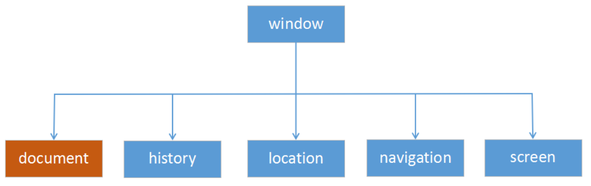
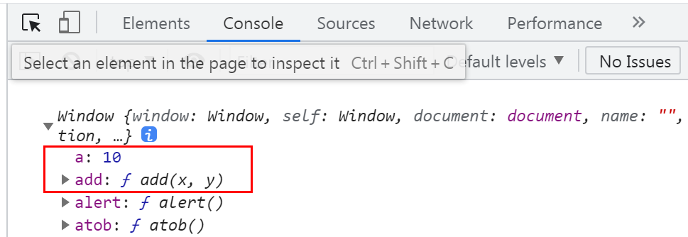
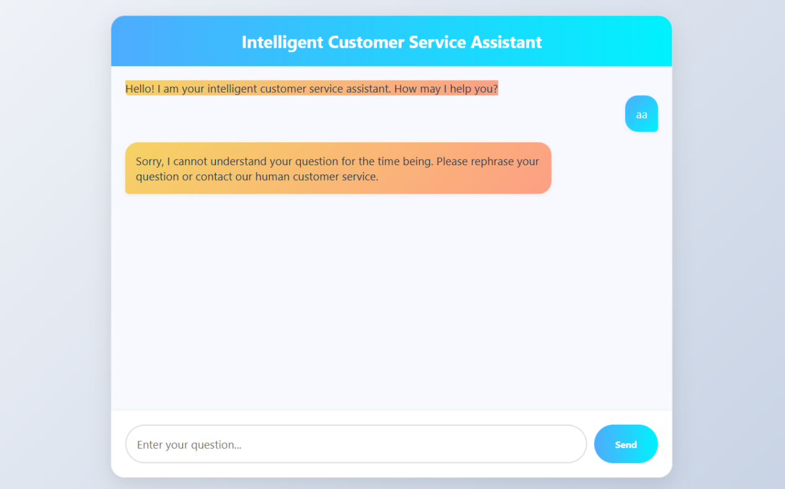

# Project 15 BOM Programming

---Traces of Time, Eternal Light of the Heart; Preserve the Past to Illuminate the Future

## Content Guide

Based on the technical standards of WorldSkills competitions, this project encapsulates animation controllers (such as the LoadingAnimator class) through object-oriented JavaScript programming. It combines CSS3 keyframes and SVG dynamic rendering to achieve high-performance loading animations, and adopts modular design to ensure technical standardization and scalability in line with international skills competitions.

## Learning Objectives

- ① Understand BOM programming.
- ② Master important properties and methods of the window object.
- ③ Master important properties and methods of the document object.

## Task 15.1 Elegant Transition & Loading Animation

### 15.1.1 Task Description

This task implements an elegant transition and loading effect. A circular rotating indicator with a blue top is created using CSS (with Bezier curves for smooth acceleration), paired with opacity transitions for fade-in and fade-out effects. When page loading is complete (simulated with a 2-second delay), the loading animation disappears smoothly, while the content area is elegantly displayed with a fade-in animation. The whole layout is responsive and automatically centered. The code structure is clear and easy to integrate into real projects by replacing it with actual asynchronous operations. The effect is shown in Figure 15-1.

<p align="center">
  
</p>

<p align="center"><em>Figure 15-1 Elegant Transition and Loading Animation</em></p>

### 15.1.2 Knowledge Preparation

#### 1. Introduction to the window Object

The window object represents the open window in the browser and provides information about the window status.

The window object can be used to access the document drawn in the window, events occurring in the window, and browser features that affect the window.

The window object is the top-level object in the browser and contains everything in the browser.

The document object we learned earlier is also part of the window object, as shown in Figure 15-2.

<p align="center">
  
</p>

<p align="center"><em>Figure 15-2 The window Object</em></p>

In addition, variables and functions declared by programmers themselves are directly attached to the window object.

```js
let a = 10;
function add(x,y){
  return x + y;
}
console.log(window);
```

The declared variable a and function add are both directly attached to the window object, as shown in Figure 15-3 below.

<p align="center">
  
</p>

<p align="center"><em>Figure 15-3 Variables and Functions Mounted on the window Object</em></p>

#### 2. Common Properties of window

Commonly used properties of window include: innerWidth, innerHeight, outerWidth, outerHeight, etc.

innerWidth / innerHeight: Store the width and height of the browser’s document display area.

##### (2) outerWidth / outerHeight: Store the width and height of the entire browser window.

```js
console.log(window.innerWidth, window.innerHeight);
console.log(window.outerWidth, window.outerHeight);
```

There are multiple ways to reference the properties and methods of the window object in a script, depending on design ideas and styles rather than specific syntactic requirements. The most logical and universal way to write such references is to include the window object in the reference:

```
window.propertyName
window.methodName([parameters])
```

When a script reference points to the window containing the document, the window object has a synonym self. In this case, the reference syntax is:

self.propertyName

```
self.methodName([parameters])
```

However, self is more suitable in more complex scripts involving multiple frames and windows. self clearly represents the current window where the script document resides, making the script easier for all users to understand.

Since the window object exists throughout the script execution, it can be omitted when referencing any object within the window. Therefore, the following syntax assumes that the properties and methods belong to the current window:

propertyName

```
methodName([parameters])
```

#### 3.Common Methods of window

The commonly used methods of the window object are shown in Table 15-1 below.

| Method | Description |
| --- | --- |
| alert | Displays an alert box with a message and an OK button. |
| confirm | Displays a dialog box with a message, an OK button and a Cancel button. |
| prompt | Displays a dialog box that prompts the user for input. |
| setInterval | A timer that repeatedly executes a callback function at specified intervals. |
| clearInterval | Cancels the timeout set by setInterval. |
| setTimeout | A timer that executes a callback function once after a specified delay. |
| clearTimeout | Cancels the timeout set by setTimeout. |

##### (1) The setInterval Method

The setInterval is used to set a timer that repeatedly executes a callback function at specified intervals. Example:

```html
<script>
  setInterval(function () {
  console.log("When the second hand finishes its 1001st waltz, you'll realize: the so-called 'too late' is just the prelude to 'just in time'.");
  }, 2000)
</script>
```

##### (2) The setTimeout Method

The setTimeout method is used to set a timer that executes a callback function once after a specified delay. Example:

```html
<script>
  setInterval(function () {
  console.log("A timer is a love letter written by time, reminding you every second: between you and your dreams, there’s only the mark of 'beginning'.");
  }, 2000)
</script>
```

### 15.1.3 Task Implementation

"Elegant Transition, Loading" is divided into the following three steps, as detailed below.

#### Step 1: Create the HTML page.

```html
<!DOCTYPE html>
<html lang="en">
  <head>
    <meta charset='UTF-8'>
    <meta name='viewport' content='width=device-width, initial-scale=1.0'>
    <title>Elegant Transition, Loading</title>
  </head>
  <body>
  </body>
</html>
```

#### Step 2: Style construction.

```html
<!DOCTYPE html>
<html lang="en">
  <head>
    <meta charset='UTF-8'>
    <meta name='viewport' content='width=device-width, initial-scale=1.0'>
    <title>Elegant Transition, Loading</title>
    <style>
      .loader {
      width: 148px;
      height: 148px;
      border: 5px solid #f3f3f3;
      border-top: 5px solid #3498db;
      border-radius: 50%;
      animation: spin 1s cubic-bezier(0.68, -0.55, 0.27, 1.55) infinite;
      margin: 50px auto;
      transition: opacity 0.3s ease;
      }
      .hidden {
      opacity: 0;
      visibility: hidden;
      }
      .content {
      padding: 20px;
      text-align: center;
      font-family: sans-serif;
      max-width: 600px;
      margin: 0 auto;
      }
      @keyframes spin {
      0% { transform: rotate(0deg); }
      100% { transform: rotate(360deg); }
      }
      .fade-in {
      animation: fadeIn 0.5s ease-in;
      }
      @keyframes fadeIn {
      from { opacity: 0; }
      to { opacity: 1; }
      }
    </style>
  </head>
  <body>
  </body>
</html>
```

#### Step 3: Use a timer to implement the loader fade-out animation, unhide the content, and trigger the content fade-in animation.

```html
<script>
  window.addEventListener('load', () => {
  setTimeout(() => {
  const loader = document.getElementById('loader');
  const content = document.getElementById('content');
  // Add fade-out animation
  loader.classList.add('hidden');
  // Display content and add fade-in animation      content.classList.remove('hidden');
  content.classList.add('fade-in');
  }, 2000); // Simulate 2 seconds of loading time
  });
</script>
```

#### Step 4: Run the index.html file to view the effect.

## Task 15.2 "Smart Customer Service" Conversation & Event Handling

### 15.2.1 Task Description

This smart customer service system aims to provide users with real-time and efficient automated interaction services. After users enter questions in the input field, the system will automatically identify the question type based on preset keyword matching rules, and retrieve corresponding answers from the predefined response library (such as common scenarios including product consultation, order inquiry, after-sales service, etc.).

The system supports submitting questions by clicking the send button or pressing the Enter key on the keyboard. After submission, the user message bubble will be displayed immediately, and a "typing" animation prompt will be triggered at the same time. After a 1.5-second delay, the system will show the customer service reply in the form of a colorful gradient bubble. If the user's question does not match any preset keywords, a default guiding message will be returned.

The entire interaction process is presented through a soft Morandi color scheme interface, combined with dynamic effects and clear information hierarchy, ensuring that users receive instant responses while enjoying a comfortable visual experience. The effect is shown in Figure 15-1.

<p align="center">
  
</p>

<p align="center"><em>Figure 15-1 Smart Customer Service</em></p>

### 15.2.2 Knowledge Preparation

#### 1. Overview of Events

JavaScript events are asynchronous notification mechanisms triggered by the browser or user operations, used to respond to interactive behaviors (such as clicks, inputs) or system status changes (such as page loading, resource readiness). They are the core of building dynamic web pages, enabling pages to update in real time according to user behaviors or environmental changes.

#### 2. Event Classification

##### (1) Mouse Events

① click

② dblclick

③ mousedown / mouseup

④ mousemove

⑤ mouseover / mouseout

⑥ contextmenu

##### (2) Keyboard Events

① keydown / keyup

② keypress (deprecated; keydown is recommended)

##### (3) Form Events

① submit

② input

③ change

④ focus / blur

⑤ reset

#### 3. Event Binding

The most common event on the window object is triggered when the page finishes loading. This event fires after all data files are fully downloaded into the browser. The advantage of using the load event to call a function is that it ensures all document objects exist in the browser’s DOM.

You can apply the load event handler to the window object as follows:

```html
<script>
  window.addEventListener('load', functionName,false);
</script>
```

Where functionName is the function to run after the page finishes downloading. You can call addEventListener multiple times to add multiple functions to the list of executions after page load.

You can also apply this event directly to an element:

```html
<script>
  window['onload'] = functionName;
  window['onload'] = functionName;
</script>
```

However, this usage means only one function will execute after page load, replacing other event handlers assigned to the window object.

In addition, variables and functions declared by programmers are directly attached to the window object.

```js
let a = 10;
function add(x,y){
  return x + y;
}
console.log(window);
```

<p align="center">
  
</p>

The declared variable a and function add are both directly attached to the window object, as shown in Figure 15-3 below.

<p align="center"><em>Figure 15-3 Variables and functions mounted on the window object</em></p>

#### 4.Common Methods of the window Object

The commonly used methods of the window object are shown in Table 15-1 below.

| Method | Description |
| --- | --- |
| alert | Displays an alert box with a message and an OK button. |
| confirm | Displays a dialog box with a message, an OK button and a Cancel button. |
| prompt | Displays a dialog box that prompts the user for input. |
| setInterval | A timer that repeatedly executes a callback function at specified intervals. |
| clearInterval | Cancels the timer set by setInterval. |
| setTimeout | A timer that executes a callback function once after a specified delay. |
| clearTimeout | Cancels the timer set by setTimeout. |

(1) The setInterval MethodsetInterval is used to set a timer that repeatedly executes a callback function at specified intervals. Example:

```html
<script>
  setInterval(function () {
  console.log("When the second hand finishes dancing its 1001st waltz, you will realize: the so-called 'too late' is merely the prelude to 'just in time'.");
  }, 2000)
</script>
```

##### (2) The setTimeout Method

The setTimeout method is used to set a timer that executes a callback function once after a specified delay. Example:

```html
<script>
  setInterval(function () {
  console.log("A timer is a love letter written by time; every second reminds you: between you and your ideals, there is only the mark of 'beginning' standing in the way.");
  }, 2000)
</script>
```

### 15.2.3 Task Implementation

The project "Smart Customer Service Conversation and Event Handling" is divided into the following eight steps, as detailed below.

#### Step 1: Create the HTML page.

```html
<!DOCTYPE html>
<html lang="en">
  <head>
    <meta charset='UTF-8'>
    <meta name='viewport' content='width=device-width, initial-scale=1.0'>
    <title>Intelligent Customer Service</title>
  </head>
  <body>
    <div class="chat-container">
      <div class="chat-header">Intelligent Customer Service Assistant</div>
      <div class="chat-messages" id="chatMessages">
        <div class="bot-message">Hello! I am your intelligent customer service assistant. How may I help you?</div>
      </div>
      <div class="typing-indicator" id="typingIndicator">
        <div class="typing-dot"></div>
        <div class="typing-dot"></div>
        <div class="typing-dot"></div>
      </div>
      <div class="input-container">
        <input type="text" id="userInput" placeholder="Enter your question..." autocomplete="off">
        <button id="sendButton">Send</button>
      </div>
    </div>
  </body>
</html>
```

#### Step 2: Style construction.

```html
<!DOCTYPE html>
<html lang="en">
  <head>
    <meta charset='UTF-8'>
    <meta name='viewport' content='width=device-width, initial-scale=1.0'>
    <title>Intelligent Customer Service</title>
    <style>
      * {
      margin: 0;
      padding: 0;
      box-sizing: border-box;
      font-family: 'Segoe UI', Tahoma, Geneva, Verdana, sans-serif;
      }
      body {
      display: flex;
      justify-content: center;
      align-items: center;
      min-height: 100vh;
      background: linear-gradient(135deg, #f5f7fa 0%, #c3cfe2 100%);
      padding: 20px;
      }
      .chat-container {
      width: 100%;
      max-width: 800px;
      height: 90vh;
      background-color: white;
      border-radius: 20px;
      box-shadow: 0 10px 30px rgba(0, 0, 0, 0.1);
      display: flex;
      flex-direction: column;
      overflow: hidden;
      border: 1px solid #e0e0e0;
      }
      .chat-header {
      background: linear-gradient(90deg, #4facfe 0%, #00f2fe 100%);
      color: white;
      padding: 20px;
      text-align: center;
      font-size: 1.5rem;
      font-weight: bold;
      }
      .chat-messages {
      flex: 1;
      overflow-y: auto;
      padding: 20px;
      background-color: #f8f9ff;
      }
      .message {
      max-width: 80%;
      margin-bottom: 15px;
      padding: 15px;
      border-radius: 18px;
      clear: both;
      position: relative;
      box-shadow: 0 2px 5px rgba(0, 0, 0, 0.05);
      }
      .user-message {
      background: linear-gradient(135deg, #4facfe 0%, #00f2fe 100%);
      color: white;
      float: right;
      border-bottom-right-radius: 5px;
      }
      .bot-message {
      background: linear-gradient(135deg, #f6d365 0%, #fda085 100%);
      color: #2c3e50;
      float: left;
      border-bottom-left-radius: 5px;
      }
      .input-container {
      display: flex;
      padding: 20px;
      background-color: white;
      border-top: 1px solid #eee;
      }
      input {
      flex: 1;
      padding: 15px;
      border: 2px solid #e0e0e0;
      border-radius: 30px;
      font-size: 1rem;
      outline: none;
      transition: all 0.3s;
      }
      input:focus {
      border-color: #4facfe;
      box-shadow: 0 0 0 3px rgba(79, 172, 254, 0.2);
      }
      button {
      background: linear-gradient(90deg, #4facfe 0%, #00f2fe 100%);
      color: white;
      border: none;
      border-radius: 30px;
      padding: 0 30px;
      margin-left: 10px;
      cursor: pointer;
      font-weight: bold;
      transition: transform 0.2s;
      }
      button:hover {
      transform: translateY(-2px);
      }
      button:active {
      transform: translateY(1px);
      }
      .typing-indicator {
      display: none;
      background-color: white;
      padding: 15px;
      border-radius: 18px;
      width: 100px;
      text-align: center;
      margin-bottom: 15px;
      box-shadow: 0 2px 5px rgba(0, 0, 0, 0.05);
      }
      .typing-dot {
      display: inline-block;
      width: 8px;
      height: 8px;
      background-color: #4facfe;
      border-radius: 50%;
      margin: 0 2px;
      animation: bounce 1.5s infinite;
      }
      .typing-dot:nth-child(2) {
      animation-delay: 0.2s;
      }
      .typing-dot:nth-child(3) {
      animation-delay: 0.4s;
      }
      @keyframes bounce {
      0%, 100% { transform: translateY(0); }
      50% { transform: translateY(-5px); }
      }
    </style>
  </head>
  <body>
    <div class="chat-container">
      <div class="chat-container">
        <div class="chat-header">Intelligent Customer Service Assistant</div>
        <div class="chat-messages" id="chatMessages">
          <div class="bot-message">Hello! I am your intelligent customer service assistant. How may I help you?</div>
        </div>
        <div class="typing-indicator" id="typingIndicator">
          <div class="typing-dot"></div>
          <div class="typing-dot"></div>
          <div class="typing-dot"></div>
        </div>
        <div class="input-container">
          <input type="text" id="userInput" placeholder="Enter your question..." autocomplete="off">
          <button id="sendButton">Send</button>
        </div>
      </div>
    </body>
  </html>
```

#### Step 3: Initialize the module.

```html
<script>
  document.addEventListener('DOMContentLoaded', () => {
  // Get DOM elements
  const chatMessages = document.getElementById('chatMessages');
  const userInput = document.getElementById('userInput');
  const sendButton = document.getElementById('sendButton');
  const typingIndicator = document.getElementById('typingIndicator');
  });
</script>
```

#### Step 4: Reply logic module.

```js
// Preset response library
const responses = {
  'hello': 'Hello! It\'s my pleasure to assist you!',
  'features': 'I can answer questions about product information, order inquiries, after-sales service, etc. Which aspect would you like to know about?',
  'refund': 'Regarding refund issues, please provide your order number and I will check the processing progress for you.',
  'default': 'Sorry, I cannot understand your question for the time being. Please rephrase your question or contact our human customer service.'
};
function getBotResponse(message) {
  // Simple keyword matching
  for (const keyword in responses) {
    if (message.includes(keyword)) {
      return responses[keyword];
    }
}
return responses['default'];
}
```

#### Step 5: Message processing module.

```js
function addMessage(text, isUser) {
  const messageElement = document.createElement('div');
  messageElement.classList.add('message');
  messageElement.classList.add(isUser ? 'user-message' : 'bot-message');
  messageElement.textContent = text;
  chatMessages.appendChild(messageElement);
  chatMessages.scrollTop = chatMessages.scrollHeight;
}
```

#### Step 6: Input processing module.

```js
function handleUserInput() {
  const message = userInput.value.trim();
  if (message) {
    // Add user message
    addMessage(message, true);
    userInput.value = '';
    // Show typing indicator
    typingIndicator.style.display = 'block';
    // Simulate delay for bot response
    setTimeout(() => {
        typingIndicator.style.display = 'none';
        const response = getBotResponse(message);
        addMessage(response, false);
      }, 1500);
}
}
```

#### Step 7: Interaction trigger module.

```js
// Send button click event
sendButton.addEventListener('click', handleUserInput);
// Enter key event for input box
userInput.addEventListener('keydown', function(e) {
    if (e.key === 'Enter') {
      handleUserInput();
    }
});
```

#### Step 7: Run the index.html file to view the effect.

## Task 15.3 Project Practice – Creating a Functional Loading Animation (Module A)

### 15.3.1 Task Description

Through this project practice, implement the creation of a functional loading animation for the mini speed test project, including the loading animation and page display after the animation ends.

### 15.3.2 Effect Display

The effect display of the created functional loading animation is shown in Figures 15-4 and 15-5.

<p align="center">
  
</p>

<p align="center"><em>Figure 15-4 Loading Animation</em></p>

<p align="center">
  
</p>

<p align="center"><em>Figure 15-5 Page displayed after animation</em></p>

### 15.3.3 Task Implementation

#### Step 1: Create a functional loading animation page. Create a new HTML page named index.html, implement a rotating loading animation, and set the page title to Heavy HTML Page. Write the page structure.

The code is as follows:

```html
<!DOCTYPE html>
<html lang="en">
  <head>
    <!-- Meta Tags -->
    <meta charset="UTF-8" />
    <meta name="viewport" content="width=device-width, initial-scale=1.0" />
    <title>A6</title>
  </head>
  <body>
    <header>
      <h1>Heavy HTML Page</h1>
    </header>
    <div class="container">
      <div class="loading-container">
        <!-- YOUR CODE HERE -->
        <div id="loading">
          <div class="circle">
            <div class="item"></div>
          </div>
        </div>
      </div>
    </div>
  </body>
</html>
```

#### Step 2: Display the page after the animation. The page includes large text content, images, videos, form submission, and footer content. Write the page structure.

The code is as follows:

```html
<!DOCTYPE html>
<html lang="en">
  <head>
    <!-- Meta Tags -->
    <meta charset="UTF-8" />
    <meta name="viewport" content="width=device-width, initial-scale=1.0" />
    <title>A6</title>
  </head>
  <body>
    <header>
      <h1>Heavy HTML Page</h1>
    </header>
    <div class="container">
      <div class="loading-container">
        <!-- YOUR CODE HERE -->
        <div id="loading">
          <div class="circle">
            <div class="item"></div>
          </div>
        </div>
      </div>
      <section class="content">
        <h2>Large Text Content</h2>
        <p>Lorem ipsum dolor sit amet, consectetur adipiscing elit. Vivamus lacinia odio vitae vestibulum vestibulum.
          Cras venenatis euismod malesuada. Lorem ipsum dolor sit amet, consectetur adipiscing elit. Vivamus lacinia
          odio vitae vestibulum vestibulum. Cras venenatis euismod malesuada. Lorem ipsum dolor sit amet, consectetur
          adipiscing elit. Vivamus lacinia odio vitae vestibulum vestibulum. Cras venenatis euismod malesuada.</p>
          <p>Lorem ipsum dolor sit amet, consectetur adipiscing elit. Vivamus lacinia odio vitae vestibulum vestibulum.
            Cras venenatis euismod malesuada. Lorem ipsum dolor sit amet, consectetur adipiscing elit. Vivamus lacinia
            odio vitae vestibulum vestibulum. Cras venenatis euismod malesuada. Lorem ipsum dolor sit amet, consectetur
            adipiscing elit. Vivamus lacinia odio vitae vestibulum vestibulum. Cras venenatis euismod malesuada.</p>
          </section>
          <section class="images">
            <h2>Images</h2>
            
            
            
          </section>
          <section class="videos">
            <h2>Videos</h2>
            <video oncanplay="loadMedia()" src="assets/Bohemian%20Rhapsody%20_%20Muppet%20Music%20Video%20_%20The%20Muppets.mp4" controls loop></video>
            <video oncanplay="loadMedia()" src="assets/Rick%20Astley%20-%20Never%20Gonna%20Give%20You%20Up%20(Official%20Music%20Video).mp4" controls loop></video>
          </section>
          <section class="form-section">
            <h2>Interactive Forms</h2>
            <form>
              <label for="name">Name:</label><br>
              <input type="text" id="name" name="name"><br><br>
              <label for="email">Email:</label><br>
              <input type="email" id="email" name="email"><br><br>
              <input type="submit" value="Submit">
            </form>
          </section>
          <section class="dynamic-content">
            <h2>Dynamic Content</h2>
            <button id="dynamicContentBtn">Add Dynamic Content</button>
            <div id="dynamicContent"></div>
          </section>
        </div>
      </body>
    </html>
```

#### Step 3: Style construction.

The code is as follows:

```html
<!DOCTYPE html>
<html lang="en">
  <head>
    <!-- Meta Tags -->
    <meta charset="UTF-8" />
    <meta name="viewport" content="width=device-width, initial-scale=1.0" />
    <title>A6</title>
    <style>
      * {
      font-family: Arial, sans-serif;
      margin: 0;
      padding: 0;
      box-sizing: border-box;
      }
      body{
      background-color: #f4f4f4;
      }
      header, footer {
      background-color: #333;
      color: #fff;
      text-align: center;
      padding: 1em 0;
      }
      .container {
      padding: 20px;
      }
      .images img {
      width: 100%;
      max-width: 300px;
      margin: 10px;
      }
      .videos iframe, .videos video {
      width: 100%;
      max-width: 600px;
      height: 300px;
      margin: 10px;
      object-fit: cover;
      }
      .content {
      margin: 20px 0;
      }
      .form-section {
      margin: 20px 0;
      }
      /* YOUR CODE HERE */
      #loading {
      background: #fff;
      display: flex;
      justify-content: center;
      align-items: center;
      position: fixed;
      left: 0;
      right: 0;
      top: 0;
      bottom: 0;
      z-index: 989;
      }
      #loading .circle {
      width: 200px;
      height: 200px;
      border: 10px solid blue;
      border-radius: 50%;
      position: relative;
      animation: loadingAni 1s linear infinite;
      }
      #loading .circle::before,
      #loading .circle::after {
      content: "";
      position: absolute;
      width: 10px;
      height: 10px;
      border-radius: 50%;
      background: blue;
      z-index: 2;
      }
      #loading .circle::before {
      left: -10px;
      top: calc(50% - 5px);
      }
      #loading .circle::after {
      right: -10px;
      top: calc(50% - 5px);
      }
      #loading .circle .item {
      position: absolute;
      left: -20px;
      right: -20px;
      top: 50%;
      bottom: -20px;
      background: #fff;
      }
      @keyframes loadingAni {
      to {
      transform: rotate(1turn);
      }
      }
    </style>
  </head>
  <body>
    <header>
      <h1>Heavy HTML Page</h1>
    </header>
    <div class="container">
      <div class="loading-container">
        <!-- YOUR CODE HERE -->
        <div id="loading">
          <div class="circle">
            <div class="item"></div>
          </div>
        </div>
      </div>
      <section class="content">
        <h2>Large Text Content</h2>
        <p>Lorem ipsum dolor sit amet, consectetur adipiscing elit. Vivamus lacinia odio vitae vestibulum vestibulum.
          Cras venenatis euismod malesuada. Lorem ipsum dolor sit amet, consectetur adipiscing elit. Vivamus lacinia
          odio vitae vestibulum vestibulum. Cras venenatis euismod malesuada. Lorem ipsum dolor sit amet, consectetur
          adipiscing elit. Vivamus lacinia odio vitae vestibulum vestibulum. Cras venenatis euismod malesuada.</p>
          <p>Lorem ipsum dolor sit amet, consectetur adipiscing elit. Vivamus lacinia odio vitae vestibulum vestibulum.
            Cras venenatis euismod malesuada. Lorem ipsum dolor sit amet, consectetur adipiscing elit. Vivamus lacinia
            odio vitae vestibulum vestibulum. Cras venenatis euismod malesuada. Lorem ipsum dolor sit amet, consectetur
            adipiscing elit. Vivamus lacinia odio vitae vestibulum vestibulum. Cras venenatis euismod malesuada.</p>
          </section>
          <section class="images">
            <h2>Images</h2>
            
            
            
          </section>
          <section class="videos">
            <h2>Videos</h2>
            <video oncanplay="loadMedia()" src="assets/Bohemian%20Rhapsody%20_%20Muppet%20Music%20Video%20_%20The%20Muppets.mp4" controls loop></video>
            <video oncanplay="loadMedia()" src="assets/Rick%20Astley%20-%20Never%20Gonna%20Give%20You%20Up%20(Official%20Music%20Video).mp4" controls loop></video>
          </section>
          <section class="form-section">
            <h2>Interactive Forms</h2>
            <form>
              <label for="name">Name:</label><br>
              <input type="text" id="name" name="name"><br><br>
              <label for="email">Email:</label><br>
              <input type="email" id="email" name="email"><br><br>
              <input type="submit" value="Submit">
            </form>
          </section>
          <section class="dynamic-content">
            <h2>Dynamic Content</h2>
            <button id="dynamicContentBtn">Add Dynamic Content</button>
            <div id="dynamicContent"></div>
          </section>
        </div>
      </body>
    </html>
```

#### Step 4: Implement the page function after the loading animation with a 3-second delay.

The code is as follows:

```html
<script>
  // Execute after the page is fully loaded
  window.onload = function() {
  // Set to execute page redirect after 3 seconds
  setTimeout(() => {
  // Hide the loading layer
  document.getElementById('loading').style.display = 'none';
  }, 3000); // 3-second delay
  };
</script>
```

#### Step 5: Run the index.html file to view the effect.
