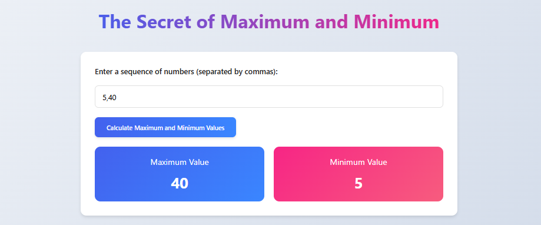
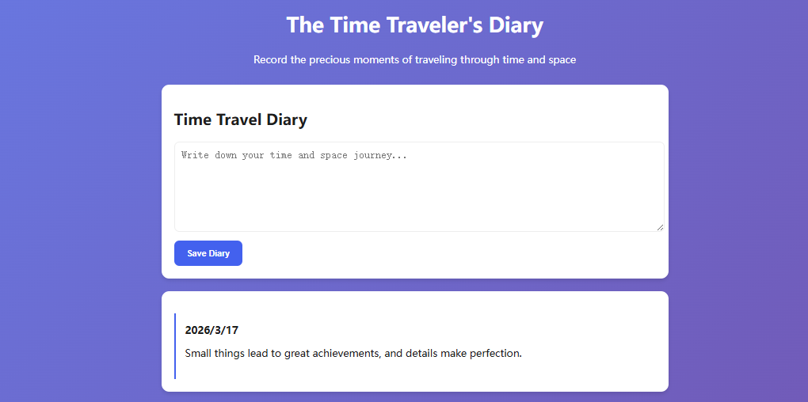
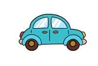
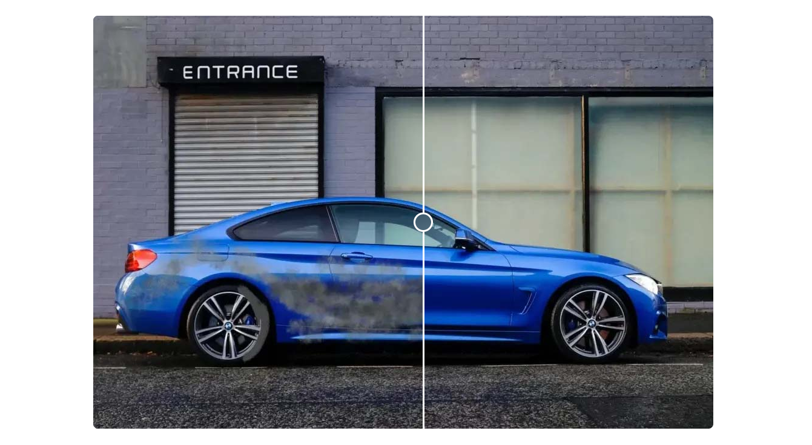

# Project 16 JavaScript Object-Oriented Programming – Skillfully Constructing Objects, Creating Diverse Structures

## Content Guide

Based on the technical standards of the WorldSkills Competition website, this project modularizes the image comparison function of Module A of the WorldSkills website technology by encapsulating classes through JavaScript object-oriented programming. This class integrates DOM manipulation and style control logic (dynamically adjusting image width and the CSS variable left to position the dividing line), realizing a slider-driven interactive image comparison effect. It not only conforms to the object-oriented principle of "data-behavior integration", but also meets the dual requirements of technical standardization and functional scalability in international skills competitions.

## Learning Objectives

- ① Master the use and basic operations of objects.
- ② Master the use of constructor functions.
- ③ Master the use of Date and Array objects.
- ④ Master the use of String and RegExp objects.
- ⑤ Master the basic syntax of class.
- ⑥ Master the inheritance of class.

## Task 16.1 The Secret of Maximum and Minimum Values

### 16.1.1 Task Description

This task implements the function of calculating the extreme values of a user-input number sequence using JavaScript: when the user clicks the "Calculate Maximum and Minimum Values" button, the system obtains the comma-separated string from the input field. After processing such as removing spaces, filtering empty values, and converting to a numeric array, it uses the Math.max() and Math.min() methods to calculate the maximum and minimum values of valid numbers. Finally, the results are dynamically rendered into the corresponding colored result cards on the page, completing the complete interactive process from data input to visual display, which meets the specification requirements of the WorldSkills Competition website technology module for data calculation and dynamic presentation. The effect is shown in Figure 16-1.

<p align="center">
  
</p>

<p align="center"><em>Figure 16-1 The Secret of Maximum and Minimum Values</em></p>

### 16.1.2 Knowledge Preparation

#### 1. Built-in Objects

There are 17 built-in objects in JavaScript. The commonly used ones include the Array object, Date object, RegExp object, String object, Global object, and Math object. These commonly used objects are introduced as follows:

##### (1) Array object: An array object that provides properties and methods for array operations.

##### (2) Date object: A date and time object used to obtain system date and time information.

(3) RegExp object: A regular expression object that uses a single string to describe and match a series of string search patterns conforming to certain syntactic rules.

##### (4) String object: A string object that provides properties and methods for string manipulation.

##### (5) Global object: A built-in object designed to collect all global methods into one object.

##### (6) Math object: A mathematical object that provides properties and methods for mathematical calculations.

#### 2. Math Object

```
Math is a built-in object provided by JavaScript, which supplies properties and methods for mathematical operations.
```

As shown in Table 16-1 below:

| Method/Property | Description |
| --- | --- |
| PI | The value of pi |
| Math.round() | Rounds a number to the nearest integer |
| Math.floor() | Rounds a number down to the nearest integer |
| Math.ceil() | Rounds a number up to the nearest integer |
| Math.max() | Returns the largest of zero or more numbers |
| Math.min() | Returns the smallest of zero or more numbers |
| Math.random() | Returns a random number between 0 and 1, excluding both 0 and 1 |

**Table 16-1 The Math Object**

Usage example:

```js
console.log(Math.PI);           // 3.141592653589793
console.log(Math.max(32, 86));                   // 86
console.log(Math.max(-1, -10));                  // -1
console.log(Math.max(20, 68, 108, 186, 75));     // 186
console.log(Math.round(3.1));         // 3
console.log(Math.round(8.6));         // 9
console.log(Math.floor(6.9));     // 6
console.log(Math.floor(-5.8));    // -6
console.log(Math.ceil(2.1));    // 3
console.log(Math.ceil(7.9));    // 8
console.log(Math.random());   // Generate a random number between 0 and 1
```

#### 3. Date Object

In web applications, we often encounter situations where dates and times need to be processed. JavaScript has a built-in core object Date.

This object can represent all times and dates from milliseconds to years, and provides a series of methods for manipulating dates and times. To use the Date object, you must first create it with the new operator. The Date constructor can generate Date objects for the past, present, and future through optional parameters. There are three common ways to create a Date object:

##### (1) Without parameters

```js
let myDate = new Date();
```

Creates a Date object containing the current system date and time.

##### (2) Create a Date object with a specified date

```js
let myDate = new Date('2025/10/28');
```

##### (3) Create a Date object with a specified time

```js
let myDaye = new (2025,10,1,10,30,20);
```

#### 4. Common Methods of the Date Object

The Date object provides many methods for working with dates and times, as shown in Table 16‑2:

| Method Name | Description |
| --- | --- |
| getFullYear() | Returns the year |
| getMonth() | Returns the month (0 – 11) |
| getDate() | Returns the day of the month (1 – 31) |
| getDay() | Returns the day of the week (0 – 6) |
| getHours() | Returns the hour (0 – 23) |
| getMinutes() | Returns the minutes (0 – 59) |
| getSeconds() | Returns the seconds (0 – 59) |

Table 16‑2 Common Methods of the Date Object

#### 5. Array Object

There are several ways to create an array in JavaScript. You can use a constructor or create one directly with square brackets. The specific methods are as follows:

##### (1) Creating Arrays

There are multiple ways to create an array in JavaScript, either using a constructor or square brackets directly, as shown below:

Format 1: Use a parameterless constructor to create an empty array.

```js
let arr = new Array();
Format 2: Constructor with a numeric parameter to specify the array length.
let arr = new Array(5);
```

Format 3: Constructor with initialization data to create and populate the array.

```js
let arr = new Array('HTML','JavaScript','DOM');
Format 4: Use square brackets to create an empty array, equivalent to the parameterless constructor.let arr = [];
let arr = [];
```

Format 5: Use square brackets with initialization data, equivalent to the constructor with parameters.

```js
let arr = ['HTML','JavaScript','DOM'];
```

##### (1) Common Array Methods

As shown in Table 16‑3:

| Method Declaration | Description |
| --- | --- |
| toString() | Converts an array to a comma-separated string of values |
| join('separator') | Joins all array elements into a string using a separator |
| pop() | Removes the last element and returns the removed value |
| push(item1[, item2, ...]) | Adds one or more elements to the end and returns the new length |
| shift() | Removes the first element and returns the removed value |
| unshift(item1[,item2, ...]) | Adds one or more elements to the start and returns the new length |
| splice(x,y) | Removes elements starting at index x for y elements |
| concat(arr) | Merges arrays |
| sort() | Sorts array elements alphabetically |
| reverse() | Reverses the order of elements in the array |

Table 16‑3 Common Array Methods

### 16.1.3 Task Implementation

The task "The Secret of Maximum and Minimum Values" is divided into the following six steps, as detailed below.

#### Step 1: Create the HTML page.

```html
<!DOCTYPE html>
<html lang="en">
  <head>
    <meta charset='UTF-8'>
    <meta name='viewport' content='width=device-width, initial-scale=1.0'>
    <title>The Secret of the Maximum and Minimum</title>
  </head>
  <body>
    <div class="container">
      <header>
        <h1>The Secret of Maximum and Minimum</h1>
      </header>
      <div class="card">
        <div class="input-group">
          <label for="numbers">Enter a sequence of numbers (separated by commas):</label>
          <input type="text" id="numbers" placeholder="e.g.: 10, 20, 30, abc, Infinity">
        </div>
        <button id="calculateBtn">Calculate Maximum and Minimum Values</button>
        <div class="results">
          <div class="result-card max-result">
            <div class="result-title">Maximum Value</div>
            <div class="result-value" id="maxValue">-</div>
          </div>
          <div class="result-card min-result">
            <div class="result-title">Minimum Value</div>
            <div class="result-value" id="minValue">-</div>
          </div>
        </div>
      </div>
    </div>
  </body>
</html>
```

#### Step 2: Style construction.

```html
<style>
  :root {
    --primary: #4361ee;
    --secondary: #f72585;
    --success: #06d6a0;
    --warning: #ffd166;
    --dark: #1e1e1e;
    --light: #f8f9fa;
    --radius: 12px;
    --shadow: 0 4px 6px rgba(0,0,0,0.1);
  }
  * {
    margin: 0;
    padding: 0;
    box-sizing: border-box;
    font-family: 'Segoe UI', system-ui, sans-serif;
  }
  body {
    background: linear-gradient(135deg, #f5f7fa 0%, #c3cfe2 100%);
    min-height: 100vh;
    display: flex;
    justify-content: center;
    padding: 20px;
  }
  .container {
    width: 100%;
    max-width: 800px;
    margin: 40px auto;
  }
  header {
    text-align: center;
    margin-bottom: 40px;
  }
  h1 {
    font-size: 2.5rem;
    background: linear-gradient(90deg, var(--primary), var(--secondary));
    -webkit-background-clip: text;
    background-clip: text;
    color: transparent;
    margin-bottom: 10px;
  }
  .subtitle {
    color: var(--dark);
    font-size: 1.2rem;
    max-width: 600px;
    margin: 0 auto;
  }
  .card {
    background: white;
    border-radius: var(--radius);
    box-shadow: var(--shadow);
    padding: 30px;
    margin-bottom: 30px;
  }
  .input-group {
    display: flex;
    flex-wrap: wrap;
    gap: 15px;
    margin-bottom: 20px;
  }
  .input-group label {
    font-weight: 500;
    color: var(--dark);
    width: 100%;
    margin-bottom: 5px;
  }
  input {
    flex: 1;
    padding: 12px 15px;
    border: 2px solid #e0e0e0;
    border-radius: 8px;
    font-size: 1rem;
    min-width: 200px;
    transition: border-color 0.3s;
  }
  input:focus {
    border-color: var(--primary);
    outline: none;
    box-shadow: 0 0 0 3px rgba(67, 97, 238, 0.2);
  }
  button {
    background: linear-gradient(90deg, var(--primary), #3a86ff);
    color: white;
    border: none;
    padding: 12px 25px;
    border-radius: 8px;
    cursor: pointer;
    font-weight: 600;
    transition: all 0.3s;
    box-shadow: 0 2px 5px rgba(0,0,0,0.1);
  }
  button:hover {
    transform: translateY(-2px);
    box-shadow: 0 4px 8px rgba(0,0,0,0.15);
  }
  button:active {
    transform: translateY(1px);
  }
  .results {
    display: grid;
    grid-template-columns: repeat(auto-fit, minmax(250px, 1fr));
    gap: 20px;
    margin-top: 20px;
  }
  .result-card {
    padding: 20px;
    border-radius: var(--radius);
    color: white;
    text-align: center;
    transition: transform 0.3s;
  }
  .result-card:hover {
    transform: translateY(-5px);
  }
  .max-result {
    background: linear-gradient(135deg, var(--primary), #3a86ff);
  }
  .min-result {
    background: linear-gradient(135deg, var(--secondary), #f75c7e);
  }
  .result-title {
    font-size: 1.1rem;
    margin-bottom: 10px;
  }
  .result-value {
    font-size: 2rem;
    font-weight: bold;
  }
  @media (max-width: 768px) {
    .input-group {
      flex-direction: column;
    }
    input, button {
      width: 100%;
    }
  }
</style>
```

#### Step 3: Bind an event to the button for calculating the maximum and minimum values.

```html
<script>
  document.getElementById('calculateBtn').addEventListener('click', function()     {
  });
</script>
```

#### Step 4: Process the input values.

```html
<script>
  document.getElementById('calculateBtn').addEventListener('click', function()     {
    const input = document.getElementById('numbers').value;
    const numbers = input.split(',')
      .map(num => num.trim())
      .filter(n => n !== '');
    // Convert and handle special values
    const processedNumbers = numbers.map(num => {
      return Number(num);
    });
  });
</script>
```

#### Step 5: Calculate the maximum and minimum values and display the results.

```html
<script>
  document.getElementById('calculateBtn').addEventListener('click', function() {
    const input = document.getElementById('numbers').value;
    const numbers = input.split(',')
      .map(num => num.trim())
      .filter(n => n !== '');
    // Convert and handle special values
    const processedNumbers = numbers.map(num => {
      return Number(num);
    });
    // Calculate maximum and minimum values
    const maxValue = Math.max(...processedNumbers)
    const minValue = Math.min(...processedNumbers)
    // Display results
    document.getElementById('maxValue').textContent = maxValue;
    document.getElementById('minValue').textContent = minValue;
  });
</script>
```

#### Step 6: Run the index.html file to view the effect.

## Task 16.2 The Time Traveler's Diary

### 16.2.1 Task Description

Refactor a basic time diary application (including diary input, local storage and display functions) from procedural code to an object-oriented implementation. Improve code structure through class encapsulation while avoiding excessive complexity. The final implementation should balance simplicity and maintainability. Prioritize the use of static methods or a minimal class design to reduce redundant code, ensure complete functions and easy expansion, and comply with the modular design specifications of the WorldSkills Competition website technical module. The effect is shown in Figure 16-2.

<p align="center">
  
</p>

<p align="center"><em>Figure 16-2 The Time Traveler's Diary</em></p>

### 16.2.2 Knowledge Preparation

#### 1. Object-Oriented Programming

An object can be a single entity with properties and types. For example, a car is an object. It has basic parameters such as brand, model, color, price, and so on. These basic parameters can be represented using properties, as shown in Figure 16-3 below.

<p align="center">
  
</p>

This car:BrandModelColorPrice... ...This car:BrandModelColorPrice... ...Parameter = PropertyParameter = PropertyEntity = ObjectEntity = Object

<p align="center"><em>Figure 16-3 Object-Oriented Programming</em></p>

##### (1) Basic class Syntax

The class syntax in ES6 is syntactic sugar based on JavaScript prototypal inheritance. It provides a clearer and more intuitive way to define classes, supporting constructors (constructor), instance methods, static methods (static), inheritance (via extends and super), and getters/setters. This makes object-oriented programming cleaner and easier to use, while its underlying implementation is still prototype-based. For example:

```js
class Point {
  constructor(x, y) {
    this.x = x;
    this.y = y;
    console.log(x, y);
  }
  toString() {
    return '(' + this.x + ', ' + this.y + ')';
  }
}
```

After a class is created, the new keyword must be used to generate an instance object of the class. If new is omitted and the class is called like an ES5 function, an error will be thrown.

```js
// Error
let point = Point(2,3);
// Correct
let point = new Point(2,3);
```

##### (2) constructor Method

Object-oriented programming introduces a clearer way of defining classes through the class syntax, and the constructor is the core method in a class used to initialize instances. For example:

```js
class Person {
  constructor(name, age) {
    this.name = name; // Instance property
    this.age = age;
  }
}
const john = new Person("John", 30);
console.log(john.name); // Output: John
```

When creating an instance of a class using the new keyword, the constructor method runs automatically to initialize the instance’s properties.

this binding: this inside the constructor refers to the newly created instance object.

##### (3) Class Inheritance

We can use the extends keyword to implement inheritance. A subclass inheriting from a parent class is like inheriting property — it gains all the properties and methods of the parent class. Also, only one parent class can follow extends each time. For example:

```css
class Father {
  constructor() {
    this.name = "father";
    this.money = 60000;
  }
  say() {
    console.log(`${this.name} say hello`);
  }
  myMoney() {
    console.log(`${this.name} has ${this.money} yuan`);
  }
}
class Son extends Father {
  constructor() {
    super(); // Note: this must be written
    this.name = "son";
    this.addmoney = 40000;
  }
  addMoney() {
    console.log(
    `${this.name} has a total of ${this.money} + ${this.addmoney} = ${this.money + this.addmoney} yuan`
    );
  }
}
var son1 = new Son();
son1.say(); // son say hello
son1.addMoney();
```

Inheritance uses extends. After inheritance, super() must be used to call the parent class's constructor, otherwise an error will occur. When instantiating a subclass with new, parameters are first passed into the subclass's constructor, and then the parent class's constructor is called via super().

##### (4) Class Static Methods

A class defines static methods using the static keyword. All methods defined in a class are inherited by instances. However, once a method is defined as static, it will not be inherited by instances and can only be called directly through the class.

```css
class Foo {
  static classMethod() {
    return 'hello';
  }
}
// Runs normally
Foo.classMethod() // 'hello'
var foo = new Foo();
// Calling the method after instantiation throws an error
foo.classMethod()
// TypeError: foo.classMethod is not a function
Static properties can also be defined in a class, for example:
// Original syntax
class Foo {
  // ...
}
Foo.prop = 1;
// New syntax
class Foo {
  static prop = 1;
}
```

### 16.2.3 Task Implementation

The "Time Traveler's Diary" task is divided into the following six steps, as detailed below.

#### Step 1: Create the HTML page.

```html
<!DOCTYPE html>
<html lang="en">
  <head>
    <meta charset='UTF-8'>
    <meta name='viewport' content='width=device-width, initial-scale=1.0'>
    <title>Simple Time Diary</title>
  </head>
  <body>
    <div class="container">
      <header>
        <h1>The Time Traveler's Diary</h1>
        <p class="subtitle">Record the precious moments of traveling through time and space</p>
      </header>
      <div class="card">
        <h2>Time Travel Diary</h2>
        <textarea id="diaryInput" placeholder="Write down your time and space journey..."></textarea>
        <button class="btn" id="saveBtn">Save Diary</button>
      </div>
      <div class="card" id="diaryContainer">
        <h3>My Diary</h3>
        <div class="empty-state">No diary entries yet</div>
      </div>
    </div>
  </body>
</html>
```

#### Step 2: Style construction.

```html
<style>
  body {
    background: linear-gradient(135deg, #667eea 0%, #764ba2 100%);
    min-height: 100vh;
    padding: 20px;
    color: #1e1e1e;
  }
  .container {
    max-width: 800px;
    margin: 0 auto;
  }
  header {
    text-align: center;
    margin: 30px 0;
    color: white;
  }
  .card {
    background: white;
    border-radius: 12px;
    padding: 20px;
    margin: 20px 0;
    box-shadow: 0 4px 6px rgba(0, 0, 0, 0.1);
  }
  textarea {
    width: 99%;
    height: 120px;
    padding: 10px;
    border: 2px solid #eee;
    border-radius: 8px;
    font-size: 16px;
  }
  .btn {
    background: #4361ee;
    color: white;
    border: none;
    padding: 12px 20px;
    border-radius: 8px;
    cursor: pointer;
    font-weight: bold;
    margin-top: 10px;
  }
  .diary-entry {
    padding: 15px;
    border-left: 3px solid #4361ee;
    margin-top: 15px;
  }
</style>
```

#### Step 3: Encapsulate using a class structure and initialize the class.

```html
<script>
  class Diary {
    static init() {
    }
  }
  Diary.init();
</script>
```

#### Step 4: Directly bind the click event of the save button via document.getElementById('saveBtn').onclick, process the input, and store and render the data.

```html
<script>
  class Diary {
    static init() {
      document.getElementById('saveBtn').onclick = () => {
        const content = diaryInput.value.trim();
        if (!content) return;
        const entry = {
          date: new Date().toLocaleDateString(),
          content: content
        };
        localStorage.diary = JSON.stringify(entry);
        diaryContainer.innerHTML = `
        <div class="diary-entry">
        <strong>${entry.date}</strong>
        <p>${entry.content}</p>
        </div>
        `;
        diaryInput.value = '';
      };
    }
  }
  Diary.init();
</script>
```

#### Step 5: Determine whether there is a diary record for the current day.

```html
<script>
  class Diary {
    static init() {
      document.getElementById('saveBtn').onclick = () => {
        const content = diaryInput.value.trim();
        if (!content) return;
        const entry = {
          date: new Date().toLocaleDateString(),
          content: content
        };
        localStorage.diary = JSON.stringify(entry);
        diaryContainer.innerHTML = `
        <div class="diary-entry">
        <strong>${entry.date}</strong>
        <p>${entry.content}</p>
        </div>
        `;
        diaryInput.value = '';
      };
      const saved = localStorage.diary;
      diaryContainer.innerHTML = saved
        ? `<div class="diary-entry">${JSON.parse(saved).content}</div>`
        : '<div class="empty-state">No diary entries yet</div>';}
  }
  Diary.init();
</script>
```

#### Step 6: Run the index.html file to view the effect.

## Task 16.3 Practical Project – Image Comparison (Module A)

### 16.3.1 Task Description

In this practical project, you will implement the image comparison feature for the mini speed test project. You are required to use the provided index.html, an empty style.css file, two images (before.jpg and after.jpg), and the splitter.svg file to build the image comparison functionality.

The image comparison container contains a splitter element, which displays before.jpg on the left and after.jpg on the right. You can adjust the display ratio of the two images by clicking the container or dragging the splitter element. As the ratio changes, one image will show more prominently while the other shows less.

### 16.3.2 Effect Display

The effect of the image comparison is shown in Figure 16-4.

<p align="center">
  
</p>

<p align="center"><em>Figure 16-4 Image Comparison</em></p>

### 16.3.3 Task Implementation

#### Step 1: Create an image comparison page. Create a new HTML page named index.html. The image comparison container contains a splitter element, which displays before.jpg on the left and after.jpg on the right. Write the page structure.

The code is as follows:

```html
<!DOCTYPE html>
<html lang="en">
  <head>
    <!-- Meta Tags -->
    <meta charset="UTF-8" />
    <meta name="viewport" content="width=device-width, initial-scale=1.0" />
    <title>Image Compare</title>
  </head>
  <body>
    <div class="container">
      <input type="range" min="0" max="992" id="range" />
      
      
    </div>
  </body>
</html>
```

#### Step 2: Style construction.

The code is as follows:

```html
<style>
  *,
  *::before,
  *::after {
    box-sizing: border-box;
    margin: 0;
    padding: 0;
  }
  body {
    display: flex;
    flex-direction: column;
    align-items: center;
    justify-content: center;
    min-height: 100vh;
  }
  .container {
    width: 1024px;
    height: 682px;
    position: relative;
    border-radius: 0.5rem;
    overflow: hidden;
  }
  img {
    position: absolute;
    inset: 0;
    width: 100%;
    height: 100%;
    object-fit: cover;
    object-position: left;
  }
  input {
    z-index: 100;
    appearance: none;
    background-color: transparent;
    position: absolute;
    inset: 0;
    width: 100%;
    height: 100%;
  }
  input::-webkit-slider-thumb {
    appearance: none;
    width: 32px;
    height: 32px;
    background-repeat: no-repeat;
    border: 3px solid white;
    border-radius: 50%;
    backdrop-filter: blur(1rem);
    background-image: url("splitter.svg") 32px no-repeat;
  }
  .container::before {
    content: "";
    position: absolute;
    height: 100%;
    top: 0;
    width: 3px;
    left: var(--left, 510.5px);
    background-color: white;
    z-index: 100;
  }
</style>
```

#### Step 3: Initialization call: Execute the init() method to complete the initial settings.

The code is as follows:

```html
<script>
  class ImageComparator {
    constructor() {
      this.range = document.getElementById('range');
      this.beforeImg = document.getElementById('before');
      this.container = document.querySelector('.container');
      this.init();
    }
  }
  let ImageCom = new ImageComparator();
</script>
```

#### Step 4: Set the initial comparison width and bind the slider events.

The code is as follows:

```html
<script>
  class ImageComparator {
    constructor() {
      this.range = document.getElementById('range');
      this.beforeImg = document.getElementById('before');
      this.container = document.querySelector('.container');
      this.init();
    }
    init() {
      this.beforeImg.style.width = '512px';
      this.range.addEventListener('input', e => this.handleSlider(e));
    }
  }
  let ImageCom = new ImageComparator();
</script>
```

#### Step 5: Slider interaction processing.

The code is as follows:

```html
<script>
  class ImageComparator {
    constructor() {
      this.range = document.getElementById('range');
      this.beforeImg = document.getElementById('before');
      this.container = document.querySelector('.container');
      this.init();
    }
    init() {
      this.beforeImg.style.width = '512px';
      this.range.addEventListener('input', e => this.handleSlider(e));
    }
    handleSlider(e) {
      const value = +e.target.value;
      this.beforeImg.style.width = `${value + 16}px`;
      this.container.style.setProperty('--left', `${value + 14.5}px`);
    }
  }
  let ImageCom = new ImageComparator();
</script>
```
