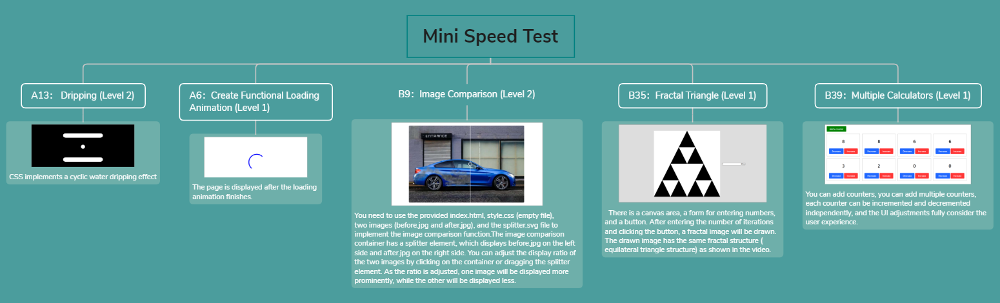
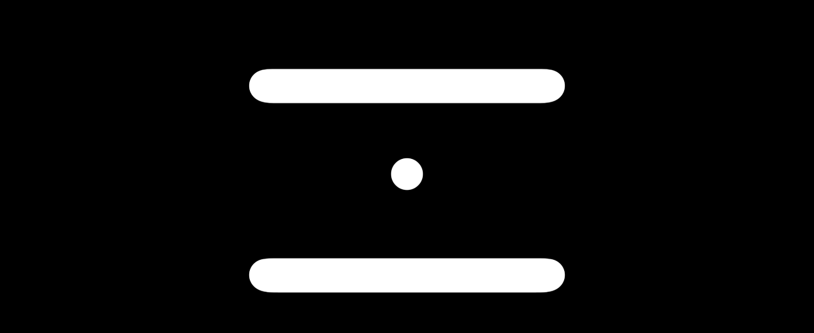
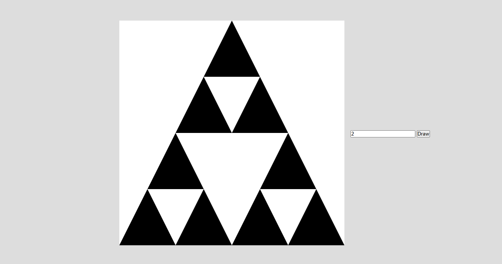
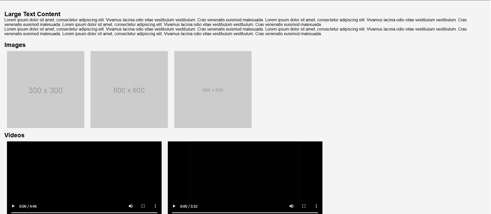

# Project 17 Comprehensive Project – Mini Speed Project (Module A)

## Content Guide
After an in-depth study of JavaScript knowledge points, we have mastered the basic syntax of JavaScript, DOM programming, BOM programming, and JavaScript object-oriented programming. To consolidate what we have learned in a timely and effective manner, this project will use the knowledge covered in the first five chapters to develop a comprehensive project – the Mini Speed Test Project (Module A).This project includes six tasks:A13: Water Droplets (Level 2)、A22: CSS Bar Chart (Level 1)、A6: Creating a Functional Loading Animation (Level 1)、B9: Image Comparison (Level 2)、B35: Fractal Triangles (Level 1)、B39: Multiple Calculators (Level 1).

## Learning Objectives
- ① Apply the basic core syntax of JavaScript to master the complete knowledge system from basic syntax to advanced features, and be proficient in using core concepts such as variables, data types, type conversion, process control, functions, arrays, and objects to implement basic web page interactions.
- ② Apply JavaScript object-oriented programming, gain an in-depth understanding of object-oriented programming, event handling mechanisms, DOM manipulation and other knowledge to complete form validation, dynamic content rendering, etc.

#### 17.1 Scoring Summary

| No. | Sub-criteria | Marks |
| --- | --- | --- |
| 1 | Mini Test Project | 4 |
| 2 | Design Implementation | 2 |
| 3 | Front-end Development | 2 |
| 4 | Back-end Development | 2 |

#### 17.2 Project Introduction
In this mini speed test project, you will complete several mini-tasks. Each small test project has three levels.
Level 1: Worth 0.5 points, estimated working time less than 15 minutes.
Level 2: Worth 1.0 point, estimated working time less than 30 minutes.
Level 3: Worth 1.5 points, estimated working time about 30 minutes.

#### 17.3 Requirement Analysis
The mini speed test project is divided into five major tasks, including A13: Water Droplets (Level 2), A22: CSS Bar Chart (Level 1), A6: Creating a Functional Loading Animation (Level 1), B9: Image Comparison (Level 2), B35: Fractal Triangles (Level 1), and B39: Multiple Calculators (Level 1). The functional description of each task is as follows.
The structure diagram of the project functional tasks is shown in Figure 17-1.
<p align="center">
  
</p>

<p align="center"><em>Figure 17-1 Functional Structure Diagram</em></p>

#### 1. Tasks of the Mini Speed Test Project
The Mini Speed Test Project includes the following tasks: A13: Water Droplets (Level 2), A6: Creating a Functional Loading Animation (Level 1), B9: Image Comparison (Level 2), B35: Fractal Triangles (Level 1), and B39: Multiple Calculators (Level 1). These are the most comprehensive tasks in terms of effects and functions in the comprehensive project.

##### (1) Water Droplets
In this task, HTML and CSS are required to implement a circulating water droplet effect. The core functions include: realizing an animation where a black circular element continuously falls vertically inside a container.

##### (2) Fractal Triangles
This task requires building an interactive fractal triangle generator. The core functions include: a canvas area, a form for number input, and a button. After entering the number of iterations and clicking the button, a fractal image will be drawn. The rendered image features an equilateral triangle structure.

##### (3) Multiple Calculators
This task requires implementing a dynamic counter system. The core functions include: dynamically generating new counter components in a grid-layout container when the user clicks the "Add a counter" button; each counter contains a number display area and "Decrease/Increase" buttons to adjust the value by clicking; the interface adopts a responsive grid layout (4 columns per row), and the buttons are designed with hover interaction effects (white background + black text) and color indicators.

##### (4) Creating a Functional Loading Animation
This task implements a web page loading transition animation that displays the home page after the animation ends. The core functions include: displaying a full-screen rotating loading animation (blue circle with dynamic pseudo-elements) when the page loads, which automatically hides after 3 seconds; the main content adopts a modular layout, including text sections, image displays (3 placeholder images of different sizes), video playback areas (2 local videos), an interactive form (name/email input + submit button), and a button for generating dynamic content.

##### (5) Image Comparison
This task requires building an interactive image comparison tool. The core functions include: using double-layer overlay combined with CSS absolute positioning and a slider control to allow users to drag the slider to adjust the display ratio of the before-and-after images in real time; with a dynamic divider line to visualize the comparison area, and a circular slider button with a border to enhance operation feedback, finally forming an interactive image difference comparison effect.

#### 17.4 Page Design

### 17.4.1 Directory Structure
The project is named module_a, and the resource folder contains the contents shown in Table 17-1:

**Table 17-1 Resource Folder Contents**

| No. | Directory &amp; Main Filename | Files Included | Task Description |
| --- | --- | --- | --- |
| 1 | A13 | index.html | Water Droplets |
| 2 | B35 | index.html | Fractal Triangles |
| 3 | B39 | index.html | Multiple Counters |
| 4 | A6 | index.html | Create a Functional Loading Animation |
| 5 | B9 | index.html | Image Comparison |

### 17.4.2 Design Concept

##### (1) Water Droplets
A black circular droplet element is driven by CSS animation to continuously fall from the top to the bottom of the container. An SVG filter is applied to simulate the viscous trailing effect of water droplets. A black-and-white inversion filter is used on the entire page to enhance visual contrast, and two black semicircular boundaries at the top and bottom limit the movement range of the droplets.
The water droplet effect is shown in Figure 17-2.
<p align="center">
  
</p>

<p align="center"><em>Figure 17-2 Water Droplets</em></p>

##### (2) Fractal Triangles
This task implements an interactive fractal triangle generator. The user sets the maximum recursion level through a numeric input field. After clicking the button, the Canvas drawing function is triggered to recursively generate a white triangular fractal pattern on a black background. Initially, a large inverted triangle is drawn, and then smaller triangles are recursively drawn in three subregions. The recursion depth is controlled by the input value. The effect is shown in Figure 17-3.
<p align="center">
  
</p>

<p align="center"><em>Figure 17-3 Fractal Triangle</em></p>

##### (3) Multiple Counters
This task implements a dynamic counter. Users can click the "Add a counter" button to generate independent counter units. Each unit includes a count area that displays the real-time value and "Decrease / Increase" buttons, supporting interactive value adjustment, as shown in Figure 17-4.
<p align="center">
  
</p>

<p align="center"><em>Figure 17-4 Multiple Counters</em></p>

##### (4) Creating a Functional Loading Animation
This task implements a web page loading transition animation that displays the home page after the animation finishes. A rotating ring loading animation is created using CSS, and JavaScript is used to keep the loading layer visible for 3 seconds after page load before hiding it, achieving a smooth transition. The main content includes text sections, an image group (3 placeholder images of different sizes), a video group (2 local videos), and an interactive form, supporting load event listening for images and videos. New content can be added to the dynamic content area at the bottom via a button. The whole page uses a responsive layout to adapt to different devices, with a dark header and footer paired with a light main background, as shown in Figure 17-5 and Figure 17-6.
<p align="center">
  
</p>

<p align="center"><em>Figure 17-5 Loading Animation</em></p>
<p align="center">
  
</p>

<p align="center"><em>Figure 17-6 Page displayed after animation</em></p>

##### (5) Image Comparison
This task implements an interactive image comparison tool. Using double-layer superimposition combined with CSS absolute positioning and a slider control, users can drag the slider to adjust the display ratio of the before and after images in real time. With a dynamic divider, the comparison area is visualized, and a round slider button with a border is used to enhance operation feedback, finally forming an interactive image difference comparison effect, as shown in Figure 17-7.
<p align="center">
  
</p>

<p align="center"><em>Figure 17-7 Image Comparison</em></p>

#### 17.5 Project Implementation
Task 1 Water Droplets

#### Step 1: Create the water droplet page in the A13 directory. Create a new HTML page named index.html. Use an SVG filter (#goo) to achieve a viscous, blurry diffusion effect similar to liquid. Write the page structure.
The code is as follows:

```html
<div class="container">
  <div class="border"></div>
  <div class="border"></div>
  <div class="drop"></div>
  <svg xmlns="http://www.w3.org/2000/svg" version="1.1">
    <defs>
      <filter id="goo">
        <feGaussianBlur
        in="SourceGraphic"
        stdDeviation="10"
        result="blur"
        />
        <feColorMatrix
        in="blur"
        type="matrix"
        values="0 0 0 0 0  0 0 0 0 0  0 0 0 0 0  0 0 0 18 -7"
        result="goo"
        />
        <feBlend in="SourceGraphic" in2="goo" />
      </filter>
    </defs>
  </svg>
</div>
```

#### Step 2: Apply a black-and-white inversion filter to the entire page to enhance visual contrast.
The code is as follows:

```html
<style>
  html {
  filter: invert(1);
  }
  *,
  *::before,
  *::after {
  box-sizing: border-box;
  margin: 0;
  padding: 0;
  }
  body {
  display: flex;
  flex-direction: column;
  align-items: center;
  justify-content: center;
  min-height: 100vh;
  background-color: white;
  }
  .container {
  width: 500px;
  height: 350px;
  position: relative;
  filter: url(#goo);
  }
  .border {
  width: 100%;
  position: absolute;
  top: 0;
  left: 0;
  right: 0;
  height: 50px;
  background-color: black;
  border-radius: 999px;
  }
  .border:nth-child(2) {
  bottom: 0;
  top: unset;
  }
  .drop {
  width: 50px;
  height: 50px;
  left: 50%;
  position: absolute;
  transform: translateX(-50%);
  background-color: black;
  border-radius: 50%;
  animation: fall 1.5s infinite linear;
  }
</style>
```

#### Step 3: Use CSS animations to drive the black circular water droplet element to continuously fall from the top to the bottom of the container.
The code is as follows:

```css
@keyframes fall {
  0% {
    top: 0;
  }
  100% {
    top: 85%;
  }
}
```

#### Step 4: Run the index.html file to view the effect.
Task 2 Fractal Triangle

#### Step 1: Create the fractal triangle page in the B35 directory. Create a new HTML page named index.html, which includes a canvas area, a form for entering numbers, and a button. Write the page structure.
The code is as follows:

```html
<!DOCTYPE html>
<html lang="en">
  <head>
    <!-- Meta Tags -->
    <meta charset="UTF-8" />
    <meta name="viewport" content="width=device-width, initial-scale=1.0" />
    <title>Document</title>
  </head>
  <body>
    <canvas width="800" height="800"></canvas>
    <input type="number" id="maxNumberInput">
    <button onclick="draw()">Draw</button>
  </body>
</html>
```

#### Step 2: Style construction.
The code is as follows:

```html
<!DOCTYPE html>
<html lang="en">
  <head>
    <!-- Meta Tags -->
    <meta charset="UTF-8" />
    <meta name="viewport" content="width=device-width, initial-scale=1.0" />
    <title>Document</title>
    <style>
      * {
      margin: 0;
      padding: 0;
      box-sizing: border-box;
      }
      body {
      height: 100vh;
      background: #dddddd;
      display: flex;
      align-items: center;
      justify-content: center;
      }
      canvas {
      background: #fff;
      }
      input {
      margin-left: 2rem;
      }
    </style>
  </head>
  <body>
    <canvas width="800" height="800"></canvas>
    <input type="number" id="maxNumberInput">
    <button onclick="draw()">Draw</button>
  </body>
</html>
```

#### Step 3: Clear the canvas and draw the initial large triangle.
The code is as follows:

```html
<script>
  const cSize = 800;
  function draw(){
  const maxCount = document.querySelector("#maxNumberInput").value;
  const canvas = document.querySelector("canvas");
  const ctx = canvas.getContext("2d");
  ctx.clearRect(0, 0, cSize, cSize);
  ctx.moveTo(cSize / 2, 0);//top vertex
  ctx.lineTo(cSize, cSize);//bottom right vertex
  ctx.lineTo(0, cSize);//lower left vertex
  ctx.fillStyle = "black";
  ctx.fill();//Fill with black background
  }
</script>
```

#### Step 4: Clear the canvas and draw the initial large triangle.
The code is as follows:

```html
<script>
  const cSize = 800;
  function draw(){
  const maxCount = document.querySelector("#maxNumberInput").value;
  const canvas = document.querySelector("canvas");
  const ctx = canvas.getContext("2d");
  ctx.clearRect(0, 0, cSize, cSize);
  ctx.moveTo(cSize / 2, 0);//top vertex
  ctx.lineTo(cSize, cSize);//bottom right vertex
  ctx.lineTo(0, cSize);//lower left vertex
  ctx.fillStyle = "black";
  ctx.fill();//Fill with black background
  //Start recursive drawing
  ctx.fillStyle = "white";
  function repeat(x, y, size, count) {
  //Recursion termination condition: Exceeding the maximum number of iterations
  if(++count > maxCount) return;
  //Draw an inverted small triangle
  ctx.beginPath();
  ctx.moveTo(x - size / 2, y - size);//apex
  ctx.lineTo(x + size / 2, y - size);//upper right vertex
  ctx.lineTo(x, y);//lower vertex
  ctx.fill();//fill white
  //Three-direction recursion (up, left-down, right-down)
  repeat(x, y - size, size / 2, count);//above
  repeat(x - size/2, y, size / 2, count);//lower left
  repeat(x + size/2, y, size / 2, count);//lower right
  }
  //Start from the bottom center
  repeat(cSize / 2, cSize, cSize / 2, 0);
  }
</script>
```

#### Step 5: Run the index.html file to view the effect.
Task 3 Multiple Counters

#### Step 1: Create the multiple counters page in the B39 directory. Create a new HTML page named index.html with an "Add a counter" button. Write the page structure.
The code is as follows:

```html
<!DOCTYPE html>
<html lang="en">
  <head>
    <!-- Meta Tags -->
    <meta charset="UTF-8" />
    <meta name="viewport" content="width=device-width, initial-scale=1.0" />
    <title>B39</title>
  </head>
  <body>
    <button class="btn add" id="add">Add a counter</button>
    <div class="counters" id="counters"></div>
  </body>
</html>
```

#### Step 2: Style construction.
The code is as follows:

```html
<!DOCTYPE html>
<html lang="en">
  <head>
    <!-- Meta Tags -->
    <meta charset="UTF-8" />
    <meta name="viewport" content="width=device-width, initial-scale=1.0" />
    <title>B39</title>
    <style>
      *,
      *::before,
      *::after {
      box-sizing: border-box;
      margin: 0;
      padding: 0;
      font-family: "Segoe UI", Tahoma, Geneva, Verdana, sans-serif;
      font-size: 1rem;
      border: 0;
      }
      body {
      display: flex;
      flex-direction: column;
      gap: 1rem;
      padding: 1rem;
      min-height: 100vh;
      align-items: flex-start;
      }
      .btn {
      font-weight: 500;
      padding: 0.5rem 1.2rem;
      font-size: 1rem;
      cursor: pointer;
      border-radius: 0.25rem;
      color: white;
      border: 2px solid red;
      transition: 0.2s;
      }
      .btn:hover {
      background-color: white !important;
      color: black;
      }
      .btn.add {
      background-color: green;
      border-color: green;
      }
      .btn.blue {
      border-color: #2067ff;
      background-color: #2067ff;
      }
      .btn.red {
      background-color: #ff3636;
      border-color: #ff3636;
      }
      .counter {
      padding: 1rem;
      display: flex;
      flex-direction: column;
      gap: 1rem;
      align-items: center;
      border: 1px solid #aaa;
      }
      .counter .count {
      font-size: 2rem;
      font-weight: 500;
      margin: 1rem 0;
      }
      .counters {
      display: grid;
      grid-template-columns: repeat(4, 1fr);
      gap: 1rem;
      }
    </style>
  </head>
  <body>
    <button class="btn add" id="add">Add a counter</button>
    <div class="counters" id="counters"></div>
  </body>
</html>
```

#### Step 3: Dynamically generate counter components.
The code is as follows:

```html
<script>
  const add = document.getElementById("add");
  const counters = document.getElementById("counters");
  add.onclick = () => {
  const id = (Date.now() + Math.floor(Math.random() * 1000)).toString(16);
  counters.innerHTML += `
  <div class="counter">
    <span class="count" id="counter-${id}">0</span>
    <div class="row">
      <button class="btn blue" onclick="decrease('${id}')">Decrease</button>
      <button class="btn red" onclick="increase('${id}')">Increase</button>
    </div>
  </div>
  `;
  };
</script>
```

#### Step 4: Counter operation function.
The code is as follows:

```html
<script>
  const add = document.getElementById("add");
  const counters = document.getElementById("counters");
  add.onclick = () => {
  const id = (Date.now() + Math.floor(Math.random() * 1000)).toString(16);
  counters.innerHTML += `
  <div class="counter">
    <span class="count" id="counter-${id}">0</span>
    <div class="row">
      <button class="btn blue" onclick="decrease('${id}')">Decrease</button>
      <button class="btn red" onclick="increase('${id}')">Increase</button>
    </div>
  </div>
  `;
  };
  function decrease(id) {
  document.getElementById(`counter-${id}`).innerText =
  Number(document.getElementById(`counter-${id}`).innerText) - 1;
  }
  function increase(id) {
  document.getElementById(`counter-${id}`).innerText =
  Number(document.getElementById(`counter-${id}`).innerText) + 1;
  }
</script>
```

#### Step 5: Run the index.html file to view the effect.
Task 4 Creating a Functional Loading Animation

#### Step 1: Create the functional loading animation page in the A6 directory. Create a new HTML page named index.html, create a rotating loading animation, and set the header title to "Heavy HTML Page". Write the page structure.
The code is as follows:

```html
<!DOCTYPE html>
<html lang="en">
  <head>
    <!-- Meta Tags -->
    <meta charset="UTF-8" />
    <meta name="viewport" content="width=device-width, initial-scale=1.0" />
    <title>A6</title>
  </head>
  <body>
    <header>
      <h1>Heavy HTML Page</h1>
    </header>
    <div class="container">
      <div class="loading-container">
        <!-- YOUR CODE HERE -->
        <div id="loading">
          <div class="circle">
            <div class="item"></div>
          </div>
        </div>
      </div>
    </div>
  </body>
</html>
```

#### Step 2: Display the page after the animation. It includes Large Text Content, image content, videos, form submission, and Footer Content Here at the bottom. Write the page structure.
The code is as follows:

```html
<!DOCTYPE html>
<html lang="en">
  <head>
    <!-- Meta Tags -->
    <meta charset="UTF-8" />
    <meta name="viewport" content="width=device-width, initial-scale=1.0" />
    <title>A6</title>
  </head>
  <body>
    <header>
      <h1>Heavy HTML Page</h1>
    </header>
    <div class="container">
      <div class="loading-container">
        <!-- YOUR CODE HERE -->
        <div id="loading">
          <div class="circle">
            <div class="item"></div>
          </div>
        </div>
      </div>
      <section class="content">
        <h2>Large Text Content</h2>
        <p>Lorem ipsum dolor sit amet, consectetur adipiscing elit. Vivamus lacinia odio vitae vestibulum vestibulum.
          Cras venenatis euismod malesuada. Lorem ipsum dolor sit amet, consectetur adipiscing elit. Vivamus lacinia
          odio vitae vestibulum vestibulum. Cras venenatis euismod malesuada. Lorem ipsum dolor sit amet, consectetur
          adipiscing elit. Vivamus lacinia odio vitae vestibulum vestibulum. Cras venenatis euismod malesuada.</p>
          <p>Lorem ipsum dolor sit amet, consectetur adipiscing elit. Vivamus lacinia odio vitae vestibulum vestibulum.
            Cras venenatis euismod malesuada. Lorem ipsum dolor sit amet, consectetur adipiscing elit. Vivamus lacinia
            odio vitae vestibulum vestibulum. Cras venenatis euismod malesuada. Lorem ipsum dolor sit amet, consectetur
            adipiscing elit. Vivamus lacinia odio vitae vestibulum vestibulum. Cras venenatis euismod malesuada.</p>
          </section>
          <section class="images">
            <h2>Images</h2>
            
            
            
          </section>
          <section class="videos">
            <h2>Videos</h2>
            <video oncanplay="loadMedia()" src="assets/Bohemian%20Rhapsody%20_%20Muppet%20Music%20Video%20_%20The%20Muppets.mp4" controls loop></video>
            <video oncanplay="loadMedia()" src="assets/Rick%20Astley%20-%20Never%20Gonna%20Give%20You%20Up%20(Official%20Music%20Video).mp4" controls loop></video>
          </section>
          <section class="form-section">
            <h2>Interactive Forms</h2>
            <form>
              <label for="name">Name:</label><br>
              <input type="text" id="name" name="name"><br><br>
              <label for="email">Email:</label><br>
              <input type="email" id="email" name="email"><br><br>
              <input type="submit" value="Submit">
            </form>
          </section>
          <section class="dynamic-content">
            <h2>Dynamic Content</h2>
            <button id="dynamicContentBtn">Add Dynamic Content</button>
            <div id="dynamicContent"></div>
          </section>
        </div>
      </body>
    </html>
```

#### Step 3: Style construction.
The code is as follows:

```html
<!DOCTYPE html>
<html lang="en">
  <head>
    <!-- Meta Tags -->
    <meta charset="UTF-8" />
    <meta name="viewport" content="width=device-width, initial-scale=1.0" />
    <title>A6</title>
    <style>
      * {
      font-family: Arial, sans-serif;
      margin: 0;
      padding: 0;
      box-sizing: border-box;
      }
      body{
      background-color: #f4f4f4;
      }
      header, footer {
      background-color: #333;
      color: #fff;
      text-align: center;
      padding: 1em 0;
      }
      .container {
      padding: 20px;
      }
      .images img {
      width: 100%;
      max-width: 300px;
      margin: 10px;
      }
      .videos iframe, .videos video {
      width: 100%;
      max-width: 600px;
      height: 300px;
      margin: 10px;
      object-fit: cover;
      }
      .content {
      margin: 20px 0;
      }
      .form-section {
      margin: 20px 0;
      }
      /* YOUR CODE HERE */
      #loading {
      background: #fff;
      display: flex;
      justify-content: center;
      align-items: center;
      position: fixed;
      left: 0;
      right: 0;
      top: 0;
      bottom: 0;
      z-index: 989;
      }
      #loading .circle {
      width: 200px;
      height: 200px;
      border: 10px solid blue;
      border-radius: 50%;
      position: relative;
      animation: loadingAni 1s linear infinite;
      }
      #loading .circle::before,
      #loading .circle::after {
      content: "";
      position: absolute;
      width: 10px;
      height: 10px;
      border-radius: 50%;
      background: blue;
      z-index: 2;
      }
      #loading .circle::before {
      left: -10px;
      top: calc(50% - 5px);
      }
      #loading .circle::after {
      right: -10px;
      top: calc(50% - 5px);
      }
      #loading .circle .item {
      position: absolute;
      left: -20px;
      right: -20px;
      top: 50%;
      bottom: -20px;
      background: #fff;
      }
      @keyframes loadingAni {
      to {
      transform: rotate(1turn);
      }
      }
    </style>
  </head>
  <body>
    <header>
      <h1>Heavy HTML Page</h1>
    </header>
    <div class="container">
      <div class="loading-container">
        <!-- YOUR CODE HERE -->
        <div id="loading">
          <div class="circle">
            <div class="item"></div>
          </div>
        </div>
      </div>
      <section class="content">
        <h2>Large Text Content</h2>
        <p>Lorem ipsum dolor sit amet, consectetur adipiscing elit. Vivamus lacinia odio vitae vestibulum vestibulum.
          Cras venenatis euismod malesuada. Lorem ipsum dolor sit amet, consectetur adipiscing elit. Vivamus lacinia
          odio vitae vestibulum vestibulum. Cras venenatis euismod malesuada. Lorem ipsum dolor sit amet, consectetur
          adipiscing elit. Vivamus lacinia odio vitae vestibulum vestibulum. Cras venenatis euismod malesuada.</p>
          <p>Lorem ipsum dolor sit amet, consectetur adipiscing elit. Vivamus lacinia odio vitae vestibulum vestibulum.
            Cras venenatis euismod malesuada. Lorem ipsum dolor sit amet, consectetur adipiscing elit. Vivamus lacinia
            odio vitae vestibulum vestibulum. Cras venenatis euismod malesuada. Lorem ipsum dolor sit amet, consectetur
            adipiscing elit. Vivamus lacinia odio vitae vestibulum vestibulum. Cras venenatis euismod malesuada.</p>
          </section>
          <section class="images">
            <h2>Images</h2>
            
            
            
          </section>
          <section class="videos">
            <h2>Videos</h2>
            <video oncanplay="loadMedia()" src="assets/Bohemian%20Rhapsody%20_%20Muppet%20Music%20Video%20_%20The%20Muppets.mp4" controls loop></video>
            <video oncanplay="loadMedia()" src="assets/Rick%20Astley%20-%20Never%20Gonna%20Give%20You%20Up%20(Official%20Music%20Video).mp4" controls loop></video>
          </section>
          <section class="form-section">
            <h2>Interactive Forms</h2>
            <form>
              <label for="name">Name:</label><br>
              <input type="text" id="name" name="name"><br><br>
              <label for="email">Email:</label><br>
              <input type="email" id="email" name="email"><br><br>
              <input type="submit" value="Submit">
            </form>
          </section>
          <section class="dynamic-content">
            <h2>Dynamic Content</h2>
            <button id="dynamicContentBtn">Add Dynamic Content</button>
            <div id="dynamicContent"></div>
          </section>
        </div>
      </body>
    </html>
```

#### Step 4: Implement the page function after the loading animation with a 3-second delay.
The code is as follows:

```html
<script>
  // Execute after the page is fully loaded
  window.onload = function() {
  // Set to execute page redirect after 3 seconds
  setTimeout(() => {
  // Hide the loading layer
  document.getElementById('loading').style.display = 'none';
  }, 3000); // 3-second delay
  };
</script>
```

#### Step 5: Run the index.html file to view the effect.
Task 5 Image Comparison

#### Step 1: Create the image comparison page in the B9 directory. Create a new HTML page named index.html. The image comparison container contains a splitter element, which displays before.jpg on the left and after.jpg on the right. Write the page structure.
The code is as follows:

```html
<!DOCTYPE html>
<html lang="en">
  <head>
    <!-- Meta Tags -->
    <meta charset="UTF-8" />
    <meta name="viewport" content="width=device-width, initial-scale=1.0" />
    <title>Image Compare</title>
  </head>
  <body>
    <div class="container">
      <input type="range" min="0" max="992" id="range" />
      
      
    </div>
  </body>
</html>
```

#### Step 2: Style construction.
The code is as follows:

```html
<style>
  *,
  *::before,
  *::after {
  box-sizing: border-box;
  margin: 0;
  padding: 0;
  }
  body {
  display: flex;
  flex-direction: column;
  align-items: center;
  justify-content: center;
  min-height: 100vh;
  }
  .container {
  width: 1024px;
  height: 682px;
  position: relative;
  border-radius: 0.5rem;
  overflow: hidden;
  }
  img {
  position: absolute;
  inset: 0;
  width: 100%;
  height: 100%;
  object-fit: cover;
  object-position: left;
  }
  input {
  z-index: 100;
  appearance: none;
  background-color: transparent;
  position: absolute;
  inset: 0;
  width: 100%;
  height: 100%;
  }
  input::-webkit-slider-thumb {
  appearance: none;
  width: 32px;
  height: 32px;
  background-repeat: no-repeat;
  border: 3px solid white;
  border-radius: 50%;
  backdrop-filter: blur(1rem);
  background-image: url("splitter.svg") 32px no-repeat;
  }
  .container::before {
  content: "";
  position: absolute;
  height: 100%;
  top: 0;
  width: 3px;
  left: var(--left, 510.5px);
  background-color: white;
  z-index: 100;
  }
</style>
```

#### Step 3: Initialization call: Execute the init() method to complete the initial setup.
The code is as follows:

```html
<script>
  class ImageComparator {
  constructor() {
  this.range = document.getElementById('range');
  this.beforeImg = document.getElementById('before');
  this.container = document.querySelector('.container');
  this.init();
  }
  }
  let ImageCom = new ImageComparator();
</script>
```

#### Step 4: Set the initial comparison width and bind the slider events.
The code is as follows:

```html
<script>
  class ImageComparator {
  constructor() {
  this.range = document.getElementById('range');
  this.beforeImg = document.getElementById('before');
  this.container = document.querySelector('.container');
  this.init();
  }
  init() {
  this.beforeImg.style.width = '512px';
  this.range.addEventListener('input', e => this.handleSlider(e));
  }
  }
  let ImageCom = new ImageComparator();
</script>
```

#### Step 5: Slider interaction handling.
The code is as follows:

```html
<script>
  class ImageComparator {
  constructor() {
  this.range = document.getElementById('range');
  this.beforeImg = document.getElementById('before');
  this.container = document.querySelector('.container');
  this.init();
  }
  init() {
  this.beforeImg.style.width = '512px';
  this.range.addEventListener('input', e => this.handleSlider(e));
  }
  handleSlider(e) {
  const value = +e.target.value;
  this.beforeImg.style.width = `${value + 16}px`;
  this.container.style.setProperty('--left', `${value + 14.5}px`);
  }
  }
  let ImageCom = new ImageComparator();
</script>
```

#### Step 5: Run the index.html file to view the effect.
Part 5 Choosing the Right Framework Is More Important Than Blindly Following Trends
