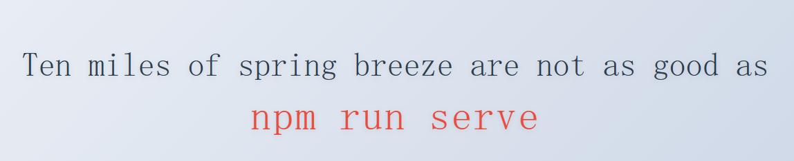
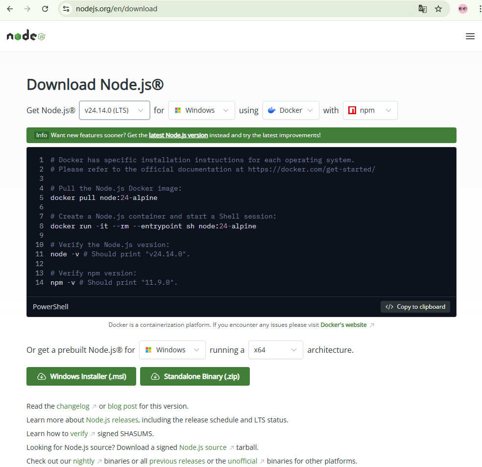
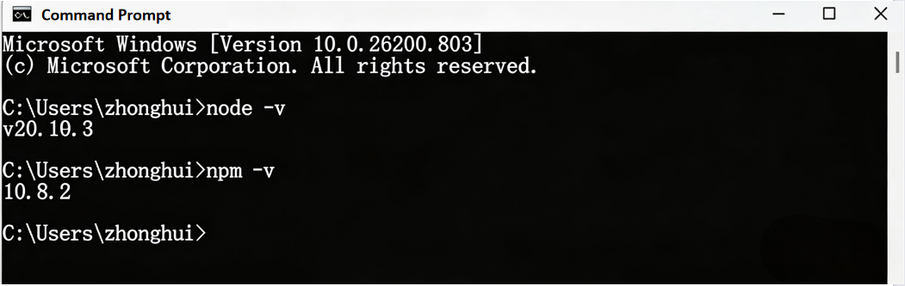
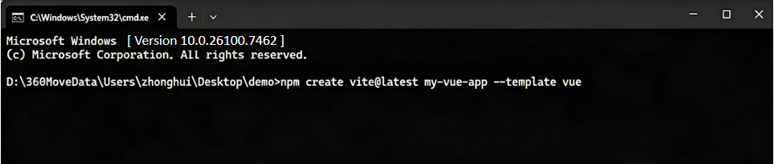
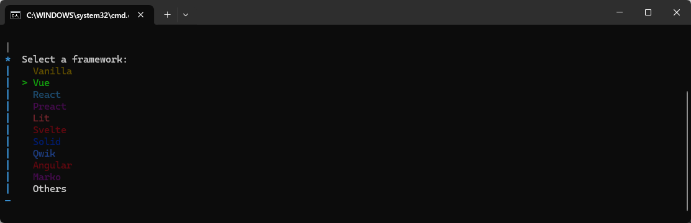
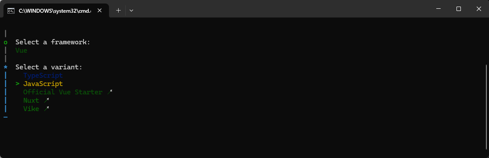
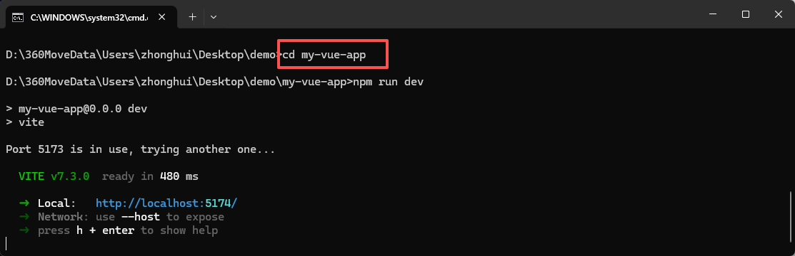
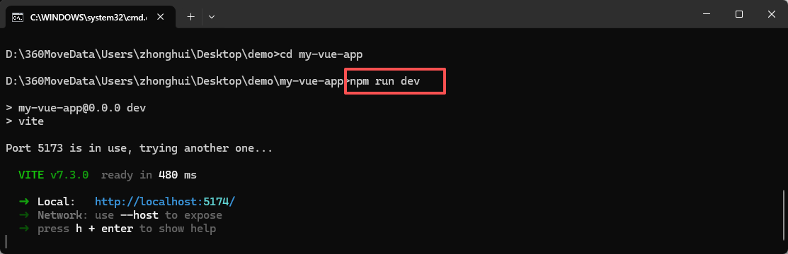
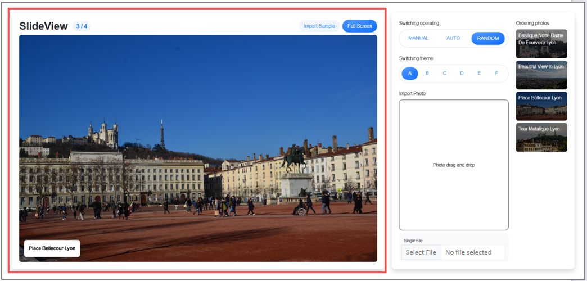

# Project 19 Vite Scaffold — One-Click Setup, Easy to Get Started

## Content Guide

The Vite scaffold is used to quickly build a Vue 3 project development environment. Before installation, configure the latest Node.js environment, and run the command npm create vite@latest project-name --template vue to initialize the project. Use create-vue to create a Vue 3 project and configure modules such as Router, Vuex, and Sass. It provides component-based development and state management support for the photo slideshow feature in the WorldSkills Competition website technology.

In the project development stage, use Vue's reactive data binding and component-based features to build image uploading, dynamic rendering, and carousel animation logic in src/components, and achieve smooth switching effects with CSS3. Manage the slideshow page routes through Vue Router, and centrally manage the image data state with Vuex.

## Learning Objectives

- ① Master the installation of the scaffold.
- ② Understand the Vue project structure.
- ③ Be familiar with Vue instances and options.
- ④ Be familiar with data binding.
- ⑤ Master Vue computed properties and understand the differences between computed properties and methods.
- ⑥ Understand the Vue lifecycle.

## Task 19.1 Nothing Compares to npm run dev

### 19.1.1 Task Description

Use "Nothing Compares to npm run dev" as my first Vue 3 case. The displayed content mainly includes the Vue CLI scaffold, quickly building a project through the scaffold, starting the project, and viewing the displayed result in the address bar. The case effect is shown in Figure 19-1.

<p align="center">
  
</p>

<p align="center"><em>Figure 19-1 Nothing Compares to npm run dev</em></p>

### 19.1.2 Knowledge Preparation

In this section, we will introduce how to build a Vue single-page application locally. The created project will use a Vite-based build setup. Before building the project, make sure you have installed the latest version of Node.js. If it is not installed, please install the latest version of Node.js first, as follows:

There are many ways to use Vue in a project. The simpler methods covered in this chapter are downloading Vue 3 locally and installing Vue 3 via the Node Package Manager (NPM).

#### 1. Installation of Vue Scaffold Tools

create-vue is the officially recommended scaffold tool for Vue. The prerequisite is that Node.js has been installed, since Node.js comes with npm (Node Package Manager) by default.

To install Node.js, enter the download URL in the browser address bar:“https://nodejs.org/en/download”to enter the Node.js installer download interface, as shown in Figure 19-2.

<p align="center">
  
</p>

<p align="center"><em>Figure 19-2 Node installer download interface</em></p>

Select the required installer according to your operating system and download it. After the download is complete, double-click the installation file to proceed with the installation.

Once the installation is finished, you can enter node -v and npm -v in the command-line tool. If the version numbers are displayed normally, it means Node.js has been installed successfully, as shown in Figure 19-3.

<p align="center">
  
</p>

<p align="center"><em>Figure 19-3 Node installed successfully</em></p>

If the installation fails, you can use the npm cache clean command to clear the cache and reinstall. During subsequent installations, if installation failure occurs, you must clear the cache first. Similarly, you can use the npm -v command to verify whether the installation was successful.

#### 2.Initialize the Project

(1) You can create a new project by using the command npm create vite@latest project-name --template vue in an appropriate location, as shown in Figure 19-4 below.

# Using npm

```
npm create vite@latest my-vue-app --template vue
```

# Using yarn

yarn create vite my-vue-app --template vue

# Enter the project directory

cd my-vue-app

<p align="center">
  
</p>

<p align="center"><em>Figure 19-4 Running the project creation command</em></p>

(2) After entering the command, press the Enter key, select Vue as the framework (using the arrow keys), and press Enter again, as shown in Figure 19-5 below.

<p align="center">
  
</p>

<p align="center"><em>Figure 19-5 Select "Vue" as the framework</em></p>

(3) You will be prompted to choose the project creation mode. Use the up and down arrow keys to select either JavaScript or TypeScript, then press Enter, as shown in Figure 19-6 below.

<p align="center">
  
</p>

<p align="center"><em>Figure 19-6 Select "JavaScript" or "TypeScript"</em></p>

（4）Enter the project directory and press Enter directly, as shown in Figure 19-7 below.

<p align="center">
  
</p>

<p align="center"><em>Figure 19-7 Enter the project</em></p>

##### (5) Enter npm run dev to start the project, as shown in Figure 19-8 below.

<p align="center">
  
</p>

<p align="center"><em>Figure 19-8 Starting the Project</em></p>

(6)Enter http://localhost:5173 in the browser address bar to preview the running effect of the project.

### 19.1.3 Task Implementation

The project "Ten miles of spring breeze are not as good as npm run dev" is divided into the following three steps, as detailed below.

#### Step 1: Go to the src directory and modify the App.vue page.

```vue
<template>
<div class="spring-container">
<div class="spring-text">
<span class="text-line">Ten miles of spring breeze are not as good as</span>
<span class="text-line">npm run serve</span>
</div>
</div>
</template>
```

#### Step 2: Style construction.

```html
<style scoped>
  @keyframes fall {
  0% { transform: translateY(-100px) rotate(0deg); }
  100% { transform: translateY(100vh) rotate(360deg); }
  }
  .spring-container {
  min-height: 100vh;
  background: linear-gradient(135deg, #f5f7fa 0%, #c3cfe2 100%);
  display: flex;
  flex-direction: column;
  justify-content: center;
  align-items: center;
  overflow: hidden;
  }
  .spring-text {
  z-index: 10;
  font-family: 'ZCOOL XiaoWei', serif;
  text-align: center;
  font-size: 4rem;
  line-height: 1.2;
  color: #2c3e50;
  text-shadow: 0 2px 10px rgba(0,0,0,0.1);
  }
  .text-line {
  display: block;
  margin: 10px 0;
  }
  .text-line:last-child {
  color: #e74c3c;
  font-size: 5rem;
  letter-spacing: 3px;
  }
  .petal {
  position: absolute;
  width: 20px;
  height: 20px;
  background-image:
  radial-gradient(circle at 30% 30%, #ff9a9e 0%, #fad0c4 100%);
  border-radius: 50% 50% 50% 0;
  transform-origin: center bottom;
  animation-timing-function: cubic-bezier(0.4, 0.2, 0.6, 0.8);
  }
</style>
```

#### Step 3: Enter the command npm run dev to start the project and view the effect.

## Task 19.2 Project Practice — Photo Slideshow System — Loading Image Files (Module E)

### 19.2.1 Task Description

This practical project implements the image file loading module in the photo slideshow system. Users can load images by dragging and dropping image files to the drop area, and these images will then be displayed and played with themed animations.

When CSS is unavailable or disabled, users can still select photo files via the file input. The photos will then be loaded and listed on the web page without applying any styles.

### 19.2.2 Effect Display

The effect display of loading image files is shown in Figure 19-11.

<p align="center">
  
</p>

<p align="center"><em>Figure 19-11 Loading Image Files</em></p>

### 19.2.3 Task Implementation

#### Step 1: Use the command npm create vite@latest project-name --template vue to generate a project named module_e-src. The project directory structure is as follows:

34_module_e: This directory stores static resource files (mainly used for initializing photos).

module_e-src

├─ node_modules/：Directory for project dependency packages

├─ public/：Directory for public static resources

├─ src/：Source code directory

├─ assets/：Static resources (manually created directory)

├─ components/：Reusable Vue components (manually created directory)

├─ EffectA.vue：Load photos

├─ App.vue ：Root component

├─ main.js ：Application entry file

├─ config.js ：File for configuring slide duration (manually created)

├─  helper.js ：File for randomly generating image names (manually created)

├─ store.js ： File for matching slideshow configuration (manually created)├─ jsconfig.json ：Configures editor behavior for JavaScript projects (e.g., VS Code), providing intelligent suggestions, path completion, module resolution, etc.

├─ package.json ：Core metadata file of the project, recording project dependencies, script commands, version information, etc.

├─ package-lock.json ：Automatically generated file that locks the exact versions of all dependencies and sub-dependencies.

├─ README.md ：Project documentation

#### Step 2: In vite.config.js, configure the initialization for image loading. The code is as follows:

```js
import { fileURLToPath, URL } from 'node:url'
import { defineConfig } from 'vite'
import vue from '@vitejs/plugin-vue'
// https://vitejs.dev/config/
export default defineConfig({
    plugins: [
      vue(),
    ],
  build: {
    outDir: "../34_module_e",
  },
server: {
  port: 3000,
},
base: "/34_module_e",
resolve: {
  alias: {
    '@': fileURLToPath(new URL('./src', import.meta.url))
  }
}
})
```

#### Step 3: In main.js, load the static resource files. The code is as follows:

```vue
import './assets/bootstrap-5.3.3.min.css'
import './assets/common.css'
import './assets/main.css'
import './assets/theme/commonTheme.css'
import { createApp } from 'vue'
import App from './App.vue'
createApp(App).mount('#app')
```

#### Step 4: Define the sliding duration in the config.js file.

The code is as follows:

```js
export const SLIDE_TIME = 3000;
```

#### Step 5: Define random numbers in the helper.js file.

```js
export function getId() {
  return ~~(Math.random() * 10000000);
}
export function convertFilename(name) {
  return name
  .split(".")[0]
  .replaceAll(/-/g, " ")
  .split(" ")
  .map(item => {
      return item.charAt(0).toUpperCase() + item.slice(1).toLowerCase();
    })
.join(" ");
}
```

#### Step 6: Configure the default playback mode in the store.js file.

```js
import {computed, ref} from "vue";
export const appMode = ref('RANDOM'); // MANUAL AUTO RANDOM
export const appTheme = ref("A"); // A B C D E F
export const appImages = ref([]);
export const currentImageIndex = ref(0);
export const currentImage = computed(() => {
    return appImages.value[currentImageIndex.value];
  })
```

#### Step 7: Import and load the homepage file in App.vue.

The code is as follows:

```vue
<script setup>
import SlideController from "@/components/SlideController.vue";
import {ref} from "vue";
</script>
<template>
<div class="row h-100">
<div class="col-8">
<slide-controller></slide-controller>
</div>
<div class="col">
<section class="section h-100">
<div class="row h-100">
<div class="col-8">
<setting-area></setting-area>
</div>
<div class="col">
<ordering-area></ordering-area>
</div>
</div>
</section>
</div>
</div>
<command-area v-if="commandShow"></command-area>
</template>
<style scoped>
#app {
  height: 100vh;
  padding: 2rem;
}
</style>
```

#### Step 8: Load images in components/EffectA.vue.The code is as follows:

```vue
<script setup>
import {currentImage} from "@/store.js";
</script>
<template>

<div class="captionBox">
<div class="caption">{{currentImage.caption}}</div>
</div>
</template>
<style scoped>
</style>
```

#### Step 9: Implement template rendering in the components/SlideController.vue file.

The code is as follows:

```vue
<template>
<section class="section h-100 d-flex flex-column">
<div class="d-flex justify-content-between align-items-center mb-2">
<div class="d-flex align-items-center">
<h1 class="fw-bold mb-0">SlideView</h1>
<div class="ms-3 badge text-primary bigBadge">
{{ currentImageIndex + 1 }} / {{ appImages.length }}
</div>
</div>
<div class="d-flex align-items-center gap-2">
<button class="btn btn-fill text-primary active" @click="importSample">Import Sample</button>
<button class="btn btn-primary enterFull" @click="toggleFullscreen">Full Screen</button>
<button class="btn btn-danger exitFull" @click="toggleFullscreen">Exit Full Screen</button>
</div>
</div>
<div class="flex-grow-1 position-relative">
<div class="staticBox">
<div class="themeContainer">
<div class="text-white" v-if="!appImages.length">Add photos!</div>
<component :is="themeComponent" v-else :key="slideKey"></component>
</div>
</div>
</div>
</section>
</template>
```

#### Step 10: Apply style control in the components/SlideController.vue file.The code is as follows:

```html
<style scoped>
  .bigBadge {
  font-size: 1.2rem;
  }
  .exitFull {
  display: none;
  }
  @media (display-mode: fullscreen) {
  .enterFull {
  display: none;
  }
  .exitFull {
  display: inline-block;
  }
  }
</style>
```

#### Step 11: Import the configuration file in components/SlideController.vue.

The code is as follows:

```vue
<script setup>
import {appImages, appMode, appTheme, currentImageIndex} from "@/store.js";
import {convertFilename, getId} from "@/helper.js";
import {computed, onMounted, ref, watch} from "vue";
import {SLIDE_TIME} from "@/config.js";
import EffectA from "@/components/EffectA.vue";
```

#### Step 12: Define the full-screen control function in components/SlideController.vue, placing it below the imported packages.

The code is as follows:

```js
/* toggle fullscreen */
function toggleFullscreen() {
  /* exit fullscreen */
  if (document.fullscreenElement) {
    document.exitFullscreen();
  } else {
  /* enter fullscreen */
  document.documentElement.requestFullscreen();
}
}
```

#### Step 13: Implement the sample data loading logic in the components/SlideController.vue file, placing it below the full-screen control function.

The code is as follows:

```js
/* import sample data */
function importSample() {
  const sampleFiles = [
    "basilique-notre-dame-de-fourviere-lyon.jpg",
    "beautiful-view-in-lyon.jpg",
    "place-bellecour-lyon.jpg",
    "tour-metalique-lyon.jpg",
  ];
sampleFiles.map(name => {
    appImages.value.push({
        id: getId(),
        image: import.meta.env.DEV
        ? "http://localhost:3000/34_module_e/" + name
        : "http://localhost/34_module_e/" + name,
        caption: convertFilename(name)
      })
})
}
/* automatic load sample data in DEV env */
if (import.meta.env.DEV) {
  //onMounted(importSample);
}
```

#### Step 14: Implement the initialization of the core logic for the slideshow in the components/SlideController.vue file, placing it below the sample data loading logic.

The code is as follows:

```js
let slideInterval = null;
const slideKey = ref(0);
/* run slide */
function setSlideInterval() {
  clearInterval(slideInterval);
  currentImageIndex.value = 0;
  slideKey.value++;
  /* Auto Playing Type */
  if (appMode.value === "AUTO") {
    slideInterval = setInterval(() => {
        /* check exists images */
        if (!appImages.value.length) return;
        /* check last turn */
        if (currentImageIndex.value + 1 === appImages.value.length) {
          currentImageIndex.value = 0;
        } else {
        currentImageIndex.value += 1;
      }
  }, SLIDE_TIME)
}
/* Random Type */
if (appMode.value === "RANDOM") {
  slideInterval = setInterval(() => {
      /* check exists images */
      if (!appImages.value.length) return;
      const randoms = appImages.value
      .map((a, i) => i) // get only index
      .filter(item => item !== currentImageIndex.value); // filter without current index
      if(!randoms.length) return;
      /* set index */
      currentImageIndex.value = randoms[~~(Math.random() * randoms.length)];
    }, SLIDE_TIME)
}
}
```

#### Step 15: Implement keyboard event listening in the components/SlideController.vue file, placing it below the initialization of the slideshow core logic.

The code is as follows:

```js
/* manual control event */
addEventListener("keydown", function (e) {
    if (appMode.value !== "MANUAL" || !appImages.value.length) return;
    if (e.code === "  " && currentImageIndex.value !== 0) {
      currentImageIndex.value -= 1;
    }
  if (e.code === "ArrowRight" && currentImageIndex.value !== appImages.value.length - 1) {
    currentImageIndex.value += 1;
  }
})
```

#### Step 16: Implement dynamic theme component mapping in the components/SlideController.vue file, placing it below the keyboard event listener.

The code is as follows:

```css
/* theme component */
const themeComponent = computed(() => {
  return {
    A: EffectA,
  }[appTheme.value];
})
```

#### Step 17: Implement responsive listening configuration in the components/SlideController.vue file, placing it below the dynamic theme component mapping.

The code is as follows:

```css
watch([appMode, appTheme, appImages], setSlideInterval, {deep: true, immediate: true});
```
