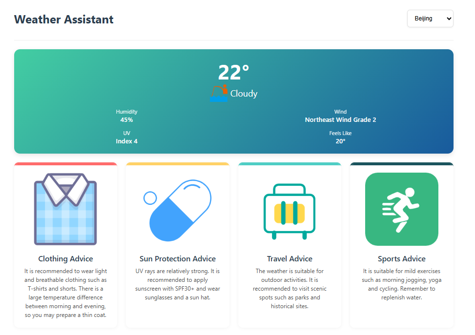
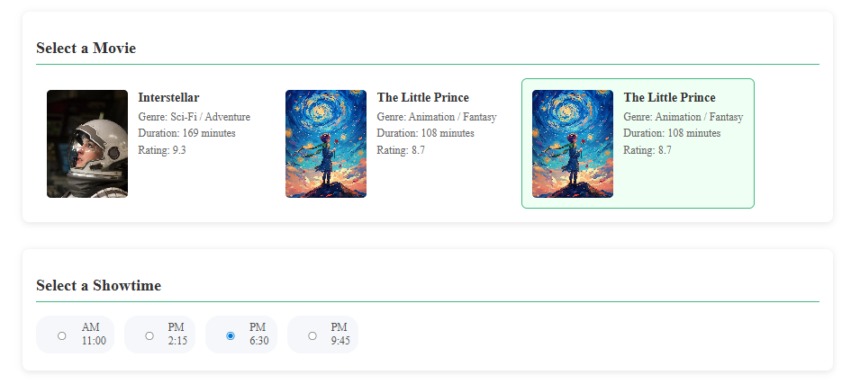
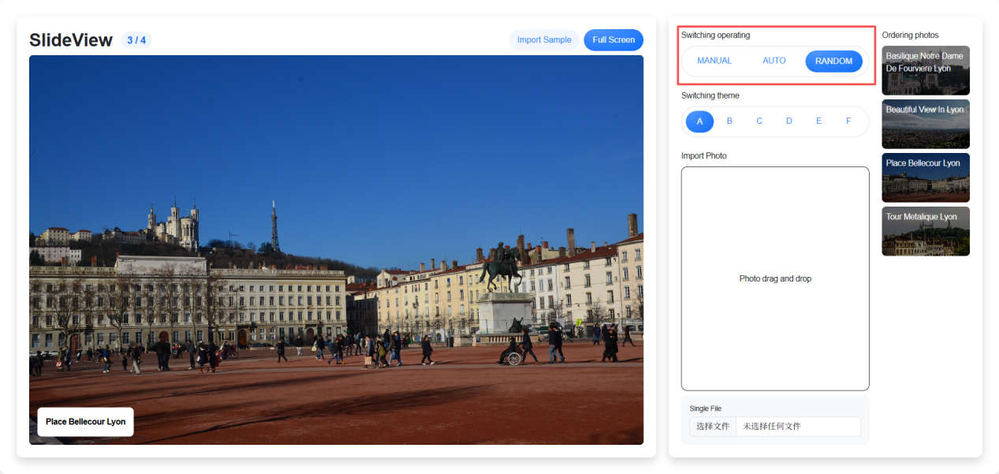

# Project 20 Core Syntax — Transitions in Flexibility, Finding Home in Flow

## Content Guide
In the WorldSkills photo slideshow project based on Vue 3, we will systematically learn core template syntax and reactive interaction techniques. We will implement theme skin switching and UI adaptation in fullscreen mode through dynamic style binding, use conditional rendering directives to control sample data, adopt list rendering directives to efficiently render image queues, and realize interactive functions such as manual navigation and fullscreen switching via event handling.

## Learning Objectives
- ① Master the declarative syntax rules of templates.
- ② Master the use of class binding and style binding to achieve dynamic visual feedback of interface states.
- ③ Be familiar with conditional rendering directives.
- ④ Master the use of v-for to efficiently render array or object data, and handle the update and optimization of dynamic lists.
- ⑤ Master click, input, keyboard and other events.
- ⑥ Master the use of v-model to achieve two-way binding of form inputs.

## Task 20.1 Interactive Weather Query

### 20.1.1 Task Description
In the interactive weather query application built with Vue 3, users can enter a city name in the search box to trigger asynchronous requests in real time and obtain weather data. The application uses the reactive features of Vue 3 to dynamically render key information such as temperature, humidity and wind speed, and displays weather icons (sunny, rainy, etc.) with conditional rendering. The effect of the case is shown in Figure 20-1.
<p align="center">
  
</p>

<p align="center"><em>Figure 20-1 Interactive Weather Query</em></p>

### 20.1.2 Knowledge Preparation
In this section, Vue.js provides some commonly used built-in directives. These built-in directives vary in usage scenarios and complexity, so for the purposes of this chapter, the simple ones among the built-in directives are collectively referred to as basic directives. They are as follows:

#### 1.Usage of v-if and v-show
The v-if directive enables conditional rendering. Vue renders elements based on whether the value of the expression is true or false. For example, in &lt;a v-if="ok"&gt;yes&lt;/a&gt;, if the value of ok is true, "yes" will be displayed; if the value of ok is false, "yes" will not be displayed.
The v-else directive is used together with the v-if directive. It must immediately follow v-if or v-else-if, otherwise it will not work. The code is as follows.

```vue
<template>
<div v-if="loading">Loading...</div>
<div v-if="error" class="error">{{ error }}</div>
<div v-if="weatherData" class="weather-display">...</div>
</template>
```

The v-if directive is used to conditionally render a block of content. This content will only be rendered when the expression of the directive returns a truthy value. The v-show directive, however, renders the HTML regardless of whether the condition is met or not. The code is as follows.

```vue
<template>
<div v-if="loading">Loading...</div>
<div v-show="isMale">Male v-show</div>
<div v-if="error" class="error">{{ error }}</div>
<div v-if="weatherData" class="weather-display">...</div>
</template>
```

#### 2.The v-for Directive
The v-for directive is used to iterate over arrays and objects, and its expression must be used together with the keyword in. The code is as follows.

```vue
<template>
<div class="city-selector">
<select v-model="selectedCity" class="city-select">
<option v-for="(city, key) in weatherData" :value="key">{{ key }}</option>
</select>
</div>
</template>
<script setup>
const weatherDate = {
  "BeiJing":{},
  "Shanghai":{}
}
</script>
```

The above example iterates over the keys of the weatherData object (such as "Beijing") to generate &lt;option&gt; tags, binds the key names to the value attribute, and displays the city names as content.

##### (1) Iterate over an array

```vue
<template>
<ul>
<li v-for="item in items" :key="item.id">
{{index}}-{{ item.name }}
</li>
</ul>
</template>
<script setup>
const items = [
  { id: 1, name: 'Zhao Si' },
  { id: 2, name: 'Song Xiaobao' },
  { id: 3, name: 'Jack' }
]</script>
```

item: The value of the current iteration item.
index: The index of the current item (optional).
items: The array to be traversed.
:key: A unique identifier, usually bound to the array item ID or other unique properties.

##### (2) Iterate over an object

```vue
<template>
<ul>
<li v-for="(value, key) in user" :key="key">
{{ key }}: {{ value }}
</li>
</ul>
</template>
<script setup>
const user = {
  name: 'Li Si',
  age: 30,
  occupation: 'Actor'
}
</script>
```

value: the value of the current property.
key: the key of the current property.
index: the index of the current property (optional).
object: the object to iterate over.

#### 3. v-bind Directive

##### (1) Dynamically bind native HTML attributes
Dynamically bind native HTML attributes such as src, style, and class. The code is as follows.

```vue
<template>

</template>
```

In the above example, the image source is dynamically set according to the path of rec.icon (such as "./img/cy.png").

##### (2) Class Binding
Vue 3 provides multiple methods for dynamically binding the class of HTML elements, supporting object syntax, array syntax, and combined syntax.
① Object Syntax
Dynamically switch class names through objects. The key is the class name, and the value is a Boolean value (determining whether to apply the class). The code is as follows.

```vue
<template>
<!-- Dynamically switch classes based on isActive and hasError -->
<div :class="{ active: isActive, 'text-danger': hasError }"></div>
</template>
<script setup>
import { ref } from 'vue';
const isActive = ref(true);
const hasError = ref(false);
</script>
```

When isActive is true, the active class should be applied. When hasError is true, the text-danger class should be applied.
② Array Syntax
Bind multiple class names through an array, which is suitable for situations where multiple static or dynamic classes need to be applied simultaneously. The code is as follows.

```vue
<template>
<!-- Static class + Dynamic class -->
<div :class="['base-class', { active: isActive }]"></div>
<!-- Pure dynamic class array -->
<div :class="[classA, classB]"></div>
</template>
<script setup>
import { ref } from 'vue';
const isActive = ref(true);
const classA = ref('font-bold');
const classB = ref('text-red');
</script>
```

③ Combined Syntax
Combines object and array syntax to implement more complex class name control. The code is as follows.

```vue
<template>
<div :class="[{ active: isActive }, errorClass]"></div>
</template>
<script setup>
import { ref } from 'vue';
const isActive = ref(true);
const errorClass = ref('text-danger');
</script>
```

##### (3) Style Binding
Vue 3 supports dynamic binding of inline styles, including object syntax, array syntax, and combined syntax.
① Object Syntax
Bind styles through objects. The key is the CSS property name, and the value is the style value. The code is as follows.

```vue
<template>
<div :style="{ color: activeColor, fontSize: fontSize + 'px' }"></div>
</template>
<script setup>
import { ref } from 'vue';
const activeColor = ref('red');
const fontSize = ref(16);
</script>
```

② Array Syntax
Bind multiple style objects through an array, which is suitable for scenarios where multiple styles need to be merged. The code is as follows.

```vue
<template>
<div :style="[baseStyles, overridingStyles]"></div>
</template>
<script setup>
import { ref } from 'vue';
const baseStyles = ref({ color: 'gray', fontSize: '14px' });
const overridingStyles = ref({ fontWeight: 'bold', color: 'black' });
</script>
```

#### 4. v-model Directive
The essence of the v-model directive is to listen to user input events to update data and handle some special scenarios specially. At the same time, the v-model directive ignores the initial values of the special attributes such as value, checked, and selected of all form elements. It always uses the data in the Vue instance as the data source. When an input event occurs, it updates the data in the Vue instance in real time, thus realizing two-way data binding. The code is as follows.

```vue
<template>
<select v-model="selectedCity">
</template>
In the above example, when the user selects a different city, the value of selectedCity is automatically updated to the value of the option (such as "Beijing"/"Shanghai").
Reverse binding: when selectedCity is modified in the script, the selected item of the drop-down box will be updated automatically.
```

#### 5.Composition API

##### (1) setup function
The core of a Vue 3 component is the setup function. In this function, you can use Vue's reactive API to declare the component's state. The code is as follows.

```js
import { ref } from 'vue';
export default {
  setup() {
    const count = ref(0);
    function increment() {
      count.value++;
    }
  return {
    count,
    increment
  };
}
}
```

##### (2) ref (Declaring Reactive Variables)
Creates a reactive reference object used to store primitive types (such as strings and numbers) or complex objects. The code is as follows.

```html
<script setup>
  import {ref,computed} from "vue"
  const selectedCity = ref("BeiJing")
</script>
```

Initialize the reactive variable selectedCity with an initial value of "Beijing". When the user selects a new city, its value is automatically updated via v-model, triggering a re-render of the view.

##### (3) computed (Creating Cached Computed Properties)
computed returns a lazily evaluated computed property, which recalculates only when the dependent reactive data changes; otherwise, it directly returns the cached result. The code is as follows.

```html
<script setup>
  import {ref,computed} from "vue"
  const currentWeather = computed(() => weatherData[selectedCity.value].current)
</script>
```

When selectedCity changes, the real-time weather data of the corresponding city is automatically obtained from weatherData.

```html
<script setup>
  import {ref,computed} from "vue"
  const forecast = computed(() => weatherData[selectedCity.value].forecast)
</script>
```

Only exists when Shanghai is selected (the Beijing data does not have a forecast field).

##### (4) Watchers (watch and watchEffect)
① watch: Allows you to respond to changes in specific data sources. You can specify a callback function that is invoked when the watched data changes.
② watchEffect: Automatically tracks dependencies within the callback function and reruns the callback whenever the dependencies change.

```css
import { ref, watch, watchEffect } from 'vue';
const count = ref(0);
watchEffect(() => {
  console.log(`Count is: ${count.value}`);
});
watch(count, (newValue, oldValue) => {
  console.log(`New value is: ${newValue}`);
});
```

### 20.1.3 Task Implementation
The interactive weather query is divided into the following nine steps, detailed as follows.

#### Step 1: Open the CMD command line and enter npm create vite@latest project-name --template vue to generate the project. The directory structure is as follows:

```text
weather
├── node_modules/  # Project dependency packages directory
├── public/  # Directory for storing public static resources
│   └── img/  # Static resources (manually created directory)
├── src/  # Source code directory
│   ├── App.vue  # Root component
│   └── main.js  # Application entry file
├── jsconfig.json  # Core metadata file of the project, recording project dependencies, script commands, version information, etc.
├── package.json  # Core metadata file of the project, recording project dependencies, script commands, version information, etc.
├── package-lock.json  # Automatically generated file that locks the exact versions of all dependencies and sub-dependencies
└── README.md  # Project documentation
```

#### Step 2: Go to the src/App.vue file and construct the overall structure. Use the single-file component structure, which includes the &lt;template&gt; section. The outermost layer is the .weather-app container, which is divided into two parts: the header (.app-header) and the main content (.main-content).

```vue
<template>
<div class="weather-app">
<header class="app-header">
<h1 class="title">Weather Assistant</h1>
<div class="city-selector">
<select class="city-select">
<option value="key">Beijing</option>
</select>
</div>
</header>
<main class="main-content">
<!-- Real-time weather card -->
<div class="current-weather-card">
<div class="temp-display">22°</div>
<div class="weather-status">
<!-- <div class="weather-icon">🌤️</div> -->

<div class="weather-text">Weather</div>
</div>
<div class="weather-details">
<div class="detail-item">
<span class="detail-label">Humidity</span>
<div class="detail-value">40%</div>
</div>
<div class="detail-item">
<span class="detail-label">Wind</span>
<div class="detail-value">Strong Wind</div>
</div>
<div class="detail-item">
<span class="detail-label">UV Index</span>
<div class="detail-value">Index 55</div>
</div>
<div class="detail-item">
<span class="detail-label">Feels Like</span>
<div class="detail-value">26°</div>
</div>
</div>
</div>
<!-- Life recommendation cards -->
<div class="recommendations-grid">
<div
class="recommendation-card"
>

<div class="rec-title">Clothing Advice</div>
<div class="rec-desc">It is recommended to wear light and breathable clothing such as T-shirts and shorts. There is a large temperature difference between morning and evening, so you may prepare a thin coat.</div>
</div>
</div>
</main>
</div>
</template>
```

#### Step 2: Style construction.

```html
<style scoped>
  .weather-app {
  --primary-color: #3498db;
  --secondary-color: #2c3e50;
  max-width: 1200px;
  margin: 0 auto;
  padding: 1rem;
  font-family: 'Segoe UI', system-ui, -apple-system, sans-serif;
  }
  .app-header {
  display: flex;
  justify-content: space-between;
  align-items: center;
  padding: 1rem 0;
  border-bottom: 1px solid #eee;
  margin-bottom: 1.5rem;
  }
  .title {
  font-size: 2rem;
  color: var(--secondary-color);
  font-weight: 700;
  }
  .city-selector {
  position: relative;
  }
  .city-select {
  padding: 0.8rem 1rem;
  font-size: 1rem;
  border: 2px solid #e0e0e0;
  border-radius: 8px;
  background: white;
  box-shadow: 0 2px 5px rgba(0,0,0,0.05);
  transition: all 0.3s;
  }
  .city-select:hover {
  border-color: var(--primary-color);
  box-shadow: 0 2px 10px rgba(52,152,219,0.2);
  }
  .main-content {
  display: grid;
  gap: 1.5rem;
  }
  .current-weather-card {
  background: linear-gradient(135deg, #43cea2, #185a9d);
  color: white;
  border-radius: 16px;
  padding: 1.5rem;
  text-align: center;
  box-shadow: 0 4px 12px rgba(0,0,0,0.1);
  animation: fadeIn 0.5s ease-out;
  }
  @keyframes fadeIn {
  from { opacity: 0; transform: translateY(20px); }
  to { opacity: 1; transform: translateY(0); }
  }
  .temp-display {
  font-size: 3.5rem;
  font-weight: 700;
  line-height: 1;
  margin: 0.5rem 0;
  }
  .weather-status {
  display: flex;
  align-items: center;
  justify-content: center;
  gap: 0.5rem;
  margin-bottom: 1rem;
  }
  .weather-icon {
  font-size: 2rem;
  }
  .weather-text {
  font-size: 1.5rem;
  }
  .weather-details {
  display: grid;
  grid-template-columns: repeat(2, 1fr);
  gap: 1rem;
  }
  .detail-item {
  display: flex;
  flex-direction: column;
  }
  .detail-label {
  font-size: 0.9rem;
  opacity: 0.9;
  }
  .detail-value {
  font-weight: 600;
  font-size: 1.1rem;
  }
  .recommendations-grid {
  display: grid;
  grid-template-columns: repeat(auto-fit, minmax(280px, 1fr));
  gap: 1.5rem;
  }
  .recommendation-card {
  background: white;
  border-radius: 12px;
  padding: 1.5rem;
  text-align: center;
  box-shadow: 0 2px 8px rgba(0,0,0,0.05);
  transition: all 0.3s;
  border-top: 4px solid var(--card-color, var(--primary-color));
  position: relative;
  overflow: hidden;
  }
  .recommendation-card::before {
  content: '';
  position: absolute;
  top: 0;
  left: 0;
  right: 0;
  height: 4px;
  background: var(--card-color, var(--primary-color));
  }
  .recommendation-card:hover {
  transform: translateY(-5px);
  box-shadow: 0 8px 16px rgba(0,0,0,0.1);
  }
  .rec-icon {
  font-size: 3rem;
  margin-bottom: 1rem;
  color: var(--card-color, var(--primary-color));
  }
  .rec-title {
  font-size: 1.3rem;
  color: var(--secondary-color);
  margin-bottom: 0.5rem;
  font-weight: 600;
  }
  .rec-desc {
  color: #555;
  line-height: 1.5;
  }
  /* */
  @media (max-width: 768px) {
  .app-header {
  flex-direction: column;
  gap: 1rem;
  }
  .weather-details {
  grid-template-columns: 1fr;
  }
  .forecast-cards {
  grid-template-columns: repeat(2, 1fr);
  }
  }
</style>
```

#### Step 3: Implement city switching and selection, and place the following data structure code.

```html
<script setup>
  import {ref, computed} from "vue"
  const weatherData = {
  "Beijing": {
  "current": {
  "temp": 22,
  "weather": "Cloudy",
  "humidity": 45,
  "wind": "Northeast Wind Grade 2",
  "uvIndex": 4,
  "feelsLike": 20
  },
  "recommendations": {
  "clothing": {
  "description": "It is recommended to wear light and breathable clothing such as T-shirts and shorts. There is a large temperature difference between morning and evening, so you may prepare a thin coat.",
  "icon": './img/cy.png',
  "color": "#FF6B6B"
  },
  "sunProtection": {
  "description": "UV rays are relatively strong. It is recommended to apply sunscreen with SPF30+ and wear sunglasses and a sun hat.",
  "icon": "./img/gm.png",
  "color": "#FFD166"
  },
  "travel": {
  "description": "The weather is suitable for outdoor activities. It is recommended to visit scenic spots such as parks and historical sites.",
  "icon": "./img/ly.png",
  "color": "#4ECDC4"
  },
  "sports": {
  "description": "It is suitable for mild exercises such as morning jogging, yoga and cycling. Remember to replenish water.",
  "icon": "./img/yd.png",
  "color": "#1A535C"
  }
  }
  },
  "Shanghai": {
  "current": {
  "temp": 26,
  "weather": "Sunny",
  "humidity": 65,
  "wind": "Southeast Wind Grade 3",
  "uvIndex": 6,
  "feelsLike": 28
  },
  "forecast": [
  {"date": "2023-06-15", "weather": "Sunny", "temp": [27, 33], "uvIndex": 7, "wind": "South Wind Grade 2"},
  {"date": "2023-06-16", "weather": "Cloudy", "temp": [26, 31], "uvIndex": 4, "wind": "East Wind Grade 3"},
  {"date": "2023-06-17", "weather": "Thunder Shower", "temp": [25, 29], "uvIndex": 3, "wind": "North Wind Grade 2"},
  {"date": "2023-06-18", "weather": "Sunny", "temp": [26, 32], "uvIndex": 6, "wind": "Southwest Wind Grade 1"}
  ],
  "recommendations": {
  "clothing": {
  "description": "It is recommended to wear sweat-absorbent and breathable cotton clothing, and prepare rain gear for possible showers.",
  "icon": "./img/xc.png",
  "color": "#6A4C93"
  },
  "sunProtection": {
  "description": "UV rays are strong. It is recommended to use sunscreen and wear a wide-brimmed hat and sunglasses.",
  "icon": "./img/fs.png",
  "color": "#FF9F1C"
  },
  "travel": {
  "description": "It is recommended to visit outdoor attractions such as the Bund and Yu Garden, and pay attention to sun protection and heatstroke prevention.",
  "icon": "./img/guoming.png",
  "color": "#2EC4B6"
  },
  "sports": {
  "description": "It is suitable for water sports such as swimming and sailing. Avoid exercising during the high-temperature period at noon.",
  "icon": "./img/dy.png",
  "color": "#E71D36"
  }
  }
  }
  }
  const selectedCity = ref('Beijing')
  // Computed property</script>
```

#### Step 4: Render data and implement city switching.

```vue
<header class="app-header">
<h1 class="title">Weather Assistant</h1>
<div class="city-selector">
<select v-model="selectedCity" class="city-select">
<option v-for="(city, key) in weatherData" :value="key">{{ key }}</option>
</select>
</div>
</header>
```

#### Step 5: Main content (Real-time weather card).

```js
// Computed property
const currentWeather = computed(() => weatherData[selectedCity.value].current)
```

#### Step 6: Render data and implement the real-time weather card.

```html
<!-- Real-time weather card -->
<div class="current-weather-card">
  <div class="temp-display">{{ currentWeather.temp }}°</div>
  <div class="weather-status">
    
    <div class="weather-text">{{ currentWeather.weather }}</div>
  </div>
  <div class="weather-details">
    <div class="detail-item">
      <span class="detail-label">Humidity</span>
      <div class="detail-value">{{ currentWeather.humidity }}%</div>
    </div>
    <div class="detail-item">
      <span class="detail-label">Wind</span>
      <div class="detail-value">{{ currentWeather.wind }}</div>
    </div>
    <div class="detail-item">
      <span class="detail-label">UV</span>
      <div class="detail-value">Index {{ currentWeather.uvIndex }}</div>
    </div>
    <div class="detail-item">
      <span class="detail-label">Feels Like</span>
      <div class="detail-value">{{ currentWeather.feelsLike }}°</div>
    </div>
  </div>
</div>
```

#### Step 7: Life advice card.

```js
// Computed property
const forecast = computed(() => weatherData[selectedCity.value].forecast)
const recommendations = computed(() => weatherData[selectedCity.value].recommendations)
// Tool function
const formatDate = (dateStr) => {
  const date = new Date(dateStr)
  return `${date.getMonth() + 1}/${date.getDate()} Week${['Sun', 'Mon', 'Tue', 'Wed', 'Thu', 'Fri', 'Sat'][date.getDay()]}`
}
const getRecTitle = (key) => {
  const titles = {
    clothing: 'Clothing Advice',
    sunProtection: 'Sun Protection Advice',
    travel: 'Travel Advice',
    sports: 'Sports Advice'
  }
return titles[key] || key
}
const getForecastColor = (uvIndex) => {
  if (uvIndex >= 7) return '#FF6B6B'
  if (uvIndex >= 5) return '#FFD166'
  if (uvIndex >= 3) return '#4ECDC4'
  return '#1A535C'
}
```

#### Step 8: Render data and implement the life advice card.

```html
<div class="recommendations-grid">
  <div v-for="(rec, key) in recommendations" :key="key" class="recommendation-card" :style="{ '--card-color': rec.color }">
    
    <div class="rec-title">{{ getRecTitle(key) }}</div>
    <div class="rec-desc">{{ rec.description }}</div>
  </div>
</div>
```

#### Step 9: Enter the command "npm run dev" to start the project and check the result.

## Task 20.2 Cinema Ticket Booking System

### 20.2.1 Task Description
A cinema ticket booking system implemented in Vue 3, adopting a reactive component architecture and animation transition effects. It supports users in dynamically selecting movie screenings, visual seat selection, and enhances interactive experience with gradient colors and micro-interaction effects, realizing a complete closed-loop ticket purchasing process from seat selection to payment. The effect of the case is shown in Figure 20-2.
<p align="center">
  
</p>

Figure 20‑2 Cinema Ticket Booking System

### 20.2.2 Knowledge Preparation
In this section, we will introduce how to build a Vue single-page application locally. The created project will use a Vite-based build setup. Before building the project, make sure you have installed the latest version of Node.js. If it is not installed, please install the latest version of Node.js first, as follows:
There are many ways to use Vue in a project. The simpler methods covered in this chapter are downloading Vue 3 locally, importing Vue.js via CDN, and installing Vue 3 through the Node Package Manager (NPM).

#### 1. @click Click Event Binding
In Vue 3, @click is syntactic sugar for the v-on:click directive. It is used to listen for click events on DOM elements and execute corresponding JavaScript logic. As one of the core features of the Vue event system, it enables efficient interactive processing when combined with Vue's reactivity.

##### (1) Basic Usage
Method Binding: Directly reference the method defined in the component.

```vue
<template>
<button @click="handleClick">Click Me</button>
</template>
<script setup>
const handleClick = () => { console.log('Button clicked'); };
</script>
Inline statement: Execute simple JavaScript expressions directly
<template>
<button @click="count++">Increase Count</button>
</template>
```

##### (2) Event Modifiers
.stop: Calls event.stopPropagation() to prevent event bubbling.

```html
<form @submit.prevent="submitForm">
  <button type="submit">Submit</button>
</form>
```

.prevent: Calls event.preventDefault() to prevent default behavior (such as form submission and link redirection).

```html
<form @submit.prevent="submitForm">
  <button type="submit">Submit</button>
</form>
.once: The event is triggered only once
<button @click.once="alertOnce">Only prompt once</button>
.capture: Handle the event in capture mode
<div @click.capture="captureFirst">
  <button>Capture Mode</button>
</div>
```

##### (3) Parameter Passing and Event Objects
Passing custom parameters: Pass additional parameters through inline statements or arrow functions.

```html
<button @click="handleClick('Parameter', $event)">Click with Parameters</button>
<script setup>
  const handleClick = (message, event) => {
  console.log(message); // Output: Parameter
  console.log(event); // Native Event object
  };
</script>
```

##### (4) Usage in the Composition API

```html
<button @click="increment">Add</button>
<button @click="warn">Warning</button>
<script setup>
  import { ref } from 'vue';
  const count = ref(0);
  const increment = () => {
  count.value++;
  };
  const warn = () => {
  alert('Warning！');
  };
</script>
```

#### 2. Data Update

##### (1) Array Methods
① push(): Add elements.
② pop(): Remove the last element.
③ shift(): Remove the first element.
④ unshift(): Add an element to the beginning of an array.
⑤ splice(): Insert, remove or replace elements in an array.
⑥ sort(): Sort in ascending order.
⑦ reverse(): Reverse the order of elements.
⑧ Array(n).fill(): Create a placeholder array of length n for later filling with real data.
Mutation methods are methods that change the original array they are called on when used.

##### (2) Array Initialization and Traversal
① Array(8).fill().map(...): Create a 2D seat array with 8 rows and 16 columns.
② seats.flat().filter(...): Flatten the 2D seat array and filter selected seats.
③ movie.showtimes.filter(...): Filter valid showtimes.

```html
<script setup>
  const seats = reactive(
  Array(8).fill().map((_, rowIndex) =>
  Array(16).fill().map((_, colIndex) => ({
  number: `${String.fromCharCode(65 + rowIndex)}${colIndex + 1}`,
  status: colIndex >= 12 ? 'occupied' : 'available',
  row: rowIndex,
  col: colIndex
  }))
  )
  );
</script>
```

### 20.2.3 Task Implementation
The cinema ticket booking system is divided into the following twelve steps, as detailed below.

#### Step 1: Open the CMD, enter the command npm create vite@latest project-name --template vue to generate the project. The directory structure is as follows:

```text
power
├── node_modules/  # Project dependency packages directory
├── public/  # Directory for storing public static resources
│   └── img/  # Static resources (manually created directory)
├── src/  # Source code directory
│   ├── App.vue  # Root component
│   └── main.js  # Application entry file
├── jsconfig.json  # Core metadata file of the project, recording project dependencies, script commands, version information, etc.
├── package.json  # Core metadata file of the project, recording project dependencies, script commands, version information, etc.
├── package-lock.json  # Automatically generated file that locks the exact versions of all dependencies and sub-dependencies
└── README.md  # Project documentation
```

#### Step 2: Go to the src/App.vue page. It uses a modular structure consisting of a movie selection module, a showtime selection module, a seat selection module, and a user information module.

```vue
<template>
<div class="cinema-system">
<!-- Movie List -->
<section class="movie-section">
<h2>Select a Movie</h2>
<div class="movie-list">
<div>

<div class="movie-info">
<h3>Interstellar</h3>
<p>Genre: 'Sci-Fi', 'Adventure'</p>
<p>Duration: 169 minutes</p>
<p>Rating: 9.3</p>
</div>
</div>
</div>
</section>
<!-- Showtime Selection -->
<section class="showtime-section">
<h2>Select a Showtime</h2>
<div class="showtime-selector">
<label>
<input type="radio"> 11:00
</label>
</div>
</section>
<!-- Seat Selection -->
<section class="seats-section">
<h2>Select Seats</h2>
<div class="screen">Screen</div>
<div class="seats-container">
<div class="seat-row">
<div class="seat">D5</div>
</div>
</div>
</section>
<!-- User Information -->
<section class="user-info-section">
<h2>Fill in Information</h2>
<form class="booking-form">
<div class="form-group">
<label>Name:</label>
<input type="text" required>
</div>
<div class="form-group">
<label>Phone Number:</label>
<input type="tel" pattern="[0-9]{11}" required>
</div>
<div class="form-group">
<label>E-Ticket Email:</label>
<input type="email">
</div>
<div class="form-group">
<label>Payment Method:</label>
<select>
<option value="alipay">Alipay</option>
<option value="wechat">WeChat Pay</option>
<option value="card">Bank Card</option>
</select>
</div>
<button type="submit" class="submit-btn">Confirm Booking</button>
</form>
</section>
</div>
</template>
```

#### Step 3: Style construction.

```html
<style>
  .cinema-system {
  max-width: 1200px;
  margin: 0 auto;
  padding: 20px;
  }
  section {
  margin-bottom: 40px;
  padding: 20px;
  background: white;
  border-radius: 10px;
  box-shadow: 0 2px 10px rgba(0,0,0,0.1);
  }
  h2 {
  color: #333;
  border-bottom: 2px solid #42b983;
  padding-bottom: 10px;
  margin-bottom: 20px;
  }
  /* Movie List Styles */
  .movie-list {
  display: flex;
  gap: 20px;
  flex-wrap: wrap;
  }
  .movie-card {
  display: flex;
  gap: 15px;
  padding: 15px;
  border: 2px solid transparent;
  border-radius: 8px;
  cursor: pointer;
  transition: all 0.3s;
  }
  .movie-card:hover {
  transform: translateY(-3px);
  box-shadow: 0 5px 15px rgba(0,0,0,0.1);
  }
  .movie-card.selected {
  border-color: #42b983;
  background-color: #f0fff4;
  }
  .poster {
  width: 120px;
  height: 160px;
  object-fit: cover;
  border-radius: 6px;
  }
  .movie-info h3 {
  margin: 0 0 8px;
  color: #333;
  }
  .movie-info p {
  margin: 5px 0;
  color: #666;
  }
  /* Showtime Selection Styles */
  .showtime-selector {
  display: flex;
  gap: 15px;
  flex-wrap: wrap;
  }
  .showtime-selector label {
  display: inline-flex;
  align-items: center;
  gap: 5px;
  padding: 8px 12px;
  background: #f5f7fa;
  border-radius: 20px;
  cursor: pointer;
  transition: all 0.3s;
  }
  .showtime-selector label:hover {
  background: #e6f7ff;
  }
  .showtime-selector input[type="radio"]:checked + label {
  background: #42b983;
  color: white;
  }
  /* Seat Selection Styles */
  .screen {
  height: 20px;
  background: linear-gradient(to right, #ccc, #eee, #ccc);
  margin: 20px 0;
  text-align: center;
  color: #666;
  letter-spacing: 10px;
  border-radius: 0 0 10px 10px;
  }
  .seats-container {
  display: flex;
  flex-direction: column;
  gap: 10px;
  }
  .seat-row {
  display: flex;
  gap: 8px;
  justify-content: center;
  }
  .seat {
  width: 30px;
  height: 30px;
  display: flex;
  align-items: center;
  justify-content: center;
  border-radius: 4px;
  cursor: pointer;
  font-size: 12px;
  transition: all 0.2s;
  }
  .available {
  background-color: #f0f9ff;
  border: 1px solid #42b983;
  }
  .available:hover {
  background-color: #d1f0e7;
  }
  .selected {
  background-color: #42b983;
  color: white;
  }
  .occupied {
  background-color: #f5f5f5;
  cursor: not-allowed;
  color: #ccc;
  }
  /* Form Styles */
  .form-group {
  margin-bottom: 15px;
  }
  label {
  display: block;
  margin-bottom: 5px;
  color: #555;
  }
  input, select {
  width: 100%;
  padding: 10px;
  border: 1px solid #ddd;
  border-radius: 6px;
  font-size: 16px;
  }
  input:focus, select:focus {
  outline: none;
  border-color: #42b983;
  box-shadow: 0 0 0 2px rgba(66, 185, 131, 0.2);
  }
  .submit-btn {
  background-color: #42b983;
  color: white;
  border: none;
  padding: 12px 25px;
  border-radius: 6px;
  cursor: pointer;
  font-size: 16px;
  transition: background-color 0.3s;
  }
  .submit-btn:hover {
  background-color: #35a578;
  }
  /* Responsive Layout */
  @media (max-width: 768px) {
  .movie-card {
  flex-direction: column;
  width: 100%;
  }
  .poster {
  width: 100%;
  height: auto;
  margin-bottom: 10px;
  }
  }
</style>
```

#### Step 4: Movie data.

```html
<script setup>
  import { reactive, ref, computed } from 'vue';
  // Movie data
  const movies = reactive([
  {
  id: 1,
  title: 'Interstellar',
  genre: ['Sci-Fi', 'Adventure'],
  duration: 169,
  rating: 9.3,
  poster: './img/xj.jpg',
  showtimes: ['10:00', '13:30', '17:00', '20:45']
  },
  {
  id: 2,
  title: 'The Little Prince',
  genre: ['Animation', 'Fantasy'],
  duration: 108,
  rating: 8.7,
  poster: './img/xwz.jpg',
  showtimes: ['11:00', '14:15', '18:30', '21:45']
  },
  {
  id: 3,
  title: 'The Little Prince',
  genre: ['Animation', 'Fantasy'],
  duration: 108,
  rating: 8.7,
  poster: './img/xwz.jpg',
  showtimes: ['11:00', '14:15', '18:30', '21:45']
  }
  ]);
  //...State Management
</script>
```

#### Step 5: Render the movie list.

```html
<!-- Movie List -->
<section class="movie-section">
  <h2>Select a Movie</h2>
  <div class="movie-list">
    <div
    v-for="movie in movies"
    :key="movie.id"
    class="movie-card"
    :class="{ selected: selectedMovie?.id === movie.id }"
    @click="selectMovie(movie)"
    >
    
    <div class="movie-info">
      <h3>{{ movie.title }}</h3>
      <p>Genre: {{ movie.genre.join(' / ') }}</p>
      <p>Duration: {{ movie.duration }} minutes</p>
      <p>Rating: {{ movie.rating }}</p>
    </div>
  </div>
</div>
</section>
```

#### Step 6: Showtime selection module. Render valid showtimes in a loop using v-for, and convert the time format with the formatTime method.

```js
// State Management
const selectedMovie = ref(null);
const selectedShowtime = ref('');
const userInfo = reactive({
    name: '',
    phone: '',
    email: '',
    payment: 'alipay'
  });
// Calculate valid showtimes
const validShowtimes = computed(() => {
    if (!selectedMovie.value) return [];
    return selectedMovie.value.showtimes.filter(time =>
      typeof time === 'string' &&
      /^\d{2}:\d{2}$/.test(time)
    );
});
// Select a movie
const selectMovie = (movie) => {
  // Validate showtime data validity
  const isValid = movie.showtimes.every(time =>
    typeof time === 'string' &&
    /^\d{2}:\d{2}$/.test(time)
  );
if (isValid) {
  selectedMovie.value = movie;
} else {
console.error('Invalid showtimes data:', movie.showtimes);
alert('Movie showtime data is abnormal, please contact the administrator');
}
};
// Safe time formatting function
const formatTime = (time) => {
  if (typeof time !== 'string') {
    console.error('Invalid time format:', time);
    return 'Invalid time format';
  }
// Validate time format
if (!/^\d{2}:\d{2}$/.test(time)) {
  return 'Invalid time format';
}
const [hours, minutes] = time.split(':').map(Number);
const period = hours >= 12 ? 'PM' : 'AM';
const formattedHour = hours % 12 || 12;
return `${period} ${formattedHour}:${minutes < 10 ? '0' : ''}${minutes}`;
};
//...Seat Selection Module
```

#### Step 7: Render the showtime selection list.

```vue
<!-- Showtime Selection -->
<section v-if="selectedMovie" class="showtime-section">
<h2>Select a Showtime</h2>
<div class="showtime-selector">
<label v-for="time in validShowtimes" :key="time">
<input
type="radio"
:value="time"
v-model="selectedShowtime"
> {{ formatTime(time) }}
</label>
</div>
</section>
```

#### Step 8: Seat selection module. Generate the seat matrix, create seat numbers from A1 to H16, and set the last 4 columns as occupied.

```js
// Seat initialization
const seats = reactive(
  Array(8).fill().map((_, rowIndex) =>
    Array(16).fill().map((_, colIndex) => ({
          number: `${String.fromCharCode(65 + rowIndex)}${colIndex + 1}`,
          status: colIndex >= 12 ? 'occupied' : 'available',
          row: rowIndex,
          col: colIndex
        }))
)
);
// Selected seats
const selectedSeats = computed(() => {
    return seats.flat().filter(seat => seat.status === 'selected');
  });
// Toggle seat status
const toggleSeat = (row, col) => {
  const seat = seats[row][col];
  if (seat.status === 'available') {
    seat.status = seat.status === 'selected' ? 'available' : 'selected';
  }
};
// Get seat style class
const getSeatClass = (seat) => {
  return {
    available: seat.status === 'available',
    occupied: seat.status === 'occupied',
    selected: seat.status === 'selected',
    disabled: seat.status === 'occupied'
  };
};
//...User Information
```

#### Step 9: Render and obtain the seat list.

```html
<!-- Seat Selection -->
<section v-if="selectedShowtime" class="seats-section">
  <h2>Select Seats</h2>
  <div class="screen">Screen</div>
  <div class="seats-container">
    <div v-for="(row, rowIndex) in seats" :key="rowIndex" class="seat-row">
      <div v-for="(seat, colIndex) in row" :key="colIndex" class="seat" :class="getSeatClass(seat)"
      @click="toggleSeat(rowIndex, colIndex)">
      {{ seat.number }}
    </div>
  </div>
</div>
</section>
```

#### Step 10: User information module, with form validation and order generation.

```css
// Submit Order
const submitOrder = () => {
  if (!selectedMovie.value || !selectedShowtime.value) {
    alert('Please select a movie and showtime first');
    return;
  }
  const order = {
    movie: selectedMovie.value.title,
    showtime: selectedShowtime.value,
    seats: selectedSeats.value.map(s => s.number),
    user: { ...userInfo },
  total: selectedSeats.value.length * 50
};
console.log('Order submitted successfully:', order);
alert(`Booking successful! You have selected seats ${order.seats.join(', ')}`);
};
```

#### Step 11: Render the user list.

```vue
<!-- User Information -->
<section v-if="selectedSeats.length > 0" class="user-info-section">
<h2>Fill in Information</h2>
<form @submit.prevent="submitOrder" class="booking-form">
<div class="form-group">
<label>Name:</label>
<input type="text" v-model="userInfo.name" required>
</div>
<div class="form-group">
<label>Phone Number:</label>
<input type="tel" v-model="userInfo.phone" pattern="[0-9]{11}" required>
</div>
<div class="form-group">
<label>E-Ticket Email:</label>
<input type="email" v-model="userInfo.email">
</div>
<div class="form-group">
<label>Payment Method:</label>
<select v-model="userInfo.payment">
<option value="alipay">Alipay</option>
<option value="wechat">WeChat Pay</option>
<option value="card">Bank Card</option>
</select>
</div>
<button type="submit" class="submit-btn">Confirm Booking</button>
</form>
</section>
```

#### Step 11: Enter the command "npm run dev" to start the project and preview the result.

## Task 20.3 Practical Project – Photo Slideshow System – Slideshow Operations (Module E)

### 20.3.1 Task Description
This practical project implements the image file loading module in the photo slideshow system. Users can load images by dragging and dropping picture files into the drop area, and these images will then be displayed and played with themed animations. When CSS is unavailable or disabled, users can still select photo files via the file input. The photos will then be loaded and listed on the webpage without any styles applied.

### 20.3.2 Effect Display
The effect display of the switching operation is shown in Figure 20-3.
<p align="center">
  
</p>

<p align="center"><em>Figure 20-3 Switch Operation</em></p>

### 20.3.3 Task Implementation

#### Step 1: Generate the project using the command npm create vite@latest project-name --template vue, with the project name module_e-src. The project directory structure is as follows:
34_module_e: This directory stores static resource files (mainly used for initializing photos).

```text
module_e-src
├── node_modules/  # Project dependency packages directory
├── public/  # Directory for storing public static resources
├── src/  # Source code directory
│   ├── assets/  # Static resources (directory created manually)
│   ├── components/  # Reusable Vue components (directory created manually)
│   │   ├── EffectA.vue  # Load photos
│   │   ├── SettingArea.vue  # Switch operations
│   │   └── SlideController.vue  # Home page
│   ├── App.vue  # Root component
│   ├── main.js  # Application entry file
│   ├── config.js  # File for configuring slide duration (created manually)
│   ├── helper.js  # File for randomly generating image names (created manually)
│   └── store.js  # File for matching slideshow configuration (created manually)
├── jsconfig.json  # Core metadata file of the project, recording project dependencies, script commands, version information, etc.
├── package.json  # Core metadata file of the project, recording project dependencies, script commands, version information, etc.
├── package-lock.json  # Automatically generated file that locks the exact versions of all dependencies and sub-dependencies
└── README.md  # Project documentation
```

#### Step 2: Import and load the switching file in the App.vue file.
The code is as follows:

```vue
<script setup>
import SlideController from "@/components/SlideController.vue";
import SettingArea from "@/components/SettingArea.vue";
import {ref} from "vue";
</script>
```

#### Step 3: Import the configuration file in the components/SettingArea.vue file.
The code is as follows:

```html
<script setup>
  import {appImages, appMode, appTheme} from "@/store.js";
  import {convertFilename, getId} from "@/helper.js";
</script>
```

#### Step 4: Implement the button style logic in the components/SettingArea.vue file.
The code is as follows:

```js
/* selected btn and unselected btn class */
function btnClass(a, b) {
  if (a === b) {
    return "btn-primary";
  }
return "btn-fill text-primary";
}
```

#### Step 5: Implement template rendering in the components/SettingArea.vue file.
The code is as follows:

```vue
<template>
<div class="d-flex flex-column h-100">
<p class="mb-2">Switching operating</p>
<div class="border rounded-pill p-2 d-flex align-items-center mb-4">
<div class="row gx-1 w-100">
<div class="col">
<button class="btn w-100 text-center" :class="btnClass(appMode, 'MANUAL')" @click="appMode = 'MANUAL'">
MANUAL
</button>
</div>
<div class="col">
<button class="btn w-100 text-center" :class="btnClass(appMode, 'AUTO')" @click="appMode = 'AUTO'">AUTO
</button>
</div>
<div class="col">
<button class="btn w-100 text-center" :class="btnClass(appMode, 'RANDOM')" @click="appMode = 'RANDOM'">
RANDOM
</button>
</div>
</div>
</div>
<!--Switching theme-->
</template>
```

#### Step 6: Style control in the components/SettingArea.vue file.
The code is as follows:

```html
<style scoped>
  .dropArea {
  border: 1px solid var(--bs-dark);
  border-radius: .75rem;
  }
  .centerBox {
  width: 100%;
  height: 100%;
  display: flex;
  justify-content: center;
  align-items: center;
  }
</style>
```

#### Step 7: Import the configuration file in the components/SlideController.vue file.The code is as follows:

```vue
<script setup>
import {appImages, appMode, appTheme, currentImageIndex} from "@/store.js";
import {convertFilename, getId} from "@/helper.js";
import {computed, onMounted, ref, watch} from "vue";
import {SLIDE_TIME} from "@/config.js";
import EffectA from "@/components/EffectA.vue";
</script>
```
