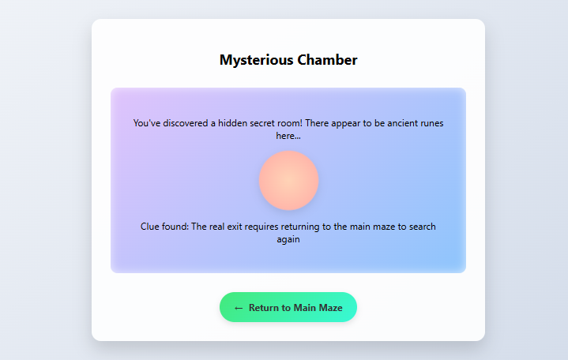
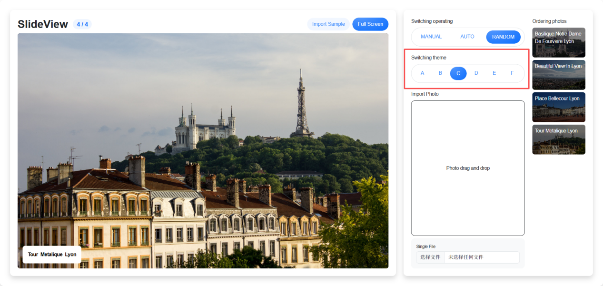

# Project 21 Route Configuration — Code Readability Is More Important Than Skills

## Content Guide
In this guide to route configuration based on Vue 3, we will focus on building a navigation system for single-page applications with Vue Router 4.
We will first learn basic configuration, including installing dependencies, creating a router instance, defining routing rules, and mapping different components to corresponding paths.
Next, we will master nested routes to realize modular and hierarchical display of page layouts.
We will generate routes dynamically based on data to improve application flexibility, and learn route guards for permission control, data preloading, and other operations before and after route navigation.

## Learning Objectives
- ① Master the declarative syntax rules of route configuration.
- ② Master route parameters and query binding to realize dynamic data transfer in navigation.
- ③ Master defining dynamic path parameters in routing rules.
- ④ Understand and master various route guards provided by Vue Router.
- ⑤ Master route-related event handling to implement interactive functions.
- ⑥ Master the combination of routing and forms to realize form data transfer and two-way binding.

## Task 21.1 Web Maze: Route Escape

### 21.1.1 Task Description
This task implements a Web Maze: Route Escape based on Vue 3. Using the reactive features and dynamic routing mechanism of Vue 3, an immersive web maze is constructed. Each level of logic in the maze is driven by nested routes and dynamic parameters of Vue Router.
The effect is shown in Figure 21-1.
<p align="center">
  
</p>

<p align="center"><em>Figure 21-1 Web Maze: Route Escape</em></p>

### 21.1.2 Knowledge Preparation
In HTML, the &lt;a&gt; tag is used for page navigation. The &lt;a&gt; tag has an attribute called href; when assigned a corresponding web address or path, it navigates to the target page.
In Vue 3, routing is implemented via Vue Router 4, the official routing manager for Vue.js. It is used to build single-page applications, allowing users to switch between different view components by changing the URL without reloading the entire page.

#### 1. Installation and Import

##### (1) Installation
Using npm:

```
npm install vue-router@4
```

Using yarn:
yarn add vue-router@4

##### (2) Import

```js
import { createRouter, createWebHistory } from 'vue-router';
```

#### 2. Routing Components

##### (1) &lt;router-link&gt;
A declarative navigation component that replaces the native &lt;a&gt; tag.

##### (2) Common Attributes
to: Target route path or route object
active-class: Custom class name for the active state
exact: Exact matching mode

```html
<router-link to="/" exact active-class="active">Home</router-link>
<router-link :to="{ name: 'About' }">About</router-link>
```

（3）&lt;router-view&gt;
A route outlet component that dynamically renders the matched component based on the current route. It supports named views to implement complex layouts. Example code is as follows.

```html
<router-view></router-view> <!-- Default View -->
<router-view name="sidebar"></router-view> <!-- Named View -->
```

#### 3. Programmatic Navigation
In addition to using &lt;router-link&gt; to create &lt;a&gt; tags for navigation links, navigation can also be implemented using the push() method of the router instance. This implementation is referred to as Vue programmatic navigation. Inside a Vue instance, the router instance can be accessed via $router, allowing the this.$router.push() method to be called. This method adds a new record to the history stack, so when the user clicks the browser’s back button, they will return to the previous URL. When &lt;router-link&gt; is clicked, this method is called internally. Thus, clicking &lt;router-link :to="..."&gt; is equivalent to calling the router.push(...) method. Sample code is as follows.

```js
// Use the useRouter composable API
import { useRouter } from 'vue-router'
const router = useRouter()
router.push('/about') // String path
router.push({ name: 'User', params: { id: 123 } }) // Named route
router.replace('/login') // Replace current route
router.go(-1) // Navigate back in history
```

#### 4. Route Parameter Passing and Parameter Retrieval
Simply implementing basic page jumps cannot meet user needs. In many cases of navigating to a new path or component, it is necessary to pass some parameters and receive them within the new component.

##### (1) Dynamic Route Parameters (params)
Dynamic fields are defined in the route path using a colon :, and the parameters become part of the route. Sample code is as follows.

```html
// Programmatic Navigation
router.push({ name: 'User', params: { id: 123 } }) // Must use named routes
// Declarative Navigation
<router-link :to="{ name: 'User', params: { id: 123 } }">User</router-link>
```

##### (1) Query Parameters
Key-value pairs appended to the URL after a ?, similar to GET request parameters. Sample code is as follows.

```html
// Programmatic Navigation
router.push({ path: '/user', query: { id: 123, name: 'John' } }) // URL: /user?id=123&name=John
// Declarative Navigation
<router-link :to="{ path: '/user', query: { id: 123 } }">User</router-link>
```

##### (2) State Parameters
Parameters are passed via HTML5 history.state, and the parameters will not be displayed in the URL. Sample code is as follows.

```
router.push({
path: '/user',
state: { id: 123 } // Parameters are hidden in history.state
})
```

#### 5. Accessing Route Parameters

##### (1) The $route Object
Dynamic parameters are accessed through the $route object. Sample code is as follows.

```vue
// User.vue (Options API)
export default {
  mounted() {
    console.log(this.$route.params.id) // Get dynamic parameter id
    console.log(this.$route.query.name) // Get query parameter name
  }
}
```

##### (2) useRoute Object
Gets the current route information. Sample code is as follows.

```html
<script setup>
  import { useRoute } from 'vue-router'
  const route = useRoute()
  console.log(route.params.id) // Dynamic parameter
  console.log(route.query.name) // Query parameter
  console.log(route.path) // Current path
</script>
```

### 21.1.3 Task Implementation

#### Step 1: Open the CMD, enter the command npm create vite@latest project-name --template vue to generate the project. The directory structure is as follows:

```text
demorouter
├── node_modules/  # Project dependency packages directory
├── public/  # Directory for storing public static resources
│   └── img/  # Static resources (manually created directory)
├── src/  # Source code directory
│   ├── router  # Router directory
│   │   └── index.js  # Route configuration
│   ├── views  # View components
│   │   ├── Home.vue  # Home view
│   │   └── Room.vue  # Sub view
│   ├── App.vue  # Root component
│   └── main.js  # Application entry file
├── jsconfig.json  # Core metadata file of the project, recording project dependencies, script commands, version information, etc.
├── package.json  # Core metadata file of the project, recording project dependencies, script commands, version information, etc.
├── package-lock.json  # Automatically generated file that locks the exact versions of all dependencies and sub-dependencies
└── README.md  # Project documentation
```

#### Step 2: Go to the src/App.vue page and import vue-router.

```vue
<script setup>
import { RouterView } from 'vue-router';
</script>
<template>
<RouterView />
</template>
<style>
body {
  margin: 0;
  font-family: 'Segoe UI', system-ui, sans-serif;
  background: linear-gradient(135deg, #f5f7fa 0%, #c3cfe2 100%);
  min-height: 100vh;
}
</style>
```

#### Step 3: Plan the routes in the src/router/index.js file. The code is as follows.

```vue
import { createRouter, createWebHistory } from 'vue-router';
import Home from '../views/Home.vue';
import Room from '../views/Room.vue';
const routes = [
  { path: '/', component: Home },
  { path: '/room', component: Room }
];
const router = createRouter({
    history: createWebHistory(import.meta.env.BASE_URL),
    routes
  });
export default router;
```

#### Step 4: Load the home view in the src/views/Home.vue file. The code is as follows.

```vue
<template>
<div class="maze-container">
<h1>Maze Escape</h1>
<div class="maze-grid">
<div class="wall "></div>
<div class="wall "></div>
<div class="wall "></div>
<div class="wall "></div>
<div class="path">
<router-link to="/room" class="escape-btn">
Enter the depths of the maze.
</router-link>
</div>
</div>
</div>
</template>
<style scoped>
.maze-container {
  text-align: center;
  padding: 2rem;
  max-width: 800px;
  margin: 0 auto;
}
.maze-grid {
  position: relative;
  width: 300px;
  height: 300px;
  margin: 2rem auto;
}
.wall {
  position: absolute;
  background: linear-gradient(to bottom, #2c3e50, #34495e);
  box-shadow: 0 0 10px rgba(0,0,0,0.3);
}
.path {
  position: absolute;
  top: 20px;
  left: 20px;
  right: 20px;
  bottom: 20px;
  display: flex;
  align-items: center;
  justify-content: center;
  background: linear-gradient(135deg, #ff9a9e 0%, #fad0c4 100%);
  border-radius: 12px;
  box-shadow: inset 0 0 20px rgba(255,255,255,0.5);
}
.escape-btn {
  padding: 0.75rem 1.5rem;
  background: linear-gradient(135deg, #6a11cb 0%, #2575fc 100%);
  color: white;
  border-radius: 25px;
  text-decoration: none;
  font-weight: bold;
  box-shadow: 0 4px 15px rgba(0,0,0,0.2);
  transition: all 0.3s ease;
  display: inline-flex;
  align-items: center;
  gap: 8px;
}
.escape-btn:hover {
  transform: translateY(-5px) scale(1.05);
  box-shadow: 0 8px 20px rgba(0,0,0,0.3);
}
.key-icon {
  font-size: 1.2rem;
  animation: float 2s ease-in-out infinite;
}
@keyframes float {
  0%, 100% { transform: translateY(0); }
  50% { transform: translateY(-10px); }
}
</style>
```

#### Step 5: Load the sub-view in the src/views/Room.vue file. The code is as follows.

```vue
<template>
<div class="room-container">
<h2>Mysterious Chamber</h2>
<div class="room-content">
<p>You've discovered a hidden secret room! There appear to be ancient runes here...</p>
<div class="rune-circle"></div>
<p>Clue found: The real exit requires returning to the main maze to search again</p>
</div>
<router-link to="/" class="back-btn">
<span class="arrow-icon">←</span> Return to Main Maze
</router-link>
</div>
</template>
<style scoped>
.room-container {
  max-width: 600px;
  margin: 3rem auto;
  padding: 2rem;
  background: rgba(255, 255, 255, 0.9);
  border-radius: 16px;
  box-shadow: 0 15px 30px rgba(0,0,0,0.15);
  text-align: center;
}
.room-content {
  margin: 2rem 0;
  padding: 2rem;
  background: linear-gradient(135deg, #e0c3fc 0%, #8ec5fc 100%);
  border-radius: 12px;
  box-shadow: inset 0 0 15px rgba(255,255,255,0.7);
}
.rune-circle {
  width: 100px;
  height: 100px;
  margin: 1rem auto;
  background: radial-gradient(circle, #ffd3b6 0%, #ffaaa5 100%);
  border-radius: 50%;
  display: flex;
  align-items: center;
  justify-content: center;
  font-size: 2rem;
  box-shadow: 0 5px 15px rgba(0,0,0,0.1);
  animation: pulse 3s infinite;
}
@keyframes pulse {
  0%, 100% { transform: scale(1); box-shadow: 0 5px 15px rgba(0,0,0,0.1); }
  50% { transform: scale(1.05); box-shadow: 0 10px 25px rgba(0,0,0,0.2); }
}
.back-btn {
  display: inline-flex;
  align-items: center;
  gap: 8px;
  padding: 0.75rem 1.5rem;
  background: linear-gradient(135deg, #43e97b 0%, #38f9d7 100%);
  color: #333;
  border-radius: 25px;
  text-decoration: none;
  font-weight: bold;
  box-shadow: 0 4px 10px rgba(0,0,0,0.1);
  transition: all 0.3s ease;
}
.back-btn:hover {
  transform: translateY(-3px);
  box-shadow: 0 8px 20px rgba(0,0,0,0.15);
}
.arrow-icon {
  font-size: 1.2rem;
  display: inline-block;
  transition: transform 0.3s;
}
</style>
```

## Task 21.2 Practical Project – Photo Slideshow System – Theme Switching (Module E)

### 21.2.1 Task Description
This practical project implements the image file loading module in the photo slideshow system. Users can load images by dragging and dropping picture files to the drop area, and these images will then be displayed and played with themed animations. When CSS is unavailable or disabled, users can still select photo files via the file input. The photos will then be loaded and listed on the webpage without any styles applied.

### 21.2.2 Effect Display
The effect of the switching operation is shown in Figure 21-2.
<p align="center">
  
</p>

<p align="center"><em>Figure 21-2 Switch Themes</em></p>

### 21.2.3 Task Implementation

#### Step 1: Generate the project using the command "npm create vite@latest project-name --template vue". The project name is module_e-src, and the project directory structure is as follows:

```text
34_module_e: Directory for storing static resource files (mainly used for initializing photos)

```text
module_e-src
├── node_modules/  # Project dependency packages directory
├── public/  # Directory for storing public static resources
├── src/  # Source code directory
│   ├── assets/  # Static resources (directory created manually)
│   ├── components/  # Reusable Vue components (directory created manually)
│   │   ├── EffectA.vue  # Theme A displays photos and titles directly without any effects.
│   │   ├── EffectB.vue  # Theme B animates the active photo moving from the left to the center, then exiting the screen by moving to the right. For the title, the title element follows the same left-to-right animation but starts with a 300-millisecond delay.
│   │   ├── EffectC.vue  # Theme C animates the active photo moving from the bottom to the center, then exiting the screen by moving upward. For the subtitle, it is split into several words, each animated with a 300-millisecond delay.
│   │   ├── EffectD.vue  # Theme D slides the active photo into the center from the left side of the screen. The photo then stays in the center. The next photo slides in and overlays the active one. Each photo has a slight random rotation between -5 and 5 degrees. The photos should not occupy the entire screen; they should take up about 85% of the screen space. The varying rotations create a stacked photo effect. Each photo has a 3px white border with a border radius of 5px, and the bottom border appears thicker due to the variant style. The title is positioned at the bottom of the photo with a white background matching the photo border.
│   │   ├── EffectE.vue  # Theme E displays the active photo in the center of the screen. The current photo then performs a door-opening effect: it splits into left and right halves, which rotate inward in 3D perspective to simulate opening doors. The next photo appears from behind and becomes active after the current photo disappears.
│   │   ├── EffectF.vue  # Theme F – Please create a new theme named "Theme F". You may define custom photo sliding transitions and subtitle animations.
│   │   ├── SettingArea.vue  # Theme switching controls
│   │   └── SlideController.vue  # Home page
│   ├── App.vue  # Root component
│   ├── main.js  # Application entry file
│   ├── config.js  # Slideshow timing configuration file (created manually)
│   ├── helper.js  # File for randomly generating image names (created manually)
│   └── store.js  # Slideshow configuration matching file (created manually)
├── jsconfig.json  # Core metadata file of the project, recording project dependencies, script commands, version information, etc.
├── package.json  # Core metadata file of the project, recording project dependencies, script commands, version information, etc.
├── package-lock.json  # Automatically generated file that locks the exact versions of all dependencies and sub-dependencies
└── README.md  # Project documentation
```

#### Step 2: Import and load the switching component in the App.vue file.
The code is as follows:

```vue
<script setup>
import SlideController from "@/components/SlideController.vue";
import SettingArea from "@/components/SettingArea.vue";
import {ref} from "vue";
</script>
```

#### Step 3: Import the configuration file in the components/SettingArea.vue file.
The code is as follows:

```html
<script setup>
  import {appImages, appMode, appTheme} from "@/store.js";
  import {convertFilename, getId} from "@/helper.js";
</script>
```

#### Step 4: Implement the template rendering for theme switching in the components/SettingArea.vue file.
The code is as follows:

```html
<!--Switching theme-->
<p class="mb-2">Switching theme</p>
<div class="border rounded-pill p-2 d-flex align-items-center mb-4">
  <div class="row gx-1 w-100">
    <div class="col">
      <button class="btn w-100 text-center" :class="btnClass(appTheme, 'A')" @click="appTheme = 'A'">A</button>
    </div>
    <div class="col">
      <button class="btn w-100 text-center" :class="btnClass(appTheme, 'B')" @click="appTheme = 'B'">B</button>
    </div>
    <div class="col">
      <button class="btn w-100 text-center" :class="btnClass(appTheme, 'C')" @click="appTheme = 'C'">C</button>
    </div>
    <div class="col">
      <button class="btn w-100 text-center" :class="btnClass(appTheme, 'D')" @click="appTheme = 'D'">D</button>
    </div>
    <div class="col">
      <button class="btn w-100 text-center" :class="btnClass(appTheme, 'E')" @click="appTheme = 'E'">E</button>
    </div>
    <div class="col">
      <button class="btn w-100 text-center" :class="btnClass(appTheme, 'F')" @click="appTheme = 'F'">F</button>
    </div>
  </div>
</div>
<!--Import Photo-->
```

#### Step 5: Load the theme switching module in the components/SlideController.vue file, and create EffectA.vue, EffectB.vue, EffectC.vue, EffectD.vue, EffectE.vue, and EffectF.vue in the components directory respectively. Among them, the EffectA.vue file has already been implemented in the practical project Photo Slideshow System (Configuration Panel Module). Only the remaining theme modules need to be implemented here.
The code is as follows:

```vue
import {appImages, appMode, appTheme, currentImageIndex} from "@/store.js";
import {convertFilename, getId} from "@/helper.js";
import {computed, onMounted, ref, watch} from "vue";
import {SLIDE_TIME} from "@/config.js";
import EffectA from "@/components/EffectA.vue";
import EffectB from "@/components/EffectB.vue";
import EffectC from "@/components/EffectC.vue";
import EffectD from "@/components/EffectD.vue";
import EffectE from "@/components/EffectE.vue";
import EffectF from "@/components/EffectF.vue";
/* theme component */
const themeComponent = computed(() => {
    return {
      A: EffectA,
      B: EffectB,
      C: EffectC,
      D: EffectD,
      E: EffectE,
      F: EffectF,
    } [appTheme.value];
})
```

#### Step 6: Implement Theme B in the components/EffectB.vue file.
The code is as follows:

```vue
<script setup>
import {currentImage, currentImageIndex} from "@/store.js";
</script>
<template>
<transition name="B-image" appear>

</transition>
<transition name="B-caption" appear>
<div class="captionBox" :key="currentImageIndex">
<div class="caption">{{ currentImage.caption }}</div>
</div>
</transition>
</template>
<style scoped>
.B-image-enter-active,
.B-image-leave-active,
.B-caption-enter-active,
.B-caption-leave-active {
  transition: .3s;
}
.B-image-enter-from,
.B-caption-enter-from {
  transform: translateX(-100%);
}
.B-image-leave-to,
.B-caption-leave-to {
  transform: translateX(100%);
}
.B-caption-enter-active {
  transition-delay: .3s;
}
</style>
```

#### Step 7: Implement Theme C in the components/EffectC.vue file.
The code is as follows:

```vue
<script setup>
import {currentImage, currentImageIndex} from "@/store.js";
import {ref, watch} from "vue";
const wordCount = ref(0);
const maxCount = ref(0);
let wordTimeout = null;
watch(currentImageIndex, () => {
    const tmpWords = currentImage.value.caption.split(" ");
    maxCount.value = tmpWords.length;
    wordCount.value = 0;
    setTimeout(addWord, 300)
  }, {immediate: true})
function addWord() {
  clearTimeout(wordTimeout);
  if (wordCount.value === maxCount.value) return;
  wordCount.value += 1;
  wordTimeout = setTimeout(addWord, 300);
}
function getWords(caption) {
  return caption.split(" ").map(item => item + " ");
}
</script>
<template>
<transition name="C-image" appear>
<div class="staticBox" :key="currentImageIndex">

<div class="captionBox">
<div class="caption C-caption">
<span v-for="(word, i) in getWords(currentImage.caption)" :class="{show: wordCount > i}" :key="word">{{ word }}</span>
</div>
</div>
</div>
</transition>
</template>
<style scoped>
.C-image-enter-active,
.C-image-leave-active {
  transition: .3s;
}
.C-image-enter-from {
  transform: translateY(100%);
}
.C-image-leave-to {
  transform: translateY(-100%);
}
.C-caption {
  overflow: hidden;
}
.C-caption span {
  display: inline-block;
  transition: .3s;
}
.C-caption span:not(:last-child) {
  margin-right: .5em;
}
.C-caption span:not(.show) {
  transform: translateY(200%);
  opacity: 0;
}
</style>
```

#### Step 8: Implement Theme D in the components/EffectD.vue file.The code is as follows:

```vue
<script setup>
import {currentImage, currentImageIndex} from "@/store.js";
import {ref, watch} from "vue";
import {getId} from "@/helper.js";
const stack = ref([]);
watch(currentImageIndex, () => {
    stack.value.push({
        id: getId(),
        image: currentImage.value.image,
        caption: currentImage.value.caption,
        deg: getRandomDeg()
      })
}, {immediate: true});
function getRandomDeg() {
  return (~~(Math.random() * 11) - 5) + "deg";
}
function getRotateStyle(item) {
  return {
    transform: `rotate(${item.deg})`
  }
}
</script>
<template>
<div class="stackContainer" id="theme-d">
<transition-group name="D-stack" appear>
<div class="stackBox" :key="item.id" v-for="item in stack">
<div class="stackItem" :style="getRotateStyle(item)">

<div class="captionBox">
<div class="caption">{{ item.caption }}</div>
</div>
</div>
</div>
</transition-group>
</div>
</template>
<style scoped>
.D-stack-enter-active {
  transition: .3s;
  .D-stack-enter-from {
    transform: translateX(-150%);
  }
#theme-d.stackContainer {
  position: relative;
  width: 85%;
  height: 85%;
}
#theme-d .stackBox {
  position: absolute;
  left: 0;
  top: 0;
  right: 0;
  bottom: 0;
}
#theme-d .stackItem {
  width: 100%;
  height: 100%;
  border: 3px solid #fff;
  border-radius: 5px !important;
}
#theme-d .stackItem img {
  border-radius: 0;
}
#theme-d .captionBox {
  padding: 0;
}
#theme-d .captionBox .caption {
  width: 100%;
  border-radius: 0;
}
</style>
```

#### Step 9: Implement Theme E in the components/EffectE.vue file.
The code is as follows:

```vue
<script setup>
import {ref, watch} from "vue";
import {currentImage, currentImageIndex} from "@/store.js";
const tmpImage = ref(null);
watch(currentImage, (value, oldValue, onCleanup) => {
    if (oldValue) {
      tmpImage.value = oldValue
    }
})
</script>
<template>
<template v-if="tmpImage">


</template>

</template>
<style scoped>
.e-half {
  z-index: 2;
}
.e-half.left {
  left: 0;
  clip-path: polygon(0 0, 50% 0, 50% 100%, 0 100%);
  transform-origin: left;
  animation: halfLeftAnimation 1s forwards;
}
@keyframes halfLeftAnimation {
  to {
    transform: rotateY(-100deg);
  }
}
.e-half.right {
  right: 0;
  clip-path: polygon(100% 0, 50% 0, 50% 100%, 100% 100%);
  transform-origin: right;
  animation: halfRightAnimation 1s forwards;
}
@keyframes halfRightAnimation {
  to {
    transform: rotateY(100deg);
  }
}
</style>
```

#### Step 10: Implement Theme F in the components/EffectF.vue file.
The code is as follows:

```vue
<script setup>
import {computed, ref, watch} from "vue";
import {currentImage, currentImageIndex} from "@/store.js";
const tmpImage = ref(null);
watch(currentImage, (value, oldValue, onCleanup) => {
    if (oldValue) {
      tmpImage.value = oldValue
    }
})
function cellImage(x, y) {
  return {
    left: -y * 100 + "%",
    top: -x * 100 + "%",
  }
}
</script>
<template>
<div class="staticBox gridBox" :key="currentImageIndex" id="theme-f">
<template v-for="x in 5">
<template v-for="y in 4">
<div class="cell">
<div class="wrapper staticBox" :style="{ 'animation-delay': Math.random() + 's' }">
<div class="front staticBox" v-if="tmpImage">

</div>
<div class="back staticBox">

</div>
</div>
</div>
</template>
</template>
<div class="captionBox">
<div>
<div class="wrapper">
<div class="front">
<div class="caption">
{{currentImage.caption}}
</div>
</div>
<div class="back">
<div class="caption">
{{currentImage.caption}}
</div>
</div>
</div>
</div>
</div>
</div>
</template>
<style scoped>
#theme-f.gridBox {
  display: grid;
  grid-template-columns: repeat(4, 1fr);
  grid-template-rows: repeat(3, 1fr);
}
#theme-f .cell {
  perspective: 1000px;
}
#theme-f .wrapper {
  transform-style: preserve-3d;
  animation: turnAnimation 1s forwards;
}
@keyframes turnAnimation {
  to {
    transform: rotateY(.5turn);
  }
}
#theme-f .wrapper > div {
  backface-visibility: hidden;
  clip-path: polygon(0 0, 100% 0, 100% 100%, 0 100%);
}
#theme-f .wrapper > div img {
  width: 400%;
  height: 300%
}
#theme-f .back {
  transform: rotateY(.5turn);
}
#theme-f .captionBox .front {
  position: absolute;
  left: 0;
  right: 0;
  top: 0;
  bottom: 0;
}
</style>
```
