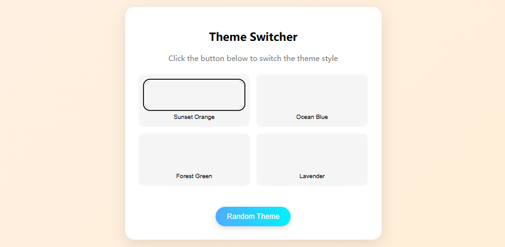
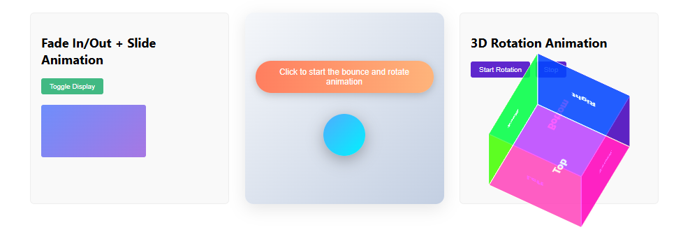
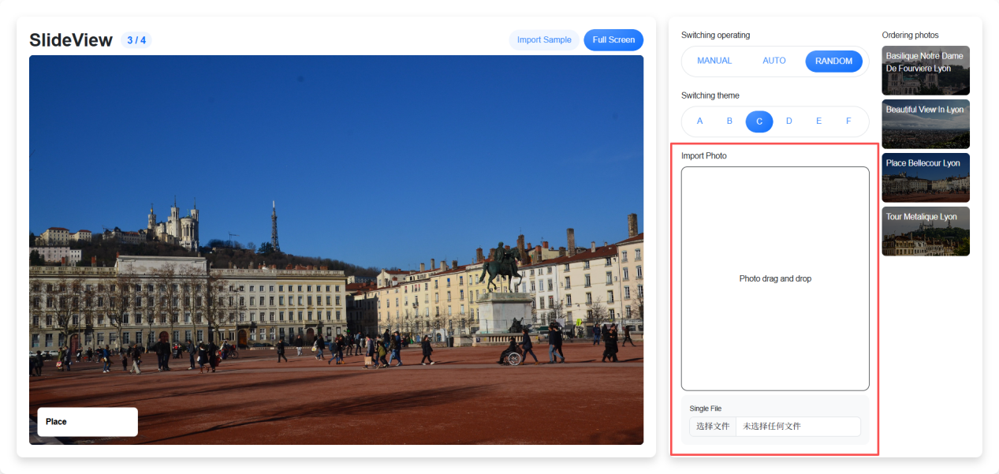
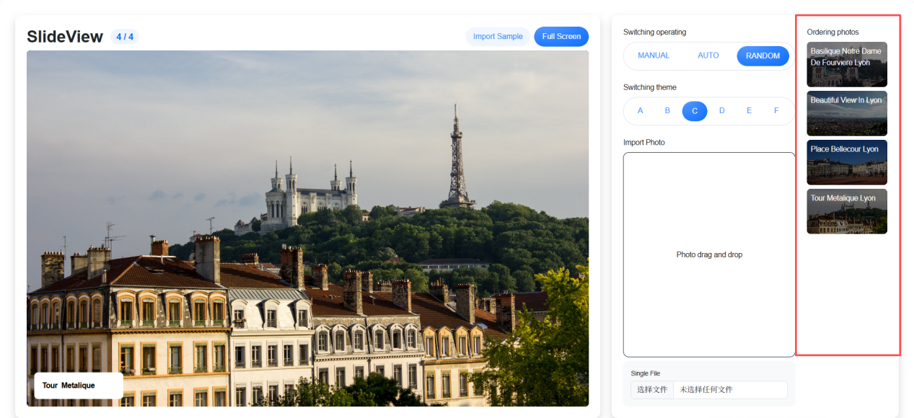

# Project 22 Components and Animations
User Experience Comes First, Details Determine Success or Failure

## Content Guide
In the process of learning Vue 3, components and transitions are key elements for building smooth and interactive user interfaces. As reusable code blocks, components allow a page to be split into independent, maintainable functional units. We need to master component definition, communication between components, passing data downward via props, and triggering interactions upward through custom events.
Transition rules add smooth animation effects when components are shown or hidden. With Vue 3's built-in &lt;Transition&gt; component, combined with CSS transition or animation class names, you can easily implement effects such as fade-in/fade-out, sliding, and scaling when elements enter or leave the screen.

## Learning Objectives
- ① Master the declarative definition and registration rules of components.
- ② Master the definition and dynamic binding of component props to achieve dynamic data transfer between parent and child components.
- ③ Understand the key role of custom events in communication from child to parent components.
- ④ Master the basic usage and transition modes of the &lt;Transition&gt; component in Vue 3.
- ⑤ Master the use of CSS transition class names to implement element entry and exit animations.

## Task 22.1 Theme Switcher

### 22.1.1 Task Description
This case implements a responsive theme switcher component based on Vue 3's Composition API, including preset theme management, dynamic switching functions, and random theme generation capabilities.
The component should display a grid of theme cards, each containing a visual preview area and a theme name, with the currently selected theme highlighted. Background gradient effects can be switched by clicking buttons, and random theme selection is also supported.
The overall layout uses gradient backgrounds and card-style design, with smooth transition animations to enhance the interactive experience. The code should separate theme data logic (using reactive to manage the theme array) from UI rendering, ensuring a clear structure and easy expansion for new themes.
The effect of the case is shown in Figure 22-1.
<p align="center">
  
</p>

<p align="center"><em>Figure 22-1 Theme Switcher</em></p>

### 22.1.2 Knowledge Preparation
I. Composition API
In Vue 3, Props are used to pass data from parent components to child components. Props are a very important concept in Vue 3, and understanding them will help you develop more efficiently with Vue 3.

#### 1. Passing Values from Parent to Child Components (Props)

##### (1) Declaring Props:
Child components declare the received Props using defineProps, which supports two methods:
① Array syntax:

```vue
defineProps(['greetingMessage'])
```

② Object syntax declaration:
```vue
defineProps({
    greetingMessage: String,
  })
```

Passing Props
The parent component passes data through attribute binding (v-bind or :), supporting both static values and dynamic data:

##### (1) Static value passing: directly hardcode the value

```vue
<template>
<ChildComponent title="Static Title" :count="10" />
</template>
```

(2)Dynamic value passing: Bind the data or computed properties of the parent component.

```vue
<template>
<ChildComponent :title="parentTitle" :count="parentCount" />
</template>
<script setup>
import { ref } from 'vue'
import ChildComponent from './ChildComponent.vue'
const parentTitle = ref('Dynamic Title')
const parentCount = ref(5)
</script>
Using Props
<script setup>
const props = defineProps(['title'])
console.log('Title is:', props.title)
</script>
```

Child to Parent Component Communication (Emit Events)

##### (1) Declare events:
The child component declares triggerable events using defineEmits, which supports two methods:
① Array syntax:

```html
<script setup>
  const emit = defineEmits(['update'])
</script>
② Object syntax declaration:
<script setup>
  const emit = defineEmits({
  update: (payload) => {
  if (typeof payload === 'number') return true
  console.warn('Invalid payload type')
  return false
  }
  })
</script>
```

Triggering Events
The child component triggers events and passes data through the emit method:

```vue
<script setup>
const emit = defineEmits(['update'])
const handleClick = () => {
  emit('update', { newValue: 42 })
}
</script>
<template>
<button @click="handleClick">Update Parent Component</button>
</template>
</script>
```

Listening to Events
The parent component can listen to child component events using @ or v-on:

```vue
<template>
<ChildComponent @update="handleUpdate" />
</template>
<script setup>
import ChildComponent from './ChildComponent.vue'
const handleUpdate = (payload) => {
  console.log('Received data from child component:', payload);
}
</script>
```

II. Composable Functions
Composable functions are functions that encapsulate and reuse state logic based on Vue 3's Composition API. One composable function can call one or more other composable functions. This allows us to build complex logic by combining multiple smaller, logically independent units, just as we assemble an entire application from multiple components.
Usage of Composable Functions
When developing front-end applications, it is often necessary to reuse logic for common tasks. In Vue 3, the corresponding logic can be extracted into external files in the form of composable functions, which can then be imported and used in components.

##### (1) Definition of Composable Functions:

```js
import { onMounted } from 'vue'
export function useFun() { // Define a composable function
  // Main code of the composable function
  // For example: Use lifecycle hooks
  onMounted(() => {
      console.log(params)
    })
return { params }
}
```

##### (2) Calling Composable Functions:

```js
import { useFun } from './fun.js' // Import the composable function
setup() {
  const { params } = useFun() // Use the composable function
}
```

##### (3) Naming Conventions for Composable Functions:
① Composable functions should be named in camelCase and start with the prefix "use". For example: useFun. They can accept parameters.
② Even if a composable function does not depend on reactive data from refs or getters, it can still accept them as parameters. If you are writing a composable function for use by other developers, it is best practice to handle parameters that may be refs or getters using the toValue() utility function instead of raw values.

```js
import {toValue }from 'vue'
export function useFun(params){
  // If params is a ref or a getter.
  const arg=toValue(params)
}
```

##### (4) Return Value:
① Composable functions conventionally always return an ordinary non-reactive object containing multiple refs. This ensures that the object remains reactive after being destructured into refs in the component.

```js
// x and y are two ref data
const { x, y } = useFun()
```

② Returning a reactive object from a composable function will cause the reactive connection to the state inside the composable function to be lost during object destructuring. In contrast, refs can maintain this reactive connection. Unless you intend to use the returned state from the composable function in the form of object properties, you may wrap the returned object with reactive() once.

```js
// x and y are two ref data
const fun =reactive(useFun())
// fun.prop is related to the original prop ref
console.log(fun.prop)
```

### 22.1.3 Task Implementation

#### Step 1: Use the command npm create vite@latest project-name --template vue to generate the project. The directory structure is as follows:

```text
subtitle
├── node_modules/  # Project dependency packages directory
├── public/  # Directory for storing public static resources
│   └── img/  # Static resources (manually created directory)
├── src/  # Source code directory
│   ├── App.vue  # Root component
│   └── main.js  # Application entry file
├── jsconfig.json  # Core metadata file of the project, recording project dependencies, script commands, version information, etc.
├── package.json  # Core metadata file of the project, recording project dependencies, script commands, version information, etc.
├── package-lock.json  # Automatically generated file that locks the exact versions of all dependencies and sub-dependencies
└── README.md  # Project documentation
```

#### Step 2: Go to the src/App.vue page, generate the theme interface, and place the following code.

```vue
<template>
<div class="theme-switcher" :class="currentTheme">
<div class="card">
<h2>Theme Switcher</h2>
<p class="subtitle">Click the button below to switch the theme style</p>
<div class="theme-grid">
<button
v-for="theme in themes"
:key="theme.id"
@click="switchTheme(theme.id)"
:class="{ active: currentTheme === theme.id }"
>
<div class="theme-preview" :style="theme.styles"></div>
<span>{{ theme.name }}</span>
</button>
</div>
<button class="random-btn" @click="randomTheme">
Random Theme
</button>
</div>
</div>
</template>
```

#### Step 3: Go to the src/App.vue page, create the styles for the theme interface, and place the following code.

```html
<style scoped>
  .theme-switcher {
  min-height: 100vh;
  display: grid;
  place-items: center;
  transition: background-color 0.5s;
  }
  .sunset {
  background: linear-gradient(135deg, #fff1e6 0%, #ffecd2 100%);
  }
  .ocean {
  background: linear-gradient(135deg, #e0f7fa 0%, #b0e0e6 100%);
  }
  .forest {
  background: linear-gradient(135deg, #e8f5e8 0%, #d4edd9 100%);
  }
  .lavender {
  background: linear-gradient(135deg, #f3e5f5 0%, #e1bee7 100%);
  }
  .card {
  background: white;
  border-radius: 20px;
  box-shadow: 0 10px 30px rgba(0, 0, 0, 0.1);
  padding: 30px;
  max-width: 500px;
  width: 90%;
  text-align: center;
  }
  .subtitle {
  color: #777;
  margin-bottom: 25px;
  }
  .theme-grid {
  display: grid;
  grid-template-columns: repeat(2, 1fr);
  gap: 15px;
  margin: 25px 0;
  }
  .theme-grid button {
  border: none;
  border-radius: 12px;
  padding: 15px;
  cursor: pointer;
  background: #f5f5f5;
  transition: all 0.3s ease;
  display: flex;
  flex-direction: column;
  gap: 10px;
  }
  .theme-grid button:hover {
  transform: translateY(-3px);
  box-shadow: 0 5px 15px rgba(0, 0, 0, 0.1);
  }
  .theme-preview {
  height: 60px;
  border-radius: 10px;
  transition: all 0.3s ease;
  }
  button.active .theme-preview {
  box-shadow: 0 0 0 3px white, 0 0 0 5px currentColor;
  }
  .highlight {
  padding: 2px 8px;
  border-radius: 4px;
  color: white;
  }
  .random-btn {
  background: linear-gradient(to right, #4facfe 0%, #00f2fe 100%);
  color: white;
  border: none;
  border-radius: 50px;
  padding: 12px 25px;
  font-size: 16px;
  cursor: pointer;
  margin-top: 20px;
  transition: all 0.3s ease;
  box-shadow: 0 4px 10px rgba(0, 0, 0, 0.15);
  }
  .random-btn:hover {
  transform: scale(1.05);
  box-shadow: 0 6px 15px rgba(0, 0, 0, 0.2);
  }
</style>
```

#### Step 4: Go to the src/App.vue page, use useThemeManager to manage theme data, and place the following code.

```html
<script setup>
  import { ref, reactive } from 'vue'
  // Composable function for theme management
  const useThemeManager = () => {
  const themes = reactive([
  { id: 'sunset', name: 'Sunset Orange', hex: '#FF7043' },
  { id: 'ocean', name: 'Ocean Blue', hex: '#42A5F5' },
  { id: 'forest', name: 'Forest Green', hex: '#43A047' },
  { id: 'lavender', name: 'Lavender', hex: '#7E57C2' },
  ])
  const currentTheme = ref('sunset')
  const switchTheme = (id) => {
  currentTheme.value = id
  }
  // Generate a random theme
  const randomTheme = () => {
  const randomIndex = Math.floor(Math.random() * themes.length)
  currentTheme.value = themes[randomIndex].id
  }
  return { themes, currentTheme, switchTheme, randomTheme }
  }
  // Use composable functions
  const { themes, currentTheme, switchTheme, randomTheme } = useThemeManager()
</script>
```

#### Step 5: Navigate to the src/App.vue page, use the randomTheme function to generate a random theme when the button is clicked, and insert the following code.
The randomTheme function is included in the complete `useThemeManager()` example above.

#### Step 6: Enter the command npm run dev to start the project and check the effect.

## Task 22.2 Dancing Code, Code Rainfall

### 22.2.1 Task Description
Three animation effect tasks need to be completed in Vue 3:
First, implement a combined animation for elements with both fade-in/fade-out and sliding effects, creating smooth visual transitions by controlling changes in transparency and position.
Second, design an interactive animation triggered by clicks. When users click an element, the element produces a combined dynamic effect of bouncing and rotating to enhance interactive fun.
Third, develop a 3D rotation animation. Using CSS 3D transformation features, elements are rotated and displayed in a three-dimensional space to improve the page's three-dimensional sense and visual appeal.
The effect of the case is shown in Figure 22-2.
<p align="center">
  
</p>

Figure 22‑2 Dancing Code, Code Rainfall

### 22.2.2 Knowledge Preparation
Vue.js transitions enable various transition effects when page elements appear and disappear. Vue provides multiple ways to apply transition effects when inserting, updating, or removing DOM elements. Vue offers a built-in transition wrapper component, which is used to wrap elements or components that need transition effects.
In short, developers can use Vue's &lt;transition&gt; component combined with CSS animations, CSS transitions, or direct DOM manipulation via JavaScript to animate elements or components.

#### 1. Transitions
A transition refers to adding animation effects during display switching, such as fade-in/fade-out, sliding animations, flying-in effects, and so on. Readers can understand how Vue's CSS transitions work through the following examples.

```vue
<template>
<div class="fade-slide-demo">
<h2>Fade In/Out + Slide Animation</h2>
<button @click="toggle">Toggle Display</button>
<Transition name="fade-slide">
<div class="box" v-if="show"></div>
</Transition>
</div>
</template>
<script setup>
import { ref } from 'vue';
const show = ref(true);
const toggle = () => { show.value = !show.value };
</script>
```

The transition effect wraps the element to be animated with the &lt;transition&gt;&lt;/transition&gt; tag and is displayed according to the name attribute.
The following implements a fade-in and fade-out switching effect for content through a toggle button operation, with the code as follows.

```html
<style scoped>
  .fade-slide-demo {
  border: 1px solid #eee;
  padding: 20px;
  border-radius: 8px;
  background: #f9f9f9;
  }
  button {
  padding: 8px 16px;
  background: #42b983;
  color: white;
  border: none;
  border-radius: 4px;
  cursor: pointer;
  margin-bottom: 20px;
  }
  button:hover {
  background: #3aa876;
  }
  .box {
  width: 200px;
  height: 100px;
  background: linear-gradient(135deg, #6e8efb, #a777e3);
  border-radius: 4px;
  }
  .fade-slide-enter-active,
  .fade-slide-leave-active {
  transition: all 0.8s cubic-bezier(0.68, -0.55, 0.265, 1.55);
  }
  .fade-slide-enter-from,
  .fade-slide-leave-to {
  opacity: 0;
  transform: translateX(30px);
  }
</style>
```

In the above example, the transition element is used to wrap the element that needs to be controlled by animation. The fade-slide in name="fade-slide" is a custom name, which will be used as a class prefix to correspond to the classes in the style sheet. The definitions of these classes are explained below.

##### (1) .fade-slide-enter-active: Defines the transition effect for the element’s entering animation

##### (2) .fade-slide-leave-active: Defines the transition effect for the element’s leaving animation

##### (3) .fade-slide-enter-from: Defines the starting state of the element’s entering animation

##### (4) .fade-slide-leave-to: Defines the ending state of the element’s leaving animation

#### 2. animations
Common transitions are CSS transitions. The usage of CSS animations is the same as that of CSS transitions. The difference is that in CSS animations, the v-enter class name is not removed immediately after the node is inserted into the DOM, but when the animationend event is triggered. You can understand how Vue’s CSS animations work through the following example, with the code as follows.

```vue
<template>
<div class="animation-container">
<button class="trigger-btn" @click="startAnimation">
Click to start the bounce and rotate animation
</button>
<div
class="animated-ball"
:class="{
'bounce-rotate': isActive,
'reset': !isActive
}"
@animationend="handleAnimationEnd"
></div>
</div>
</template>
<script setup>
import { ref } from 'vue';
const isActive = ref(false);
const startAnimation = () => {
  isActive.value = true;
};
const handleAnimationEnd = () => {
  // Reset the state after the animation ends to allow triggering again
  isActive.value = false;
};
</script>
<style scoped>
.animation-container {
  display: flex;
  flex-direction: column;
  align-items: center;
  justify-content: center;
  min-height: 300px;
  background: linear-gradient(135deg, #f5f7fa 0%, #c3cfe2 100%);
  border-radius: 16px;
  padding: 20px;
  box-shadow: 0 8px 32px rgba(0, 0, 0, 0.1);
}
.trigger-btn {
  padding: 12px 24px;
  background: linear-gradient(to right, #ff7e5f, #feb47b);
  color: white;
  border: none;
  border-radius: 30px;
  font-size: 16px;
  cursor: pointer;
  box-shadow: 0 4px 15px rgba(0, 0, 0, 0.2);
  transition: transform 0.2s, box-shadow 0.2s;
  margin-bottom: 40px;
}
.trigger-btn:hover {
  transform: translateY(-2px);
  box-shadow: 0 6px 20px rgba(0, 0, 0, 0.3);
}
.animated-ball {
  width: 80px;
  height: 80px;
  border-radius: 50%;
  background: linear-gradient(135deg, #4facfe 0%, #00f2fe 100%);
  box-shadow: 0 8px 30px rgba(0, 0, 0, 0.3);
}
/* Bounce + Rotate Combined Animation */
.bounce-rotate {
  animation: bounce-rotate 1.5s ease-in-out;
}
@keyframes bounce-rotate {
  0% {
    transform: translateY(0) rotate(0deg);
    animation-timing-function: cubic-bezier(0.175, 0.885, 0.32, 1.275);
  }
25% {
  transform: translateY(-30px) rotate(90deg);
}
50% {
  transform: translateY(0) rotate(180deg);
  animation-timing-function: cubic-bezier(0.6, 0.04, 0.98, 0.335);
}
75% {
  transform: translateY(-20px) rotate(270deg);
}
100% {
  transform: translateY(0) rotate(360deg);
  animation-timing-function: cubic-bezier(0.175, 0.885, 0.32, 1.275);
}
}
/* Reset Animation */
.reset {
  transition: all 0.5s;
}
</style>
```

#### 3. JavaScript Hooks
JavaScript transitions refer to transition effects implemented using JavaScript hook functions. These hook functions can be used in conjunction with CSS transitions/animations or independently. When using only JavaScript transitions, the done callback is required in both enter and leave; otherwise, they will be called synchronously and the transition will complete immediately. The code is as follows.

```vue
<template>
<button @click="addItem">Add</button>
<button @click="removeItem">Remove</button>
<transition-group name="list" tag="ul">
<li v-for="item in items" :key="item.id">
{{ item.text }}
</li>
</transition-group>
</template>
<script>
export default {
  data() {
    return {
      items: [
        { id: 1, text: 'Item 1' },
        { id: 2, text: 'Item 2' }
      ]
  };
},
methods: {
  addItem() {
    this.items.push({
        id: Date.now(),
        text: 'New Item'
      });
},
removeItem() {
  this.items.pop();
}
}
};
</script>
<style>
.list-move,
.list-enter-active,
.list-leave-active {
  transition: all 0.5s ease;
}
.list-enter-from,
.list-leave-to {
  opacity: 0;
  transform: translateX(30px);
}
</style>
```

### 22.2.3 Task Implementation

#### Step 1: Use the command npm create vite@latest project-name --template vue to generate a project named module_e-src. The project directory structure is as follows:

```text
animate
├── node_modules/  # Project dependency packages directory
├── public/  # Directory for storing public static resources
│   └── img/  # Static resources (manually created directory)
├── src/  # Source code directory
│   ├── App.vue  # Root component
│   └── main.js  # Application entry file
├── jsconfig.json  # Core metadata file of the project, recording project dependencies, script commands, version information, etc.
├── package.json  # Core metadata file of the project, recording project dependencies, script commands, version information, etc.
├── package-lock.json  # Automatically generated file that locks the exact versions of all dependencies and sub-dependencies
└── README.md  # Project documentation
```

#### Step 2: Load the fade-in and fade-out effect, the click-triggered bounce and rotation animation, and the 3D rotation animation in the App.vue file. The code is as follows.

```vue
<script setup>
import FadeSlide from './components/FadeSlide.vue'
import BounceAnimation from './components/BounceAnimation.vue'
import Rotate3D from './components/Rotate3D.vue'
</script>
```

#### Step 3: Implement the 3D style effect in the src/components/Rotate3D.vue file. The code is as follows.

```vue
<template>
<div class="rotate3d-demo">
<h2>3D Rotation Animation</h2>
<button @click="startRotation">Start Rotation</button>
<button @click="stopRotation" style="margin-left: 10px;">Stop</button>
<div class="cube-container">
<div
class="cube"
:style="cubeStyle"
@mouseenter="stopRotation"
@mouseleave="startRotation"
>
<div class="face front">Front</div>
<div class="face back">Back</div>
<div class="face right">Right</div>
<div class="face left">Left</div>
<div class="face top">Top</div>
<div class="face bottom">Bottom</div>
</div>
</div>
</div>
</template>
```

#### Step 4: Implement the 3D rotation animation component in the src/components/Rotate3D.vue file. The code is as follows.

```html
<script setup>
  import { ref, computed, onUnmounted } from 'vue';
  const rotation = ref({ x: 0, y: 0 });
  const isRotating = ref(false);
  let animationFrame = null;
  const cubeStyle = computed(() => ({
  transform: `rotateX(${rotation.value.x}deg) rotateY(${rotation.value.y}deg)`
  }));
  const rotate = () => {
  if (!isRotating.value) return;
  rotation.value.y += 0.5;
  rotation.value.x += 0.2;
  animationFrame = requestAnimationFrame(rotate);
  };
  const startRotation = () => {
  if (!isRotating.value) {
  isRotating.value = true;
  rotate();
  }
  };
  const stopRotation = () => {
  isRotating.value = false;
  if (animationFrame) {
  cancelAnimationFrame(animationFrame);
  }
  };
  onUnmounted(() => {
  stopRotation();
  });
</script>
```

#### Step 5: Implement 3D transformation in the src/components/Rotate3D.vue file. The code is as follows.

```html
<style scoped>
  .rotate3d-demo {
  border: 1px solid #eee;
  padding: 20px;
  border-radius: 8px;
  background: #f9f9f9;
  perspective: 1000px;
  }
  button {
  padding: 8px 16px;
  background: #5f27cd;
  color: white;
  border: none;
  border-radius: 4px;
  cursor: pointer;
  margin-bottom: 20px;
  }
  button:hover {
  background: #4c1d9f;
  }
  .cube-container {
  width: 200px;
  height: 200px;
  margin: 0 auto;
  position: relative;
  }
  .cube {
  width: 100%;
  height: 100%;
  position: relative;
  transform-style: preserve-3d;
  transition: transform 0.1s;
  }
  .face {
  position: absolute;
  width: 200px;
  height: 200px;
  display: flex;
  align-items: center;
  justify-content: center;
  font-size: 20px;
  font-weight: bold;
  color: white;
  opacity: 0.9;
  border: 2px solid white;
  box-sizing: border-box;
  }
  .front  {
  background: rgba(255, 0, 0, 0.7);
  transform: rotateY(0deg) translateZ(100px);
  }
  .back   {
  background: rgba(0, 255, 0, 0.7);
  transform: rotateY(180deg) translateZ(100px);
  }
  .right  {
  background: rgba(0, 0, 255, 0.7);
  transform: rotateY(90deg) translateZ(100px);
  }
  .left   {
  background: rgba(255, 255, 0, 0.7);
  transform: rotateY(-90deg) translateZ(100px);
  }
  .top    {
  background: rgba(255, 0, 255, 0.7);
  transform: rotateX(90deg) translateZ(100px);
  }
  .bottom {
  background: rgba(0, 255, 255, 0.7);
  transform: rotateX(-90deg) translateZ(100px);
  }
</style>
```

## Task 22.3 Project Practice – Photo Slideshow System – Order Photos (Module E)

### 22.3.1 Task Description
This project practice implements the image file loading module in the photo slideshow system project. Users can load images by dragging and dropping image files into the drop area, and these images will then be displayed and played with themed animations.
When CSS is unavailable or disabled, users can still select photo files via the file input. The photos will then be loaded and listed on the webpage without any styles applied.

### 22.3.2 Effect Display
The effect display of the switching operation is shown in Figure 22-3.
<p align="center">
  
</p>

Figure 22‑3 Import Photos

### 22.3.3 Task Implementation

#### Step 1: Use the command npm create vite@latest project-name --template vue to generate a project named module_e-src. The project directory structure is as follows:
34_module_e: Directory for storing static resource files (mainly used for initializing photos)

```text
module_e-src
├── node_modules/  # Project dependency packages directory
├── public/  # Directory for storing public static resources
├── src/  # Source code directory
│   ├── assets/  # Static resources (directory created manually)
│   ├── components/  # Reusable Vue components (directory created manually)
│   │   ├── EffectA.vue  # Theme A displays photos and titles directly without any effects.
│   │   ├── EffectB.vue  # Theme B animates the active photo moving from the left to the center, then exiting the screen by moving to the right. For the title, the title element follows the same left-to-right animation but starts with a 300-millisecond delay.
│   │   ├── EffectC.vue  # Theme C animates the active photo moving from the bottom to the center, then exiting the screen by moving upward. For the subtitle, it is split into several words, each animated with a 300-millisecond delay.
│   │   ├── EffectD.vue  # Theme D slides the active photo into the center from the left side of the screen. The photo then stays in the center. The next photo slides in and overlays the active one. Each photo has a slight random rotation between -5 and 5 degrees. The photos should not occupy the entire screen; they should take up about 85% of the screen space. The varying rotations create a stacked photo effect. Each photo has a 3px white border with a border radius of 5px, and the bottom border appears thicker due to the variant style. The title is positioned at the bottom of the photo with a white background matching the photo border.
│   │   ├── EffectE.vue  # Theme E displays the active photo in the center of the screen. The current photo then performs a door-opening effect: it splits into left and right halves, which rotate inward in 3D perspective to simulate opening doors. The next photo appears from behind and becomes active after the current photo disappears.
│   │   ├── EffectF.vue  # Theme F – Please create a new theme named "Theme F". You may define custom photo sliding transitions and subtitle animations.
│   │   ├── SettingArea.vue  # Theme switching controls
│   │   └── SlideController.vue  # Home page
│   ├── App.vue  # Root component
│   ├── main.js  # Application entry file
│   ├── config.js  # Slideshow timing configuration file (created manually)
│   ├── helper.js  # File for randomly generating image names (created manually)
│   └── store.js  # Slideshow configuration matching file (created manually)
├── jsconfig.json  # Core metadata file of the project, recording project dependencies, script commands, version information, etc.
├── package.json  # Core metadata file of the project, recording project dependencies, script commands, version information, etc.
├── package-lock.json  # Automatically generated file that locks the exact versions of all dependencies and sub-dependencies
└── README.md  # Project documentation
```

#### Step 2: Load and import the switching file in the App.vue file.
The code is as follows:

```vue
<script setup>
import SlideController from "@/components/SlideController.vue";
import SettingArea from "@/components/SettingArea.vue";
import {ref} from "vue";
</script>
```

#### Step 3: Implement the template rendering for photo import in the components/SettingArea.vue file.The code is as follows:

```html
<!--Import Photo-->
<p class="mb-2">Import Photo</p>
<div class="dropArea centerBox flex-grow-1" @dragstart.prevent="" @dragover.prevent="" @drop.prevent="dropFiles">
  <div class="">Photo drag and drop</div>
</div>
<label class="mt-2 bg-light rounded p-3">
  <small>Single File</small>
  <input type="file" class="form-control" @change="changeSingleFile">
</label>
```

#### Step 4: Import the configuration file in the components/SettingArea.vue file.
The code is as follows:

```html
<script setup>
  import {appImages, appMode, appTheme} from "@/store.js";
  import {convertFilename, getId} from "@/helper.js";
  ...Button styles
  ...Image import function
</script>
```

#### Step 5: Implement the button style logic in the components/SettingArea.vue file.
The code is as follows:

```js
/* selected btn and unselected btn class */
function btnClass(a, b) {
  if (a === b) {
    return "btn-primary";
  }
return "btn-fill text-primary";
}
```

#### Step 6: Implement the image import function in the components/SettingArea.vue file.
The code is as follows:

```css
/* upload single file by input form */
function changeSingleFile(e) {
  const file = e.target.files[0];
  if (!file) return;
  appImages.value.push({
    id: getId(),
    image: URL.createObjectURL(file),
    caption: convertFilename(file.name)
  })
  e.target.type = "text";
  e.target.type = "file";
  alert("Import photo");
}
/* drag and drop many files */
function dropFiles(e) {
  const files = e.dataTransfer.files;
  if (!files.length) return;
  [...files].forEach(file => {
    appImages.value.push({
      id: getId(),
      image: URL.createObjectURL(file),
      caption: convertFilename(file.name)
    })
  })
}
```

## Task 22.4 Project Practice – Photo Slideshow System – Order Photos (Continued, Module E)

### 22.4.1 Task Description
This practical project implements the image file loading module in the photo slideshow system. Users can load images by dragging and dropping image files into the drop zone, and these images will then be displayed and played with themed animations.
When CSS is unavailable or disabled, users can still select photo files through the file input. The photos will then be loaded and listed on the web page without any styles applied.

### 22.4.2 Effect Display
The effect of the switching operation is shown in Figure 22-4.
<p align="center">
  
</p>

Figure 22‑4 Order Photos

### 22.4.3 Task Implementation

#### Step 1: Use the command npm create vite@latest project-name --template vue to generate a project named module_e-src. The project directory structure is as follows:
34_module_e: Directory for storing static resource files (mainly used for initializing photos)

```text
module_e-src
├── node_modules/  # Project dependency packages directory
├── public/  # Directory for storing public static resources
├── src/  # Source code directory
│   ├── assets/  # Static resources (directory created manually)
│   ├── components/  # Reusable Vue components (directory created manually)
│   │   ├── EffectA.vue  # Theme A displays photos and titles directly without any effects.
│   │   ├── EffectB.vue  # Theme B animates the active photo moving from the left to the center, then exiting the screen by moving to the right. For the title, the title element follows the same left-to-right animation but starts with a 300-millisecond delay.
│   │   ├── EffectC.vue  # Theme C animates the active photo moving from the bottom to the center, then exiting the screen by moving upward. For the subtitle, it is split into several words, each animated with a 300-millisecond delay.
│   │   ├── EffectD.vue  # Theme D slides the active photo into the center from the left side of the screen. The photo then stays in the center. The next photo slides in and overlays the active one. Each photo has a slight random rotation between -5 and 5 degrees. The photos should not occupy the entire screen; they should take up about 85% of the screen space. The varying rotations create a stacked photo effect. Each photo has a 3px white border with a border radius of 5px, and the bottom border appears thicker due to the variant style. The title is positioned at the bottom of the photo with a white background matching the photo border.
│   │   ├── EffectE.vue  # Theme E displays the active photo in the center of the screen. The current photo then performs a door-opening effect: it splits into left and right halves, which rotate inward in 3D perspective to simulate opening doors. The next photo appears from behind and becomes active after the current photo disappears.
│   │   ├── EffectF.vue  # Theme F – Please create a new theme named "Theme F". You may define custom photo sliding transitions and subtitle animations.
│   │   ├── SettingArea.vue  # Theme switching controls
│   │   ├── SlideController.vue  # Home page
│   │   └── OrderingArea.vue  # Order Photos
│   ├── App.vue  # Root component
│   ├── main.js  # Application entry file
│   ├── config.js  # Slideshow timing configuration file (created manually)
│   ├── helper.js  # File for randomly generating image names (created manually)
│   └── store.js  # Slideshow configuration matching file (created manually)
├── jsconfig.json  # Core metadata file of the project, recording project dependencies, script commands, version information, etc.
├── package.json  # Core metadata file of the project, recording project dependencies, script commands, version information, etc.
├── package-lock.json  # Automatically generated file that locks the exact versions of all dependencies and sub-dependencies
└── README.md  # Project documentation
```

#### Step 2: Load and import the order photo file in the App.vue file.
The code is as follows:

```vue
<script setup>
import SlideController from "@/components/SlideController.vue";
import SettingArea from "@/components/SettingArea.vue";
import OrderingArea from "@/components/OrderingArea.vue";
import {ref} from "vue";
</script>
```

#### Step 3: Implement the photo ordering page in the components/OrderingArea.vue file.
The code is as follows:

```vue
<template>
<div class="h-100 d-flex flex-column">
<p class="mb-2">Ordering photos</p>
<div class="flex-grow-1 position-relative">
<div class="scrollBox">
<div class="row gy-2">
<div class="col-12" v-for="item in appImages">
<div class="item" @mousedown="grabDown(item)" @mouseover="targetOver(item)" :style="grabStyle(item)">

<div>{{ item.caption }}</div>
</div>
</div>
</div>
</div>
</div>
</div>
</template>
```

#### Step 4: Implement the styles for ordering photos in the components/OrderingArea.vue file.
The code is as follows:

```html
<style scoped>
  .item {
  position: relative;
  aspect-ratio: 16/9;
  display: flex;
  justify-content: flex-start;
  align-items: flex-end;
  -webkit-user-drag: none;
  overflow: hidden;
  border-radius: .5rem;
  user-select: none;
  }
  .item div {
  background: rgba(0, 0, 0, .5);
  color: #fff;
  padding: .5rem;
  z-index: 2;
  left: 0;
  top: 0;
  width: 100%;
  height: 100%;
  position: absolute;
  }
  .item img {
  width: 100%;
  height: 100%;
  border-radius: .5rem;
  }
  .scrollBox {
  position: absolute;
  left: 0;
  right: 0;
  top: 0;
  bottom: 0;
  overflow-x: hidden;
  overflow-y: auto;
  }
</style>
```

#### Step 5: Load the core files in the components/OrderingArea.vue file.
The code is as follows:

```js
import {appImages} from "@/store.js";
import {ref} from "vue";
```

...Define initial values

#### Step 6: Define the initial values in the components/OrderingArea.vue file.
The code is as follows:

```js
const moveX = ref(0);
const moveY = ref(0);
const getId = ref(null);
const targetId = ref(null);
/* mouse down for drag and drop */
```

#### Step 7: Perform the drag-and-drop operation when the mouse is pressed down in the components/OrderingArea.vue file.

```js
/* mouse down for drag and drop */
function grabDown(item) {
  getId.value = item.id;
  moveX.value = 0;
  moveY.value = 0;
  window.addEventListener("mousemove", grabMove);
  window.addEventListener("mouseup", grabUp);
}
/* mouse move for drag and drop */
```

#### Step 8: Implement the drag operation when the mouse is pressed down in the components/OrderingArea.vue file.
The code is as follows:

```js
/* mouse move for drag and drop */
function grabMove(e) {
  moveX.value += e.movementX;
  moveY.value += e.movementY;
}
/* mouse up for drag and drop */
```

#### Step 9: Implement the drag-and-drop operation when the mouse is released in the components/OrderingArea.vue file.
The code is as follows:

```js
/* mouse up for drag and drop */
function grabUp(e) {
  if (targetId.value) {
    const grabIndex = appImages.value.findIndex(item => item.id === getId.value);
    const targetIndex = appImages.value.findIndex(item => item.id === targetId.value);
    const tmp = {...appImages.value[targetIndex]};
    appImages.value[targetIndex] = appImages.value[grabIndex];
    appImages.value[grabIndex] = tmp;
    getId.value = null;
    targetId.value = null;
    moveX.value = 0;
    moveY.value = 0;
  }
window.removeEventListener("mousemove", grabMove);
window.removeEventListener("mouseup", grabUp);
}
/* other item mouse over for drag and drop */
```

#### Step 10: Implement the drag-and-drop operation when hovering over other items in the components/OrderingArea.vue file.
The code is as follows:

```js
/* other item mouse over for drag and drop */
function targetOver(item) {
  targetId.value = item.id;
}
/* moving item style */
function grabStyle(item) {
  if (getId.value !== item.id) return;
  return {
    transform: `translate(${moveX.value}px, ${moveY.value}px)`,
    pointerEvents: "none",
    zIndex: 2,
  }
}
```
