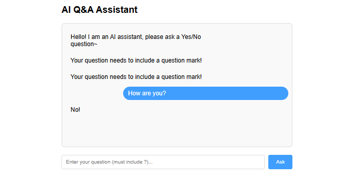
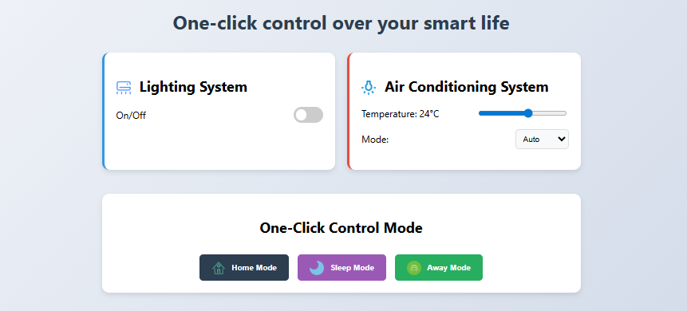
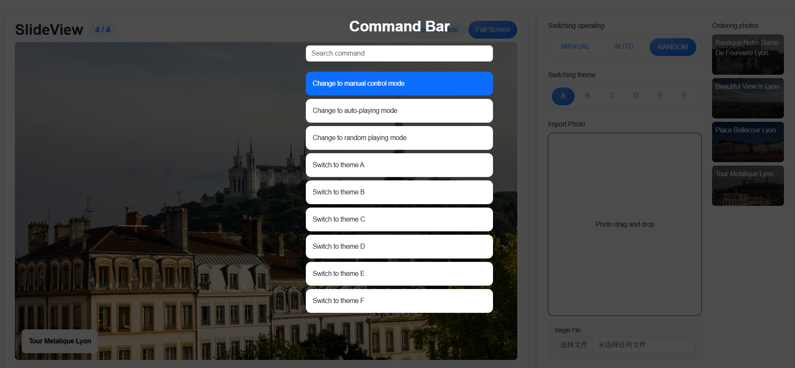

# Project 23 State Management and Axios Asynchronous Requests
---Code as a Boat Sailing to the Shore of Full-Stack Development, Breaking Through Waves

## Content Guide
In project development based on Vue 3, we will delve into the state management mechanism, learn how to manage all component states of the application through centralized storage, and realize efficient data sharing and synchronous updates between components.
At the same time, we will systematically study Axios asynchronous request technology, use its concise API design to achieve secure communication with backend servers, and efficiently handle HTTP requests and responses.

## Learning Objectives
- ① Master the core concepts of Vuex and the state management mechanism.
- ② Proficiently use Axios to complete front-end and back-end data interaction.
- ③ Understand the necessity of calling Axios in Actions.
- ④ Master the complete process of updating state through asynchronous Actions.

## Task 23.1 Q&amp;A Interactive System

### 23.1.1 Task Description
This task implements a lightweight Q&amp;A interactive system based on Vue 3, adopting the Composition API to manage question-and-answer states via ref/reactive. It integrates the InputArea sub-component to realize v-model two-way binding and form submission, and uses the dynamically rendered MessageList component to display the dialogue flow of user/AI dual roles.
With a gradient background, rounded cards and shadow design to create a fresh visual style, the final system supports real-time input capture, two-way dialogue display and random intelligent replies.
The effect of the case is shown in Figure 23-1.
<p align="center">
  
</p>

Figure 23‑1 Q&amp;A, Easy Interaction

### 23.1.2 Knowledge Preparation
Axios is a Promise-based HTTP client for both browsers and Node.js. It provides a rich set of APIs for sending HTTP requests such as GET, POST, PUT, DELETE, and supports request and response interceptors, automatic JSON data conversion, request cancellation, and other features.

#### 1. Install Axios
Install Axios using NPM with the following command:

```
npm install axios --save
```

#### 2.Import Axios
After installation, import Axios in the components that need to use it. Import it in the file.

```html
<script>
  import axios from 'axios';
</script>
```

#### 3.GET Request
As can be seen from the previous examples, a GET request without parameters can directly obtain data by concatenating the backend API address.

```html
<script>
  import axios from 'axios';
  async function fetchData() {
  try {
  const response = await axios.get('/users');
  console.log(response.data);
  } catch (error) {
  console.error('Request failed:', error.message);
  }
  }
</script>
Request with Parameters
axios.get('/users', { params: { id: 123 } });
```

#### 4. POST Request
GET requests can be used to retrieve required data from the server. If the form data from the frontend needs to be sent to the server for processing, a POST request is required.The syntax of a POST request is similar to that of a GET request.

```css
axios.post('/users', { name: 'Alice', age: 25 });
```

#### 5.Other Methods
Methods such as PUT, DELETE, and PATCH are used in a similar way, specified by the method parameter.

```css
axios({
  method: 'PUT',
  url: '/users/123',
  data: { name: 'Bob' },
});
```

#### 6.Interceptors
Request interceptors are used to uniformly set tokens and process request parameters. Sample code is as follows:

```
axios.interceptors.request.use(config => {
config.headers.Authorization = `Bearer ${localStorage.token}`;
return config;
});
```

#### 7.Requesting Local JSON Data
One of the advantages of Vue.js is that it enables complete separation of front-end and back-end development. Therefore, during development, back-end APIs often lag behind page development, making it necessary to simulate back-end API response results.Requesting and using local JSON data in Vue is an important part of project development. Below is an explanation of how to use Axios to request JSON data in Vue files.

##### (1) File location: Create a JSON file in the assets directory of the project:
assets/
├── data.json
Sample content of the JSON file is as follows: assets/data.json

```
{
"users":[{
"title": "Growth and Persistence",
"description": "The best time to plant a tree was ten years ago, and the second best time is now",
"items": ["Learn Axios", "Read JSON data", "Render to the page"]
}]
}
```

(2)Request JSON data in the component, create a component under src/DataJson.vue

```vue
<template>
<div>
<h1>{{ jsonData.title }}</h1>
<p>{{ jsonData.description }}</p>
<ul>
<li v-for="user in users" :key="user.id">
{{ user.description}}
</li>
</ul>
</div>
</template>
(3)Use Axios to request data. Send a GET request via Axios in the <script> tag:
<script setup>
import { reactive } from 'vue';
// Import JSON file (Vite recommends using the @ alias)
import jsonData from '@/assets/data.json';
// Convert to reactive data
const users = reactive(jsonData.users);
</script>
```

### 23.1.3 Task Implementation

#### Step 1: Use the command npm create vite@latest project-name --template vue to generate the project. The project directory structure is as follows:
subtitle
├─ node_modules/：Project dependency packages directory
├─ public/：Directory for storing public static resources
├─ img/：Static resources (manually created directory)
├─ src/：Source code directory
├─ App.vue: Root component
├─ main.js: Application entry file
├─ jsconfig.json ：Core metadata file of the project, recording project dependencies, script commands, version information, etc.
├─ package.json ：Core metadata file of the project, recording project dependencies, script commands, version information, etc.
├─ package-lock.json ：Automatically generated file that locks the exact versions of all dependencies and sub-dependencies
├─ README.md ：Project documentation

#### Step 2: Go to the src/App.vue page, generate the theme interface, and place the following code.

```vue
<template>
<div class="app">
<h2>AI Q&A Assistant</h2>
<!-- Message display area -->
<div class="chat-box">
```

&lt;div
v-for="(msg, index) in messages"
:key="index"

```
class="message"
```

:class="{ 'user-msg': msg.isUser }"
&gt;

```html
{{ msg.text }}
</div>
</div>
<!-- Input area -->
<div class="input-area">
```

&lt;input
v-model="question"
@keyup.enter="askQuestion"

```html
placeholder="Enter your question (must include ?)..."
/>
<button @click="askQuestion" :disabled="isLoading">
  {{ isLoading ? 'Thinking...' : 'Ask' }}
</button>
</div>
</div>
</template>
```

#### Step 3: Go to the src/App.vue page, create the styles for the theme interface, and place the following code.

```html
<style scoped>
  .app {
  max-width: 600px;
  margin: 0 auto;
  padding: 20px;
  font-family: Arial, sans-serif;
  }
  .chat-box {
  height: 300px;
  border: 1px solid #ddd;
  border-radius: 8px;
  padding: 10px;
  margin: 20px 0;
  overflow-y: auto;
  background-color: #f9f9f9;
  }
  .message {
  margin: 8px 0;
  padding: 8px 12px;
  border-radius: 18px;
  max-width: 70%;
  }
  .user-msg {
  margin-left: auto;
  background-color: #409eff;
  color: white;
  }
  .input-area {
  display: flex;
  gap: 10px;
  }
  input {
  flex: 1;
  padding: 10px;
  border: 1px solid #ddd;
  border-radius: 4px;
  }
  button {
  padding: 10px 20px;
  background-color: #409eff;
  color: white;
  border: none;
  border-radius: 4px;
  cursor: pointer;
  }
  button:disabled {
  background-color: #a0cfff;
  }
</style>
```

#### Step 4: Go to the src/App.vue page, implement the core logic, import the axios package, and place the following code.

```html
<script setup>
  import { ref } from 'vue'
  import axios from 'axios'
  // Check if the input contains "?", otherwise prompt the user
</script>
```

#### Step 5: Go to the src/App.vue page, check whether the input contains "?", otherwise prompt the user, and place the following code.

```js
const question = ref('')
const messages = ref([
    { text: 'Hello! I am an AI assistant, please ask a Yes/No question~', isUser: false }
  ])
const isLoading = ref(false)
const askQuestion = async () => {
  if (!question.value.includes('?')) {
    messages.value.push({ text: 'Your question needs to include a question mark!', isUser: false })
    return
  }
// Add user's question
}
```

#### Step 6: Go to the src/App.vue page, add the user's question, and place the following code.

```
// Add user's question
messages.value.push({ text: question.value, isUser: true })
question.value = ''
isLoading.value = true
// Call free API
```

#### Step 7: Go to the src/App.vue page, call the API, and place the following code.

```js
// Call free API
try {
  const { data } = await axios.get('https://yesno.wtf/api')
  const answer = data.answer === 'yes' ? 'Yes!' : 'No!'
  messages.value.push({ text: answer, isUser: false })
} catch {
messages.value.push({ text: 'Service is temporarily unavailable', isUser: false })
} finally {
isLoading.value = false
}
```

## Task 23.2 One‑Click Control of Your Smart Life

### 23.2.1 Task Description
In the One‑Click Control of Your Smart Life application built with Vue 3, users can manage all smart home devices conveniently through a unified control panel with just one click.
Entering a command triggers Vuex state management to synchronously update device status, render lighting brightness and air temperature, and intelligently switch device icons and operation interfaces with conditional rendering.
The effect of the case is shown in Figure 23‑2.
<p align="center">
  
</p>

Figure 23‑2 One‑Click Control of Your Smart Life

### 23.2.2 Knowledge Preparation
Pinia is a state management library for Vue. It provides a simpler and more intuitive way to manage the state of Vue applications. Inspired by Vuex, Pinia uses the Composition API to simplify state management code.
Pinia originated from an experiment in November 2019, aiming to offer a state management solution with the Composition API for Vue. Its design goal is to become an alternative to Vuex, the official state management library. It supports both Vue 2 and Vue 3, and does not require developers to use the Composition API mandatorily.

#### 1. Installation of Pinia
Install Pinia using NPM with the following command:

```
npm install Pinia
```

#### 2.PiniaImport Pinia
Import Pinia in the project's main.js file and use the createApp method to initialize it. Sample code is as follows:

```js
import { createPinia} from 'pinia';
```

#### 3.Store
A container that stores application state. Each Store is an independent module. Sample code is as follows:

```css
import { defineStore } from 'pinia';
// Options API
export const useCounterStore = defineStore('counter', {
  state: () => ({ count: 0 }),
getters: {
  doubleCount: (state) => state.count * 2,
},
actions: {
  increment() {
    this.count++;
  },
},
});
// Composition  API
export const useUserStore = defineStore('user', () => {
  const user = ref(null);
  const setUser = (newUser) => {
    user.value = newUser;
  };
  return { user, setUser };
});
```

#### 4.State
Stores application data and supports reactivity. It can be defined and used within the Store. The Store allows direct access and modification. Sample code is as follows:

```js
// Options-style definition
const useStore = defineStore('store-id',{
```

state:()=&gt;({
count:0，

```js
uname:'ZhangSan',
isAdmin: true,
roles:[],
})
})
// Define state in composition style
const useStore =defineStore('store-id',()=>{
    constg count=ref(0)
    const uname=ref('ZhangSan')
    const isAdmin =ref(true)
    const roles =ref([])
  })
```

#### 5.Getters (Computed Properties)
Getters are similar to the computed properties in Vue components. They are values calculated based on the current state.
Getters are reactive and will update automatically when the state they depend on changes. Sample code is as follows.

```js
// Define Getter in options style
const useStore =defineStore('counter',{
    state:()=>({count:0}),
    getters:{
      tenfold:(state)=>state.count*10
    },
})
// Define Getter in composition style
const useStore=defineStore('counter'，()=>{
    const count=ref(0)
    const tenfold=computed(()=>count.value * 10)
    return {count,tenfold }
  })
```

#### 6.Actions
Actions are similar to methods in Vue components. They are functions used to modify the state.
Actions can contain asynchronous operations, and state changes can be handled with the helper functions provided by Pinia. Sample code is as follows.

```js
// Define Actions in options style
const useStore =defineStore('counter',{
    state:()=>({ count:0 }),
    actions:{
      decrement(){
        this.count--
      },
  },
})
// Define Actions in composition style
const useStore =defineStore('counter',()=>{
    const count=ref(0)
    const decrement=()=>{
      count.value--
    }
  return fcount,decrement}
})
```

### 23.2.3 Task Implementation

#### Step 1: Use the command npm create vite@latest project-name --template vue to generate the project. The directory structure is as follows:
Life
├─ node_modules/：Project dependency packages directory
├─ public/：Directory for storing public static resources
├─ img/：Static resources (manually created directory)
├─ src/：Source code directory
├─ App.vue: Root component
├─ main.js: Application entry file
├─ jsconfig.json ：Core metadata file of the project, recording project dependencies, script commands, version information, etc.
├─ package.json ：Core metadata file of the project, recording project dependencies, script commands, version information, etc.
├─ package-lock.json ：Automatically generated file that locks the exact versions of all dependencies and sub-dependencies
├─ README.md ：Project documentation

#### Step 2: Go to the src/App.vue file, create the main interface, and place the following code.

```vue
<template>
<div class="smart-home-control">
<h1>One-click control over your smart life</h1>
<div class="control-grid">
<!-- Lighting Control -->
<div class="control-card lighting-card">
<h2> Lighting System</h2>
<div class="control-group">
<span>On/Off</span>
<label class="switch">
<input type="checkbox" v-model="state.lighting.on">
<span class="slider"></span>
</label>
</div>
<div class="control-group" v-if="state.lighting.on">
<span>Brightness: {{ state.lighting.brightness }}%</span>
<input type="range" min="0" max="100" v-model="state.lighting.brightness">
</div>
</div>
<!-- Air Conditioning Control -->
<div class="control-card climate-card">
<h2> Air Conditioning System</h2>
<div class="control-group">
<span>Temperature: {{ state.climate.temp }}°C</span>
<input type="range" min="16" max="30" v-model="state.climate.temp">
</div>
<div class="control-group">
<span>Mode:</span>
<select v-model="state.climate.mode">
<option value="auto">Auto</option>
<option value="cool">Cooling</option>
<option value="heat">Heating</option>
</select>
</div>
</div>
</div>
<!-- One-Click Control Buttons -->
<div class="one-click-control">
<h2>One-Click Control Mode</h2>
<div class="mode-buttons">
<button @click="setMode('home')" class="home-btn">
 Home Mode
</button>
<button @click="setMode('sleep')" class="sleep-btn">
 Sleep Mode
</button>
<button @click="setMode('away')" class="away-btn">
 Away Mode
</button>
</div>
</div>
</div>
</template>
```

#### Step 3: Go to the src/App.vue page, create styles for the main interface, and place the following code.

```html
<style>
  /* Styles remain unchanged */
  :root {
  --primary-color: #3498db;
  --success-color: #2ecc71;
  --warning-color: #f39c12;
  --danger-color: #e74c3c;
  --card-radius: 12px;
  --shadow-sm: 0 2px 4px rgba(0,0,0,0.05);
  --shadow-md: 0 4px 8px rgba(0,0,0,0.1);
  }
  body {
  font-family: 'Segoe UI', Tahoma, Geneva, Verdana, sans-serif;
  background: linear-gradient(135deg, #f5f7fa 0%, #c3cfe2 100%);
  min-height: 100vh;
  margin: 0;
  padding: 20px;
  }
  .smart-home-control {
  max-width: 800px;
  margin: 0 auto;
  }
  h1 {
  text-align: center;
  color: #2c3e50;
  margin-bottom: 30px;
  }
  .control-grid {
  display: grid;
  grid-template-columns: repeat(auto-fit, minmax(300px, 1fr));
  gap: 20px;
  margin-bottom: 40px;
  }
  .control-card {
  background: white;
  border-radius: var(--card-radius);
  box-shadow: var(--shadow-md);
  padding: 20px;
  transition: transform 0.3s, box-shadow 0.3s;
  }
  .lighting-card {
  border-left: 4px solid var(--primary-color);
  }
  .climate-card {
  border-left: 4px solid #e74c3c;
  }
  .control-group {
  display: flex;
  align-items: center;
  justify-content: space-between;
  margin: 15px 0;
  }
  /* Switch styles */
  .switch {
  position: relative;
  display: inline-block;
  width: 50px;
  height: 26px;
  }
  .switch input {
  opacity: 0;
  width: 0;
  height: 0;
  }
  .slider {
  position: absolute;
  cursor: pointer;
  top: 0;
  left: 0;
  right: 0;
  bottom: 0;
  background-color: #ccc;
  transition: .4s;
  border-radius: 26px;
  }
  .slider:before {
  position: absolute;
  content: "";
  height: 18px;
  width: 18px;
  left: 4px;
  bottom: 4px;
  background-color: white;
  transition: .4s;
  border-radius: 50%;
  }
  input:checked + .slider {
  background-color: var(--primary-color);
  }
  input:checked + .slider:before {
  transform: translateX(24px);
  }
  select {
  padding: 8px;
  border-radius: 6px;
  border: 1px solid #ddd;
  background-color: #f8f9fa;
  max-width: 150px;
  }
  input[type="range"] {
  width: 150px;
  }
  .one-click-control {
  background: white;
  border-radius: var(--card-radius);
  box-shadow: var(--shadow-md);
  padding: 20px;
  text-align: center;
  }
  .mode-buttons {
  display: flex;
  gap: 15px;
  justify-content: center;
  margin-top: 15px;
  flex-wrap: wrap;
  }
  button {
  background: var(--primary-color);
  color: white;
  border: none;
  padding: 10px 20px;
  border-radius: 6px;
  cursor: pointer;
  transition: all 0.3s;
  font-weight: 600;
  margin-top: 10px;
  }
  .home-btn {
  background: #2c3e50;
  }
  .sleep-btn {
  background: #9b59b6;
  }
  .away-btn {
  background: #27ae60;
  }
  button:hover {
  opacity: 0.9;
  transform: translateY(-2px);
  }
  .icon {
  width: 24px;
  height: 24px;
  margin-right: 8px;
  vertical-align: middle;
  }
  button .icon {
  margin-right: 6px;
  }
</style>
```

#### Step 4: Go to the src/App.vue page, implement state management and one-click mode settings, and place the following code.

```html
<script setup>
  import { reactive } from 'vue';
  // Simplified state management
  const state = reactive({
  lighting: { on: false, brightness: 100 },
  climate: { temp: 24, mode: 'auto' }
  });
  // One-click mode setting
  const setMode = (mode) => {
  switch(mode) {
  case 'home':
  state.lighting.on = true;
  state.lighting.brightness = 80;
  state.climate.temp = 24;
  break;
  case 'sleep':
  state.lighting.on = true;
  state.lighting.brightness = 20;
  state.climate.temp = 26;
  break;
  case 'away':
  state.lighting.on = false;
  state.climate.temp = 20;
  break;
  }
  };
</script>
```

## Task 23.3 Project Practice – Photo Slideshow System – Command Bar (Module E)

### 23.3.1 Task Description
This project practice implements the command bar module in the photo slideshow system project. Users can display the command bar by pressing CTRL+K or typing "/". They can return to the normal state from the command bar dialog by pressing the ESC key.
The command bar is usually positioned in the center of the screen. When the command bar is activated, the rest of the web page will be dimmed. While the command bar is displayed, different options will appear below the command bar input field.
Users can select different options using the Up and Down arrow keys on the keyboard. The selected option should be highlighted so that users can clearly identify it. When the user presses the ENTER key, the selected option will be executed as a command.

### 23.3.2 Effect Display
The effect of the switching operation is shown in Figure 23‑3.
<p align="center">
  
</p>

<p align="center"><em>Figure 23-3 Command Bar</em></p>

### 23.3.3 Task Implementation

#### Step 1: Use the command npm create vite@latest project-name --template vue to create a project named module_e-src. The project directory structure is as follows:
34_module_e: This directory stores static resource files (mainly used for initializing photos).
module_e-src
├─ node_modules/：Project dependency packages directory
├─ public/：Directory for storing public static resources
├─ src/：Source code directory
├─ assets/： Static resources (directory created manually)
├─ components/： Reusable Vue components (directory created manually)
├─ EffectA.vue: Theme A displays photos and titles directly without any effects.
├─ EffectB.vue: Theme B animates the active photo moving from the left to the center, then exiting the screen by moving to the right. For the title, the title element follows the same left-to-right animation but starts with a 300-millisecond delay.
├─ EffectC.vue: Theme C animates the active photo moving from the bottom to the center, then exiting the screen by moving upward. For the subtitle, it is split into several words, each animated with a 300-millisecond delay.
├─ EffectD.vue: Theme D slides the active photo into the center from the left side of the screen. The photo then stays in the center. The next photo slides in and overlays the active one. Each photo has a slight random rotation between -5 and 5 degrees. The photos should not occupy the entire screen; they should take up about 85% of the screen space. The varying rotations create a stacked photo effect. Each photo has a 3px white border with a border radius of 5px, and the bottom border appears thicker due to the variant style. The title is positioned at the bottom of the photo with a white background matching the photo border.
├─ EffectE.vue: Theme E displays the active photo in the center of the screen. The current photo then performs a door-opening effect: it splits into left and right halves, which rotate inward in 3D perspective to simulate opening doors. The next photo appears from behind and becomes active after the current photo disappears.
├─ EffectF.vue: Theme F – Please create a new theme named "Theme F". You may define custom photo sliding transitions and subtitle animations.
├─ SettingArea.vue: Theme switching controls
├─ SlideController.vue: Home page
├─ OrderingArea.vue：Order Photos
├─ CommandArea.vue：Command Bar
├─ App.vue: Root component
├─ main.js: Application entry file
├─ config.js: Slideshow timing configuration file (created manually)
├─ helper.js: File for randomly generating image names (created manually)
├─ store.js: Slideshow configuration matching file (created manually)
├─ jsconfig.json ：Core metadata file of the project, recording project dependencies, script commands, version information, etc.
├─ package.json ：Core metadata file of the project, recording project dependencies, script commands, version information, etc.
├─ package-lock.json ：Automatically generated file that locks the exact versions of all dependencies and sub-dependencies
├─ README.md ：Project documentation

#### Step 2: Implement the command bar page in the CommandArea.vue file.
The code is as follows:

```vue
<template>
<aside>
<div class="singleForm py-5">
<h1 class="text-center text-white mb-4">Command Bar</h1>
<label class="mb-4 d-block">
<input type="text" class="form-control" v-model="commandKeyword" placeholder="Search command">
</label>
<div class="row gy-2">
<div class="col-12" v-for="(item, i) in commands">
<div class="p-3 rounded"
```

:class="{'bg-white': i !== location, 'bg-primary': i === location, 'text-white': i === location}"&gt;

```html
{{ item.name }}
</div>
</div>
</div>
</div>
</aside>
</template>
```

#### Step 3: Implement the command bar styles in the CommandArea.vue file.
The code is as follows:

```html
<style scoped>
  aside {
  background: rgba(0, 0, 0, .7);
  position: fixed;
  left: 0;
  top: 0;
  bottom: 0;
  right: 0;
  z-index: 9999;
  }
</style>
```

#### Step 4: Implement the configuration file in the CommandArea.vue file.
The code is as follows:

```html
<script setup>
  import {computed, onUnmounted, ref, watch} from "vue";
  import {appMode, appTheme} from "@/store.js";
  /* command search form keyword */
</script>
```

#### Step 5: Search for the following keywords in the command bar in the CommandArea.vue file.
The code is as follows:

```js
/* command search form keyword */
const commandKeyword = ref("");
watch(commandKeyword, () => location.value = 0);
/* Define command list */
```

#### Step 6: Define the command list in the CommandArea.vue file.
The code is as follows:

```css
/* Define command list */
const commandList = ref([
{
  name: "Change to manual control mode",
  action: () => {
    appMode.value = 'MANUAL';
  }
},
{
  name: "Change to auto-playing mode",
  action: () => {
    appMode.value = 'AUTO';
  }
},
{
  name: "Change to random playing mode",
  action: () => {
    appMode.value = 'RANDOM';
  }
},
{
  name: "Switch to theme A",
  action: () => {
    appTheme.value = 'A';
  }
},
{
  name: "Switch to theme B",
  action: () => {
    appTheme.value = 'B';
  }
},
{
  name: "Switch to theme C",
  action: () => {
    appTheme.value = 'C';
  }
},
{
  name: "Switch to theme D",
  action: () => {
    appTheme.value = 'D';
  }
},
{
  name: "Switch to theme E",
  action: () => {
    appTheme.value = 'E';
  }
},
{
  name: "Switch to theme F",
  action: () => {
    appTheme.value = 'F';
  }
}
])
const location = ref(0);
const commands = computed(() => {
  const reg = new RegExp(commandKeyword.value);
  return commandList.value
  .filter(item => {
    return reg.test(item.name);
  })
})
/* up and down event */
```

#### Step 7: Implement the drag operation when the mouse is pressed down in the CommandArea.vue file.
The code is as follows:

```js
function keydown(e) {
  if (e.code === "ArrowDown") {
    location.value++;
  }
if (e.code === "ArrowUp") {
  location.value--;
}
location.value = Math.min(commands.value.length -1, Math.max(0, location.value));
if (e.code === "Enter" && commands.value[location.value]) {
  commands.value[location.value].action();
}
}
/*  register and remove event */
```

#### Step 8: Implement up and down navigation events in the CommandArea.vue file.
The code is as follows:

```
/* register and remove event */
addEventListener("keydown", keydown);
onUnmounted(() => {
removeEventListener("keydown", keydown);
})
```
