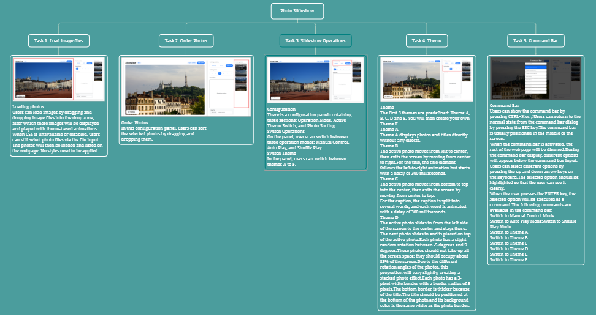
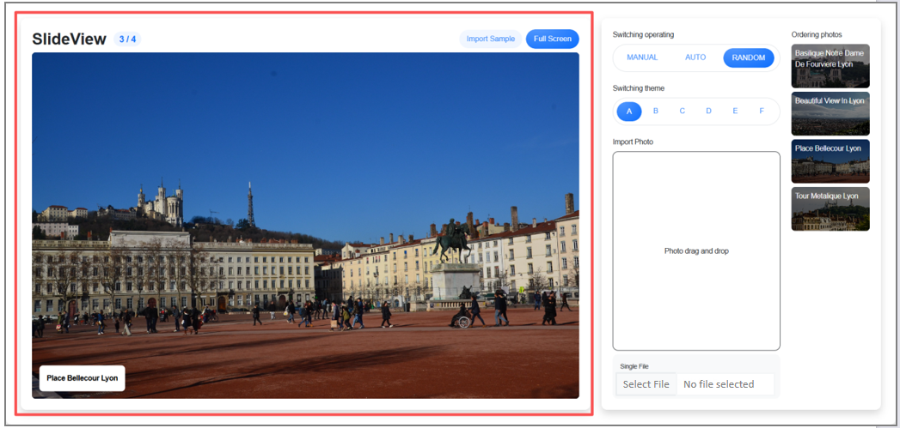
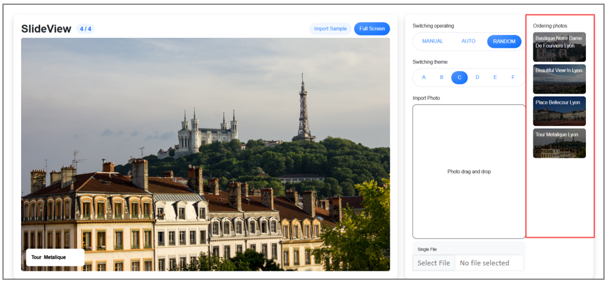
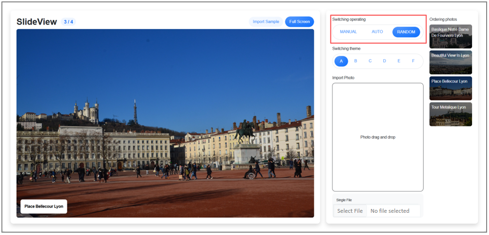
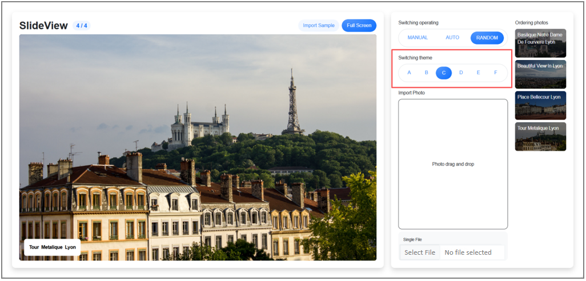

# Project 24 Comprehensive Project - Photo Slideshow System (Module E)

## Content Guide

After systematically mastering the core features and reactivity principles of Vue 3, this project will use the Vue 3 knowledge system to develop a comprehensive practical project - the Photo Slideshow System. The project covers five core modules: Module 1: Loading Image Files, Module 2: Ordering Photos, Module 3: Slideshow Operations, Module 4: Themes, and Module 5: Command Bar.

## Learning Objectives

- ① Apply reactive data and state management, master the core reactivity mechanism of Vue 3 through ref and reactive, and implement reactive management of data such as image data, current index, and carousel status. Be able to derive computed properties using computed to reduce duplicate calculations and optimize performance.
- ② Apply component-based development and directive system, use the v-for directive to render image lists, combine v-bind to dynamically bind image paths, style classes and interactive attributes, and listen to user click events (such as switch buttons and autoplay control) via @.
- ③ Apply transition animations and dynamic effects, use the transition component to add fade-in and fade-out animations for the display/hide of a single image to enhance visual effects.

#### 24.1 Scoring Summary

| No. | Sub-criteria | Marks |
| --- | --- | --- |
| 1 | Loading Image Files | 2.75 |
| 2 | Ordering Photos | 1.5 |
| 3 | Slideshow Operations | 2.5 |
| 4 | Themes | 6.5 |
| 5 | Command Bar | 3.75 |

#### 24.2 Project Introduction

In this project, the client requires you to create a photo slideshow tool. Users can load external photos or load sample photos into the slideshow. The photos will then appear one by one, stay for a few seconds, and then disappear. Depending on the applied theme, the appearance and disappearance of photos may include transitions and animations.

The photo slideshow supports different playback modes:

Manual mode using the left and right arrow keys on the keyboard.

Auto-play mode, where photos play automatically and loop back to the first photo after the last one is displayed.

Shuffle mode, where a random photo is displayed after a few seconds. In this mode, the slideshow plays continuously and never ends.

The photo slideshow can also be switched to full-screen viewing. When in full screen, the browser toolbar and Windows taskbar will be hidden.

#### 24.3 Requirement Analysis

The photo slideshow system is divided into five major tasks:

Task 1: Loading image files

Task 2: Ordering photos

Task 3: Slideshow operations

Task 4: Themes

Task 5: Command bar

The functional description of each task is as follows.The functional task structure diagram of the project is shown in Figure 24-1.

<p align="center">
  
</p>

<p align="center"><em>Figure 24-1 Functional Structure Diagram</em></p>

#### 1.Photo Slideshow Project Tasks

The photo slideshow project includes the following tasks: Task 1: Loading Image Files, Task 2: Ordering Photos, Task 3: Slideshow Operations, Task 4: Themes, and Task 5: Command Bar.

In this project, the client requires you to create a photo slideshow tool. Users can load external photos or load sample photos into the slideshow. The photos will then appear one by one, stay for a few seconds, and then disappear. Depending on the applied theme, transitions and animations may be applied when photos appear and disappear.

##### (1) Loading Image Files

In this task, users can load images by dragging and dropping image files into the drop area. The images will then be displayed and played with animations according to the selected theme.

If CSS is unavailable or disabled, users can still select photo files via the file input. The photos will then be loaded and listed on the webpage without any styles applied.

##### (2) Ordering Photos

In this task, within the configuration panel, users can sort the selected photos by dragging and dropping them.

##### (3) Slideshow Operations

This task requires implementing the slideshow operation module. Core functions include:

Configuration: A configuration panel with three sections: operation mode, active theme switching, and photo ordering.

Mode Switching: Users can switch among three operation modes on the panel: manual control, auto-play, and random play.

Theme Switching: Users can switch between themes A to F in the panel.

Photo Ordering: Within the configuration panel, users can sort selected photos by dragging and dropping.

##### (4) Themes

This task implements the theme module. The first five themes are predefined: Theme A, B, C, D, and E. A custom Theme F will also be created.

Theme A: Displays photos and titles directly without any effects.

Theme B: The active photo moves from left to center, then exits the screen by moving from center to right. The title follows the same left-to-right animation but starts with a 300-millisecond delay.

Theme C: The active photo moves from bottom to center, then exits the screen by moving upward from the center. The subtitle is split into several words, each with a 300-millisecond animation delay.

Theme D: The active photo slides in from the left side of the screen to the center and stays there. The next photo slides in and overlays the active one. Each photo has a slight random rotation between -5 and 5 degrees. Photos should occupy approximately 85% of the screen space rather than the full screen. The varying rotations create a stacked photo effect. Each photo has a 3px white border with a 5px border-radius, and a thicker bottom border to accommodate the title. The title is placed at the bottom of the photo with a white background matching the photo border.

Theme E: The active photo is displayed in the center of the screen. The current photo then shows a door-opening effect: it splits into left and right halves, which rotate in 3D perspective toward the screen to simulate opening doors. The next photo appears from behind and becomes active after the current photo disappears.

##### (5) Command Bar

This task implements the command bar module.

Users can show the command bar by pressing CTRL+K or typing "/". They can return to the normal state from the command bar dialog by pressing the ESC key.

The command bar is normally positioned in the center of the screen. When activated, the rest of the webpage is dimmed.

While the command bar is displayed, various options appear below the command input. Users can select different options using the Up and Down arrow keys on the keyboard. The selected option is highlighted for clear user feedback.

#### 24.4 Page Design

### 24.4.1 Directory Structure

The project name is module_e-src, and the resource folder contains the following directory:

34_module_e: This directory stores static resource files (mainly used for initializing photos).

```text
module_e-src
├── node_modules/: Project dependency packages directory
├── public/: Directory for storing public static resources
├── src/: Source code directory
│   ├── assets/: Static resources (directory created manually)
│   ├── components/: Reusable Vue components (directory created manually)
│   │   ├── EffectA.vue: Theme A displays photos and titles directly without any effects.
│   │   ├── EffectB.vue: Theme B animates the active photo moving from the left to the center, then exiting the screen by moving to the right. For the title, the title element follows the same left-to-right animation but starts with a 300-millisecond delay.
│   │   ├── EffectC.vue: Theme C animates the active photo moving from the bottom to the center, then exiting the screen by moving upward. For the subtitle, it is split into several words, each animated with a 300-millisecond delay.
│   │   ├── EffectD.vue: Theme D slides the active photo into the center from the left side of the screen. The photo then stays in the center. The next photo slides in and overlays the active one. Each photo has a slight random rotation between -5 and 5 degrees. The photos should not occupy the entire screen; they should take up about 85% of the screen space. The varying rotations create a stacked photo effect. Each photo has a 3px white border with a border radius of 5px, and the bottom border appears thicker due to the variant style. The title is positioned at the bottom of the photo with a white background matching the photo border.
│   │   ├── EffectE.vue: Theme E displays the active photo in the center of the screen. The current photo then performs a door-opening effect: it splits into left and right halves, which rotate inward in 3D perspective to simulate opening doors. The next photo appears from behind and becomes active after the current photo disappears.
│   │   ├── EffectF.vue: Theme F – Please create a new theme named "Theme F". You may define custom photo sliding transitions and subtitle animations.
│   │   ├── SettingArea.vue: Theme switching controls
│   │   ├── SlideController.vue: Home page
│   │   ├── OrderingArea.vue: Order Photos
│   │   └── CommandArea.vue: Command Bar
│   ├── App.vue: Root component
│   ├── main.js: Application entry file
│   ├── config.js: Slideshow timing configuration file (created manually)
│   ├── helper.js: File for randomly generating image names (created manually)
│   └── store.js: Slideshow configuration matching file (created manually)
├── jsconfig.json: Core metadata file of the project, recording project dependencies, script commands, version information, etc.
├── package.json: Core metadata file of the project, recording project dependencies, script commands, version information, etc.
├── package-lock.json: Automatically generated file that locks the exact versions of all dependencies and sub-dependencies
└── README.md: Project documentation
```

### 24.4.2 Design Ideas

##### (1) Loading Image Files

In this task, users can load images by dragging and dropping image files into the drop area, and the images will then be displayed and played according to the selected theme.When CSS is unavailable or disabled, users can still select photo files via the file input. The photos will then be loaded and listed on the webpage without any styles applied, as shown in Figure 24-2.

<p align="center">
  
</p>

Figure 24‑2 Loading Image Files

##### (2) Ordering Photos

This task mainly implements the photo ordering module. In this configuration panel, users can sort the selected photos by dragging and dropping them, as shown in Figure 24‑3.

<p align="center">
  
</p>

Figure 24‑3 Ordering Photos

##### (3) Slideshow Operations

This task mainly implements the slideshow operation module, which contains a configuration panel with three sections: operation mode, active theme switching, and photo ordering.

Mode switching: Users can switch among three operation modes on the panel: manual control, auto-play, and random play.

Theme switching: Users can switch between themes A to F in the panel.

The effect is shown in Figure 24‑5.

<p align="center">
  
</p>

Figure 24‑5 Slideshow Operations

##### (4) Themes

This task mainly implements the theme module. The first five themes are predefined: Theme A, B, C, D and E. You will then create your own Theme F.

Theme A displays photos and titles directly without any effects.

In Theme B, the active photo moves from the left to the center, then moves from the center to the right and exits the screen. For the title, the title element follows the same left-to-right animation but starts with a 300-millisecond delay.

In Theme C, the active photo moves from the bottom to the center, then moves upward from the center and exits the screen. For the subtitle, it is split into several words, each with a 300-millisecond animation delay.

In Theme D, the active photo slides in from the left side of the screen to the center and stays there. The next photo slides in and is placed on top of the active photo. Each photo has a slight random rotation between -5 degrees and 5 degrees. These photos should not occupy the entire screen space; they should take up about 85% of it. The different rotations create a stacked photo effect. Each photo has a 3px white border with a 5px border-radius, and a thicker bottom border. The title is placed at the bottom of the photo with a white background matching the photo border, as shown in Figure 24‑6.

<p align="center">
  
</p>

Figure 24‑6 Themes

##### (5) Command Bar

This task mainly implements the command bar module. Users can display the command bar by pressing CTRL+K or typing "/". They can return to the normal state from the command bar dialog by pressing the ESC key.

The command bar is usually positioned in the center of the screen. When the command bar is activated, the rest of the web page will be dimmed. While the command bar is displayed, different options will appear below the command bar input field.

Users can select different options using the Up and Down arrow keys on the keyboard. The selected option should be highlighted so that users can clearly identify it. When the user presses the ENTER key, the selected option will be executed as a command.

The command bar includes the following commands:

Switch to Manual Control Mode, Switch to Auto-play Mode, Switch to Shuffle Mode, Switch to Theme A, Switch to Theme B, Switch to Theme C, Switch to Theme D, Switch to Theme E, Switch to Theme F,as shown in Figure 24‑7.

<p align="center">
  
</p>

<p align="center"><em>Figure 24-7 Command Bar</em></p>

#### 24.5 Project Implementation

Task 1 Loading Image Files

#### Step 1: generate the project using the command"npm create vite@latest project-name --template vue".

#### Step 2: configure image loading initialization in vite.config.js. The code is as follows:

```js
import { fileURLToPath, URL } from 'node:url'
import { defineConfig } from 'vite'
import vue from '@vitejs/plugin-vue'
// https://vitejs.dev/config/
export default defineConfig({
    plugins: [
      vue(),
    ],
  build: {
    outDir: "../34_module_e",
  },
server: {
  port: 3000,
},
base: "/34_module_e",
resolve: {
  alias: {
    '@': fileURLToPath(new URL('./src', import.meta.url))
  }
}
})
```

#### Step 3: Load static resource files in main.js. The code is as follows:

```vue
import './assets/bootstrap-5.3.3.min.css'
import './assets/common.css'
import './assets/main.css'
import './assets/theme/commonTheme.css'
import { createApp } from 'vue'
import App from './App.vue'
createApp(App).mount('#app')
```

#### Step 4: Define the slide duration in the config.js file. The code is as follows:

```js
export const SLIDE_TIME = 3000;
```

#### Step 5: Define a random number in the helper.js file.

```js
export function getId() {
  return ~~(Math.random() * 10000000);
}
export function convertFilename(name) {
  return name
  .split(".")[0]
  .replaceAll(/-/g, " ")
  .split(" ")
  .map(item => {
      return item.charAt(0).toUpperCase() + item.slice(1).toLowerCase();
    })
.join(" ");
}
```

#### Step 6: Configure the default playback mode in the store.js file.

```js
import {computed, ref} from "vue";
export const appMode = ref('RANDOM'); // MANUAL AUTO RANDOM
export const appTheme = ref("A"); // A B C D E F
export const appImages = ref([]);
export const currentImageIndex = ref(0);
export const currentImage = computed(() => {
    return appImages.value[currentImageIndex.value];
  })
```

#### Step 7: Import and load the homepage file in App.vue.

The code is as follows:

```vue
<script setup>
import SlideController from "@/components/SlideController.vue";
import SettingArea from "@/components/SettingArea.vue";
import OrderingArea from "@/components/OrderingArea.vue";
import CommandArea from "@/components/CommandArea.vue";
import {ref} from "vue";
</script>
<template>
<div class="row h-100">
<div class="col-8">
<slide-controller></slide-controller>
</div>
<div class="col">
<section class="section h-100">
<div class="row h-100">
<div class="col-8">
<setting-area></setting-area>
</div>
<div class="col">
<ordering-area></ordering-area>
</div>
</div>
</section>
</div>
</div>
<command-area v-if="commandShow"></command-area>
</template>
<style scoped>
#app {
  height: 100vh;
  padding: 2rem;
}
</style>
```

#### Step 8: Import the configuration file in the components/SlideController.vue file.The code is as follows:

```vue
<script setup>
import {appImages, appMode, appTheme, currentImageIndex} from "@/store.js";
import {convertFilename, getId} from "@/helper.js";
import {computed, onMounted, ref, watch} from "vue";
import {SLIDE_TIME} from "@/config.js";
import EffectA from "@/components/EffectA.vue";
import EffectB from "@/components/EffectB.vue";
import EffectC from "@/components/EffectC.vue";
import EffectD from "@/components/EffectD.vue";
import EffectE from "@/components/EffectE.vue";
import EffectF from "@/components/EffectF.vue";
/* toggle fullscreen */
</script>
```

#### Step 9: Load images in components/EffectA.vue.

The code is as follows:

```vue
<script setup>
import {currentImage} from "@/store.js";
</script>
<template>

<div class="captionBox">
<div class="caption">{{currentImage.caption}}</div>
</div>
</template>
<style scoped>
</style>
```

#### Step 10: Implement template rendering in the components/SlideController.vue file.

The code is as follows:

```vue
<template>
<section class="section h-100 d-flex flex-column">
<div class="d-flex justify-content-between align-items-center mb-2">
<div class="d-flex align-items-center">
<h1 class="fw-bold mb-0">SlideView</h1>
<div class="ms-3 badge text-primary bigBadge">
{{ currentImageIndex + 1 }} / {{ appImages.length }}
</div>
</div>
<div class="d-flex align-items-center gap-2">
<button class="btn btn-fill text-primary active" @click="importSample">Import Sample</button>
<button class="btn btn-primary enterFull" @click="toggleFullscreen">Full Screen</button>
<button class="btn btn-danger exitFull" @click="toggleFullscreen">Exit Full Screen</button>
</div>
</div>
<div class="flex-grow-1 position-relative">
<div class="staticBox">
<div class="themeContainer">
<div class="text-white" v-if="!appImages.length">Add photos!</div>
<component :is="themeComponent" v-else :key="slideKey"></component>
</div>
</div>
</div>
</section>
</template>
```

#### Step 11: Apply style control in the components/SlideController.vue file.

The code is as follows:

```html
<style scoped>
  .bigBadge {
  font-size: 1.2rem;
  }
  .exitFull {
  display: none;
  }
  @media (display-mode: fullscreen) {
  .enterFull {
  display: none;
  }
  .exitFull {
  display: inline-block;
  }
  }
</style>
```

#### Step 12: Define the full-screen control function in the components/SlideController.vue file, placing it below the imported packages.

The code is as follows:

```js
/* toggle fullscreen */
function toggleFullscreen() {
  /* exit fullscreen */
  if (document.fullscreenElement) {
    document.exitFullscreen();
  } else {
  /* enter fullscreen */
  document.documentElement.requestFullscreen();
}
}
/* import sample data */
```

#### Step 13: Implement the sample data loading logic in the components/SlideController.vue file, placing it below the full-screen control function.

The code is as follows:

```js
/* import sample data */
function importSample() {
  const sampleFiles = [
    "basilique-notre-dame-de-fourviere-lyon.jpg",
    "beautiful-view-in-lyon.jpg",
    "place-bellecour-lyon.jpg",
    "tour-metalique-lyon.jpg",
  ];
sampleFiles.map(name => {
    appImages.value.push({
        id: getId(),
        image: import.meta.env.DEV
        ? "http://localhost:3000/34_module_e/" + name
        : "http://localhost/34_module_e/" + name,
        caption: convertFilename(name)
      })
})
}
/* automatic load sample data in DEV env */
if (import.meta.env.DEV) {
  //onMounted(importSample);
}
```

#### Step 14: Implement the initialization of the core slideshow logic in the components/SlideController.vue file, placing it below the sample data loading logic.

The code is as follows:

```js
let slideInterval = null;
const slideKey = ref(0);
/* run slide */
function setSlideInterval() {
  clearInterval(slideInterval);
  currentImageIndex.value = 0;
  slideKey.value++;
  /* Auto Playing Type */
  if (appMode.value === "AUTO") {
    slideInterval = setInterval(() => {
        /* check exists images */
        if (!appImages.value.length) return;
        /* check last turn */
        if (currentImageIndex.value + 1 === appImages.value.length) {
          currentImageIndex.value = 0;
        } else {
        currentImageIndex.value += 1;
      }
  }, SLIDE_TIME)
}
/* Random Type */
if (appMode.value === "RANDOM") {
  slideInterval = setInterval(() => {
      /* check exists images */
      if (!appImages.value.length) return;
      const randoms = appImages.value
      .map((a, i) => i) // get only index
      .filter(item => item !== currentImageIndex.value); // filter without current index
      if(!randoms.length) return;
      /* set index */
      currentImageIndex.value = randoms[~~(Math.random() * randoms.length)];
    }, SLIDE_TIME)
}
}
```

#### Step 15: Implement keyboard event listening in the components/SlideController.vue file, placing it below the initialization of the core slideshow logic.

The code is as follows:

```js
/* manual control event */
addEventListener("keydown", function (e) {
    if (appMode.value !== "MANUAL" || !appImages.value.length) return;
    if (e.code === "  " && currentImageIndex.value !== 0) {
      currentImageIndex.value -= 1;
    }
  if (e.code === "ArrowRight" && currentImageIndex.value !== appImages.value.length - 1) {
    currentImageIndex.value += 1;
  }
})
```

#### Step 16: Implement dynamic theme component mapping in the components/SlideController.vue file, placing it below the keyboard event listener.

The code is as follows:

```css
/* theme component */
const themeComponent = computed(() => {
  return {
    A: EffectA,
    B: EffectB,
    C: EffectC,
    D: EffectD,
    E: EffectE,
    F: EffectF,
  }[appTheme.value];
})
```

#### Step 17: Implement responsive listening configuration in the components/SlideController.vue file, placing it below the dynamic theme component mapping.

The code is as follows:

```css
watch([appMode, appTheme, appImages], setSlideInterval, {deep: true, immediate: true});
```

Task 2 Slideshow Operations

#### Step 18: Import the configuration file in the components/SettingArea.vue file.

The code is as follows:

```html
<script setup>
  import {appImages, appMode, appTheme} from "@/store.js";
  import {convertFilename, getId} from "@/helper.js";
</script>
```

#### Step 19: Implement button style logic in the components/SettingArea.vue file.

The code is as follows:

```js
/* selected btn and unselected btn class */
function btnClass(a, b) {
  if (a === b) {
    return "btn-primary";
  }
return "btn-fill text-primary";
}
/* upload single file by input form */
```

#### Step 20: Implement template rendering in the components/SettingArea.vue file.

The code is as follows:

```vue
<template>
<div class="d-flex flex-column h-100">
<!--Switching operating-->
<p class="mb-2">Switching operating</p>
<div class="border rounded-pill p-2 d-flex align-items-center mb-4">
<div class="row gx-1 w-100">
<div class="col">
<button class="btn w-100 text-center" :class="btnClass(appMode, 'MANUAL')" @click="appMode = 'MANUAL'">
MANUAL
</button>
</div>
<div class="col">
<button class="btn w-100 text-center" :class="btnClass(appMode, 'AUTO')" @click="appMode = 'AUTO'">AUTO
</button>
</div>
<div class="col">
<button class="btn w-100 text-center" :class="btnClass(appMode, 'RANDOM')" @click="appMode = 'RANDOM'">
RANDOM
</button>
</div>
</div>
</div>
<!--Switching theme-->
<!--Import Photo-->
</div>
</template>
```

#### Step 21: Apply style control in the components/SettingArea.vue file.

The code is as follows:

```html
<style scoped>
  .dropArea {
  border: 1px solid var(--bs-dark);
  border-radius: .75rem;
  }
  .centerBox {
  width: 100%;
  height: 100%;
  display: flex;
  justify-content: center;
  align-items: center;
  }
</style>
```

Task 3 Switch Themes

#### Step 22: Implement the theme section in the components/SettingArea.vue file, placing it below the switch operations.

The code is as follows:

```html
<p class="mb-2">Switching theme</p>
<div class="border rounded-pill p-2 d-flex align-items-center mb-4">
  <div class="row gx-1 w-100">
    <div class="col">
      <button class="btn w-100 text-center" :class="btnClass(appTheme, 'A')"
      @click="appTheme = 'A'">A</button>
    </div>
    <div class="col">
      <button class="btn w-100 text-center" :class="btnClass(appTheme, 'B')"
      @click="appTheme = 'B'">B</button>
    </div>
    <div class="col">
      <button class="btn w-100 text-center" :class="btnClass(appTheme, 'C')"
      @click="appTheme = 'C'">C</button>
    </div>
    <div class="col">
      <button class="btn w-100 text-center" :class="btnClass(appTheme, 'D')"
      @click="appTheme = 'D'">D</button>
    </div>
    <div class="col">
      <button class="btn w-100 text-center" :class="btnClass(appTheme, 'E')"
      @click="appTheme = 'E'">E</button>
    </div>
    <div class="col">
      <button class="btn w-100 text-center" :class="btnClass(appTheme, 'F')"
      @click="appTheme = 'F'">F</button>
    </div>
  </div>
</div>
<!--Import Photo-->
```

#### Step 23: Implement Theme B in the components/EffectB.vue file (Requirement: The activity photo moves from the left to the center, then moves from the center to the right and exits the screen. For the title, the title element follows the left-to-right animation but starts with a 300-millisecond delay).

The code is as follows:

```vue
<script setup>
import {currentImage, currentImageIndex} from "@/store.js";
</script>
<template>
<transition name="B-image" appear>

</transition>
<transition name="B-caption" appear>
<div class="captionBox" :key="currentImageIndex">
<div class="caption">{{ currentImage.caption }}</div>
</div>
</transition>
</template>
<style scoped>
.B-image-enter-active,
.B-image-leave-active,
.B-caption-enter-active,
.B-caption-leave-active {
  transition: .3s;
}
.B-image-enter-from,
.B-caption-enter-from {
  transform: translateX(-100%);
}
.B-image-leave-to,
.B-caption-leave-to {
  transform: translateX(100%);
}
.B-caption-enter-active {
  transition-delay: .3s;
}
</style>
```

#### Step 24: Implement Theme C in the components/EffectC.vue file (Requirement: The event photo moves from the bottom to the middle of the top, then moves from the middle to the top and exits the screen. For the subtitle, it is divided into several words, and each word has an animation delay of 300 milliseconds).

The code is as follows:

```vue
<script setup>
import {currentImage, currentImageIndex} from "@/store.js";
import {ref, watch} from "vue";
const wordCount = ref(0);
const maxCount = ref(0);
let wordTimeout = null;
watch(currentImageIndex, () => {
    const tmpWords = currentImage.value.caption.split(" ");
    maxCount.value = tmpWords.length;
    wordCount.value = 0;
    setTimeout(addWord, 300)
  }, {immediate: true})
function addWord() {
  clearTimeout(wordTimeout);
  if (wordCount.value === maxCount.value) return;
  wordCount.value += 1;
  wordTimeout = setTimeout(addWord, 300);
}
function getWords(caption) {
  return caption.split(" ").map(item => item + " ");
}
</script>
<template>
<transition name="C-image" appear>
<div class="staticBox" :key="currentImageIndex">

<div class="captionBox">
<div class="caption C-caption">
<span v-for="(word, i) in getWords(currentImage.caption)" :class="{show: wordCount > i}" :key="word">{{ word }}</span>
</div>
</div>
</div>
</transition>
</template>
<style scoped>
.C-image-enter-active,
.C-image-leave-active {
  transition: .3s;
}
.C-image-enter-from {
  transform: translateY(100%);
}
.C-image-leave-to {
  transform: translateY(-100%);
}
.C-caption {
  overflow: hidden;
}
.C-caption span {
  display: inline-block;
  transition: .3s;
}
.C-caption span:not(:last-child) {
  margin-right: .5em;
}
.C-caption span:not(.show) {
  transform: translateY(200%);
  opacity: 0;
}
</style>
```

#### Step 25: Implement Theme D in the components/EffectD.vue file

(Requirement: The event photo slides in from the left side of the screen to the center and stays there. The next photo slides in and overlays the current one. Each photo has a slight random rotation between -5 and 5 degrees. The photos should not occupy the entire screen; they should take up about 85% of the screen space. The varying rotations create a stacked photo effect. Each photo has a 3px white border with a border radius of 5px, and the bottom border appears thicker due to the variation. The title should be positioned at the bottom of the photos with a background color matching the white border of the photos.)

The code is as follows:

```vue
<script setup>
import {currentImage, currentImageIndex} from "@/store.js";
import {ref, watch} from "vue";
import {getId} from "@/helper.js";
const stack = ref([]);
watch(currentImageIndex, () => {
    stack.value.push({
        id: getId(),
        image: currentImage.value.image,
        caption: currentImage.value.caption,
        deg: getRandomDeg()
      })
}, {immediate: true});
function getRandomDeg() {
  return (~~(Math.random() * 11) - 5) + "deg";
}
function getRotateStyle(item) {
  return {
    transform: `rotate(${item.deg})`
  }
}
</script>
<template>
<div class="stackContainer" id="theme-d">
<transition-group name="D-stack" appear>
<div class="stackBox" :key="item.id" v-for="item in stack">
<div class="stackItem" :style="getRotateStyle(item)">

<div class="captionBox">
<div class="caption">{{ item.caption }}</div>
</div>
</div>
</div>
</transition-group>
</div>
</template>
<style scoped>
.D-stack-enter-active {
  transition: .3s;
}
.D-stack-enter-from {
  transform: translateX(-150%);
}
#theme-d.stackContainer {
  position: relative;
  width: 85%;
  height: 85%;
}
#theme-d .stackBox {
  position: absolute;
  left: 0;
  top: 0;
  right: 0;
  bottom: 0;
}
#theme-d .stackItem {
  width: 100%;
  height: 100%;
  border: 3px solid #fff;
  border-radius: 5px !important;
}
#theme-d .stackItem img {
  border-radius: 0;
}
#theme-d .captionBox {
  padding: 0;
}
#theme-d .captionBox .caption {
  width: 100%;
  border-radius: 0;
}
</style>
```

#### Step 26: Implement Theme E in the components/EffectE.vue file

(Requirement: The active photo is displayed in the center of the screen. Then a door-opening effect is applied to the current photo. The active photo is split into two halves: the left half and the right half. The left and right halves then rotate in 3D perspective toward the screen to create a door-opening effect. The next photo appears from back to front and becomes active after the current photo disappears.)

The code is as follows:

```vue
<script setup>
import {ref, watch} from "vue";
import {currentImage, currentImageIndex} from "@/store.js";
const tmpImage = ref(null);
watch(currentImage, (value, oldValue, onCleanup) => {
    if (oldValue) {
      tmpImage.value = oldValue
    }
})
</script>
<template>
<template v-if="tmpImage">


</template>

</template>
<style scoped>
.e-half {
  z-index: 2;
}
.e-half.left {
  left: 0;
  clip-path: polygon(0 0, 50% 0, 50% 100%, 0 100%);
  transform-origin: left;
  animation: halfLeftAnimation 1s forwards;
}
@keyframes halfLeftAnimation {
  to {
    transform: rotateY(-100deg);
  }
}
.e-half.right {
  right: 0;
  clip-path: polygon(100% 0, 50% 0, 50% 100%, 100% 100%);
  transform-origin: right;
  animation: halfRightAnimation 1s forwards;
}
@keyframes halfRightAnimation {
  to {
    transform: rotateY(100deg);
  }
}
</style>
```

#### Step 27: Implement Theme F in the components/EffectF.vue file

(Requirement: Please create a new theme named "Theme F". You can define the photo sliding transition and subtitle animation.)

The code is as follows:

```vue
<script setup>
import {computed, ref, watch} from "vue";
import {currentImage, currentImageIndex} from "@/store.js";
const tmpImage = ref(null);
watch(currentImage, (value, oldValue, onCleanup) => {
    if (oldValue) {
      tmpImage.value = oldValue
    }
})
function cellImage(x, y) {
  return {
    left: -y * 100 + "%",
    top: -x * 100 + "%",
  }
}
</script>
<template>
<div class="staticBox gridBox" :key="currentImageIndex" id="theme-f">
<template v-for="x in 5">
<template v-for="y in 4">
<div class="cell">
<div class="wrapper staticBox" :style="{ 'animation-delay': Math.random() + 's' }">
<div class="front staticBox" v-if="tmpImage">

</div>
<div class="back staticBox">

</div>
</div>
</div>
</template>
</template>
<div class="captionBox">
<div>
<div class="wrapper">
<div class="front">
<div class="caption">
{{currentImage.caption}}
</div>
</div>
<div class="back">
<div class="caption">
{{currentImage.caption}}
</div>
</div>
</div>
</div>
</div>
</div>
</template>
<style scoped>
#theme-f.gridBox {
  display: grid;
  grid-template-columns: repeat(4, 1fr);
  grid-template-rows: repeat(3, 1fr);
}
#theme-f .cell {
  perspective: 1000px;
}
#theme-f .wrapper {
  transform-style: preserve-3d;
  animation: turnAnimation 1s forwards;
}
@keyframes turnAnimation {
  to {
    transform: rotateY(.5turn);
  }
}
#theme-f .wrapper > div {
  backface-visibility: hidden;
  clip-path: polygon(0 0, 100% 0, 100% 100%, 0 100%);
}
#theme-f .wrapper > div img {
  width: 400%;
  height: 300%
}
#theme-f .back {
  transform: rotateY(.5turn);
}
#theme-f .captionBox .front {
  position: absolute;
  left: 0;
  right: 0;
  top: 0;
  bottom: 0;
}
</style>
```

Task 4 Order Photos

#### Step 28: Implement image upload in the components/SettingArea.vue file

(Requirement: Users can load images by dragging and dropping image files into the drop area, and these images will then be displayed and played according to the theme animations. When CSS is unavailable or disabled, users can still select photo files via the file input. The photos will then be loaded and listed on the web page without any styles applied.)

The code is as follows:

```html
<p class="mb-2">Import Photo</p>
<div class="dropArea centerBox flex-grow-1" @dragstart.prevent=""
@dragover.prevent="" @drop.prevent="dropFiles">
<div class="">Photo drag and drop</div>
</div>
<label class="mt-2 bg-light rounded p-3">
  <small>Single File</small>
  <input type="file" class="form-control" @change="changeSingleFile">
</label>
```

#### Step 29: Upload a single file through the input form in the components/SettingArea.vue file. Place it below the classes for selected and unselected buttons.

The code is as follows:

```css
/* upload single file by input form */
function changeSingleFile(e) {
  const file = e.target.files[0];
  if (!file) return;
  appImages.value.push({
    id: getId(),
    image: URL.createObjectURL(file),
    caption: convertFilename(file.name)
  })
  e.target.type = "text";
  e.target.type = "file";
  alert("Import photo");
}
/* drag and drop many files */
function dropFiles(e) {
  const files = e.dataTransfer.files;
  if (!files.length) return;
  [...files].forEach(file => {
    appImages.value.push({
      id: getId(),
      image: URL.createObjectURL(file),
      caption: convertFilename(file.name)
    })
  })
}
```

#### Step 30: Implement photo ordering in the components/OrderingArea.vue file

(Requirement: In this configuration panel, users can sort the selected photos by dragging and dropping them.)

The code is as follows:

```vue
<script setup>
import {appImages} from "@/store.js";
import {ref} from "vue";
const moveX = ref(0);
const moveY = ref(0);
const getId = ref(null);
const targetId = ref(null);
/* mouse down for drag and drop */
function grabDown(item) {
  getId.value = item.id;
  moveX.value = 0;
  moveY.value = 0;
  window.addEventListener("mousemove", grabMove);
  window.addEventListener("mouseup", grabUp);
}
/* mouse move for drag and drop */
function grabMove(e) {
  moveX.value += e.movementX;
  moveY.value += e.movementY;
}
/* mouse up for drag and drop */
function grabUp(e) {
  if (targetId.value) {
    const grabIndex = appImages.value.findIndex(item => item.id === getId.value);
    const targetIndex = appImages.value.findIndex(item => item.id === targetId.value);
    const tmp = {...appImages.value[targetIndex]};
    appImages.value[targetIndex] = appImages.value[grabIndex];
    appImages.value[grabIndex] = tmp;
    getId.value = null;
    targetId.value = null;
    moveX.value = 0;
    moveY.value = 0;
  }
window.removeEventListener("mousemove", grabMove);
window.removeEventListener("mouseup", grabUp);
}
/* other item mouse over for drag and drop */
function targetOver(item) {
  targetId.value = item.id;
}
/* moving item style */
function grabStyle(item) {
  if (getId.value !== item.id) return;
  return {
    transform: `translate(${moveX.value}px, ${moveY.value}px)`,
    pointerEvents: "none",
    zIndex: 2,
  }
}
</script>
<template>
<div class="h-100 d-flex flex-column">
<p class="mb-2">Ordering photos</p>
<div class="flex-grow-1 position-relative">
<div class="scrollBox">
<div class="row gy-2">
<div class="col-12" v-for="item in appImages">
<div class="item" @mousedown="grabDown(item)" @mouseover="targetOver(item)" :style="grabStyle(item)">

<div>{{ item.caption }}</div>
</div>
</div>
</div>
</div>
</div>
</div>
</template>
<style scoped>
.item {
  position: relative;
  aspect-ratio: 16/9;
  display: flex;
  justify-content: flex-start;
  align-items: flex-end;
  -webkit-user-drag: none;
  overflow: hidden;
  border-radius: .5rem;
  user-select: none;
}
.item div {
  background: rgba(0, 0, 0, .5);
  color: #fff;
  padding: .5rem;
  z-index: 2;
  left: 0;
  top: 0;
  width: 100%;
  height: 100%;
  position: absolute;
}
.item img {
  width: 100%;
  height: 100%;
  border-radius: .5rem;
}
.scrollBox {
  position: absolute;
  left: 0;
  right: 0;
  top: 0;
  bottom: 0;
  overflow-x: hidden;
  overflow-y: auto;
}
</style>
```

Task 5 Command Bar

#### Step 31: Implement the command bar in the components/CommandArea.vue file

(Requirement: Users can display the command bar by pressing CTRL+K or the / key. Users can return to the normal state from the command bar dialog by pressing the ESC key. The command bar is usually positioned in the middle of the screen, and the rest of the web page will be dimmed when the command bar is activated. Various options will be displayed below the command bar input during its rendering. Users can select different options by pressing the up and down arrow keys on the keyboard. The selected option should be highlighted for user recognition. When the user presses the ENTER key, the selected option will be executed as a command. The following commands are available in the command bar: Switch to Manual Control Mode, Switch to Auto Play Mode, Switch to Shuffle Mode, Switch to Theme A, Switch to Theme B, Switch to Theme C, Switch to Theme D, Switch to Theme E, Switch to Theme F.)

The code is as follows:

```vue
<script setup>
import {computed, onUnmounted, ref, watch} from "vue";
import {appMode, appTheme} from "@/store.js";
/* command search form keyword */
const commandKeyword = ref("");
watch(commandKeyword, () => location.value = 0);
/* Define command list */
const commandList = ref([
    {
      name: "Change to manual control mode",
      action: () => {
        appMode.value = 'MANUAL';
      }
  },
{
  name: "Change to auto-playing mode",
  action: () => {
    appMode.value = 'AUTO';
  }
},
{
  name: "Change to random playing mode",
  action: () => {
    appMode.value = 'RANDOM';
  }
},
{
  name: "Switch to theme A",
  action: () => {
    appTheme.value = 'A';
  }
},
{
  name: "Switch to theme B",
  action: () => {
    appTheme.value = 'B';
  }
},
{
  name: "Switch to theme C",
  action: () => {
    appTheme.value = 'C';
  }
},
{
  name: "Switch to theme D",
  action: () => {
    appTheme.value = 'D';
  }
},
{
  name: "Switch to theme E",
  action: () => {
    appTheme.value = 'E';
  }
},
{
  name: "Switch to theme F",
  action: () => {
    appTheme.value = 'F';
  }
}
])
const location = ref(0);
const commands = computed(() => {
    const reg = new RegExp(commandKeyword.value);
    return commandList.value
    .filter(item => {
        return reg.test(item.name);
      })
})
/* up and down event */
function keydown(e) {
  if (e.code === "ArrowDown") {
    location.value++;
  }
if (e.code === "ArrowUp") {
  location.value--;
}
location.value = Math.min(commands.value.length -1, Math.max(0, location.value));
if (e.code === "Enter" && commands.value[location.value]) {
  commands.value[location.value].action();
}
}
/* register and remove event */
addEventListener("keydown", keydown);
onUnmounted(() => {
    removeEventListener("keydown", keydown);
  })
</script>
<template>
<aside>
<div class="singleForm py-5">
<h1 class="text-center text-white mb-4">Command Bar</h1>
<label class="mb-4 d-block">
<input type="text" class="form-control" v-model="commandKeyword" placeholder="Search command">
</label>
<div class="row gy-2">
<div class="col-12" v-for="(item, i) in commands">
<div class="p-3 rounded"
:class="{'bg-white': i !== location, 'bg-primary': i === location, 'text-white': i === location}">
{{ item.name }}
</div>
</div>
</div>
</div>
</aside>
</template>
<style scoped>
aside {
  background: rgba(0, 0, 0, .7);
  position: fixed;
  left: 0;
  top: 0;
  bottom: 0;
  right: 0;
  z-index: 9999;
}
</style>
```

#### Step 32: Update and implement the trigger keyboard event in the App.vue file.

The code is as follows:

```js
/* open and close command */
const commandShow = ref(false);
addEventListener("keydown", e => {
    /* open  */
    if ((e.ctrlKey && e.code === "KeyK") || e.code === "Slash") {
      commandShow.value = true;
    }
  /* close */
  if (e.code === "Escape") {
    commandShow.value = false;
  }
});
```
